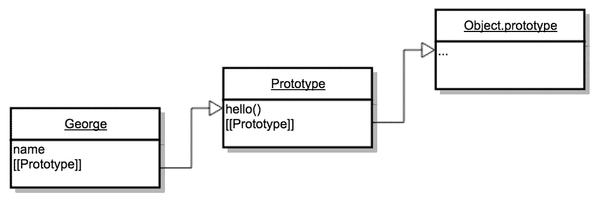

# 3 种不同的原型继承:ES6+版本

> 原文：<https://medium.com/javascript-scene/3-different-kinds-of-prototypal-inheritance-es6-edition-32d777fa16c9?source=collection_archive---------0----------------------->


Triplets — Phil Dolby (CC-BY-2.0)

本文改编自【JavaScript 应用程序编程”，针对 ES6 进行了扩展和更新。

为了声称精通 JavaScript，理解 JavaScript 的本地继承能力是如何工作的很重要。这是 JavaScript 编写和学习中经常被忽视的领域，但是理解它可以极大地增强能力。

JavaScript 是有史以来最具表现力的编程语言之一。它最好的特性之一是无需类和类继承就能创建和继承对象*。*

它的委托原型、运行时对象扩展和闭包的组合允许您在 JavaScript 中表达三种不同的原型，这提供了超越类继承的显著优势。

更多关于类继承的缺点，请看“经典继承过时了:如何在原型 OO 中思考”:

Recorded at the O’Reilly Fluent conference, 2013

# 委托/差异继承

委托原型是作为另一个对象的基础的对象。当从委托原型继承时，新对象会获得对原型的引用。

当您尝试访问新对象的属性时，它会首先检查对象自己的属性。如果它没有在那里找到它，它检查*`[[原型]]`* ，等等，沿着**原型链**向上，直到它回到 *`Object.prototype`* ，它是大多数对象的根委托。



The Prototype Chain

方法委托可以节省内存资源，因为所有实例只需要共享每个方法的一个副本。有几种方法可以在 JavaScript 中建立这种关系。您可能在 ES6 中看到的是这样的:

由于与类继承相关的许多问题，以及扩展类的诱惑，我不推荐这种技术。我在这里提出它只是因为它可能是一个熟悉的参考点。

您可能也熟悉 ES5 构造函数版本:

我更喜欢使用 *`Object.create()`的**工厂函数**。*(在 JavaScript 中，*任何函数*都可以创建新对象。当它不是构造函数时，它被称为*工厂函数)*:

通过使用 *`Object.create(null)`将原型设置为 *`null`* ,可以避免属性委托。*

委托的一个主要缺点是它不太适合存储状态。如果您试图将状态存储为对象或数组，则变更对象或数组的任何成员都会变更共享原型的每个实例的成员。为了保护实例安全，您需要为每个对象制作一份状态副本。

# 串联继承/克隆/混合

串联继承是将属性从一个对象复制到另一个对象的过程，不保留两个对象之间的引用。它依赖于 JavaScript 的动态对象扩展特性。

克隆是存储对象默认状态的一个很好的方法:这个过程通常使用 *`Object.assign()'来实现。*在 ES6 之前，从 Lodash、下划线或 jQuery 中使用类似的 *`.extend()`* 方法是很常见的。

这种风格用于混音是很常见的。例如，您可以通过混合 *`EventEmitter3`* 原型将任何对象变成事件发射器:

我们可以用它来创建一个主干风格的事件发射模型:

串联继承非常强大，但是当您将它与闭包结合使用时，它会变得更好。

# 功能继承

不要与函数式编程混淆。

由道格拉斯·克洛克福特在《JavaScript:精彩部分》中创造。函数继承利用工厂函数，然后使用串联继承添加新的属性。

为扩展现有对象而创建的函数通常被称为*函数混合。使用函数进行扩展的主要优点是，它允许您使用函数闭包来封装私有数据。换句话说，你可以强制私有状态。*

将属性挂在公共属性上有点尴尬，因为用户可以在不调用正确方法的情况下设置或获取它们。我们真正想做的是在私有闭包*中隐藏属性(参见:* [*“什么是闭包？”*](/javascript-scene/master-the-javascript-interview-what-is-a-closure-b2f0d2152b36) *)* 。它看起来像这样:

通过将 *`attrs`* 从公共属性移动到私有标识符，我们从公共 API 中移除了它的所有踪迹。现在使用它的唯一方法是通过**特权方法**。特权方法是在闭包的函数范围内定义的任何方法，这使它们能够访问私有数据。

注意在上面的例子中，我们用 *`mixinModel()`* 包装了实际的函数 mixin， *`rawMixin()`* 。我们需要这样做的原因是因为我们需要在函数中设置 *`this`* 的值，这是我们用 *`Function.prototype.call()`完成的。我们可以跳过包装器，让调用者来做这件事，但是那样会很讨厌。*

# 类继承上的合成

> "优先选择对象组合而不是类继承。"~四人帮，“ [设计模式:可复用面向对象软件的要素](http://www.amazon.com/Design-Patterns-Elements-Reusable-Object-Oriented/dp/0201633612/ref=as_li_ss_tl?ie=UTF8&dpID=51szD9HC9pL&dpSrc=sims&preST=_AC_UL160_SR127%2C160_&refRID=1M5H8SBQF96ZHXYV1RQ2&linkCode=ll1&tag=eejs-20&linkId=530b7fcb4f0e734b7952559730673cae)

类继承用限制性分类法创建了 **is-a** 关系，所有这些最终对新用例来说都是错误的。但事实证明，我们通常为 **has-a** 、 **uses-a** 或 **can-do** 关系使用继承。

作曲更像是吉他效果器踏板。想要一个可以做延迟，微妙失真和机器人声音的东西？没问题！把它们都插上电源:

```
const effect = compose(delay, distortion, robovoice); // Rock on!
```

> 什么时候需要使用类继承？对我来说，答案很简单:“永远不会。”

## 成分是:

*   **更简单**
*   **更富表现力**
*   **更加灵活**

更多内容请参见“组合胜于继承”。

# “阶级”呢？

如你所见，JavaScript 提供了一个非常灵活的对象系统，不需要依赖 *`class`。那么我们为什么要在第一个地方加上 *`class`* ？因为很多人都熟悉其他语言中的类范式，人们一直试图在 JavaScript 中模仿它。*

> JavaScript 中的继承是如此简单，以至于让那些认为需要努力的人感到困惑。为了使它变得更难，我们加上了“阶级”。

几个流行的库使用委托原型链在 JavaScript 中实现了伪类继承来模拟类继承。添加一个官方的 *`class`* 关键字提供了一种单一的规范方式来模拟 JavaScript 中的类继承——但是在我看来，[你应该完全避免它](/javascript-scene/the-two-pillars-of-javascript-ee6f3281e7f3)。在 JavaScript 中，组合比类继承更简单、更有表现力、更灵活。我想不出一个好的用例，其中 *`class`* 比本地原型更适合。

几年来，我一直鼓励人们为类继承提出一个令人信服的用例，但我听到的不是好的用例，而是很多常见的误解。

# 结论

一旦你开始考虑使用原型的无类对象和继承，以及连接，你就会真正体会到 JavaScript 的对象系统是多么简单、强大和灵活。

想了解更多关于原型继承和对象组合的知识吗？

# [跟随 Eric Elliott 学习 JavaScript】](http://ericelliottjs.com/product/lifetime-access-pass/)

***埃里克艾略特*** *著有* [*【编程 JavaScript 应用】*](http://pjabook.com) *(奥赖利)，以及* [*【跟埃里克艾略特学 JavaScript】*](http://ericelliottjs.com/product/lifetime-access-pass/)*。他曾为****Adobe Systems*******Zumba Fitness*******【华尔街日报】*******BBC****等顶级录音师****

**他大部分时间都在旧金山湾区和世界上最美丽的女人在一起。**