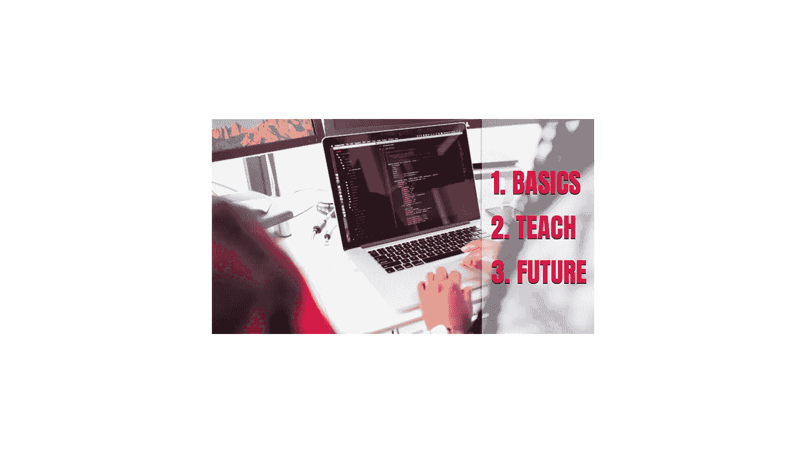
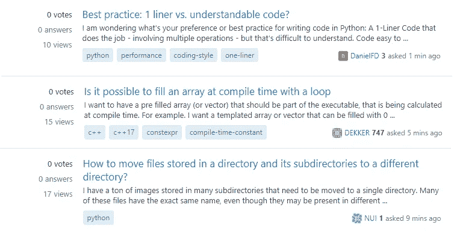

# 成为更高效开发者的 3 个习惯

> 原文：<https://medium.com/quick-code/3-habits-to-be-a-more-productive-developer-de0320e1b5a5?source=collection_archive---------2----------------------->

目前，我开始了我的第一份工作，做后端开发人员。作为一名优秀的大三学生，我有很多东西要学，而且我不是办公室里更好的程序员。但是，我想尽快不再当小三。因此，我在编码和学习的过程中，研究了成为一名更高效的开发人员的习惯和方法。

作为我调查和实现的结果，我发现了 3 个习惯，它们可以让我以更好的方式学习，成为更好的开发人员，编写更多更干净的代码。今天我将与你们分享它们。

Habits to Productive Developers

# 专注于基础

当我们学习一门新技术或语言时，我们喜欢跟随大量的教程和课程。我们喜欢知道关于语言的许多事情，当然，如果这些事情是高级功能就更好了。然而，如果你想成为这项技术的专家，并且你想正确理解所有这些高级功能，那么**掌握基础知识是你必须做的事情**。

例如，想象你是一名画家。完美地了解色彩理论或每种颜色传递的感觉会让你更好地在你的画面中表达感情。对你的第一幅画来说不会很有必要，但是如果你想画很多好画的话，真的会很有帮助。

**研究你所在领域的基础知识，并主导它们**。请永远记住，所有的高级功能都是基于其技术基础之上的。

# 教与学

如果你想学东西，你必须教它。

当你学习的时候，你可以观看教程，阅读文档或者开发你的项目。但是如果你想深入了解一项新技术或语言，你应该教别人。教学是一种活动，需要你退一步问自己:“我真的理解这个题目来解释它吗？这个概念我清楚了吗？**我能回答别人可能问我的任何问题？”**。

你有很多方法可以教别人:写博客(或媒体)，录 Youtube 视频，或者在 StackOverflow 这样的论坛上帮忙。

StackOverflow example questions that allow you to learn by teaching

# 未来自我的代码

在大多数情况下，我们只为现在的自己编码，特别是当我们有一个很近的截止日期或者我们正在解决一个问题的时候。我们写明确的注释，我们不在必要的时候重构，我们缩短变量的名字来节省一点时间，等等。这是一个非常大的错误。

你要为未来的自己写作。你现在的自己拥有关于你要写的代码的所有知识:背景、想法、信息……但是你未来的自己没有这些。你未来的自己将参与制作其他功能，此外，还将参与理解你过去所做的乱七八糟的代码。

出于这个原因，下一次你编码的时候问问你自己:**“将理解我未来的自我这个代码片段(功能、上下文、有用性…)？”**。

做一名开发人员不是一件容易的工作。你要面对复杂的问题，复杂的工作团队，嘎吱嘎吱的粉丝大佬等等。如果你不想被解雇，你必须及时正确地发展。这就是为什么我们成为更好的开发者包括在我们生活中的好习惯是重要的。

这三个习惯在我目前的第一份工作中帮助了我，并改变了我的生活，提高了我在发展过程中的生产力(尤其是第一份工作)。现在我可以学得更好更快，当我必须检查我以前的代码时，问题也更少了。我希望这些习惯对你也有用。

# 结论👋

谢谢大家！非常感谢您阅读这篇文章。我很想知道你对此的看法，所以不要写在评论里，我会读给你听。

反过来，如果这篇文章已经帮助你记住了，你可以为它鼓掌，并与你的同志分享。如果你不想错过我的任何一篇文章，别忘了关注我。

# 关于作者🤓

我的两个爱好是技术和交流，所以我抓住一切机会谈论或写关于技术的东西。

# 想要连接吗？📲

📩jesuslagaresgalan@gmail.com

**📸 [**Instagram**](https://instagram.com/jesuslagares_)**

**💼 [**领英**](https://www.linkedin.com/in/jesus-lagares/)**

**📹 [**Youtube**](https://www.youtube.com/c/Jes%C3%BAsLagares)**

**🐦 [**推特**](https://twitter.com/jesuslagares_)**

**谢谢！❣️**