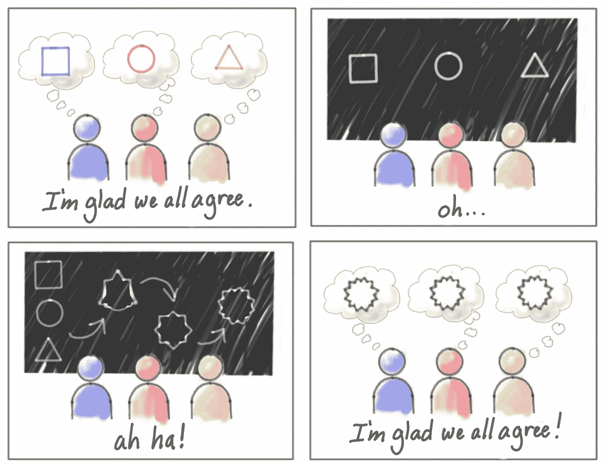

# 3 hal yang saya pelajari selama menjadi Product Manager selama satu tahun terakhir

> 原文：<https://medium.easyread.co/3-hal-yang-saya-pelajari-di-dunia-product-selama-satu-tahun-terakhir-6bc8808b412e?source=collection_archive---------5----------------------->

## Product Manager Life

## Apa yang didapat setelah satu tahun di dunia product management

Photo by [William Iven](https://unsplash.com/@firmbee?utm_source=medium&utm_medium=referral) on [Unsplash](https://unsplash.com?utm_source=medium&utm_medium=referral)

Perjalanan karir saya sebagai seorang tim Product dimulai pada tahun 2019, ketika itu saya diterima di salah satu startup yang bisnis model nya Business-to-Business (B2B) yang befokus pada masalah Supply Chain Management. Saat itu saya diterima dengan posisi Associate Product Manager, posisi awal untuk terjun ke dunia Product Management.

Berikut sepenggal cerita perjalanan saya ketika bergabung ke dunia Product Management yang sebelumnya bekerja di dunia Project Management.

 [## Fitra’s Journery From Project to Product Management

### My journey in Project Management began in September 2013\. I started my journey by joining one of the software houses in…

productcoalition.com](https://productcoalition.com/transform-from-project-to-product-management-5c3aa47a3156) 

Setelah kurang lebih satu tahun bekerja sebagai tim Product, banyak hal — hal baru yang dipelajari yang menjadikan saya lebih paham tentang dunia Product Management. Rasanya hampir setiap Hari pasti saya mendapatkan hal baru yang mana dari situ saya jadikan bahan belajar agar kedepan nya bisa menjadi lebih baik lagi terutama dalam menangani sebuah produk.

Berikut tiga hal pelajaran penting yang saya dapatkan selama menjabat sebagai tim Product selama satu tahun terakhir.

## 1\. Product Manager sebagai orchestrator

Sebagai seorang Product Manager, maka salah satu keahlian yang dibutuhkan adalah memastikan semua anggota tim (baik tim Engineer, Quality Assurance, UI designer dll) memiliki tujuan dan mendapatkan konteks yang sama atas apa yang sedang atau yang akan dikerjakan (Shared Understanding). Karena jika semua anggota tim sudah mendapatkan konteks yang sama, maka kedepan nya proses pengembangan produk akan terasa lebih mudah dan cepat.

> “Shared understanding is when we both understand what the other person is imagining and why” — Jeff Patton

Shared Understanding — [https://www.jpattonassociates.com/read-this-first/](https://www.jpattonassociates.com/read-this-first/)

Tugas ini dibebankan kepada Product Manager agar semua anggota tim paham atas apa dan kenapa harus mengerjakan hal tersebut.

## 2\. Product Manager Influence tanpa punya wewenang

Keahlian lainnya yang penting bagi seorang Product Manager adalah bagaimana caranya influence anggota tim tanpa harus menjadi kapten dari tim tersebut. Product Manager sudah pasti harus banyak bekerja sama dengan cross-functional tim, minimal dengan Engineer, Quality Assurance, UI designer dll. Product Manager harus bisa untuk tidak menjadi “Boss” tetapi tetap bisa memberikan arahan apa yang harus dikerjakan.

Product Manager harus memastikan produk nya sukses. Salah satu caranya adalah dengan menyamakan suara para stakeholder pada banyak hal, seperti saat menetukan prioritas. Product Manager menyakinkan semua orang agar bergerak pada jalur yang sama.

Cara yang paling efektif untuk menyakinkan orang lain adalah dengan memberitahu alasan dibalik setiap keputusan yang diambil. Jangan hanya memberitahu apa yang harus dilakukan, tetapi juga tunjukkan kenapa hal tersebut benar untuk dilakukan. Tambahkan data agar orang lain juga lebih yakin, karena tanpa data berarti kita hanya beropini.

## 3\. Product Manager sebagai pengambil keputusan

Pelajaran lainnya adalah sebagai Product Manager hampir setiap hari dituntut untuk mengambil keputusan, baik keputusan yang kecil hingga keputusan yang berdampak besar terhadap produk. Keputusan yang diambil oleh Product Manager biasanya membantu tim untuk membuka blocker yang dihadapi oleh tim. Kalaupun ada hal yang perlu diputuskan tetapi tidak oleh Product Manager (oleh stakeholder lainnya) setidaknya Product Manager yang bertanggung jawab atas keputusan yang diambil baik untuk produk.

Keputusan — keputusan yang diambil akan tercermin terhadap produk itu sendiri baik atau tidaknya sebuah produk. Jika ada keputusan yang diambil kurang tepat itu akan menambah beban di kemudian hari untuk memperbaiki kesalahan sebelumnya.

saya juga pernah membahas mengenai kesalahan yang sering dilakukan oleh Product Manager, salah satu nya mengenai ragu dalam mengambil keputusan.

 [## Kesalahan yang Dilakukan oleh Product Manager

### Apa saja kesalahan yang sering dilakukan dan cara menanganinya

medium.com](https://medium.com/easyread/kesalahan-yang-dilakukan-oleh-product-manager-1922980e0225) 

# Penutup

Setelah lebih kurang satu tahun sejak tahun 2019 menjadi tim Product banyak hal yang harus terus dipelajari agar bisa memberikan value kepada User dan Customer. Bagi saya setiap hari adalah waktu dimana saya terus belajar hal — hal baru tentang Product Management dan juga evaluasi atas apa yang sudah dikerjakan selama ini.

Pembelajaran selama ini juga akhirnya yang membuat saya di promosikan sebagai Product Manager di tahun 2020\. Dan ini merupakan awal dari babak baru dimana masih banyak hal baru yang harus dipelajari.

## Jika anda menyukai artikel ini, berikut beberapa artikel lainnya yang dapat anda nikmati:

 [## Apakah anda harus kembali ke kantor?

### Tetap bekerja di rumah atau harus kembali ke kantor pasca pandemi

medium.com](https://medium.com/easyread/apakah-anda-harus-kembali-ke-kantor-47f243f62ffb)  [## Project vs Product

### Penjelasan singkat tentang project dan product serta perbedaan antara keduanya

medium.com](https://medium.com/easyread/project-vs-product-b9c89a079fed)  [## Langkah Menjadi Seorang Product Manager

### Kenapa begitu sulit mendapatkan pekerjaan dengan posisi sebagai Product Manager

medium.com](https://medium.com/easyread/langkah-menjadi-seorang-product-manager-818620a7b214)