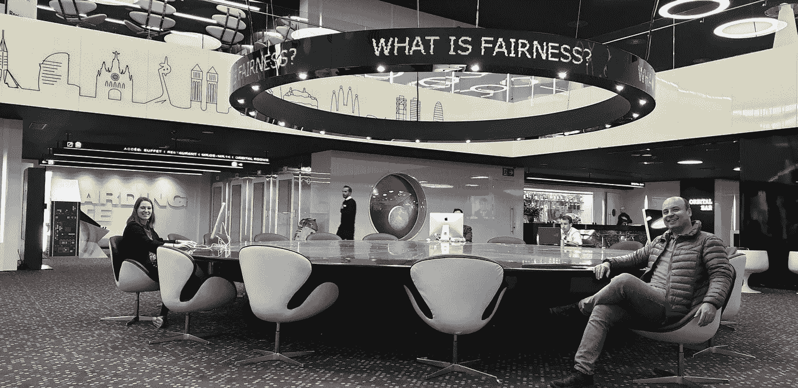

# 来自 FAT*ML 2020 的 3 个亮点

> 原文：<https://medium.com/compendium/3-highlights-from-fat-ml-2020-97d90cb3841e?source=collection_archive---------2----------------------->

## 今年的[胖*ML 大会](https://facctconference.org/2020/index.html)你错过了吗？别担心，下面是我的三大要点，让你了解 FAT*ML 社区目前讨论的一些主要热门话题。

FAT*ML 是一个跨学科的会议，聚集了对社会技术系统中的公平、问责和透明感兴趣的研究人员和从业者。尽管 FAT*ML 社区一开始非常关注算法和计算机科学，但今年的会议显示出了向真正的跨学科研究的明显转变，将关注点扩展到了法律、社会科学和人文学科。来自不同学科的作者的论文被接受的数量反映了这一点。但是，我们为什么要关心机器学习中的公平、问责和透明呢？如果你还不熟悉 FAT*ML 缩写背后的想法和思想，请看看[马尔科·安吉尔·贝尔塔尼-奥克兰德在去年大会前发表的介绍这个话题的博客文章。](/grensesnittet/https-medium-com-mab-55055-what-is-fatml-and-why-should-you-care-dfb36e51f2f4)

# **1。我们的反歧视重点对吗？**

我发现今年会议的第一个主题特别有趣和重要，那就是向更广阔的公平视角的转变。以前，FAT*ML 社区内的研究主要集中在从非歧视和群体或个人之间结果的可测量平等的角度来看公平性。今年，来自其他学科的意见扩展了这个相当狭隘的公平焦点，并为解决权力结构、包容性流程以及研究人员和科学家在问题形成和解决方法中的作用等问题开辟了新的问题。

在社区内，对公平和公平结果的普遍兴趣的假设似乎经常被普遍接受。然而，人们多次强调，这种假设可能往往是错误的，公平往往是由系统的开发者或所有者而不是用户来定义的。因此，结果是提供商决定人们重视什么。不同的会谈讨论了这些不平衡的权力问题，并就如何在基于机器学习的系统中实现更大的公平和平等提出了许多新的有趣的方法和方法论。有趣的演讲包括: [Michael Katell 的演讲](https://dl.acm.org/doi/abs/10.1145/3351095.3372874)关于如何通过早期和经常与受机器学习影响的人交流来实现产品过程中的平等， [Chelsea Barabas 的演讲](https://dl.acm.org/doi/abs/10.1145/3351095.3372859)关于研究强者而不是弱者的优势和方法，[波格丹一世 Kulynych 的贡献](https://dl.acm.org/doi/abs/10.1145/3351095.3372853)关于如何设计和实现一种新的防御体系，使那些受优化系统影响的*能够从外部影响、改变和对抗系统*。**

Yochai Benkler 发表了一篇非常鼓舞人心的主题演讲，对群体内部现有的非常狭隘的公平观提出了质疑。在他的演讲中，他把他的结论集中在公平的两个方面:歧视和剥削。他向社区伸出援手，要求**将重点从反歧视**(结果中的不平等待遇)**转移到反剥削**(权力和资源的不平等分配)，以解决考虑到生产力和权力分配的更广泛的潜在危害。因此，他指出了社会地位或阶级、权力和对人类的剥削之间关系的更大的结构性问题，并强调了计算机科学学科在帮助解决剥削问题方面的潜力。如果我们能够从如何评估歧视中得到启发，以客观的方式更好地衡量剥削，这个社区就可以对世界产生更大的影响。

# **2。解释有用吗？**

今年会议的另一个有趣的投入是针对****对最终用户的用途和价值**的讲座和小组讨论。机器学习解释研究背后的一个主要原因是实现更大的透明度，并使用户能够理解如何在未来改变他或她的算法结果，并能够批评和质疑系统。然而，在由 [Umang Bhatt](https://dl.acm.org/doi/abs/10.1145/3351095.3375624) 提交的研究中，一个关键的发现是，当解释被用于实践时，它们通常从未到达最终用户，而是被数据工程师用于调试。此外，这项研究指出了一些与实时部署相关的技术限制，以及与如何解释解释以及建议解释中关系和因果关系背后的不确定性相关的问题。Solon Barocas 的一次演讲还指出，解释依赖于许多容易被忽视的假设，包括特征值的建议变化清楚地映射到现实世界的行动。叶小开·汉考克斯-李的另一个演讲也提出了解释通常不可靠的问题，并认为如果我们希望解释世界上的真实模式，这是如何有问题的，以及这如何会构成道德风险，其中“最佳”解释是基于哪些解释看起来最公平而选择的。**

**承认解释中的一些局限性，导致讨论解释对最终用户是否有用，以及解释是否基于用户不理解的前提、技术和统计假设。这也提出了一个问题，我们是否应该用更多的时间[建立可解释的模型](https://blog.acolyer.org/2019/10/28/interpretable-models/)而不是使用黑箱模型(见[第 7 节](https://dl.acm.org/doi/abs/10.1145/3351095.3372836)关于解释的公平清洗风险)。与这个问题相关的 [Ravit Dotan 和 Smitha Milli](https://dl.acm.org/doi/abs/10.1145/3351095.3373157) 提出了一些有趣的工作，指出机器学习模型的选择不是价值中立的。他们指出，神经网络和深度学习模型的使用与计算能力的增加相关，但这些模型有一些权衡，包括环境影响、权力集中和缺乏可解释性。**

# ****3。如何在实践中做好伦理？****

**最后，今年的会议还将大量注意力集中在**监管和内部审计**问题上。相当多的论文从 GDPR 的角度考虑了公平、透明和解释，包括纳尼·詹森·雷文特洛的主题演讲。**

**但由于监管和官方审计系统或机构仍然很少，内部审计和自我监管是许多从业者和公司目前正在努力解决的问题。为了指导这个过程 [Inioluwa Deborah Raji 和 Andrew Smart](https://dl.acm.org/doi/abs/10.1145/3351095.3372873) 展示了他们为*内部*算法审计定义端到端框架的工作(在部署之前)。与此相关，也如上所述，[波格丹一世·库林奇](https://dl.acm.org/doi/abs/10.1145/3351095.3372853)还引入了一个有趣的框架，用于在部署后对机器学习系统进行更广泛的*外部*审计。**

**此外，一个有趣的关于如何弥合人工智能伦理研究与实践之间的差距的工艺会议专注于一些核心技术公司，如脸书、LinkedIn 和 Pymetrics(自动招聘)在内部如何与伦理和公平合作。在随后的讨论组中，讨论了适当监管和标准的必要性，以及确保内部实践和外部审计不仅仅导致道德清洗，而是实际道德考虑的重要性。**

**当然，会议期间还有许多其他有趣的演讲和问题，但这些是我觉得特别有趣的一些要点。要了解所有研讨会和讲座的概况，你可以在这里找到整个项目[，在这里](https://facctconference.org/2020/programschedule.html)找到所有被接受的论文[。](https://facctconference.org/2020/programschedule.html)**