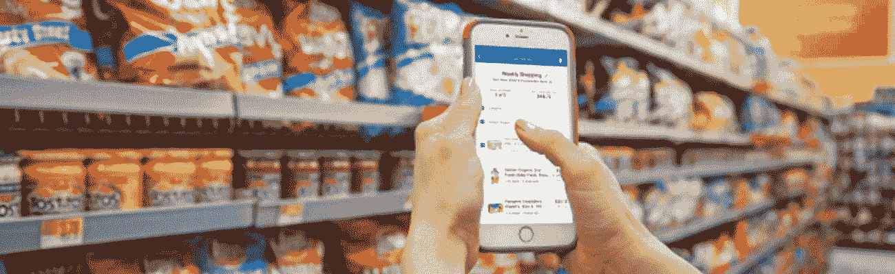

# 传统砖块零售商的 3 项关键技术

> 原文：<https://medium.com/walmartglobaltech/3-key-technologies-for-traditionally-brick-retailers-34baf948871a?source=collection_archive---------3----------------------->

我工作中最棒的部分之一就是看到所有最新的技术被应用到零售业。我总是看到一些新的、令人惊奇的东西，并思考零售业的未来会是什么样子。但这也是一个挑战:在创新的海洋中，传统的砖块零售商应该优先考虑哪些？什么样的技术能让消费者更好地购物？

沃尔玛的全球网络帮助我的团队更多地了解全球数百万顾客的习惯和需求；考虑到他们，我们投资并开发了许多技术来让他们的生活更轻松。我们了解到，基本上，购物者想要“购物”更少。重点是方便，方便，方便。以下是传统零售商应该建立的简化购物的三项技术。

**1。一个老掉牙的好东西:手机**

不要忽视它，这是不可否认的。手机——实际上是应用程序——是并将继续是购物者移动体验的基石。大多数零售商在这方面投资不足，没有让他们的应用程序保持最新或最前沿。没有什么设备比智能手机更个性化或更普及，让零售商可以一天 24 小时都在顾客手中。它的透明手机给零售商提供了贴近消费者的最佳机会。

对于沃尔玛来说，我们希望我们的应用程序成为客户体验的重要组成部分，以至于那些把手机留在车里的人会转身去拿，因为他们知道使用沃尔玛应用程序购物更快、更容易(甚至可能更有趣)。

商店地图等功能让购物者更加方便，向消费者展示在商店的哪里可以找到商品，或者移动快递退货，让消费者在前往商店之前开始退货变得简单。或者像沃尔玛支付支付项目，使用多种支付方式，如果他们的手机需要的话。我们还扩展了一些功能，包括那些需要的功能，如药房快速提货、杂货店路边购物、快速转账、轻松订购我们的应用程序，并且我们将继续创新和更新。

这款手机的无处不在是它的优势，零售商可以轻松提高其应用程序的效率，使其同时成为客户服务代表和收银机。还有一件事，你必须“赚”到客户的手机——应用程序必须足够有粘性，客户才会投资安装应用程序。AppAnnie 最近的[研究](https://techcrunch.com/2017/05/04/report-smartphone-owners-are-using-9-apps-per-day-30-per-month/)显示，智能手机用户平均每天只使用 9 个应用，每月 30 个。你如何成为这 9 个人(或 30 个人)中的一员？

**2。机器学习；客户在您需要的时候得到他们想要的东西**

因此，零售中的许多流程通过机器学习(ML)变得更好。通过寻找模式，机器语言将从商品选择到最后一英里配送的零售体验个性化。我们能够利用数据做更多事情，并将顾客-零售商的数字关系与店内体验相融合。

在我们的规模上，补给一直很复杂。地区趋势、天气、人口统计，甚至当地的体育赛事都会极大地改变成千上万种商品的需求。多年来，我们一直在商店层面改进这一点，因为我们已经为数百万个人客户添加了数据。这将 ML 从宏观趋势转变为成千上万的微观趋势，并展示了关于人们如何购物的惊人数据。

我们还使用 ML 进行最后一英里的递送。商店员工可以在上下班途中注册为邻居送货。ML 用于确定哪些员工住在哪些客户的路线上，考虑包裹的时间、大小，甚至冰淇淋是否会融化。这对每个人都有好处:客户更快地收到订单，成本降低，对环境的影响也降低了，员工有机会增加他们的实得工资。

对于 ML，它是关于规模的。自动化后，数据变得可操作，而且数据越多越好。沃尔玛在 28 个国家拥有 11，700 家实体店，每周约有 1.4 亿购物者，其客户关系可以追溯到个人电脑出现之前。由于数字能力的进步，这些数据可以被分析到最小的细节。零售商(和其他所有人)可以采取“数据优先”的方法，让数据自己查询并确定结论，而不是查询数据。

**3。计算机视觉&深度学习；知道要寻找什么**

我要你的鞋子！你在哪里得到那张桌子的？这个有蓝色的吗？我们都在商店或对朋友说过类似的话，但未来是计算机视觉和深度学习，它正在改变视觉搜索和我们将如何购物。喜欢这双鞋吗？拍照或扫描物品，找到相同或相似的物品。

计算机视觉是机器接收和分析视觉数据并做出决策的能力。携带相机、6 英尺高的机器人在大约 50 家沃尔玛商店的过道里漫游，拍照并扫描货架以检查库存。然后，他们会通知商场员工任何库存问题。

当我们用昂贵的设备和复杂的扫描床在全链范围内推出条形码时，沃尔玛帮助彻底改变了计算机视觉的使用。今天，你可以用一个 Raspberry Pi 和几行代码完成所有这些工作。我们已经到了这样一个地步，包装上有肉眼看不见的条形码，并且可以被扫描。你可能很快就会看到完全不需要条形码的一天，因为整个包装都可以被计算机“看到”，并且拥有你识别价格所需的一切(然而，我们仍在试图找出如何检测有机胡萝卜和普通胡萝卜之间的差异)。

深度学习通过教会相机识别物品、人、溢出物、交通、盗窃，以及通过分析数百万张图像并标记正确的情况来支持计算机视觉——深度学习的关键是训练数据，这是沃尔玛拥有的东西，并且每天都在继续产生更多。

零售领域的计算机视觉应用将遍布整个街区——从检查草莓有多老，到更紧密地包装盒子和托盘，到通过分析客户导航来寻找商店布局中的死角。视觉搜索继续发展，从我们“展示更多像这张图片一样的商品”的无尽通道，到如果产品相同，可以直接从照片上订购。技术变得越来越好，越来越便宜，并将为许多零售商打开各种新的大门。与此同时，仓库和商店中有很好的用例，有助于提高我们的成本，这将通过更低的价格传递给消费者。

**人民科技**

这些技术指向同一个东西:如果技术最终能给人们更多的时间来生活，那它就是有用的。无论是通过加快退货速度、保证食品安全、简化库存，还是消除结账队伍，顾客都会很快采用这项伟大的技术，并很快摆脱那些令人担忧的问题。

我期待看到这些技术带来的零售创新和颠覆。它们提供了建立传统实体零售商与客户、供应商和托运人之间现有关系的机会，并革新古老的流程。这是一个令人兴奋的前进时刻。