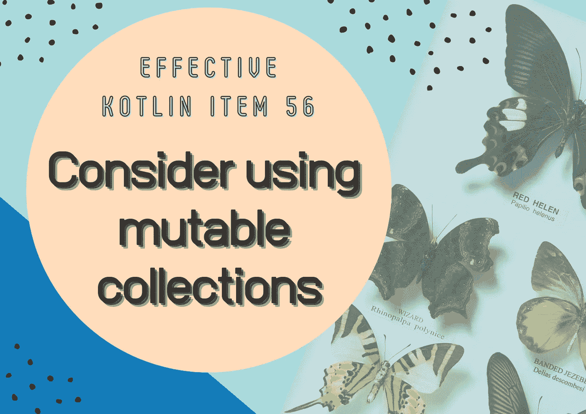
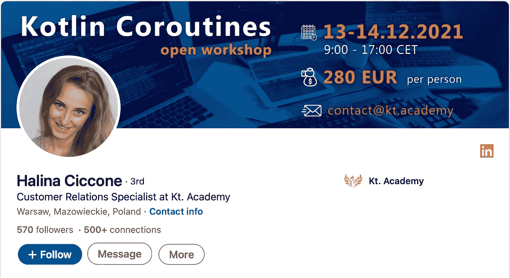

# 来自 Kt 的 3 篇 Kotlin 文章和重要信息。学院🌟

> 原文：<https://blog.kotlin-academy.com/3-kotlin-articles-important-information-from-kt-academy-435d4aaaa01c?source=collection_archive---------2----------------------->

你好！
Kt。这里是学院**👋**

看看我们今天为你准备了什么，享受阅读吧！🤩

👉[测试科特林协程](https://kt.academy/article/cc-testing)👉[科特林协程](https://kt.academy/article/cc-channel)中的通道
👉考虑使用可变集合

最后，您还可以直接联系我们才华横溢的**客户&维修车间专家**，他们可以帮助您找到最适合您和您的团队的维修车间！🔥

⏬
⏬

我们如何测试 Kotlin 协同程序，包括常见的 Android 和后端案例。

Marcin Moskala 测试 Kotlin 协同程序👇

[Testing Kotlin Coroutines](https://kt.academy/article/cc-testing)
🔻 This is a chapter from the [Kotlin Coroutines](https://kt.academy/book/coroutines) book. You can find Early Access on [LeanPub](https://leanpub.com/coroutines/).

什么是通道，它是如何工作的，以及我们可以在哪里使用它。

**马辛·莫斯卡拉的《科特林协程》中的频道**👇

[Channel in Kotlin Coroutines](https://kt.academy/article/cc-channel)
🔻 This is a chapter from the [Kotlin Coroutines](https://kt.academy/book/coroutines) book. You can find Early Access on [LeanPub](https://leanpub.com/coroutines/).

当可变集合优先于不可变集合时。

考虑使用 Marcin Moskala 的可变集合👇

[Effective Kotlin Item 56: Consider using mutable collections](https://kt.academy/article/ek-mutable-collections)
🔻 This is a chapter from the [Effective Kotlin](https://kt.academy/book/effectivekotlin) book. You can find it on [LeanPub](https://leanpub.com/effectivekotlin) or [Amazon](https://www.amazon.com/Effective-Kotlin-practices-Marcin-Moskala/dp/8395452837/ref=sr_1_1?dchild=1&keywords=effective+kotlin&qid=1615033955&sr=8-1).

你需要一个工作坊，但你不确定哪一个去 choose❓
你有什么具体的培训 needs❓
或者也许你想成为我们 trainers❓的一员

我们出色的**客户&车间专家— Halina** 随时为您提供帮助！通过以下方式直接联系她:

👉邮箱[halina @ kt . academy](http://halina@kt.academy/)👉或者 LinkedIn [Halina Ciccone](https://www.linkedin.com/in/halina-ciccone-536266207/)

她会回答你所有的问题！

今天就到这里吧！

谢谢，再见！

卡帕头。学院团队

www: [kt.academy](https://kt.academy/)
博客:[blog.kotlin-academy.com](http://blog.kotlin-academy.com/)
推特 EN:[@ ktdotsacademy](https://twitter.com/ktdotacademy)
推特 PL:[@ ktdotsacademypl](https://twitter.com/ktdotacademyPL)
FB:[@ ktdotsacademy](https://www.facebook.com/KtDotAcademy)
LinkedIn:[@ Kt。学院](https://www.linkedin.com/company/kt-academy/)

