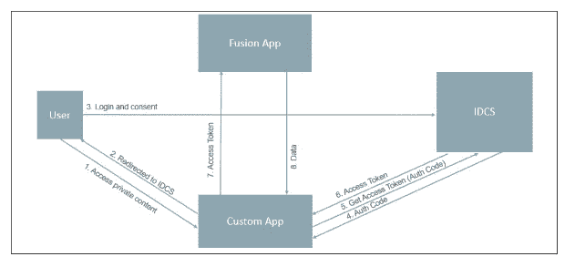
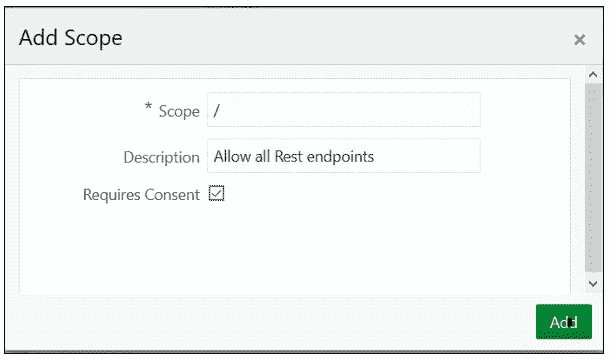
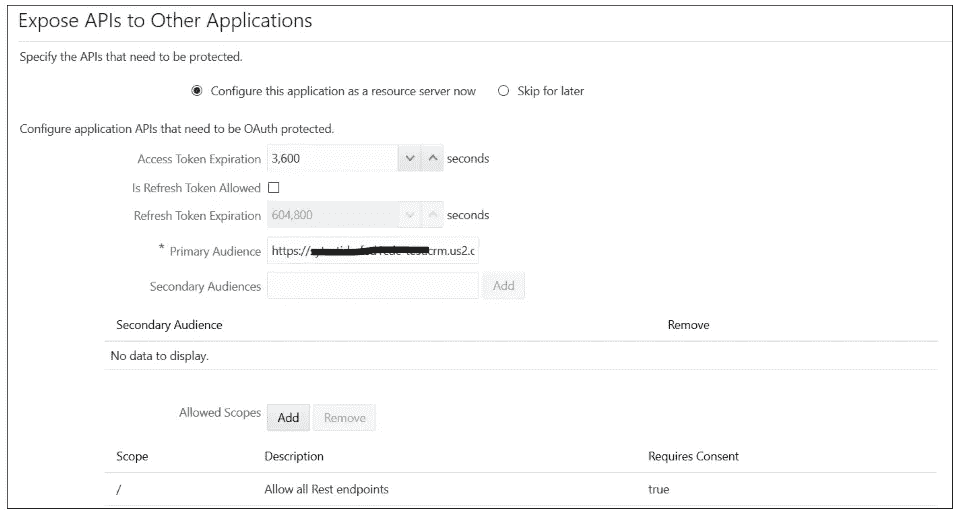
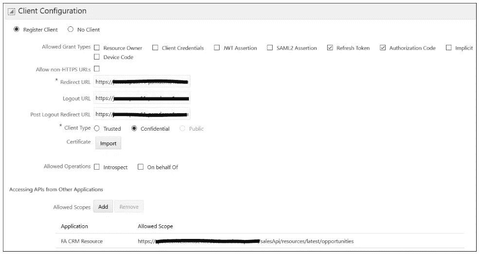

# 调用融合应用程序 Rest 端点的三分支 OAuth 流程

> 原文：<https://medium.com/oracledevs/3-legged-oauth-flow-to-invoke-fusion-apps-rest-endpoints-5fc6b0b7b059?source=collection_archive---------3----------------------->

这是我撰写的系列博客中的第五篇，旨在解释 Oracle 融合应用程序与 PaaS 服务的身份集成，使用身份云服务来实现服务之间的单点登录。这是这个系列的博客列表

1.  [了解集成架构——融合应用与平台服务](/@amit.gokhru/understanding-the-integration-architecture-fusion-application-with-platform-services-9b8297594873)
2.  [启用融合应用作为身份提供商的联盟](/@amit.gokhru/enable-federation-with-fusion-apps-as-identity-provider-1ca6d795659c)
3.  [启用身份云服务作为身份提供商的联盟](/@amit.gokhru/enable-federation-with-identity-cloud-service-as-identity-provider-36e80d2bc4ec)
4.  [在融合应用和身份云服务之间设置用户和角色同步](/@amit.gokhru/setting-up-users-and-roles-synchronization-between-fusion-apps-and-identity-cloud-service-70dcf2144107)
5.  [调用 Fusion Apps rest 端点的三脚 OAuth 流。](/@amit.gokhru/3-legged-oauth-flow-to-invoke-fusion-apps-rest-endpoints-5fc6b0b7b059)

在这篇博客中，我将解释我们如何利用 3 条腿的 OAuth，这是 IDCS 与融合应用集成的一项新功能。

请注意，如#2、#3 和#4 中所述的联合和同步设置是实现这一点的先决条件。

需要这样做的一些重要用例是-

1.  在用户登录和同意的情况下显示融合数据的自定义应用程序。
2.  经同意，第三方应用程序获取用户的融合数据。

下面是此类应用程序的应用程序架构，它利用了三脚 OAuth



申请流程如下-

1.  用户访问 web 应用程序中需要访问其融合应用程序数据的区域。
2.  自定义应用程序将用户重定向到 IDCS 进行身份验证。
3.  IDCS 显示登录页面，用户使用其凭证登录，并同意应用程序访问其数据。
4.  IDCS 用授权码返回到应用程序
5.  应用程序向 IDCS 请求访问令牌，提交授权码、客户端 id 和客户端秘密
6.  IDCS 返回接入令牌
7.  应用程序调用融合应用程序的 Rest 端点。
8.  融合应用验证访问令牌并将用户数据返回给应用。

让我们看看如何实现上面的流程-

1.  为 Fusion Application Rest 端点配置 OAuth 资源(如果尚不可用)

*   登录 IDCS 管理控制台>单击“应用程序”选项卡>“添加”
*   在应用程序向导中，选择“可信应用程序”
*   在“应用程序详细信息”页面上，提供应用程序名称和描述，然后单击下一步
*   跳过客户端配置，然后单击“下一步”
*   选择单选按钮“立即将应用程序配置为资源服务器”,将融合应用程序 API 路径配置为 OAuth 资源

—提供“主要受众”= FA 端点的主机

—单击“允许范围”上的“添加”,添加主要和次要受众的允许范围



*   查看受众和允许的范围，然后单击下一步。您可以添加特定的 API 作为作用域，然后为那些允许的作用域请求访问令牌。当您添加“/”作为允许的范围时，请确保在请求访问令牌时使用“受众”+“/”作为范围。



*   单击完成
*   激活应用程序

2.为您的自定义应用程序配置 Oauth 客户端

*   登录 IDCS 管理控制台>单击“应用程序”选项卡>“添加”
*   在应用程序向导中，选择“可信应用程序”
*   在“应用程序详细信息”页面上，提供应用程序名称和描述，然后单击下一步
*   选择“立即将应用程序配置为客户端”

—选择“授权代码”和“刷新令牌”作为允许的授权类型

—在“重定向 URL”中提供用户登录后要重定向的应用程序 URL

—在“注销 URL”中提供您的应用程序注销 URL

—在“注销后重定向 URL”中提供您的注销后 URL

—从“允许的范围”中的 FA 资源添加 API



*   单击完成
*   记下客户端 id 和客户端密码
*   激活应用程序

3.应用程序配置—将用户重定向到 IDCS 端点，他以此身份访问私有内容

```
[https://<IDCS](https://%3cIDCS) HOST>/oauth2/v1/authorize?client_id=<CLIENT - ID>&response_type=code&redirect_uri=<REDIRECT URL AS CONFIGURED IN CLIENT>&scope=<SCOPE AS CONFIGURED IN CLIENT ALLOWED SCOPE>
```

4.成功认证后，IDCS 将按照给定的重定向 URL 重定向回应用程序，请求参数中包含 AUTH-CODE。从请求中获取授权码(JAVA 代码)

```
String code = httpReq.getParameter("code");
if (code == null || code.length() == 0) {
  LOGGER.log(Level.SEVERE, "Invalid Code");
}
String authCode;
try {
  authCode= URLEncoder.encode(code, "UTF8");
} catch (Exception e) {
  LOGGER.log("Exception occurred!!")
}
```

5.通过在 IDCS 令牌端点(JAVA 代码)上提交授权代码、客户端 id 和客户端机密，从授权代码获取访问令牌

```
String IDCSTokenURL = "[https://<IDCS](https://%3cIDCS) HOST>/oauth2/v1/token";
String postBody = "grant_type=authorization_code"+"&code="+authCode;Response httpResponse;Map<String, String> requestOptions = new HashMap<>();
requestOptions.put("Accept", "*/*");
String authzHdrVal = "<CLIENT-ID>" + ":" + "<CLIENT-SECRET>";
requestOptions.put("Authorization", "Basic "  + DatatypeConverter.printBase64Binary(authzHdrVal.getBytes("UTF-8")));httpResponse = execHttpRequest(IDCSTokenURL , "POST", requestOptions, postBody);String result = httpResponse.getResponseBodyAsString("UTF-8");
JSONObject json = new JSONObject(result);
IDCSAccessToken = json.getString("access_token");
```

6.使用访问令牌(JAVA 代码)调用融合应用程序的 REST 端点

```
Client client = null;
WebResource resource = null;ClientConfig cc = new DefaultClientConfig();
client = Client.create(cc);String fusionAPIURL = new String(<FA API URL>);
resource = client.resource(url);ClientResponse clientResponse= null;
clientResponse= resource.header("user.tenant.name", "<FA tenant name>").header("Authorization", "Bearer " + accessToken).accept("application/json").get(ClientResponse.class);
```

7.从 Fusion 获得数据后，您的应用程序可以根据需要在应用程序 UI 中显示这些数据。

这就结束了我们的 3 脚 OAuth 的实现，它支持运行时用户认证和同意第三方应用程序访问用户的融合数据。

*本文表达的观点是我个人的观点，不一定代表甲骨文的观点。*