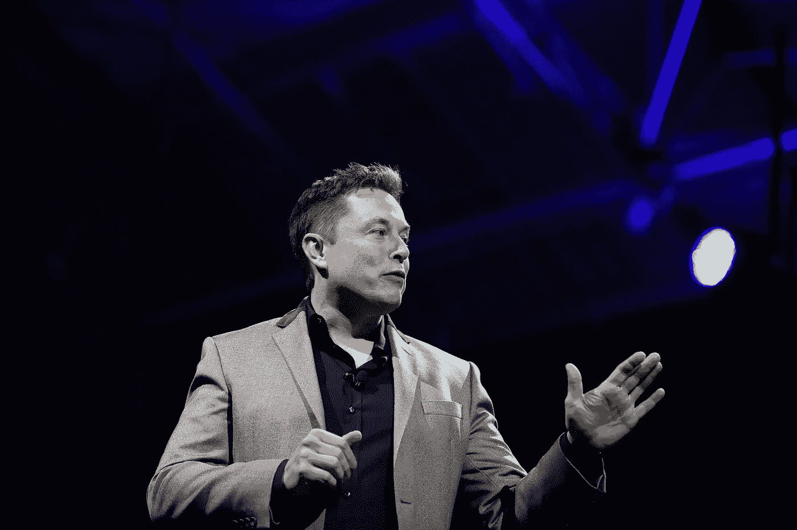
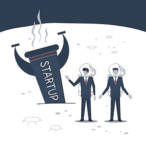
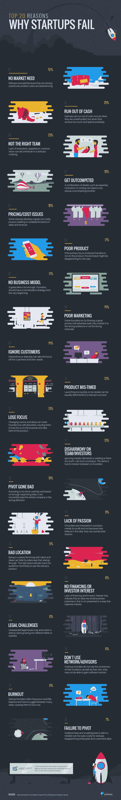

# 埃隆·马斯克给有抱负的初创企业创始人的 3 条经验。

> 原文：<https://medium.easyread.co/3-lessons-from-elon-musk-for-aspiring-startup-founders-32d7560e18a3?source=collection_archive---------1----------------------->

在看了埃隆·马斯克的多次采访并在写这篇文章之前做了大量研究之后。他给了我很多建议，但我决定挑选 3 条最适合创业者的经验。

他们在这里:

# 1.开展第一原理分析

什么是第一原理分析？

> 第一原理分析是一种基于最基本而非类比的思维方式。它的意思是，不要根据以前做过的事情或其他人如何做来做事情，而是试图将事情归结为最基本的真理，并从那里进行推理。这需要更多精神能量——埃隆·马斯克

第一原理分析通过理解一个复杂问题或概念的起源，帮助你更好地理解它。

你的选择，类比思考要容易得多，因为你根据已经做的事情得出结论，我们的大脑会找到解决问题的最快最简单的方法。

当你比较过去和现在的结果时，类比思维是有用的。

类比的问题在于，因为你是根据已经做的事情得出结论，所以当你试图理解未知的时候，它有可能错过一些最重要的事实

通过第一原理思考和类比之间的区别如下:

1.  **电动汽车和电池。**

Tesla

**比喻**:电动汽车永远行不通，因为电池贵。

第一条原则:从更便宜的来源购买单个电池可以让我们生产更便宜的电池。

2.**优步**

UBER

**比喻**:出租车但有私家车

**第一个原则:**一种更便宜的交通方式，你可以随时随地通过智能手机按下一个按钮来请求。

3.**创业失败**

Failed startups

**类比** : 95%的创业公司都失败了

**第一条原则:**根据统计，创业公司失败的最大原因是因为他们的产品很少或没有市场需求。

# 2.如何打造一个实际有用的产品

在采访萨姆·奥特曼(YCombinator 总裁)时，萨姆问埃隆

> "一个人应该如何找出自己最有用的地方？"

埃隆说:

> “好吧，我认为你应该做一些估计，不管你试图创造的这个东西是什么，与当前的技术水平相比，它会影响多少人的**效用增量**。所以，这就是为什么我认为有一些事情会产生很大的影响，但会影响到少量或中等数量的人，这是很棒的，因为有些事情即使产生很小的影响，但会影响到大量的人。比如，曲线下的面积。”

这是什么意思？

请允许我通过编辑埃隆的回答来简化他的回答

> “好吧，我想你会估计一下，不管你要创造的是什么东西，它会对多少人产生影响

例如:

假设你的目标是制造一种不碎的玻璃，这种玻璃比普通玻璃好 70%。所以你的**δ**是 70。现在，有多少人买得起&愿意买你的眼镜？

假设有 10000 人有能力购买你的眼镜，你在图表下的点数是(70*1000) = 70000。

现在，假设你的目标是制造一种能让人们更快再生身体的东西，你的产品比人们目前使用的产品好 10%，那么你的 **delta** 就是 10。

假设它将影响 10000 条生命，那么你在图表下的点就是(10*10000) = 100000。

根据 Elon 的说法，你应该创造第二种产品，因为它比“牢不可破”的玻璃有更大的影响力。简而言之，

> 创造一个比当前竞争对手好 10 倍并影响 10000 人的产品，与创造一个比当前竞争对手好 1 倍并影响 100000 人的产品是一样的。

# 3.如果你需要灵感的话，你不应该这样做。

不同的人有不同的个性和优势，处于顶端的人是那些“发现”自己优势的人。你**不一定要成为一名企业家才能变得富有，如果那是你的目标的话。**

你应该问问你自己

> “我生活中想要的是什么？”

如果你知道最终目标，开始做任何事情都要好得多。

> **“如果你连目标是什么都不知道，你怎么能实现任何目标呢？”**

在你开始之前，对自己做一个严格的自我分析，为什么你想要做这件事，如果你仍然决定去做，那么不管别人说什么，都要去做。

> “如果你需要鼓舞人心的话，你不应该这么做”——埃隆·马斯克

# 结论

从第一原理分析开始，从那里开始推理。

打造一个实际上会产生巨大影响的产品。

确保你对自己进行了严格的自我分析，并就你正在努力做的事情寻求批评性的反馈。

这个决定由你来做。

接下来我要接受一位中国亿万富翁的建议，你可能知道是谁…未完待续~

纪凡·安普特拉 *贝柳·塞林是一名软件工程、编程和创业爱好者。请关注个人资料，了解最新动态。*

*Jika anda merasa artikel ini menarik dan bermanfaat, bagikan ke lingkaran pertemanan anda, agar mereka dapat membaca artikel ini.*