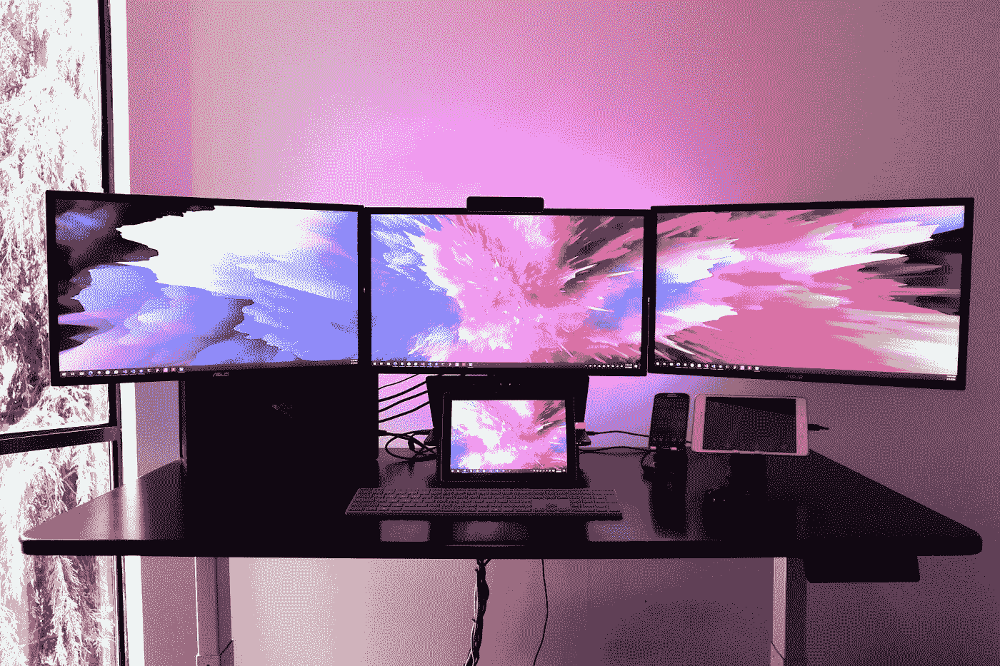

# 在 Flutter App +现场演示中创建响应式布局的 3 个选项

> 原文：<https://medium.easyread.co/3-options-for-creating-responsive-layouts-in-flutter-app-live-demo-68b0c0e955ab?source=collection_archive---------0----------------------->

## 让您的应用对所有屏幕尺寸(手机、平板电脑和桌面)都能做出响应的最简单方法。



Photo by [Jorge Ramirez](https://unsplash.com/@jorgedevs?utm_source=medium&utm_medium=referral) on [Unsplash](https://unsplash.com?utm_source=medium&utm_medium=referral)

我对“Flutter”框架的第一次体验是开发一个物联网 web 应用的移动版本。所以基本上，在创建 UI 时，我对响应式屏幕没有任何担心。因为我的应用程序只用于移动设备。

但是在我的第三个项目中，我的老板让我帮助仓库的流程变得**无纸化**。我们想简化*工作人员通常在监控*仓库货物进出之前打印文件的流程。而且主要要求是，仓库 App 要在平板设备上使用。所以，那是我第一次学习在 flutter 应用中为更宽的屏幕制作一个小部件。

在从一些资源中学习之后，我决定开发一个适用于所有设备的应用程序。工人可以在手机上安装应用程序，也可以在仓库的桌面上打开应用程序。以下是我为你收集的 3 个选项，关于如何在 flutter 应用程序中制作响应式布局。

> 目录

> 动态填充 *| ⭐️* 布局生成器 *| ⭐️ ⭐️ ⭐️* 扩展 buildcontex*|⭐️⭐️⭐️⭐️⭐️*

> *dart pad 上的现场演示: (以防你想先试试)*

*   [响应填充](https://dartpad.dev/?id=49078a3c9643cb65febbece13ed54ee9)
*   [布局生成器](https://dartpad.dev/?id=027bc67ac129aed523e58e44c647b3c1)
*   [扩展构建上下文](https://dartpad.dev/?id=59656d666468db4c86d2c71362c6dcb4)
*   响应式网格视图

在这篇博客中，我们将探讨如何让你的应用程序布局适应你的屏幕的 3 个例子。好的，我们开始吧……

## 1.动态填充| ⭐️

你可能认为这是没有反应的，但这是处理宽屏的解决方案之一。它的工作原理是向父部件添加水平填充。填充值将根据屏幕宽度动态设置。让我们看看下面的代码:

您可以为上面的代码创建一个新的文件和类。然后在需要限制屏幕宽度的时候使用它。你所需要做的就是用 **ResponsivePadding** 小部件包裹你的屏幕。

```
[@override](http://twitter.com/override)
Widget build(BuildContext context) {
  return ResponsivePadding(
    child: Scaffold()
....
```

> 这是实现代码的一个示例。这里可以看到演示: [***镖靶***](https://dartpad.dev/?id=49078a3c9643cb65febbece13ed54ee9)


responsive padding

## 2.布局生成器| ⭐️ ⭐️ ⭐️

> LayoutBuilder:构建一个依赖于父部件大小的部件树。

顾名思义，这个小部件将根据大小限制构建一个布局。与第一种不同的是，通过这种方式，我们将捕捉所有可能的屏幕尺寸，然后安排布局。假设我们有 3 种布局:移动、平板和桌面。在每个布局中，我们可以使用不同的小部件。我是从 Youtube 的 **TheFlutter Way** 中学到这个方法的，你可以通过参考中的链接访问视频。让我们先看看响应代码。

在上面的代码中，我们有一个 StatelessWidget 并返回一个 LayoutBuilder。如你所见，我们有 3 个约束宽度。您可以根据需要进行修改。

示例实现:

*   移动布局:由于宽度很小，我想在一列中显示内容，所以我将向下滚动以查看所有内容
*   平板:屏幕比移动宽，我想组合行和列。
*   桌面:对于桌面大小，我认为一行显示所有内容就足够了。我还改变了每个孩子的宽度。

我们可以像下面的代码一样使用它:

```
[@override](http://twitter.com/override)
Widget build(BuildContext context) {
  return Responsive(
    mobile: mobileWidget,
    tablet: tabletWidget,
    desktop: desktopWidget,
  );
}
```

> 你可以用这里的演示代码自己试试: [***镖靶***](https://dartpad.dev/?id=027bc67ac129aed523e58e44c647b3c1)


layout builder

现在我们根据屏幕大小有 3 种不同的布局。您可以为每个布局创建自定义小部件。这样当应用程序在你的手机、平板电脑或桌面上打开时，它们都有合适的外观。

## 3.扩展构建上下文 *| ⭐️⭐️⭐️⭐️⭐️*

好吧，这是一个相当中级的水平，但非常体面，易于使用。因为我们将使用一个来自 flutter 的扩展方法和一个通用函数。先说定义。

> 泛型函数是用类型参数声明的函数。调用时，使用实际类型而不是类型参数。[ [参考](https://learn.microsoft.com/en-us/cpp/extensions/generic-functions-cpp-cli?view=msvc-170)

对于泛型函数，我们可以基于我们声明的类型来使用函数。所以会更有活力。在 dartlang 中，当一个类或函数用类型<t>声明时，我们通常会遇到这种情况。</t>

> Dart 2.7 中引入的扩展方法是向现有库添加功能的一种方式。[ [参考号](https://dart.dev/guides/language/extension-methods)

现在我们可以为当前框架创建新的函数。详细的解释，可以看文档。

在 flutter 中，我们有 **BuildContext** 。正如我们所知， **BuildContext** 处理小部件在小部件树中的位置。所以…我们将在所有的小部件树中有一个上下文。没有上下文，小部件将不会被呈现。

现在我们将为 BuildContext 创建一个扩展方法来执行响应式布局。让我们看看下面的代码:

有了这段代码，我们可以用更简单的代码实现与 LayoutBuilder 相同的结果。

```
[@override](http://twitter.com/override)
Widget build(BuildContext context) {
  return Container(
    child: context.responsive<Widget>(
      mobileWidget, // default 
      md: tabletWidget, // medium
      lg: desktopWidget, // large
    ),
  );
}
```

> 在这里试用带扩展响应式的现场演示: [***镖靶***](https://dartpad.dev/?id=59656d666468db4c86d2c71362c6dcb4)

正如我之前说过的，这个方法是通用的，我们可以定义一个函数来返回一个数字或者别的什么。让我们试试下面的例子。何时以及如何使用它。

“颤动”中网格视图的另一个例子

```
[@override](http://twitter.com/override)
Widget build(BuildContext context) {
  return GridView.count(
    crossAxisCount: context.responsive<int>(
      2, // default
      sm: 2, // small 
      md: 3, // medium
      lg: 4, // large 
      xl: 5, // extra large screen
    ),
.......
```


responsive grid view

> 在此尝试现场演示响应式网格视图: [***镖盘***](https://dartpad.dev/?id=925bbdc793dc6b529cb07eb636338ac9)

好了，这是让你的 flutter 应用有一个响应性布局的三种方法。您可以根据需要更改断点值。

如果您有任何其他意见或问题，请在下面留下您的评论。我很乐意展开讨论。
感谢你的阅读，如果这篇文章对你有帮助，别忘了鼓掌

## 参考:

*   [针对网络、标签和移动设备的 Flutter 全响应设计——YouTube](https://www.youtube.com/watch?v=0mp-Ok00WZE&t=764s)
*   [LayoutBuilder 类—小部件库— Dart API (flutter.dev)](https://api.flutter.dev/flutter/widgets/LayoutBuilder-class.html)
*   [扩展方法|飞镖](https://dart.dev/guides/language/extension-methods)
*   [https://twitter.com/millergodev/status/1573545322457927680?s = 20&t = a _ EEG impf 1 uytworhiub 5 w](https://twitter.com/millergodev/status/1573545322457927680?s=20&t=a_eEgIMPf1uyTwoRHiUb5w)
*   [GridView 类— widgets 库— Dart API (flutter.dev)](https://api.flutter.dev/flutter/widgets/GridView-class.html)