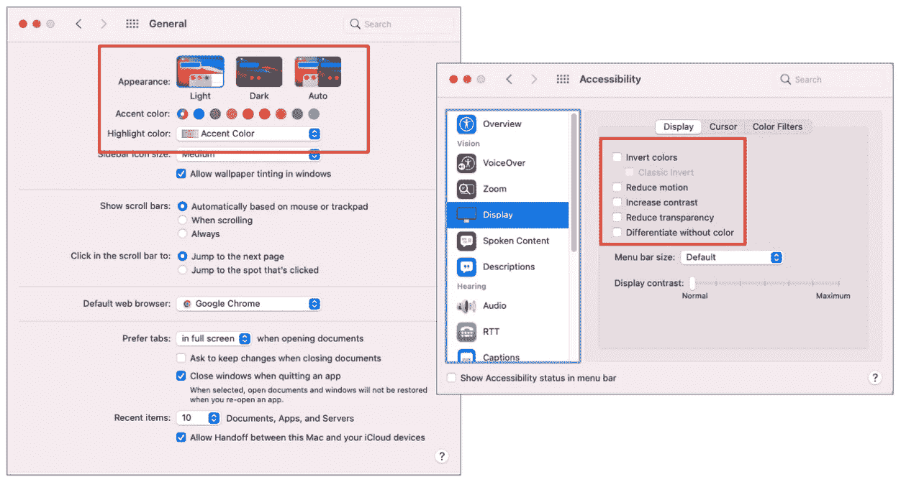

# 2022 年最相关的 3 个个性化趋势

> 原文：<https://medium.com/globant/3-personalization-trends-that-are-most-relevant-in-2022-bc415a67fd0a?source=collection_archive---------3----------------------->

Personalization Trends relevant in 2022

根据 Gartner.com 的说法，个性化是“在双方之间创造相关的、个性化的交互的过程，旨在增强接受者的体验。”

随着消费者越来越多地出现在网上，数字平台也在不断发展。随着品牌在数字市场上激烈竞争，个性化体验正成为客户旅程的重要组成部分。

Amazon displaying personalized suggestions based on previous purchases.

在我们目前的在线体验中，主要是购物体验，我们被足够智能的平台宠坏了，这些平台可以了解我们的好恶。然后，这些平台会推荐进一步购买的选项，以及可以与当前购买一起购买的选项。现在我们已经习惯了这样的个性化，很难再回头了。人们只能期待更愉快的数字体验。

为什么我们需要个性化？

个性化在以下方面帮助我们:

1.  消费者更喜欢根据他们的搜索历史和偏好为他们提供定制优惠和推荐的品牌。
2.  使用个性化的公司看到了宝贵的投资回报，因为它们提供了更好的访客参与和客户体验。
3.  个性化不仅仅是增加收入，它还可以帮助降低客户获取成本。
4.  营销人员认为个性化可以改善顾客与品牌的关系。
5.  如果客户收到定制的营销信息，他们的品牌忠诚度就会增加。

**个性化和定制化是一回事吗？**

许多营销人员交替使用个性化和定制这两个术语，但它们并不相同，它们代表了不同的使用案例和目的。让我们更好地理解这些术语。

当平台根据客户过去的行为数据定制体验时，个性化就实现了。在这里，客户数据用于预测未来的偏好并提出建议。例如，网飞根据用户以前的搜索和浏览为每个用户个性化其主页。

另一方面，定制是由客户或用户自己执行的，以适应他的需求。例如:脸书用户可以选择他们最喜欢的内容，也可以打开针对个人、页面或帖子的通知。

根据 Google I/O 2021，新的响应式设计将使用用户定制来提供个性化体验。例如，用户在其操作系统中设置的首选项可用于构建更加强大和个性化的 web 体验，尤其是对于那些有辅助功能需求的用户。

Image source: Article on the new responsive by Una Kravets

**2022 年最相关的个性化趋势**

既然我们已经意识到了个性化的重要性，让我们来看看 2022 年最相关的一些个性化趋势。

**个性化趋势 1:元宇宙的个性化**

随着数字世界和现实世界的营销策略趋同，个性化的重要性只会增加。不仅仅是[人工智能](/globant/ai-powered-optimization-of-websites-steps-to-improve-customer-experience-with-ai-5c32c79e76e3)和机器学习技术，随着自然语言处理、强化学习和情感识别的最新发展，公司可以提供跨平台和维度的超个性化体验。

随着元宇宙的出现，个性化将采取一种新的形式，让消费者在元宇宙体验身临其境的感觉。正如移动曾经做过的那样，元宇宙将增加观众行为的多样化。营销人员需要改进他们的个性化工具，以提供高度相关和引人入胜的广告。

**个性化趋势二:全渠道个性化**

沿着最合适的路径与客户见面，在他们所在的地方或他们喜欢的渠道(包括自有媒体、社交媒体和付费媒体)上引发互动。当消费者在多种设备和渠道之间切换时，为了一致性，必须支持这些媒介之间的一致性。有了技术，就有可能跨多个接触点连接用户数据。

通过跨 web、应用程序、电子邮件和人力渠道提供一致、相关和及时的互联客户体验，统一信息传递。

**个性化趋势 3:少饼干的个性化**

随着浏览器不再支持第三方 cookie，我们已经到达了第三方 cookie 时代的终点。现在重要的是收集第一方数据。由于这些数据归企业所有，它们可以利用这些数据来提供优惠，提供个性化的内容和体验。准确规划哪些信息是有用的，并使用 CRM 来整合所有数据，以确保公司能够提供有凝聚力的战略体验，这将非常重要。

谷歌还推出了基于兴趣的广告(IBA ),这是一种个性化广告形式，根据用户最近访问的网站推断出的兴趣为用户选择广告。

总的来说，个性化策略可能会发生转变，这种转变可能基于一般的受欢迎程度，或者跟踪鼠标悬停和点击，或者地理位置、当地天气和推荐数据。

**结论**

公司拥有精心设计的个性化策略非常重要。这些策略需要根据数字环境和客户行为的变化不断发展。不断测试你的策略的结果，注意哪些击中了要害，哪些没有。这可以通过持续的优化测试和学习循环来实现，该循环使用客户数据、分析和见解来交互式地改善数字交互和体验。

在制定个性化策略时，请注意，随着用户越来越意识到他们的数字足迹，他们希望控制如何以及何时使用他们的个人数据。他们期望完全透明，以此作为对其数据授权的回报。

记住上述趋势，很明显，客户希望在 2022 年获得控制权。无论是通过相关营销、体验之旅满足他们的期望，还是满足他们的隐私担忧，将脱颖而出的公司都将通过将最终用户放在第一位来规划他们的数字体验。