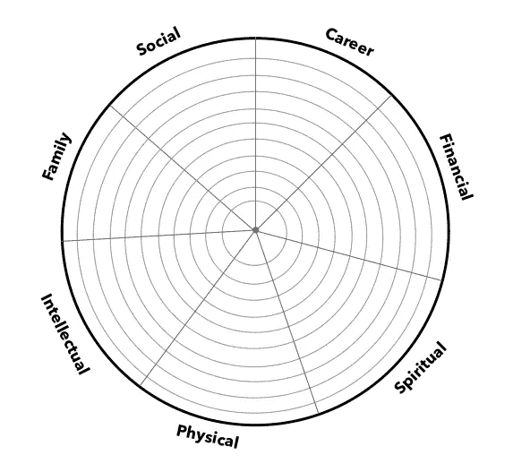

# 我从指导中学到的 3 件事

> 原文：<https://medium.com/version-1/3-things-i-learned-from-mentoring-728c905bd55c?source=collection_archive---------0----------------------->

Photo by [Medienstürmer](https://unsplash.com/@medienstuermer?utm_source=medium&utm_medium=referral) on [Unsplash](https://unsplash.com?utm_source=medium&utm_medium=referral)

我目前是影子董事会第一版的成员。影子董事会是一群 30 岁以下的人，他们向高级决策者提供反馈和想法。[在这里了解更多关于影子板](https://www.version1.com/shadow-board/)的信息。

每位影子董事会成员都幸运地从高级团队中被指派了一名导师。学员有责任推动课程，设定议程，并开诚布公地从课程中获得最大收益。导师不仅是优秀的倾听者，而且会挑战学员，帮助他们设定目标，成为值得信赖的顾问。

# 如何充分利用指导

可能很难知道你想从辅导课上得到什么，或者如何进行辅导——特别是如果你是第一次有正式的导师。以下是我想出的一些与你的导师进行成功对话的技巧。

*   在指导会议之前了解你自己。在第 1 版中，我们可以使用个性分析(PPA)工具。PPA 有助于提高你的自我意识水平，发现你天生擅长什么，并确定什么能激励你。网上有很多自我意识工具，只需谷歌一下“我如何变得更有自我意识”。
*   向你的导师敞开心扉，让他们帮助你——你需要对他们开诚布公。这可以是分享你的职业目标、动机和背景，因为这是你想要进一步发展的地方。所有这些都会让他们更好地了解你，并提供量身定制的建议。找出你的优势和劣势。探索这些在职业生涯中对你有帮助的地方，以及它们可能在哪些地方阻碍了你或拖了你的后腿的例子。将这些作为与你的导师对话的开始，然后导师会就如何克服你发现的任何问题提供一些指导。​​​​​​​
*   你可以与导师探讨的另一个领域是职业变化或进展——他们可能有很多年的经验，所以可以向你提供他们旅程的一些细节，或者给你下一步行动的建议。

# 所以，关于我从指导中学到的 3 件事

## 当你获得更多责任时，时间管理的重要性。

帕累托原则或 80-20 法则指出,“大约 80 %的结果来自 20 %的原因。这是一种分布不均的现象，在无数的生活和商业场合中都可以找到。这个原则可以用来帮助你更有效地管理你的时间，完成那些会产生最大影响的任务。我现在牢记这一点，并做到以下几点:

*   如果我没有任何可以增加或获得的价值，就提前退出通话。
*   每天早上做一份每日任务清单，午饭后回顾进度。
*   如果工作/机会不符合你的目标或者不是当务之急，拒绝它们。
*   学会在团队中委派任务。

把这些都列出来很容易，但是把它们付诸实践却很难。我的建议是服用其中的一种，开始做一两个星期，慢慢地你会发现它会成为一种习惯。

## 设定短期和长期目标的重要性

目标设定是我们都知道的事情，在第 1 版中，我们必须设定季度目标，并与我们的经理一起审核。我从我的导师那里学到，后退一步，为今年设定目标，甚至展望未来也很重要。这是有意义的，特别是在我作为业务分析师的工作角色中，我参与产品路线图，为产品或项目制定愿景和方向。这是我们预测中非常重要的一步，那么为什么我没有用自己的职业生涯甚至生命来做这件事呢？

我的导师建议完成[生活之轮练习](https://www.indeed.com/career-advice/career-development/wheel-of-life)，因为我发现很难开始——这个练习帮助你理解生活中的不同领域是如何平衡的。这是一个很好的开始方式，因为我能够为低于预期的领域设定目标，并保持已经处于良好水平的领域。

另一个想法是给自己写一封 5 年的信，想象 5 年后的自己——你在哪里？你在做什么?你在工作中的职责是什么？同行怎么看你？这可以让你思考你想成为什么样的人，并可以推动更短期的目标。

## 如何处理重要的谈话

我向我的导师提出的一个问题是进行艰难的对话，努力说不或拒绝——这与时间管理密切相关。作为一次学习练习，我的导师让我查看过去进展顺利和不太顺利的对话，并记录下来。这帮助我了解我可以改进的地方。我的导师告诉我，在进入这些对话之前，要确保你有一个清晰的计划，这可以确保你从对话中获得最大的收获，不会错过任何关键点。同样重要的是，你要在谈话前处理任何负面情绪，如沮丧或愤怒，因为这可能导致谈话进行得很糟糕，双方都没有好结果。这些教训告诉我，在匆忙进行这些对话之前，先退一步。

> 我真的鼓励任何想发展自己或事业的人去寻找导师。要记住的一件重要的事情是，导师会在那里指导你，所以你必须在第一时间接受支持，并准备好在自己身上投入时间。

最后，我想对 Jarlath Dooley 说一句非常感谢的话，感谢你迄今为止为我提供的指导，感谢你让我变得更有自知之明，并发展这些将在未来几年对我大有裨益的技能。

**关于作者:**

Tanya Matthews 是 Version 1 的商业分析师。