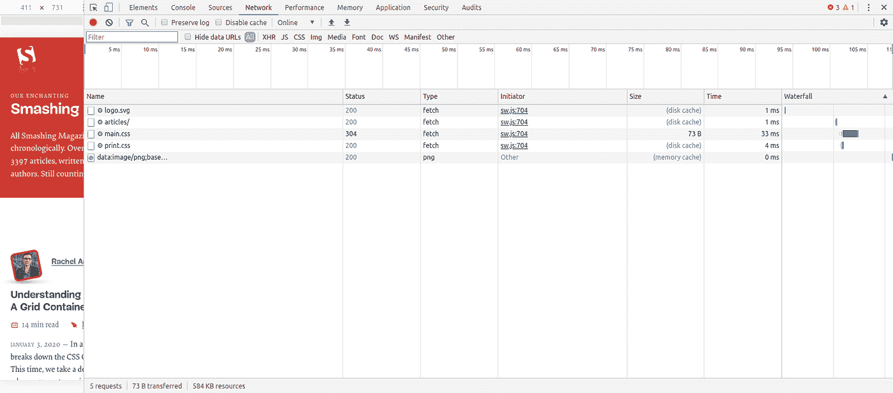
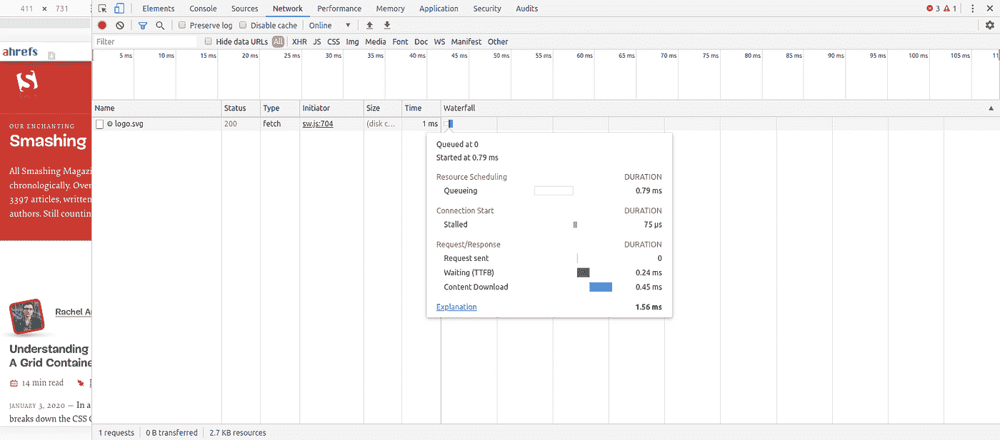

# 提高网站速度的 3 个技巧

> 原文：<https://medium.com/quick-code/3-tips-to-boost-your-website-speed-1d88de6efb3d?source=collection_archive---------2----------------------->

网站速度是建设和维护网站时需要考虑的最重要的因素之一。根据市场调查，一个运行缓慢的网站会导致平均 11%的页面浏览量下降和 16%的客户满意度下降。

“根据谷歌的研究，如果一个网站在 3 秒钟内没有加载，53%的访问者会离开这个网站。”

考虑到这一标准，谷歌在其搜索引擎结果中将加载速度低于 3 秒的网站排名靠前。

由于智能手机的大量使用，网站速度优化变得更加重要。以移动形式压缩和挤压全尺寸网站的内容是一项复杂的任务。

需要通过[有效的应用程序开发](https://www.valuecoders.com/application-development)进行大量优化，以确保所有类型设备的最佳内容可视性。

那么提高你的网站速度还有哪些优势呢？

根据 MachMetrics，互联网上大多数网站的加载速度为 8-11 秒。这与谷歌建议的理想的 3 秒网站加载速度相差甚远。

但正如我提到的，谷歌仍然认为页面速度是一个 SEO 排名因素。因此，通过优化你的速度，你自动有一个更好的机会在 SERPs 上比竞争对手排名更高。

现在到了关键的部分——如何提高网站速度？

好吧，这里有 3 个简单的小窍门:

# 1.最小化 HTTP 请求的数量

网站 80%以上的加载时间都用于下载页面的不同部分——图像、样式表、脚本、字体等。获取网站上的每一个元素都需要发送 HTTP 请求。请求数量越多=加载页面的时间越长。

那么如何最小化 HTTP 请求呢？

首先，找出页面发出的 HTTP 请求的数量。

为此，我们将使用谷歌 Chrome 浏览器中的开发者工具选项。

打开要分析的页面的 URL。然后右键单击并选择“检查”(或使用键盘快捷键 Ctrl+Shift+I)。这将把你带到开发者工具部分。

从这里，找到右上角的“网络”选项卡，并单击它(通过拖动开发工具部分的左边界来扩展可视区域)。

上面的截图是你在网络标签中看到的。该表显示了为显示网页而发送的所有 HTTP 请求。在这个表中,“Name”列显示了页面上加载的所有文件,“size”列显示了它们的大小(duh),“Time”列显示了加载元素所花费的时间。面板的左下方显示了发送的 HTTP 请求的总数。

在上图中，您可以看到本例中分析的网站仅使用了 5 个 HTTP 请求来加载其页面。然而，大多数网站并非如此。我见过网站加载十几个 HTTP 请求，然后有一个可怕的加载时间。

因此，检查 HTTP 请求并删除任何不必要的内容非常重要。如果减少或消除任何东西是不可能的，那么下一个技巧可能会有所帮助。

# 2.缩小和合并文件

第一点帮助你看到你的网站发送的 HTTP 请求的数量。在下一个技巧中，我们将通过合并和缩小文件来尽量减少请求。

HTML、CSS 和 JavaScript 文件几乎构成了网站的整个前端。它们也是 HTTP 请求数量最多的网站。通过缩小和合并你的 HTML，CSS 和 JavaScript 文件，你可以减少请求的总数，同时减少它们的大小。

网站开发的这一方面由开发人员在自定义网站开发中负责。但是如果你使用的是模板化的网站构建器，比如 WordPress、Wix、Squarespace 等提供的，那么缩小和合并需要特别注意。

*:删除多余的格式、代码和空格。*

****合并*** :顾名思义——将多个相同类型的文件合并成一个(合并两个独立的 CSS/JavaScript 文件)。*

*如果你使用的是模板化的网站构建器，缩小和合并只需要安装一个插件，激活它，嘣！*

# *3.最小化 TTFB*

*网站速度优化的一部分是尽量减少加载网站的时间。然而，经常被遗忘的一个重要部分是加载网站之前所花费的时间，即服务器从*开始*在浏览器上加载网站所花费的时间。*

***到达第一个字节的时间**或 TTFB 基本上是浏览器从网站服务器加载数据的第一个字节所花费的时间。Google 建议 TTFB 低于 200ms。*

*我们之前讨论的技巧是关于前端的，这是关于网站的后端，也就是服务器。*

*每当有人访问一个网站时，浏览器就向服务器发送相关的 HTTP 请求，然后服务器向浏览器发送信息以加载该网站。在服务器和网络浏览器之间的通信中，TTFB 是可见的。*

*与第一个技巧类似，我们可以使用 Google Chrome 的开发工具来查看 TTFB。*

**

*像我们在第一篇技巧文章中所做的那样转到 Network 选项卡后，您需要将鼠标悬停在表格的“瀑布”列中看到的第一个项目上。*

*在悬停时出现的小框中，我们可以看到“等待(TTFB)”，在这种情况下，为 0.24 毫秒。非常值得称赞，粉碎杂志！*

*如果你的网站的 TTFB 低于 200 毫秒，那么没有理由担心。但如果不是这样，那么下面是你 TTFB 较低的四个可能原因:*

# *1.网络问题*

*这是仅有的两个不受你控制的问题之一。你所能做的就是确保你使用的是一个可靠的主机服务提供商的服务，确保世界和平。*

# *2.高流量*

*高流量是 TTFB 低的另一个原因，这完全超出了你的控制。强烈建议不要使用共享主机服务，因为它们只会降低你的网站速度，包括 TTFB。您可以升级您的网站功能或您的 VPS 的 VPS，以适应更高的流量，而不影响 TTFB。*

# *3.Web 服务器配置中的问题*

*网络服务器不是你的托管平台，而是运行它的软件。有几个问题会困扰 web 服务器，导致糟糕的配置，并最终导致糟糕的 TTFB。*

# *4.动态内容创建(尤其是在 WordPress 网站中)*

*这个问题在 WordPress 驱动的网页中尤其普遍。当 web 服务器向浏览器提供动态内容时，动态页面必须由服务器构建。这需要时间，并最终导致更高的 TTFB。*

*有一个解决 WordPress 中动态内容创建问题的方法，叫做缓存。缓存是指在服务器上预先构建页面，准备好 HTML，并在用户访问上述网站时将其发送到浏览器的过程。*

*缓存有助于绕过 WordPress 站点中的 TTFB 问题，并最终提高网站加载速度。*

# *让我们结束吧！*

*这里提到的这三个技巧几乎涵盖了你优化网站速度所需要做的一切。当然，还有各种其他因素影响网站速度。但是控制好上述三点有助于解决大部分(如果不是全部)网站速度相关的问题。*