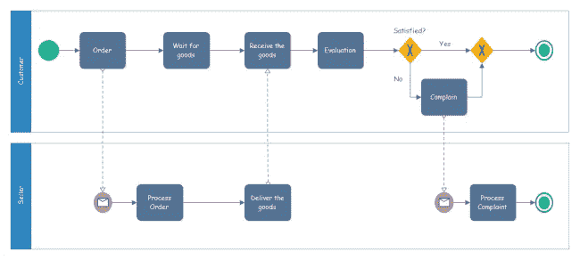
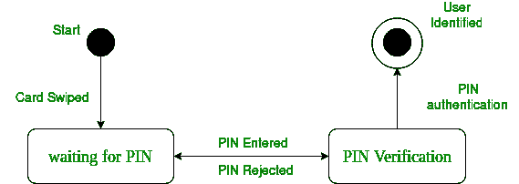
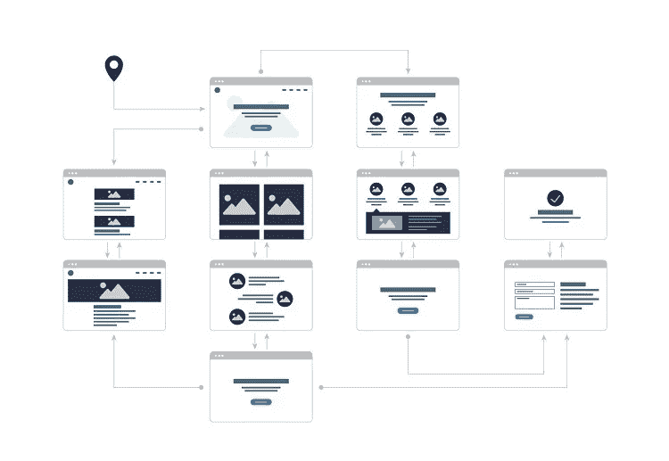

# 3 个对产品经理有用的图表

> 原文：<https://medium.easyread.co/3-useful-diagrams-for-product-manager-67ae2df0d027?source=collection_archive---------0----------------------->

## 产品经理生活

## 在展示密集信息时，图表比文字更有力量

Photo by [You X Ventures](https://unsplash.com/@youxventures?utm_source=medium&utm_medium=referral) on [Unsplash](https://unsplash.com?utm_source=medium&utm_medium=referral)

作为产品经理，你需要的一项技能是为你的团队绘制并提供清晰的图表。因为在创建文档时，文字往往不能帮助解释要传达的真实意图。为了解决这个问题，我总是在文档中添加图表，以便他们理解目标。

# 图表帮助产品经理设计和计划

在最初的概念过程中，我总是使用特性或产品的图表来绘制业务流程图。我这样做是因为这样做可以让我更容易地进行设计，并且我可以更全面地了解这些功能。往往在这个过程中，如果我看到少了什么，那么我就能很快找出来。此外，使用图表，我可以非常清楚地表达我脑海中的想法，相比之下，我必须在没有视觉辅助的情况下描述这些想法。

**比如**有业务流程复杂，决策点多，没有任何图形支持的特点；很难解释。图表也可以作为团队之间交流的媒介。

根据我的经验，尤其是在制作产品文档时，这些图表是最常用的。

# 业务流程模型和符号(BPMN)

BPMN diagram example. Image: [**edrawsoft**](http://www.edrawsoft.com)

> 业务流程模型和符号(BPMN)将为企业提供以图形符号理解其内部业务流程的能力，并将为组织提供以标准方式交流这些流程的能力—【BPMN.org】T4

## BPMN 元素

BPMN 分为四种元素类型:

*   **流对象**(事件、活动和网关)
*   **连接对象**(序列流、消息流、关联)
*   **泳道**(泳池或泳道)
*   **工件**(数据对象，组，注释)

 [## 什么是业务流程建模符号

### 销售、项目管理和其他领域的专业人员使用业务流程建模软件来规划他们的…

www.lucidchart.com](https://www.lucidchart.com/pages/bpmn) 

## 当我用 BPMN 的时候。

当我想翻译将要开发的新功能的过程时，我会使用 BPMN，当我想与利益相关者进行头脑风暴时，我也会使用它。我平时用来做 BPMN 图的工具，像 [**cawemo**](https://cawemo.com/) 和 [**lucidchart**](https://www.lucidchart.com/) 。

# 状态图

状态图是统一建模语言(UML)的一种，它描述了单个对象响应系统中一系列事件的行为。

State Diagram example. Image: [geeksforgeeks.org](https://www.geeksforgeeks.org/unified-modeling-language-uml-state-diagrams/)

## 状态图符号

状态图分为五个符号:

*   **状态**
*   **跃迁**
*   **初始状态**
*   **最终状态**

 [## 使用 draw.io 的 UML 状态图

### 状态图在程序设计中被用来描述一个系统可能处于的各种状态。

drawio-app.com](https://drawio-app.com/uml-state-diagrams-with-draw-io/) 

## 当我使用状态图时

当我想要显示状态和由特定事件触发的另一个状态之间的关系时，我通常使用这个图。这个图表将极大地帮助开发人员理解可能发生的状态和变化。因为我用的工具是 draw.io 或者现在已经改成了[diagrams.net](https://www.diagrams.net/)

# 用户旅程

产品经理的任务之一是与 UX 团队合作，或者我可以说与 UX 团队的合作可能非常激烈。UX 团队将提供大量关于我们正在构建的功能或产品流的信息。帮助产品经理与 UX 团队沟通的方法是创建用户旅程图。

> 用户旅程代表用户在使用产品或服务时可能遇到的一系列事件或经历。用户旅程可以被映射或设计成显示作为交互呈现的步骤和选择，以及由此产生的动作。—[everyinteraction.com](https://www.everyinteraction.com/definition/user-journey/)

User Journey example. Image: [optimizely.com](https://www.optimizely.com/optimization-glossary/user-journey-map/)

## 当我使用用户旅程时

当提出新功能或新产品时，会用到用户旅程，因此我们可以识别潜在的冲突，并决定整体用户流可能是什么样子。此外，当进行重要的变更时，它将帮助我决定流程的哪些部分需要修改。

我用的工具是 [**adobe xd**](https://www.adobe.com/sea/products/xd.html) 或者 [**invision**](https://www.invisionapp.com/) 。

# 结论

对于产品经理来说，使用图表有很多好处。应用于文档，甚至在与利益相关者进行简报时用作支持材料。

最终，它使产品开发过程变得更加容易。