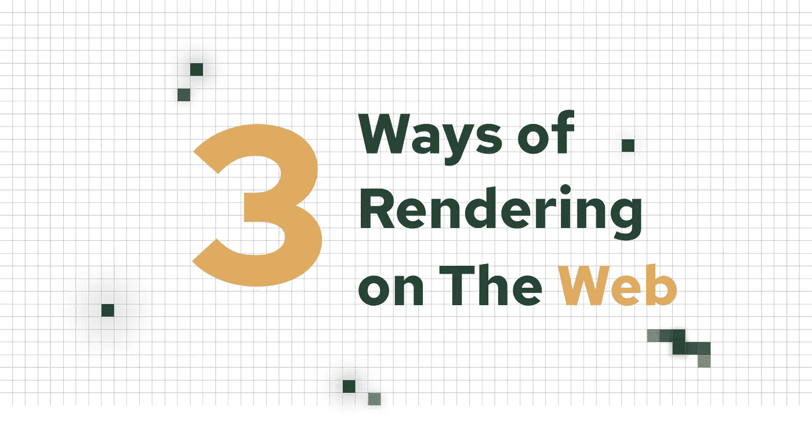

# 在网络上呈现的 3 种方式

> 原文：<https://medium.com/compendium/3-ways-of-rendering-on-the-web-4363864c859e?source=collection_archive---------1----------------------->

Illustration: Colored pixels being painted on a background

## 介绍

渲染一个网站有几种方法。一个常见的挑战是何时选择哪种类型。

在开始一个新项目之前探索这些选项可以防止我们重构部分代码或整个技术栈。要看在谷歌获得好的排名是否至关重要。或者内容是否应该更具交互性、更具动态性，并平滑地淡出用户的视野。或者性能和卓越的用户体验对您的业务目标更为重要。

所有的网站都有不同的需求，对网络渲染有一些基本的了解会让你节省金钱、时间和挫折。

# 概念和术语

首先，我们将了解一些基本的技术概念和术语。了解一点它们将帮助我们在网站的渲染选项上做出更好的决定。

这些概念我们可以分为两类:性能和渲染。

## 表演

*   **水合**是 JavaScript 将静态 HTML(从服务器返回)转换成浏览器中动态交互元素的技术。通常也称为客户端水合或再水合。补水的时候 JavaScript(比如事件处理程序，监听器等。)链接到静态 HTML，使其具有交互性。
*   **预渲染**是一种在构建时提前渲染*HTML 的技术。对于应该被搜索引擎抓取和排名的公共页面，预渲染是必不可少的。服务器端和静态端应用程序使用这种技术。*

## 翻译

*   **First Paint** (FP)是用户导航到页面后呈现的第一步。它是在屏幕和浏览器窗口中绘制的第一个像素，浏览器窗口中视觉上与导航之前不同的所有内容都在第一次绘制中处理。
*   **第一次内容丰富的绘制** (FCP)是浏览器第一次向 DOM 呈现某些东西，比如文本、图像或 SVG。在这个过程中，浏览器会告诉用户“有事发生了”。
*   **互动时间** (TTI)。此时，浏览器已经呈现了整个网站内容，用户可以与页面上的元素进行交互。这可能是按下按钮或点击文本字段，给用户一些反馈。

# 客户端渲染(CSR)

客户端渲染的网站“自己”做所有的事情例如从 API 中检索数据、管理逻辑以及直接在浏览器中的页面之间进行路由。访问者访问的每个页面及其相应的 URL 都是动态创建的。

*我们可以把客户端渲染想象成包裹递送，由三个包裹组成。每个包裹会以不同的顺序在不同的时间出现，但是你不知道确切的时间。你将得到第一个包裹，然后是第二个，最后是第三个。*

客户端应用程序通常具有快速的 FP 和 FCP。他们使用水合作用，这会导致缓慢的*交互*时间，因为浏览器需要“启动”JavaScript 代码，再水合，然后将 HTML 加载回浏览器窗口。水合过程可能随时间而变化，这取决于您的应用程序包含多少 JavaScript。

一个缓慢的 TTI 对*搜索引擎优化* (SEO)不是很好。大多数需要为 SEO 抓取和优化内容的客户端应用程序都必须实现预渲染才能正常工作。

客户端呈现是 JavaScript 应用程序的默认设置。像 React、Angular 和 Vue 等流行的前端框架都使用这种渲染类型。

## 优点:

*   给予用户快速的反馈和流畅的用户体验，例如快速的第一次满意的绘画。
*   服务器负载低，因为所有内容都在客户端/用户浏览器中处理和呈现。
*   比服务器端呈现的应用程序成本更低。

## 缺点:

*   可能会导致用户体验不佳。潜在地，让用户等待内容，直到所有内容都完全加载到浏览器中，导致用户离开网站。
*   客户端应用程序使得搜索引擎机器人很难看到网站内容，这导致没有或很差的索引。
*   如果 JavaScript 在用户浏览器中被禁用，则 JavaScript 页面将不可见。

# 服务器端呈现(SSR)

服务器端渲染(SSR)是按需发生的，也称为及时*(JIT)。每次客户端请求页面时，服务器都会为该请求生成 HTML。然后将 HTML 返回给客户机，完全呈现出来，准备显示。*

*我们可以把服务器上的渲染想象成包裹递送，就像客户端渲染一样。你可以在同一时间收到所有的包裹，而不是在不同的时间收到。*

*服务器端呈现比静态端呈现慢，因为 HTML 完全是根据每个请求生成的。但是在将整个结果返回给用户时，它比客户端呈现的应用程序要快。*

*像 Vue 和 React 这样的 JavaScript 框架使用*水合*来生成从服务器发送的交互代码。*

## *优点:*

*   *适合以 SEO 为主的网站。*
*   *通过按需交付所有内容，为用户提供出色的用户体验。*

## *缺点:*

*   *可能很贵。除了前端代码之外，还需要设置和管理服务器或服务器代码。*
*   *如果服务器关闭，网站也会关闭。*
*   *除了前端开发人员之外，可能还需要后端/全栈开发人员。*

# *静态侧渲染*

*静态呈现发生在构建时。每个页面都提前编译并呈现为静态 HTML 文件*(AOT)。*文件生成 AOT 意味着我们将为每个文件生成一个带有单独 URL 的 HTML 文件。静态网站的优秀之处在于，它们可以上传到 CDN，并在需要时轻松地转移到另一个来源，而无需做太多工作。*

*我们可以想象静态渲染一个应用程序，就像在服务器上一样，只是它的速度非常快。包裹不需要事先包装；它们会立刻运送给你。*

*静态呈现的网站有一些显著的优势。它们速度更快，可靠性更好，并且改进了 SEO。静态生成的网站有快速 FP、FCP 和 TTI。*

*几个月前，我写了一篇文章，讨论拥有静态生成的网站可以带来哪些好处。欢迎你来阅读:[静态网站的好处。](https://marius-ibsen.medium.com/benefits-of-static-websites-5fb187d1ffe6)*

## *优点:*

*   *完美的搜索引擎优化为重点的网站。*
*   *可靠、性能卓越、安全且可扩展*
*   *成本低；它可以在内容交付网络(CDN)上“生存”*
*   *易于在主机提供商之间转移*

## *缺点:*

*   *您依赖于部署整个网站以防发生变化，例如为电子商务商店推送新闻文章或产品。*

# *让我们结束吧*

*如果你问自己，“什么时候应该对渲染类型的选择至关重要？”当一个网站包含 JavaScript 时，这才是相关的。*

*CSR 可以为用户提供更快的响应(FCP)。当内容需要更新而不需要联系服务器时，它的交互性更强，也更完美。另一方面，假设你用全 JavaScript 建立一个网站。在这种情况下，一些 JavaScript 框架，如 React、Vue 或 Angular，在大多数情况下只会呈现一个空的 HTML 页面。在完全呈现之前，搜索引擎爬虫会将这些站点视为完全空白。*

*过去几年流行的许多 JavaScript 框架都内置了静态站点生成(SSG)和服务器端呈现，如 GatsbyJS 和 NextJS，同时支持 SSR 和 SSG。*

*SSR 和 SSG 更适合 SEO。两者都可以更快地显示页面内容。它们提供了更好的用户体验，搜索引擎机器人将更容易对你的页面进行排名。假设你有一个只包含 HTML 的静态网站。在这种情况下，您根本不需要关注或担心 SEO 优化或过多的服务器负载。*

*在我最近做的项目中，我们已经结合使用了客户端和静态渲染好几年了。这样做是必不可少的，因为我为之工作的客户有一个网站，它既是一个新闻页面，也包含一些页面，用户可以在这些页面上看到一些安全页面背后的客户关系。*

*如果你和我上面描述的情况一样，我不建议你完全只做服务器端或者客户端。知道什么时候使用不同的渲染类型，你将会制作出非常棒的网站，给用户很好的用户体验。*

*感谢您的阅读！*

**代号为**