# 使用图表检测利益冲突

> 原文：<https://medium.com/oracledevs/303fdc8ccb5a?source=collection_archive---------0----------------------->


Photo by [Sasun Bughdaryan](https://unsplash.com/@sasun1990?utm_source=unsplash&utm_medium=referral&utm_content=creditCopyText) on [Unsplash](https://unsplash.com/?utm_source=unsplash&utm_medium=referral&utm_content=creditCopyText)

利益冲突交易有多种模式。让我们考虑一个案例，一个组织的雇员批准了与他们相关的公司的交易。例如，如果一家公司的员工以更高的价格从他们家庭拥有的商店购买办公设备，这将是公司的损失。如果这种情况发生在政府或公共服务部门，则需要作为潜在腐败进行调查。

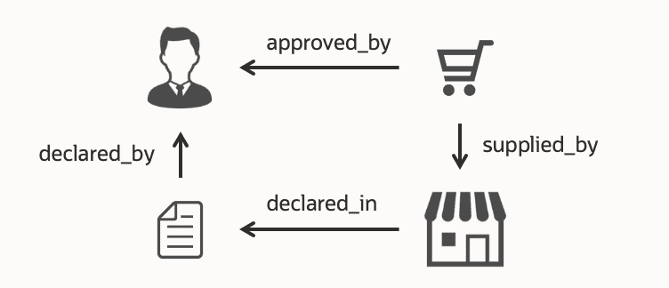

这种“联系”并不总是简单的，但它们可能涉及多种关系。它们可能是有意隐藏的，也可能是偶然发生的。因此，如果系统能够检测到可能存在利益冲突的交易，就可以保护组织及其员工免受欺诈和不利影响。

在本文中，我们将向您展示如何使用图形来检测这种“连接”。我们将展示一个使用 Graph Studio for Oracle Autonomous Database(ADB)的示例，同时可以使用所有 Oracle 数据库尝试相同的场景。有关如何设置的更多信息，请参见:

*   [在云上设置 Oracle Graph(ADB)](/oracledevs/setup-oracle-graph-on-cloud-adb-9f92aa5b8846)
*   [在云上设置 Oracle Graph(DBCS)](/oracledevs/setup-oracle-graph-on-cloud-dbcs-84bc198d54a0)

**源数据集**

让我们假设下列数据以表格的形式存在。为了方便起见，我在所有文件中添加了 COI (=利益冲突)前缀。请右键单击链接以保存文件。

*   [COI_EMPLOYEE](https://raw.githubusercontent.com/ryotayamanaka/oracle-graph/main/conflict-of-interest/coi_employee.csv) (姓名、电话号码、地址等。)
*   [COI_SUPPLIER](https://raw.githubusercontent.com/ryotayamanaka/oracle-graph/main/conflict-of-interest/coi_supplier.csv) (姓名、电话号码、地址等。)
*   [COI_PURCHASE](https://raw.githubusercontent.com/ryotayamanaka/oracle-graph/main/conflict-of-interest/coi_purchase.csv) (发票号、供应商、审批人等。)
*   [COI_FORM_MASTER](https://raw.githubusercontent.com/ryotayamanaka/oracle-graph/main/conflict-of-interest/coi_form_master.csv) (表单 ID 和员工 ID)
*   [COI_FORM_INTEREST](https://raw.githubusercontent.com/ryotayamanaka/oracle-graph/main/conflict-of-interest/coi_form_interest.csv) (表格 ID，兴趣类型，供应商等。)

如果您使用自治数据库(ADB ),您可以通过数据库操作加载上述文件。

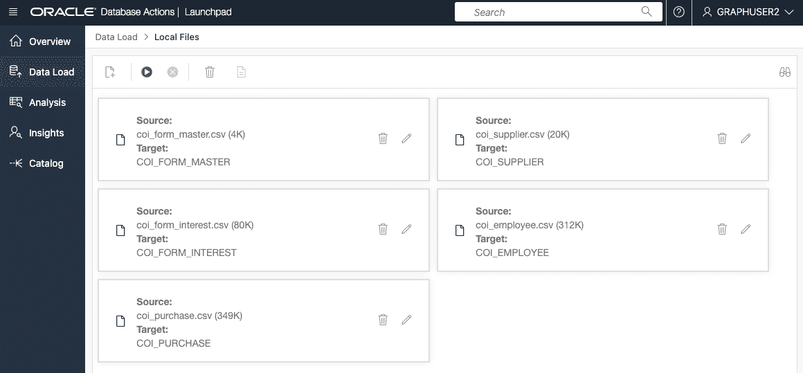

要复制以下演示，请参见此处的[了解更多详情](https://github.com/ryotayamanaka/oracle-graph/tree/main/conflict-of-interest)。

**创建图表**

Oracle Graph 提供了 CREATE PROPERTY GRAPH 语法来从表数据集创建图形。

```
CREATE PROPERTY GRAPH graph1
  VERTEX TABLES (
    coi_employee AS employee
      KEY (employee_id)
      PROPERTIES ARE ALL COLUMNS EXCEPT (postal)
  , coi_form_master AS form_master
      KEY (form_id)
  , coi_supplier AS supplier
      KEY (company_id)
  , coi_purchase AS purchase
      KEY (invoice_no)
  )
  EDGE TABLES (
    coi_form_interest_with_key
      KEY (id)
      SOURCE KEY(form_id) REFERENCES form_master
      DESTINATION KEY(company_id) REFERENCES supplier
      LABEL has_interest
  , coi_purchase AS approved_by
      KEY (invoice_no)
      SOURCE KEY (invoice_no) REFERENCES purchase
      DESTINATION KEY (approver_employee_id) REFERENCES employee
  , coi_purchase AS supplied_by
      KEY (invoice_no)
      SOURCE KEY (invoice_no) REFERENCES purchase
      DESTINATION KEY (company_id) REFERENCES supplier
  , coi_form_master AS declared_by
      KEY (form_id)
      SOURCE KEY (form_id) REFERENCES form_master
      DESTINATION KEY (employee_id) REFERENCES employee
  )
```

在 Graph Studio 笔记本上运行该语句将从数据库表中提取数据，并在内存中创建一个图形。

```
%python-pgx

statement = """
CREATE PROPERTY GRAPH coi_graph1
  VERTEX TABLES (
    ...
  )
  EDGE TABLES (
    ...
  )
"""
session.prepare_pgql(statement).execute()
```

创建了由 3800 个顶点和 4759 条边组成的图。

```
%python-pgx

graph1 = session.get_graph("COI_GRAPH1")
graph1

PgxGraph(name: COI_GRAPH, v: 3800, e: 4759, directed: True, memory(Mb): 3)
```

**模式匹配**

一旦有了图，就可以尝试使用 PGQL 查询进行模式匹配。

```
SELECT *
FROM MATCH (s1)<-[r1:has_interest]-(d)-[r2:declared_by]->(e)<-[r3:approved_by]-(p)-[r4:supplied_by]->(s2) ON coi_graph1
LIMIT 1
```

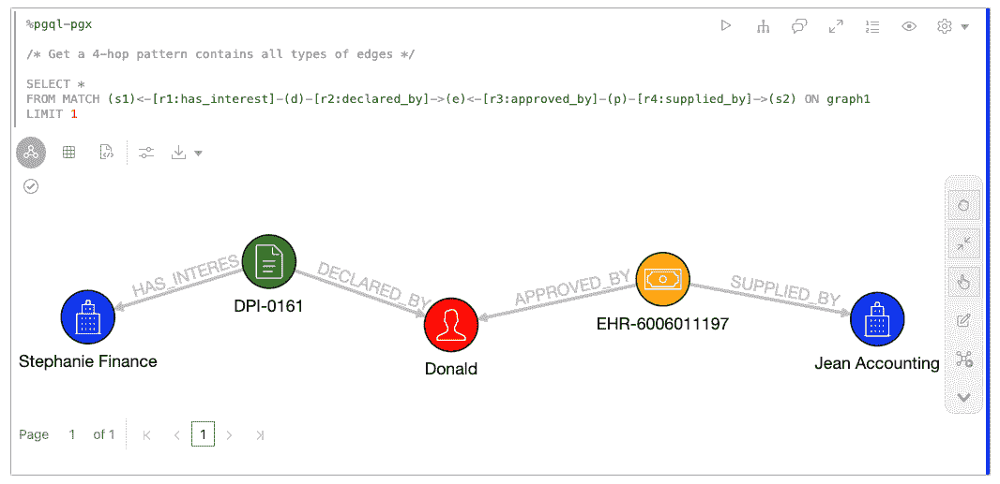

如果一个模式在一行中太长，你可以把它分成两行。这里，变量 **s1** 和 **s2** 可能是也可能不是同一个供应商，但是在模式中出现两次的变量 **e** 表示同一个雇员。

```
SELECT *
FROM MATCH (
  (s1)<-[r1:has_interest]-(d)-[r2:declared_by]->(e),
  (e)<-[r3:approved_by]-(p)-[r4:supplied_by]->(s2)
) ON coi_graph1
LIMIT 1s
```

在 Graph Studio 笔记本中，我们可以接受用户输入来指定查询中的值。在这里，检索给定的雇员“Cory Sims”和周围的信息。

```
SELECT *
FROM MATCH (
  (s1)<-[r1:has_interest]-(d)-[r2:declared_by]->(e),
  (e)<-[r3:approved_by]-(p)-[r4:supplied_by]->(s2)
) ON coi_graph1
WHERE e.first_name = '${First name}' AND e.last_name = '${Last name}'
```

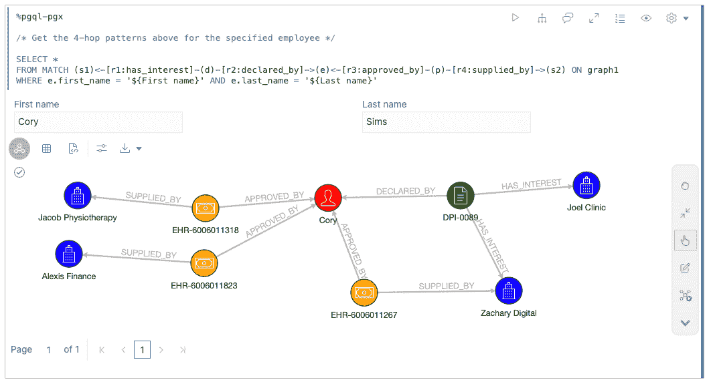

在这种情况下，Cory Sims 已经声明个人利益反对 Zachary Digital，因此系统可能需要对 Zachary Digital 的购买发出警报。


还可以检测包含特定模式的所有病例。为了表示这个 4 跳循环，我们可以使用顶点 **(s)** 来表示模式的开始和结束。

```
SELECT *
FROM MATCH (
  (s1)<-[r1:has_interest]-(d)-[r2:declared_by]->(e),
  (e)<-[r3:approved_by]-(p)-[r4:supplied_by]->(s2)
) ON coi_graph1
LIMIT 3
```

该查询返回 3 个案例。

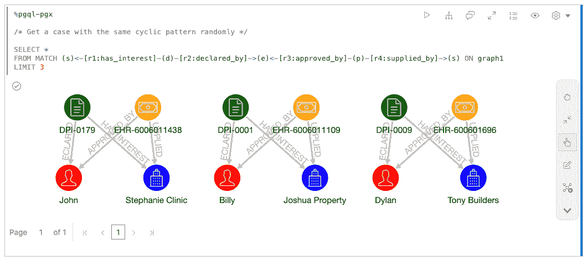

**添加新关系**

接下来，让我们考虑当我们发现员工或供应商之间的隐藏关系时，如何向图中添加新的边。我们通常可以根据员工和供应商的属性信息来检测关系。例如，如果员工和供应商共用同一个电话号码(或紧急联系电话号码)，我们可以假设他们之间有任何联系。

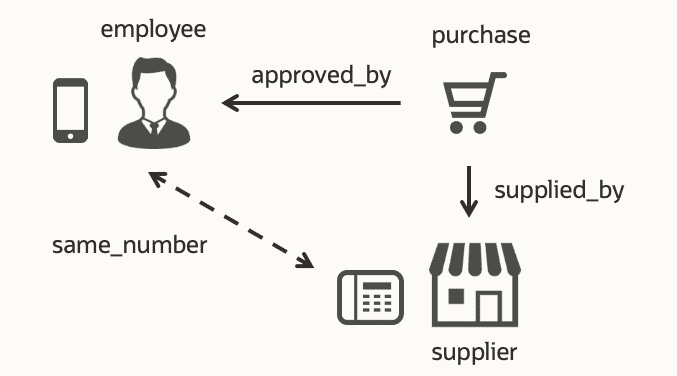

现在让我们想一个有效的方法来创建这样的关系作为新的边。因为电话号码信息是作为雇员顶点(或供应商顶点)的属性保存的，所以我们可以运行一个 PGQL 查询(INSERT EDGE 语法)来根据属性添加这样的边。

同时，查找所有匹配值(在本例中是电话号码)的最有效方法是使用表扫描和连接操作。如果图的源数据存储在表中，那么关系可以定义为 RDBMS 中表的新视图。记住为表连接在列上创建索引。

```
CREATE VIEW coi_same_number_1 AS
SELECT ROWNUM AS id, e1.employee_id AS e1_id, e2.employee_id AS e2_id
FROM coi_employee e1, coi_employee e2
WHERE e1.EMERGENCY_CONTACT_PHONE = e2.phone;
```

```
CREATE VIEW coi_same_number_2 AS
SELECT ROWNUM AS id, e.employee_id, s.company_no
FROM coi_employee e, coi_supplier s
WHERE e.EMERGENCY_CONTACT_PHONE = s.phone;
```

准备好视图后，修改 CREATE PROPERTY GRAPH 语句，这样 **graph2** 将包含新的关系。

```
CREATE PROPERTY GRAPH graph2
  VERTEX TABLES (
    ...
  )
  EDGE TABLES (
    ...
  , coi_emergency_contact_1
      KEY (id)
      SOURCE KEY(employee_id_1) REFERENCES employee
      DESTINATION KEY(employee_id_2) REFERENCES employee
      LABEL emergency_contact
      NO PROPERTIES
  , coi_emergency_contact_2
      KEY (id)
      SOURCE KEY(employee_id) REFERENCES employee
      DESTINATION KEY(company_id) REFERENCES supplier
      LABEL emergency_contact
      NO PROPERTIES
  )
```

现在，您可以看到添加了新关系 **emergency_contact** 。

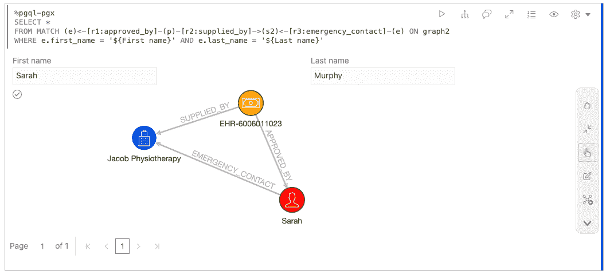

**基于地理空间距离的关系**

使用上一节描述的方法，我们可以基于现有信息创建各种类型的边。

现在让我们考虑雇员和供应商地址之间的地理空间距离。如果他们的地址非常接近，他们可能是亲戚或邻里朋友等私人关系。

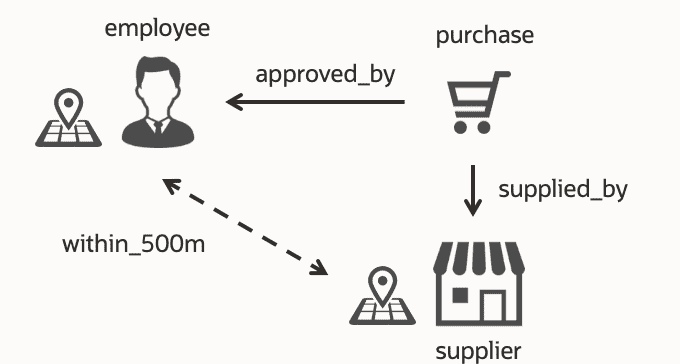

为了有效地计算距离，根据员工和供应商的纬度和经度信息添加了几何列(=包含针对几何信息优化的特殊对象的表列)，并且还为这些列创建了空间索引。

```
CREATE TABLE coi_employee_geom AS
SELECT
  t.*,
  SDO_GEOMETRY(
    2001,       -- Geometry type (two-dementional point)
    4326,       -- Coordinate system ID (SRID) 
    SDO_POINT_TYPE(t.address_lon, t.address_lat, NULL), NULL, NULL
  ) AS address_geom
FROM coi_employee t;

INSERT INTO user_sdo_geom_metadata VALUES (
  'coi_employee_geom',
  'address_geom',
  SDO_DIM_ARRAY(
    SDO_DIM_ELEMENT('LONGITUDE', -180.0, 180.0, 0.05),
    SDO_DIM_ELEMENT('LATITUDE', -90.0, 90.0, 0.05)
  ),
  4326
);
COMMIT;

CREATE INDEX idx_coi_employee_geom
  ON coi_employee_geom (address_geom)
  INDEXTYPE IS mdsys.spatial_index_v2;
```

使用这些索引，我们可以定义一个视图，列出“500 米内”的员工-供应商对。

```
CREATE VIEW coi_within_500m AS
SELECT
  ROWNUM AS id,
  e.employee_id,
  s.company_id,
  SDO_GEOM.SDO_DISTANCE(e.address_geom, s.address_geom, 0.005, 'unit=M') AS dist
FROM
  coi_employee_geom e,
  coi_supplier_geom s
WHERE
  SDO_GEOM.SDO_DISTANCE(e.address_geom, s.address_geom, 0.005, 'unit=M') < 500;
```

```
CREATE PROPERTY GRAPH graph2
  VERTEX TABLES (
    ...
  )
  EDGE TABLES (
    ...
  , coi_within_500m
      KEY (id)
      SOURCE KEY(employee_id) REFERENCES employee
      DESTINATION KEY(company_id) REFERENCES supplier
      LABEL within_500m
  )
```

可以看到 _500m 内新增了一个边缘类型**。在这种情况下，Derek 两次批准从 Kimberly Apparel 购买商品，Kimberly Apparel 的地址很近。**

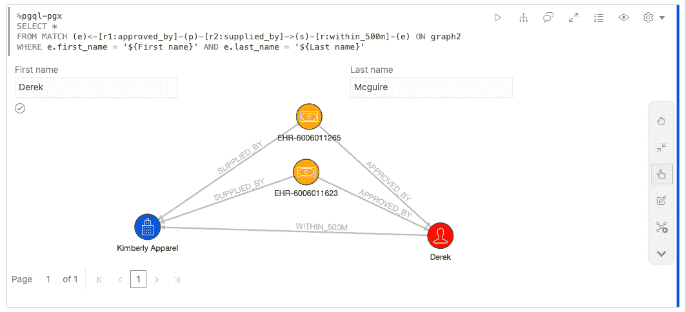

也可以在地图上显示它们。

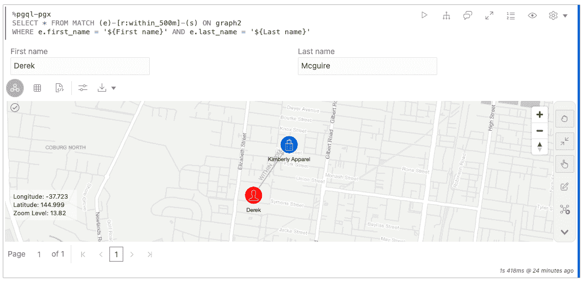

**未知长度的循环路径**

PGQL 有一个路径查找语法，允许 Oracle Graph 通过对内存中的图形应用算法(如 Dijkstra 算法)来高效地查找最短路径。

例如，此查询返回两个雇员之间的最短路径。

```
SELECT a1, b, a2
FROM MATCH TOP 1 SHORTEST (e1) (-[r]-(v))+ (e2) ONE ROW PER STEP (a1, b, a2) ON graph2
WHERE e1.employee_id = '${Employee 1}' AND e2.employee_id = '${Employee 2}'
  AND COUNT(v) = COUNT(DISTINCT v)
```

该结果显示 Kelly 和 Jack 批准的两次采购的供应商一起列在(某人的)申报单上。路径查找是成功的，但是在这种情况下结果不是很有用。

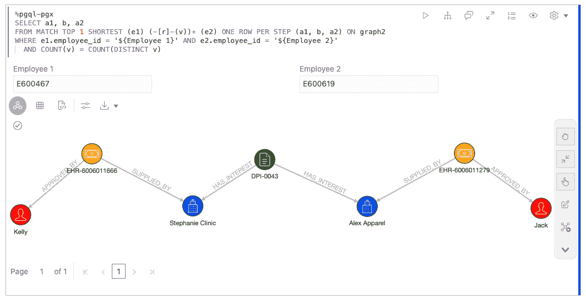

这里有一些注意事项:

*   图案`(-[r]-(v))+`沿两个方向追踪一条或多条边。
*   `ONE ROW PER STEP (a1, b, a2)`将检测到的路径分解成步骤，并将它们映射到变量`a1, b, a2`。
*   添加条件`COUNT(v) = COUNT(DISTINCT v)`是为了消除多次穿过相同顶点的路径。

在这里，我们可以想到下图的案例。该模式是包含新添加的边“same_number”的 5 跳循环。在前面的部分中，我们搜索了具有固定跳数的循环，但是在实际情况中，循环的长度可能是未知的。

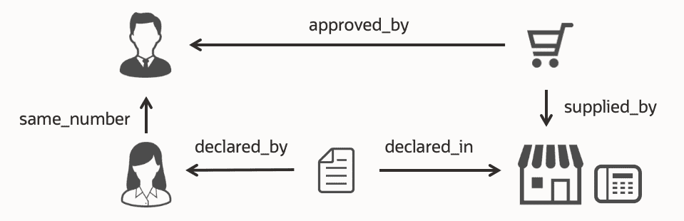

因此，让我们使用路径查找语法来检测未知长度的循环。我们应该为起点和终点都指定目标雇员，并搜索一条只穿过相同边一次的路径。

```
SELECT a1, b, a2
FROM MATCH TOP 50 SHORTEST (e1) (-[r]-(v))+ (e2) ONE ROW PER STEP (a1, b, a2) ON graph2
WHERE e1.first_name = '${First name}' AND e1.last_name = '${Last name}'
  AND e1 = e2
  AND COUNT(v) = COUNT(DISTINCT v)
  AND COUNT(r) = COUNT(DISTINCT r)
```

如预期的那样，该查询返回 5 跳循环。同时还发现了另一个包含“在 _ 500 米以内”边的圈。通过使用路径查找技术，我们甚至可以检测未知长度的循环。

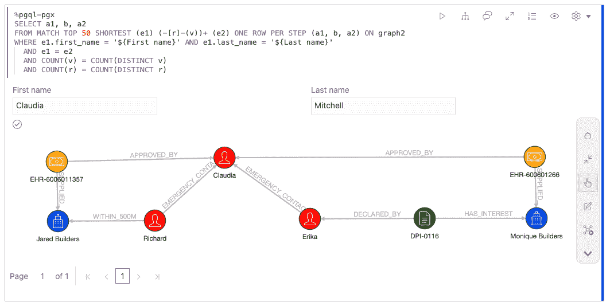

**总结**

我们发现，图表可用于表示利益冲突分析的实体和活动，并检测暗示可疑交易的周期。此外，通过在数据库中定义新的关系，我们不仅可以考虑匹配值(比如电话号码)，还可以考虑地理空间距离。许多 SQL 函数提供了更多的技术，例如，模糊字符串匹配可以处理符号失真。最后，我们看到路径查找是一种强大的功能，可以检测长度未知的路径。

这种情况可以在任何 Oracle 数据库中重现(Oracle Graph 包含在 Oracle 数据库 12.2 和更高版本中)。此外，自治数据库用户不需要任何设置，因为它包括开箱即用的 Graph Studio 笔记本。样本数据和笔记本可在[这里](https://github.com/ryotayamanaka/oracle-graph/tree/main/conflict-of-interest)获得。请用甲骨文云[永远免费服务](https://www.oracle.com/cloud/free/)免费试用自治数据库。

请从以下网址了解更多关于**甲骨文图**的信息:

*   [中](/tag/oracle-graph) (=所有带有 Oracle Graph 标签的文章)
*   [堆栈溢出](https://stackoverflow.com/questions/tagged/oracle-graph) (=带有 oracle-graph 标记的问题)
*   [Slack AnDOUC](https://join.slack.com/t/andouc/shared_invite/zt-1a2hmiz6f-vLlblcQyv0t9FMraMMP5uQ) (=邀请链接，请访问#graph)
*   [Slack OracleDevRel](https://join.slack.com/t/oracledevrel/shared_invite/zt-uffjmwh3-ksmv2ii9YxSkc6IpbokL1g) (=邀请链接，请访问#oracle-db-graph)

想谈谈吗？[加入我们的 public Slack](https://bit.ly/odevrel_slack) 与真正的 Oracle 开发人员交流！