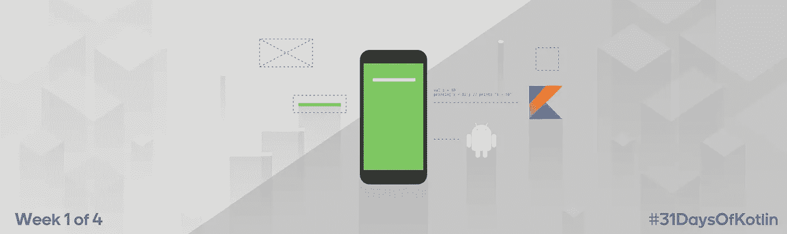

# # 31 日 sOfKotlin —第 1 周回顾

> 原文：<https://medium.com/androiddevelopers/31daysofkotlin-week-1-recap-fbd5a622ef86?source=collection_archive---------3----------------------->



Illustration by [Virginia Poltrack](https://twitter.com/VPoltrack)

我们写的 Kotlin 代码越多，我们就越喜欢它！Kotlin 的现代语言功能和 [Android KTX](https://github.com/android/android-ktx) 一起让我们的 Android 代码更加简洁、清晰和令人愉快。我们( [@FMuntenescu](https://twitter.com/FMuntenescu) 和 [@objcode](https://twitter.com/objcode) )开始了 [#31DaysOfKotlin](https://twitter.com/search?q=%2331DaysOfKotlin) 系列，作为分享我们最喜欢的 Kotlin 和 Android KTX 功能的一种方式，并希望让更多的人像我们一样喜欢它。

查看其他摘要:

[](/google-developers/31daysofkotlin-week-2-recap-9eedcd18ef8) [## # 31 日 sOfKotlin —第 2 周回顾

### 我们写的 Kotlin 代码越多，我们就越喜欢它！Kotlin 的现代语言功能与 Android KTX 一起使…

medium.com](/google-developers/31daysofkotlin-week-2-recap-9eedcd18ef8) [](/google-developers/31daysofkotlin-week-3-recap-20b20ca9e205) [## # 31 日 sOfKotlin —第 3 周回顾

### 我们写的 Kotlin 代码越多，我们就越喜欢它！Kotlin 的现代语言功能与 Android KTX 一起使…

medium.com](/google-developers/31daysofkotlin-week-3-recap-20b20ca9e205) [](/google-developers/31daysofkotlin-week-4-recap-d820089f8090) [## # 31 日 sOfKotlin —第 4 周回顾

### 我们写的 Kotlin 代码越多，我们就越喜欢它！Kotlin 的现代语言功能与 Android KTX 一起使…

medium.com](/google-developers/31daysofkotlin-week-4-recap-d820089f8090) 

在科特林的前 7 天，我们专注于基础知识。

# 第一天:猫王操作员

有风格地处理空值？检查 elvis 操作符`?:`，删除你的“空模板”。用默认值替换空值甚至返回只是一点语法糖！文件:[猫王操作员](https://kotlinlang.org/docs/reference/null-safety.html#elvis-operator)。

```
val name: String = person.name **?:** “unknown”
val age = person.age ?: return
```

# 第二天:字符串模板

格式化字符串？通过在变量名前面加上`$`来引用字符串中的变量和表达式。使用`${expression}`评估表达式。文档:[字符串模板](https://kotlinlang.org/docs/reference/basic-types.html#string-templates)。

```
val language = “Kotlin”// “Kotlin has 6 characters”
val text = “$language has ${language.length} characters”
```

# 第 3 天:析构声明

现在用棱镜？ [Android KTX](https://github.com/android/kotlin-extensions) 使用析构来分配颜色的分量值。您可以在类中使用析构，或者扩展现有的类来添加析构。文档:[析构声明](https://kotlinlang.org/docs/reference/multi-declarations.html)。

```
// now with prisms
val (red, green, blue) = color// destructuring for squares
val (left, top, right, bottom) = rect// or more pointedly
val (x, y) = point
```

# 第四天:当表情

拥有超能力的交换声明？科特林的表情几乎可以匹配任何东西。文字值、枚举、数字范围。甚至可以调用任意函数！文件:[时](https://kotlinlang.org/docs/reference/control-flow.html#when-expression)

```
class Train(val cargo: Number?) {
    override fun toString(): String {
        return when (cargo) {
            null, 0 -> "empty"
            1 -> "tiny"
            in 2..10 -> "small"
            is Int -> "big inty"
            else -> "$cargo"
        }
    }
}
```

# 第五天:循环、范围表达式和析构

当与 Kotlin 的另外两个特性结合使用时，For 循环有了更强大的功能:范围表达式和析构。文件:[范围](https://kotlinlang.org/docs/reference/ranges.html)，[析构](https://kotlinlang.org/docs/reference/multi-declarations.html#destructuring-declarations)。

```
*// iterating in the range 1 to 100
for(i in 1..100) {…}**// iterating backwards, in the range 100 to 1
for(i in 100 downTo 1){…}**// iterating over an array, getting every other element
val array = arrayOf(“a”, “b”, “x”)
for(i in 1 until array.size step 2 ){…}**// iterating over an array with the item index and destructuring
for((index, element) in array.withIndex()) {…}**// iterating over a map
val map = mapOf(1 to “one”, 2 to “two”)
for( (key, value) in map){…}*
```

# 第六天:属性

在 Kotlin 中，类可以有可变的和只读的属性，默认情况下生成 getters 和 setters。如果需要，您还可以实现自定义的。文档:[属性](https://kotlinlang.org/docs/reference/properties.html)。

```
class User {
    // properties
    val id: String = “” // immutable. just getter var name: String = “” // default getter and setter var surname: String = “” // custom getter, default setter
    get() = surname.toUpperCase() // custom getter declaration var email: String = “” // default getter, custom setter
    set(value) { // custom setter declaration
    // “value” = name of the setter parameter
    // “field” = property’s backing field; generated
        if(isEmailValid(value)) field = value
    }
}
```

# 第 7 天:数据类和等式

创建只有一个角色的类:保存数据？将它们标记为“数据”类。生成`equals()`的默认实现(还有`hashCode()`、`toString()`和`copy()`)，并检查结构是否相等。文档:[数据类](https://kotlinlang.org/docs/reference/data-classes.html#data-classes)，[相等](https://kotlinlang.org/docs/reference/equality.html)

```
data class User(
    val name: String, 
    val email: String, 
    val address: Address, 
    … 
)public class UserListDiffCallback: DiffUtil.Callback() { override fun areContentsTheSame(
         oldItemPosition: Int,  
         newItemPosition: Int
    ): Boolean { 
    // use the generated equals method
    return newUserList[newItemPosition] == 
           oldUserList[oldItemPosition])
}
```

本周重点关注基础知识:去除空错误、简化循环和条件、改进 getters 和 setters，以及去除样板文件。下周我们将深入了解更多 Kotlin 功能！

你已经开始使用科特林了吗？我们很想知道你还发现了哪些很棒的功能，以及你是如何在你的 Android 应用中使用它们的。

特别感谢我们的评审员:[杰克](https://twitter.com/JakeWharton)，[罗曼](https://twitter.com/romainguy)，[尼克](https://twitter.com/crafty)，[詹姆斯](https://twitter.com/jmslau)，[唐](https://twitter.com/donturner)以及我们的设计师:[弗吉尼亚](https://twitter.com/VPoltrack)。