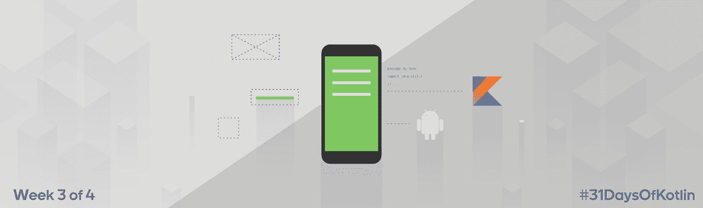

# # 31 日 sOfKotlin —第 3 周回顾

> 原文：<https://medium.com/androiddevelopers/31daysofkotlin-week-3-recap-20b20ca9e205?source=collection_archive---------5----------------------->



Illustration by [Virginia Poltrack](https://twitter.com/VPoltrack)

我们写的 Kotlin 代码越多，我们就越喜欢它！Kotlin 的现代语言功能和 [Android KTX](https://github.com/android/android-ktx) 一起让我们的 Android 代码更加简洁、清晰和令人愉快。我们( [@objcode](https://twitter.com/objcode) 和 [@FMuntenescu](https://twitter.com/FMuntenescu) )开始了 [#31DaysOfKotlin](https://twitter.com/search?q=%2331DaysOfKotlin) 系列，作为分享我们最喜欢的 Kotlin 和 Android KTX 功能的一种方式，并希望让更多的人像我们一样喜欢它。

Kotlin 的第 3 周分为 Kotlin 功能和使用 Android KTX 使您的 Android 代码更甜的不同方法。

查看所有的 recaps:

[](/google-developers/31daysofkotlin-week-1-recap-fbd5a622ef86) [## # 31 日 sOfKotlin —第 1 周回顾

### 我们写的 Kotlin 代码越多，我们就越喜欢它！Kotlin 的现代语言功能与 Android KTX 一起使…

medium.com](/google-developers/31daysofkotlin-week-1-recap-fbd5a622ef86) [](/google-developers/31daysofkotlin-week-2-recap-9eedcd18ef8) [## # 31 日 sOfKotlin —第 2 周回顾

### 我们写的 Kotlin 代码越多，我们就越喜欢它！Kotlin 的现代语言功能与 Android KTX 一起使…

medium.com](/google-developers/31daysofkotlin-week-2-recap-9eedcd18ef8) [](/google-developers/31daysofkotlin-week-4-recap-d820089f8090) [## # 31 日 sOfKotlin —第 4 周回顾

### 我们写的 Kotlin 代码越多，我们就越喜欢它！Kotlin 的现代语言功能与 Android KTX 一起使…

medium.com](/google-developers/31daysofkotlin-week-4-recap-d820089f8090) 

# 第 15 天:操作员超载

用操作符重载写 Kotlin `(time * 2)`更快。像`Path`、`Range`或`SpannableStrings`这样的对象自然允许像加法或减法这样的操作。使用 Kotlin，您可以实现自己的操作符。Docs: [运算符重载](https://kotlinlang.org/docs/reference/operator-overloading.html#operator-overloading)， [Android KTX 使用示例](https://github.com/android/android-ktx/blob/master/src/main/java/androidx/core/text/SpannableString.kt#L32)。

```
// Definition/** Adds a span to the entire text. */
inline operator fun Spannable.**plusAssign**(span: Any) =
setSpan(span, 0, length, SPAN_INCLUSIVE_EXCLUSIVE)// Use it like thisval spannable = “Eureka!!!!”.toSpannable()
spannable **+=** StyleSpan(BOLD) // Make the text bold with +=
spannable **+=** UnderlineSpan() // Make the text underline with +=
```

# 第 16 天:顶级函数和参数

**类的实用方法**？将它们添加到源文件的顶层。在 Java 中，它们被编译成该类的静态方法。文档:[基本语法](https://kotlinlang.org/docs/reference/basic-syntax.html)。

```
// Define a top-level function that creates a DataBinding Adapter for a RecyclerView@BindingAdapter(“userItems”)
fun userItems(recyclerView: RecyclerView, list: List<User>?){
    //update the RecyclerView with the new list
    …
}class UsersFragment: Fragment{...}
```

你在为你的类定义静态常量吗？使它们成为顶级属性。它们将被编译成字段和静态访问器。

```
// Define a top-level property for Room database
private const val DATABASE_NAME = “MyDatabase.db”private fun makeDatabase(context: Context): MyDatabase {
    return Room.databaseBuilder(
                   context,
                   MyDatabase::class.java,
                   DATABASE_NAME
              ).build()
}
```

# 第 17 天:不用迭代器迭代类型

有趣地方的迭代器？Android KTX 给`ViewGroup`和`SparseArray`增加了迭代器。使用`operator`关键字来定义迭代器扩展。Foreach 循环将使用扩展！Docs: [for loops](https://kotlinlang.org/docs/reference/control-flow.html#for-loops) ， [Android KTX 使用示例](https://github.com/android/android-ktx/blob/master/src/main/java/androidx/core/view/ViewGroup.kt#L66)。

```
// Example from Android KTX
for(view in viewGroup) { }
for(key in sparseArray) {}// Your project
operator Waterfall.iterator() {
   // add an iterator to a waterfall class
}for(items in myClass) {} // Now waterfall has iterations!
```

# 第 18 天:简单的内容价值观

将`[ContentValues](https://developer.android.com/reference/android/content/ContentValues.html)`的强大和 Kotlin 的简洁结合起来。使用 Android KTX `ContentValues`创建器，只需通过一个`Pair<StringKey, Value>`。 [Android KTX 实现](https://github.com/android/android-ktx/blob/master/src/main/java/androidx/core/content/ContentValues.kt#L21)。

```
val contentValues = contentValuesOf(
    “KEY_INT” to 1,
    “KEY_LONG” to 2L,
    “KEY_BOOLEAN” to true,
    “KEY_NULL” to null
)
```

# 第 19 天:DSL

特别棒吗？领域特定语言可以通过使用类型安全生成器来创建。它们有助于清洁的 APIs 你也可以借助 [extension lambdas](https://kotlinlang.org/docs/reference/lambdas.html#function-literals-with-receiver) 和 [type safe builders](https://kotlinlang.org/docs/reference/type-safe-builders.html) 这样的特性来构建它们。

```
html {
    head {
             title {+”This is Kotlin!” }
         }
    body {
             h1 {+”A DSL in Kotlin!”}
             p {+”It’s rather”
                b {+”bold.” }
                +”don’t you think?”
                }
          }
}
```

Spek 是一个作为 Kotlin DSL 构建的测试库。Spek 没有使用`@Annotations`，而是提供了一种类型安全的方式来声明您的测试代码，而不依赖于反射魔法。

```
@RunWith(JUnitPlatform::class)
class MyTest : Spek({
    val subject = Subject()
    given("it ’ s on fire") {
        subject.lightAFire()
        it("should be burning") {
            assertTrue(subject.isBurning())
        }
        it("should not be cold") {
            assertFalse(subject.isCold())
        }
    }
})
```

Android 上 Kotlin 的另一个 DSL 是 [Anko](https://github.com/Kotlin/anko) 。Anko 允许您使用声明性代码构建 Android 视图。

```
frameLayout {
    button("Light a fire") {
    onClick {
        lightAFire()
    }
}
```

# 第 20 天:简易捆绑

捆绑起来，准备好 Android KTX 中简洁的[捆绑创建器。不再给`putString`、`putInt`或他们 20 个朋友中的任何一个打电话。一个调用将使你成为一个新的](https://github.com/android/android-ktx/blob/master/src/main/java/androidx/core/os/Bundle.kt#L27)`[Bundle](https://developer.android.com/reference/android/os/Bundle.html)`，它甚至可以处理数组！

```
val bundle = bundleOf(
        "KEY_INT " *to* 1,
        "KEY_LONG" *to* 2L,
        "KEY_BOOLEAN" *to* true,
        "KEY_NULL" *to* null
        "KEY_ARRAY" to arrayOf(1, 2)
)
```

# 第 21 天:清理延期

羊肉是甜的。使用最后一个参数调用语法，您可以清理回调、`[Callable](https://developer.android.com/reference/java/util/concurrent/Callable.html)`和`[Runnable](https://developer.android.com/reference/java/lang/Runnable.html)`。比如安卓 KTX 用[小包装](https://github.com/android/android-ktx/blob/master/src/main/java/androidx/core/os/Handler.kt#L38)甜化`postDelayed`。

```
// Android KTX API
fun Handler.postDelayed(
              delay: Int, 
              token: Any? = null,  
              action: () -> Unit)// Call it like this — no need for a Runnable in your code
handler.postDelayed(50) {
         // pass a lambda to postDelayed
}
```

本周我们关注了一些基本的 Kotlin 特性，如操作符重载、顶级函数和参数以及迭代器，我们讨论了一个高级特性:领域特定语言(DSL ),并展示了如何在使用 Android KTX 处理内容值、包和回调时编写更简洁的代码。

你已经开始使用科特林了吗？我们很想知道你还发现了哪些很棒的功能，以及你是如何在你的 Android 应用中使用它们的。