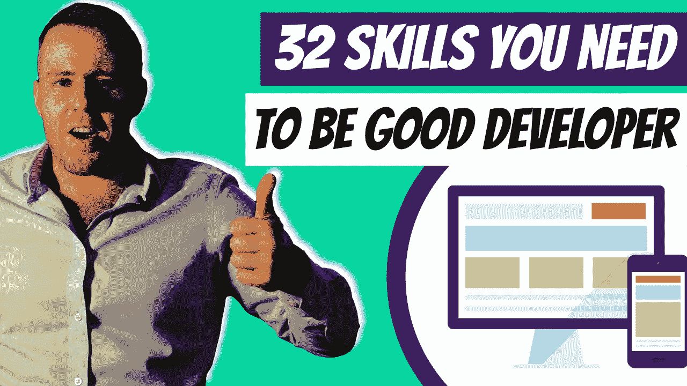

# 成为优秀 Python 开发人员所需的 32 项技能

> 原文：<https://medium.com/duomly-blockchain-online-courses/32-skills-you-need-to-become-a-good-python-developer-f74ac503b4d0?source=collection_archive---------10----------------------->

[32 Skills You Need to Become a Good Python Developer](https://www.blog.duomly.com/skills-you-need-to-become-good-python-developer/)

本文最初发表于:[https://www . blog . duomly . com/skills-you-need-to-be-good-python-developer/](https://www.blog.duomly.com/skills-you-need-to-become-good-python-developer/)

Python 编程的职业生涯需要一套超越编码的技能。

要想成功，你必须分析思考，解决问题。