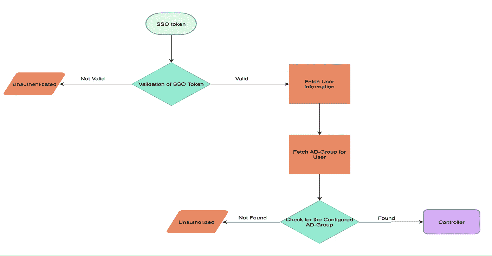
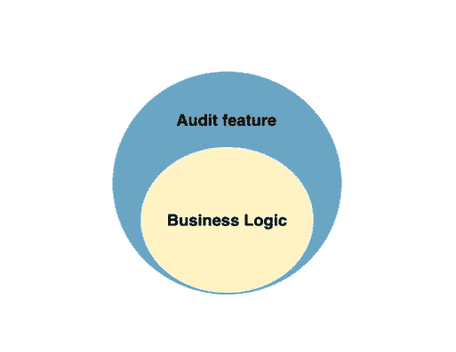
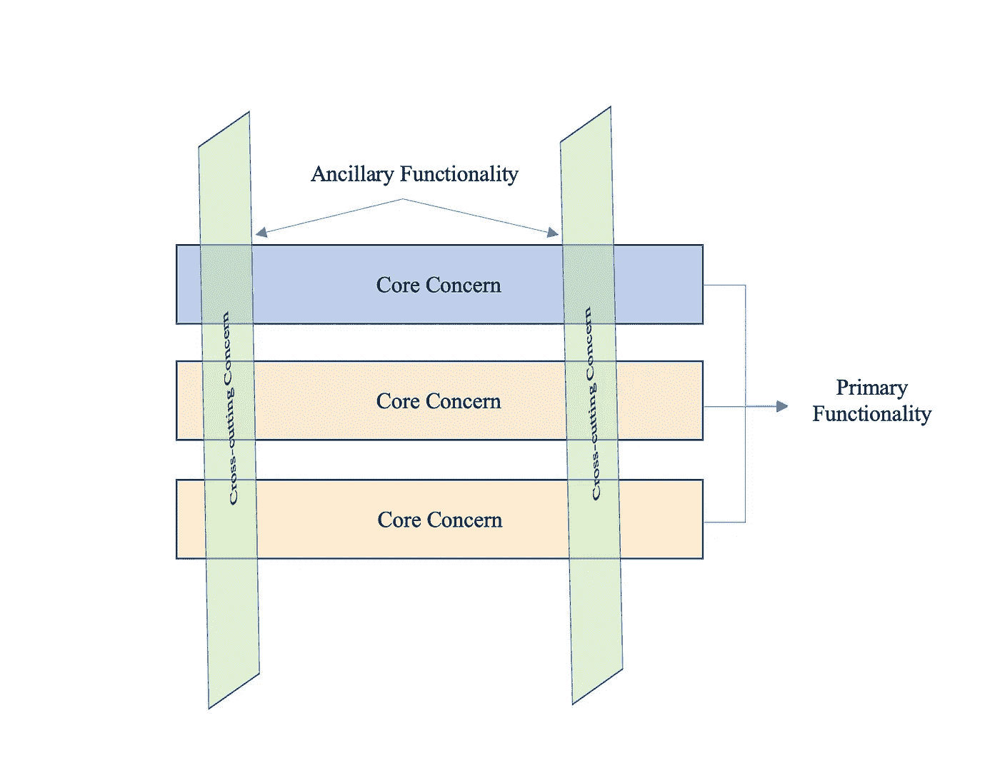
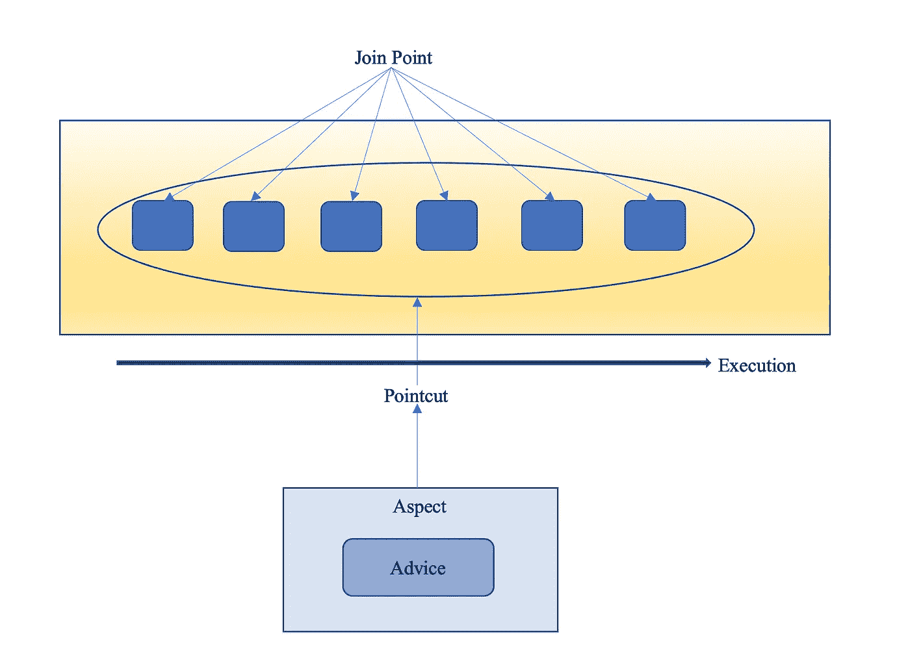

# 3A 框架= f(Spring Boot 自定义过滤器+方面编程)

> 原文：<https://medium.com/walmartglobaltech/3a-framework-f-spring-boot-custom-filters-aspect-programming-3d9e8223f222?source=collection_archive---------0----------------------->

***认证*** *，* ***授权*** *和* ***记账(3A)*** 是现在任何应用开发过程中最需要的部分。任何具有这三个 A 特征的框架都将能够控制处理中涉及的任何计算资源的访问、权限和责任。

在这个博客中，我们将重点关注在 **Spring Boot** 库的帮助下，用 ***AAA*** 能力开发框架所需要的概念。对于**身份验证和* ***身份验证*** *身份验证*，我们将演练利用****Spring Security****库开发一个自定义安全过滤器，对于***A****udit*日志，我们将重点关注***

# *****认证和授权—自定义安全与 Spring 安全*****

**在我们深入探讨该主题之前，有几个基本概念可供快速参考:**

*   *****认证*** :通常使用密码和用户名或 SSO 令牌来验证用户对其身份所做声明的过程。**
*   *****授权*** :根据用户所拥有的角色，为用户提供执行某项任务/活动的权限的过程。**
*   *****Servlet 过滤器***:Servlet 是一个运行在 Web 服务器上的程序，它接收并响应来自客户端的请求，通常通过 HTTP。Filter 是一个可以转换请求或响应的头和内容(或两者)的对象。**

**我们使用 **Spring Security** 库来开发认证和授权框架。需要使用不记名令牌来验证和授权用户使用计算资源。下面是身份验证和授权的高级流程图，第一步是验证 SSO 令牌，然后根据成功的验证获取用户信息，然后检查所需的 AD 组，用户应该属于哪个 AD 组才能访问和使用资源。**

****

**Flowchart for Authentication & Authorization**

**现在来看一下 **Spring Security** 库， **Spring Boot** 在 **Spring Security** 库和 **Spring Security** 的帮助下提供安全性，Spring Security 是一个 servlet 过滤器的集合，它允许在请求和响应分别到达 Spring 控制器和客户端之前进行监控、处理。**

**Spring 应用程序基本上是一个 servlet，即***dispatcher servlet***，它将每个请求重定向到***@ rest Controllers***或 ***@Controllers*** 。而不幸的是***dispatcher servlet***没有任何安全机制。因此，应该有一些辅助的支持机制，用于在未经认证和未经授权的请求到达目标之前对其进行限制，这就是 **Spring Security** 库通过对传入的请求和响应提供 ***过滤器*** 来提供帮助的地方。它还允许在 **Spring Boot** 应用程序中编写和配置自定义安全过滤器，以在每个传入请求到达 **DispatcherServlet** 之前对其进行过滤。**

**安全过滤器的简单实现的小快照如下:**

```
*****public class RequestAndResponseFilter extends GenericFilterBean {*** 
    ***@Override*** 
    ***protected void doFilter(HttpServletRequest*** *request,* ***HttpServletResponse*** *response,* ***FilterChain*** *chain****) throws IOException, ServletException {*** 

        ***Token token = request.getHeaders("Token");***  // (1) 

        // checking if valid token is passed ***if (Authenticated(token) == false) {***  // (2) // when token passed is invalid we would send HTTP 401 response to the user  
           ***response.setStatus(HttpServletResponse.SC_UNAUTHORIZED);*** // HTTP 401\. 

            ***return;*** 
        **}** // since token passed in the request is valid, fetch the required info of user 
       ***UserInfo user = FetchUserInformation("token");*** // (3) // checking for required AD-Group of which user should be part of 
      ***if (Authorized(user) == false) {*** // (4) // user is not part of the AD-Group 
            ***response.setStatus(HttpServletResponse.SC_FORBIDDEN);*** // HTTP 403 
           ***return;***
        ***}*** // Setting up authentication for authorized user 
       ***CustomAuthentication authentication = new CustomAuthentication(userId, name,email);*** // (5)

        ***SecurityContextHolder.
getContext().setAuthentication(authentication);*** // (6) //  request is allowed to Dispatcher servlet 
       ***chain.doFilter(request, response);*** // (7) ***}******private UserInfo fetchUserInformation (Token*** *token****) {*** 
        // getting all information of user for setting security context and the user authorization ***return userInfo;*** 
    ***}*** ***private boolean Authenticated(Token*** *token****) {*** // verifying the to the databases ***return false;*** 
    **}** ** *private boolean Authorized(UserInfo*** *user****) {*** // checking for required AD-Group. ***return false;*** ***}******}*****
```

****步骤:****

1.  **从请求中提取令牌。**
2.  **从数据库验证令牌的有效性。**
3.  **身份验证成功后，从数据库中获取重要的用户信息。**
4.  **检查所需的广告组，用户应该是其中的一部分。**
5.  **CustomAuthentication 是实现由 **Spring Boot** 提供的认证接口的类。认证接口由 **Spring Security** 库提供，用于存储用户的基本信息，如用户名、密码和角色。**
6.  *****Security context holder***和 ***SecurityContext*** 是安全库提供的两个重要类。***security context***保存经过认证的用户信息。因此，要获得关于用户的信息，我们需要找到***security context***。现在，***security context holder***是一个使用 ThreadLocal 对象来存储***security context***的类。在这里，我们试图将经过认证和授权的用户的***security context***设置为***security context holder***，这样我们就可以在将来需要的时候获得用户的信息。**
7.  **允许请求进入过滤器链，然后进入 **DispatcherServlet** ，进而进入控制器。**

*****过滤器链* :** 在 **Spring Boot** 应用中，使用**弹簧安全**每个请求通过 15 个安全过滤器，以链式方式排列。这个概念被称为滤波器链。**

**现在，为了配置 **Spring Security** ，即我们希望对哪些端点认证每个请求，以及我们希望对哪些端点允许每个请求等等；我们需要一个具有以下属性的类:**

1.  *****enable web security***注释，用于允许 Spring 找到这个类并将其应用到全局 web 安全。**
2.  **扩展***web securityconfigureradapter***以使用提供的配置方法，通过这些方法可以定义要保护哪个端点。**

**一个简单的***web securityconfigureradapter***看起来像是:**

```
*****@Configuration***
***@EnableWebSecurity*** // (1)
***public class CongurationForSecurity extends WebSecurityConfigurerAdapter {*** // (1) ***@Override***
    ***protected void configure(HttpSecurity*** *http****) throws Exception {*** //(2) ***http
        .authorizeRequests()
        .antMatchers("/").permitAll()***    //(3)
        ***.anyRequest().authenticated();***  // (4) ***}***
***}*****
```

****步骤:****

1.  **用***@ Configuration******@ enable web security***和 extending***WebSecurityConfigurerAdapter***注释的简单类。**
2.  **覆盖***configure(http security http)***方法来指定过滤器处理请求的规则。**
3.  **所有对 URI**"/**的请求都被允许。**
4.  **除了***”/***之外的任何其他请求都应该被认证。**

**在我们的应用程序中，我们已经完成了自定义 **A** 认证和 **A** 授权机制的开发。现在，让我们进入下一部分，开发我们应用程序的 **A** 会计特性。**

# ****弹簧面向方面编程****

**我们使用了 ***面向方面编程*** 来开发一个框架，它可以为我们提供访问日志的能力，而不干扰任何主要功能代码。**

****

**Audit Aspect**

*****面向方面编程*** 是一种范例，它使我们能够以不同于 **OOP** 的方式来思考程序结构。 ***AOP*** 中模块化的单位是 ***方面*** 像 ***类*** 是为了 ***OOP*** 。方面提供了动态添加横切关注点的方法。**

**现在，让我们关注什么是***交叉关注点，但首先让我们理解 ***关注点* :** 它是我们希望在应用程序的特定模块中拥有的行为，它可以被定义为我们希望实现的功能。关注有两种类型:*****

1.  *******核心关注:*** 模块的主要功能****
2.  *******横切关注点:*** 次要需求的功能，适用于整个应用，如日志、安全等，每个模块都需要。****

********

****Core Concerns & Cross-Cutting Concerns****

****这张图片显示了应用程序分解成的模块。每个模块的主要重点是提供核心服务。然而，这些模块中的每一个都需要辅助功能，例如日志记录和安全性。这些辅助功能是跨领域的问题。****

****在这篇博客中，我们的主要焦点是为 ***审计日志*** 实现方面。日志方面的过于简化的实现:****

```
*******@Aspect*** // — — — — — — — (1)
***@Component***
***public class CustomAspectForAuditLog {*** //Pointcut containing all the classed annotates with Service and RestController ***@Pointcut("within(@org.springframework.stereotype.Service *)" +" || within(@org.springframework.web.bind.annotation.RestController *)")*** // — — — — — — — (2)
    ***public void pointcutBasedOnAnnotation() {*** // Pointcut methods are empty, since it’s for containing the joinpoint. ***}*** //Pointcut based on packages
     ***@Pointcut("within(com.wlamartlabs.springExample.service.*)" +" || within(com.walmartlabs.springExample.controller.*)")*** // — — — — — — (3)
     ***public void pointcutBasedOnPackage() {*** // Pointcut methods are empty, since it’s for containing the joinpoint. ***}*** //Advice for dealing Exception thrown by controller.
    ***@AfterThrowing(pointcut = "pointcutBasedOnPackage() && pointcutBasedOnAnnotation()", throwing = "exception")*** // — — — — — — — (4)
    ***public void handlingErrorFromController(JoinPoint joinPoint, Throwable exception) {*** // implementation dealing with the exception thrown ***}*** //Advice for dealing the request while entering and exiting the controller
    ***@Around("pointcutBasedOnPackage () && pointcutBasedOnAnnotation ()")*** // — — — — — — — (4)
    ***public Object prepareAuditLog(ProceedingJoinPoint joinPoint) throws Throwable {*** // operation before entering controller method // Useful info can be extracted for Audit ***Object result = joinPoint.proceed();***// — — — — — — — (5) // operation after exiting from controller method // Useful info can be extracted for Audit ***return result;*** ***}******}*******
```

1.  ****用 ***@Aspect*** 注释的 Java 类，用于将该类声明为横切关注点的实现。连接方面和被通知对象的过程是在加载时完成的。****
2.  ****为了理解 ***切入点*** ，我们需要了解一下 ***连接点*** 。 ***连接点*** 是应用程序的 ***程序执行*** 中的候选点，可以插入一个方面。这个点可以是一个被调用的方法，也可以是一个被抛出的异常。在这些点上，方面代码可以插入到应用程序的正常流程中，以添加新的特性。既然在每个代码点都应用方面代码不好或者说不可行，那么就选择一组*，称之为 ***切入点*** 。从示例代码中，所有标注了 ***@Repository*** 、 ***@Service*** 和***@ rest controller***的类都被选择作为连接点。*****
3.  ****切入点也可以通过定义应用程序中的包名来定义。****
4.  ****为了理解***@后抛*** 和***@前后*** ，我们需要知道什么是 ***忠告*** 。 ***建议*** 被定义为方面在特定连接点采取的行动。有五个建议，即:之前，之后，周围，抛后和后返回。****

****让我们简要讨论一下各种建议:****

****a.***之前:****在连接点之前执行的建议。*****

*****b.***之后:****在连接点之后执行的建议连接点要么成功执行，要么出现异常。******

*****c. ***运行后* :** 只有连接点无异常成功执行时才执行的建议。*****

****d. ***抛出后* :** 如果连接点因抛出异常而退出时执行的通知。****

****e. ***围绕* :** 这是最有力的建议，它围绕着连接点。Around advice 可以在方法调用前后执行自定义行为。****

****5.在 ***周围建议*****允许执行 ***连接点*** 的决定，是在程序员手中。 ***proceed()*** 方法允许 ***连接点*** 被执行，并返回连接点返回的对象。******

******为了对方面编程结构有一个完整清晰的了解，我们可以参考下图。******

************

******Aspect Oriented Paradigm Representation******

# ******结论******

******我们使用 **Spring Boot** 的 **Spring Security** 库开发了一个定制的**过滤器**，它有用于 **A** 认证和 **A** 授权的定制方法。并且我们还使用 ***【面向方面编程*** 开发了*方面* ，使**在应用*中有了***记账功能。因此，在 **Spring Boot** 库的帮助下，我们实现了理解开发具有 ***AAA*** 能力的应用程序所需的概念的目标。******

# ******参考******

1.  ******[https://docs . spring . io/spring-security/site/docs/current/reference/html 5/](https://docs.spring.io/spring-security/site/docs/current/reference/html5/)******
2.  ******[https://docs . spring . io/spring-framework/docs/2.5 . x/reference/AOP . html](https://docs.spring.io/spring-framework/docs/2.5.x/reference/aop.html)******