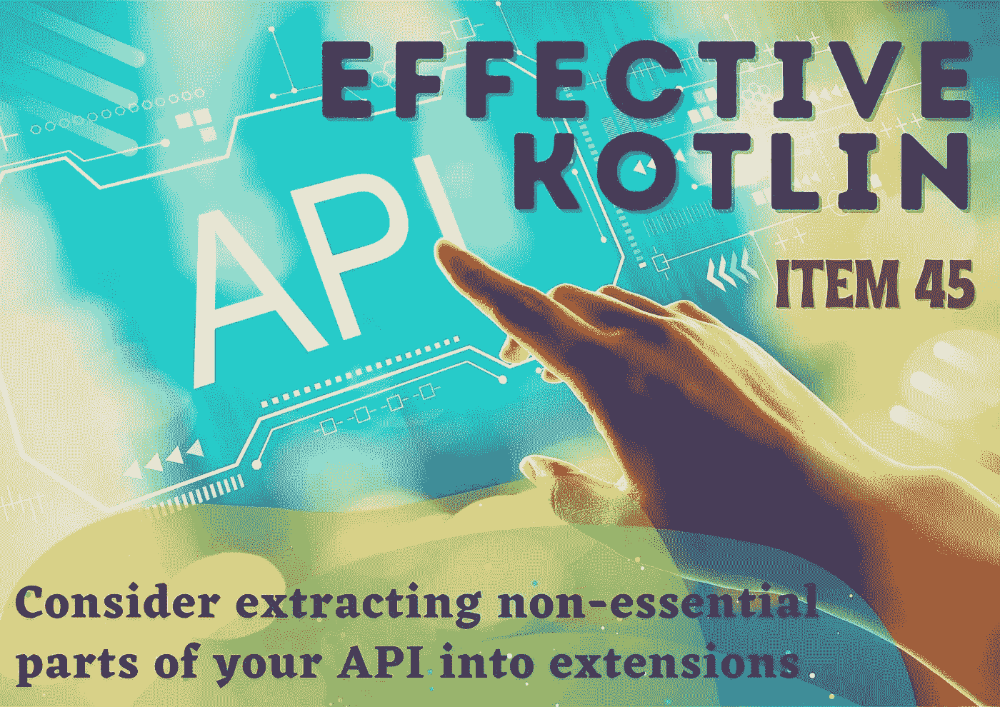
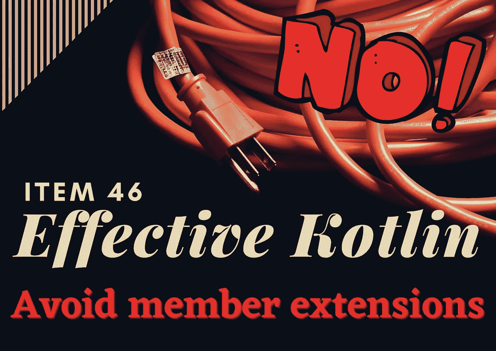
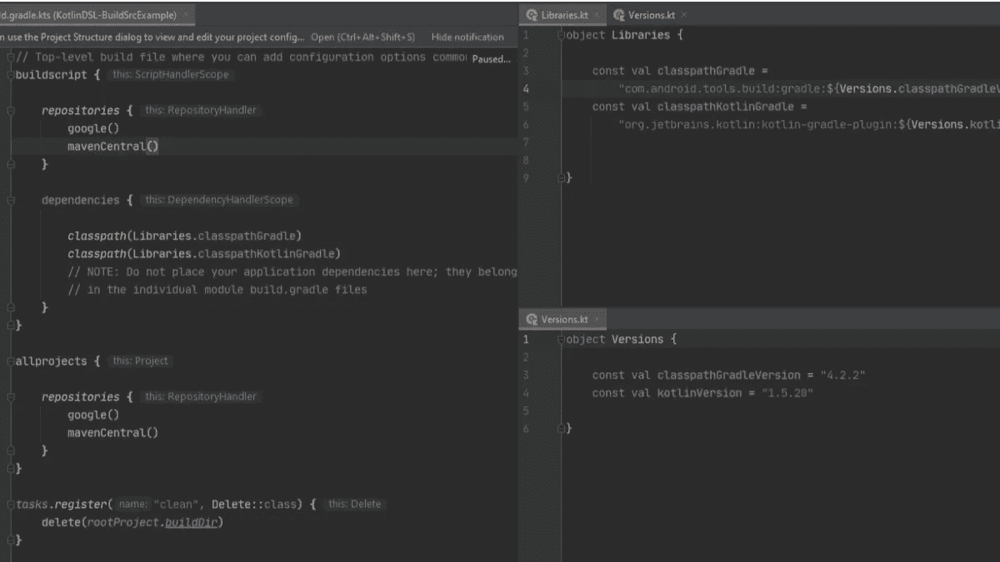

# 4 篇文章和一些来自 Kt 的新闻。⭐️学院

> 原文：<https://blog.kotlin-academy.com/4-articles-some-news-from-kt-academy-%EF%B8%8F-2c4c42de6634?source=collection_archive---------2----------------------->

你好**👋**

今天，我们将为您带来许多精彩的文章和一些激动人心的消息！🤩

在下面找到一个快捷方式，但不要忘记进一步滚动！

**⇢篇** :
👉[考虑将 API 中不重要的部分提取到扩展中](https://kt.academy/article/ek-extensions)
👉[避免成员扩展](https://kt.academy/article/ek-member-extensions)
👉[科特林协程调度程序](https://kt.academy/article/cc-dispatchers)
👉 [Kotlin DSL、BuildSrc、产品风味、风味图标等](/kotlin-dsl-buildsrc-product-flavors-flavor-icon-and-more-abf30c65e8fd)

**⇢** [成为我们的培训师！](https://kt.academy/user/trainer/form) ****⇢**[功能性科特林车间](https://kt.academy/workshop/kotlinFunctional)**

**尽情享受吧！**

**成员和扩展之间有什么区别，在什么情况下我们应该选择一个而不是另一个👇
[**考虑将 API 中不重要的部分提取到 Marcin moska a 编写的扩展**](https://kt.academy/article/ek-extensions) 中。**

**

[Effective Kotlin Item 45: Consider extracting non-essential parts of your API into extensions](https://kt.academy/article/ek-extensions)** 

**什么是 extensions❓成员？他们怎么样？possible❓
和…为什么我们应该避免使用 them❓**

**在 Marcin Moskala
撰写的文章中找到所有这些问题的答案👉 [**避免成员扩展**](https://kt.academy/article/ek-member-extensions)**

**

[Effective Kotlin Item 46: Avoid member extensions](https://kt.academy/article/ek-member-extensions)** 

**Kotlin 协程库提供的一个重要功能是让我们决定一个协程应该运行什么线程。这是使用 [**调度程序**](https://kt.academy/article/cc-dispatchers) 完成的。**

**要了解应该在哪里使用 Kotlin coroutines 库中的每个调度程序，请阅读 Marcin Moskala 撰写的最新文章👇**

**

[Kotlin coroutines dispatchers](https://kt.academy/article/cc-dispatchers)** 

**想知道如何将 Gradle 文件迁移到 Kotlin DSL，实现 buildSrc 吗？
查看本文 [**Kotlin DSL、BuildSrc、产品风味、风味图标等更多**](/kotlin-dsl-buildsrc-product-flavors-flavor-icon-and-more-abf30c65e8fd) 由 Mustafa Yiğ it 撰写。**

**

[Kotlin DSL, BuildSrc, Product Flavors, Flavor Icon and more](/kotlin-dsl-buildsrc-product-flavors-flavor-icon-and-more-abf30c65e8fd)** 

**卡帕头。学院将世界级专家与✨各种规模的公司联系起来**

**你想成为我们 的一员，与需要的人分享你的知识吗？**

**填写这张表格，加入我们的编程大家庭🔥**

**

[B](/kotlin-dsl-buildsrc-product-flavors-flavor-icon-and-more-abf30c65e8fd)[ecome our trainer](https://kt.academy/user/trainer/form)** 

**❗️Leverage 您的技能和提高您的生产力与函数式编程功能在 Kotlin❗️**

**[同**功能科特林**同](https://kt.academy/workshop/kotlinFunctional)功能科特林。学院🔥
👉1 天
👉大量练习
👉对于有经验的 Kotlin 开发人员**

**点击此处查看更多详情并注册⤵️**

**

[Functional Kotlin](https://kt.academy/workshop/kotlinFunctional)** 

**今天就到这里吧！**

**谢谢，再见！**

**卡帕头。学院团队**

**www: [kt.academy](https://kt.academy/)
博客:[blog.kotlin-academy.com](http://blog.kotlin-academy.com/)
Twitter EN:[@ ktdotsacademy](https://twitter.com/ktdotacademy)
Twitter PL:[@ ktdotsacademypl](https://twitter.com/ktdotacademyPL)
FB:[@ ktdotsacademy](https://www.facebook.com/KtDotAcademy)
LinkedIn:[@ Kt。学院](https://www.linkedin.com/company/kt-academy/)**

****