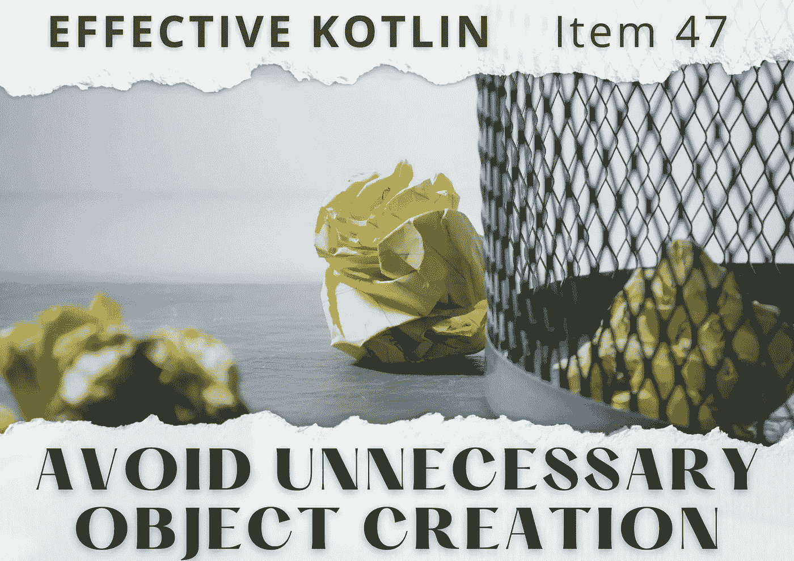
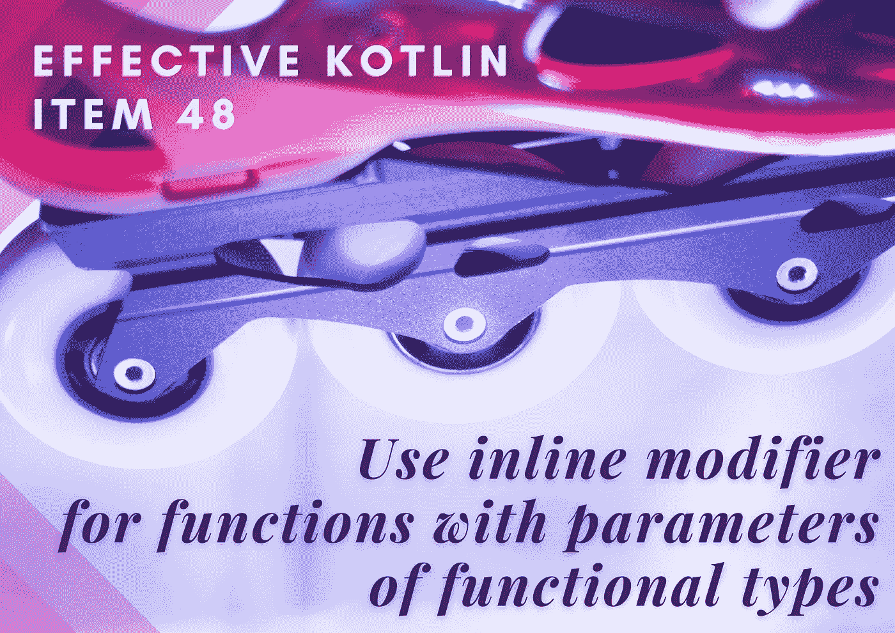
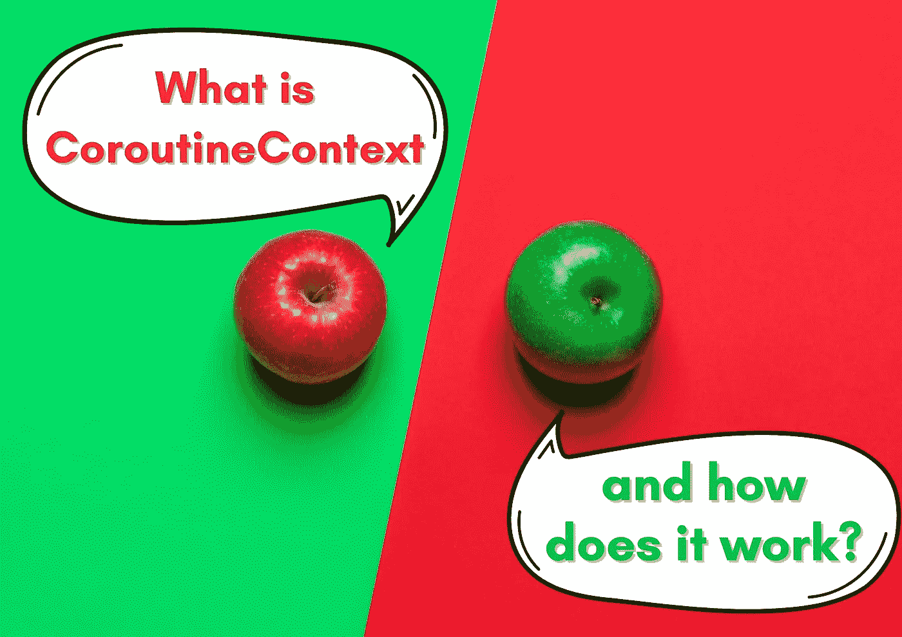
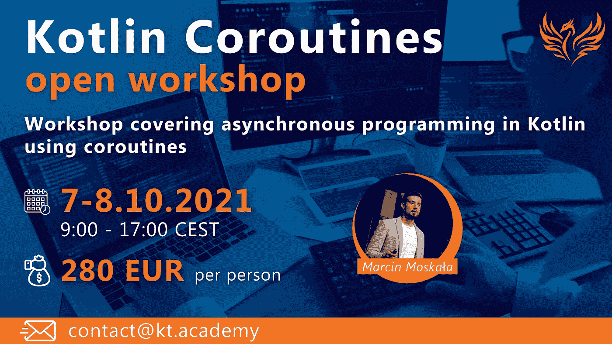
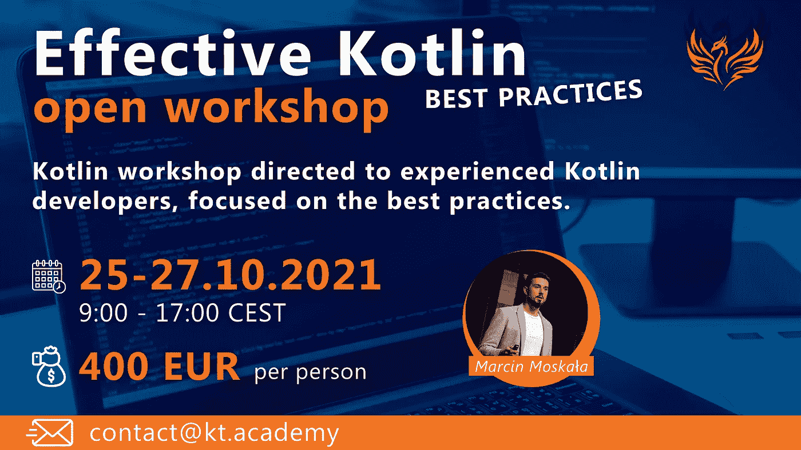

# 4 篇精彩文章和开放式研讨会提案🌟

> 原文：<https://blog.kotlin-academy.com/4-great-articles-open-workshops-proposal-3244a5b649e?source=collection_archive---------2----------------------->

你好！**👋**

假期即将结束，所以为了让这段时间不那么令人沮丧，我们发送了一些新的内容来阅读😊

请记住，您可以通过回复此电子邮件与我们分享您的想法和建议📩

以下是今天内容的简要总结👇

**文章**👉避免不必要的对象创建
👉对带有函数类型参数的函数使用内联修饰符
👉协程构建器
👉什么是 CoroutineContext，它是如何工作的？

**科特林协程** & **有效科特林**开放工作坊

尽情享受吧！⏬

对象创建有时会很昂贵，并且总是要花费一些东西。当不必要的时候，学会如何避免它。

**避免不必要的对象创作**Marcin Moskala👇

[Effective Kotlin Item 47: Avoid unnecessary object creation](https://kt.academy/article/ek-unnecessary-objects)
🔻 This is a chapter from the [Effective Kotlin](https://kt.academy/book/effectivekotlin) book. You can find it on [LeanPub](https://leanpub.com/effectivekotlin) or [Amazon](https://www.amazon.com/Effective-Kotlin-practices-Marcin-Moskala/dp/8395452837/ref=sr_1_1?dchild=1&keywords=effective+kotlin&qid=1615033955&sr=8-1).

内联函数是如何工作的，为什么它们对我们应用程序的性能如此重要🤔

**对带有函数类型参数的函数使用内联修饰符**👇

[Effective Kotlin Item 48: Use inline modifier for functions with parameters of functional types](https://kt.academy/article/ek-inline-functions)
🔻 This is a chapter from the [Effective Kotlin](https://kt.academy/book/effectivekotlin) book. You can find it on [LeanPub](https://leanpub.com/effectivekotlin) or [Amazon](https://www.amazon.com/Effective-Kotlin-practices-Marcin-Moskala/dp/8395452837/ref=sr_1_1?dchild=1&keywords=effective+kotlin&qid=1615033955&sr=8-1).

我们如何启动协程，什么是结构化并发，它是如何工作的。

**Coroutine builders** 作者 Marcin Moskał a👇

[Coroutine builders](https://kt.academy/article/cc-builders)
🔻 This is a chapter from the [Kotlin Coroutines](https://kt.academy/book/coroutines) book. You can find Early Access on [LeanPub](https://leanpub.com/coroutines/).

对协程上下文的深入解释——协程的强大数据容器。

什么是协同上下文，它是如何工作的？作者马尔钦·莫斯卡拉👇

[What is CoroutineContext and how does it work?](https://kt.academy/article/cc-coroutine-context)
🔻 This is a chapter from the [Kotlin Coroutines](https://kt.academy/book/coroutines) book. You can find Early Access on [LeanPub](https://leanpub.com/coroutines/).

我们计划在 2021 年 10 月【24 日】【25 日】【26 日】举办【22】 2 场在线公开研讨会【23】🔥

❗️ [科特林冠](https://kt.academy/workshop/coroutines) ❗️

❗️ [有效科特林](https://kt.academy/workshop/effectiveKotlin) ❗️

如果您有兴趣参加其中的任何一个，请查看详细信息并通过我们的网站注册👉 [Kt。学院](https://kt.academy/)
或发送电子邮件至👉联系@kt.academy。

今天就到这里吧！

谢谢，再见！

卡帕头。学院团队

www: [kt.academy](https://kt.academy/)
博客:[blog.kotlin-academy.com](http://blog.kotlin-academy.com/)
Twitter EN:[@ ktdotsacademy](https://twitter.com/ktdotacademy)
Twitter PL:[@ ktdotsacademypl](https://twitter.com/ktdotacademyPL)
FB:[@ ktdotsacademy](https://www.facebook.com/KtDotAcademy)
LinkedIn:[@ Kt。学院](https://www.linkedin.com/company/kt-academy/)

