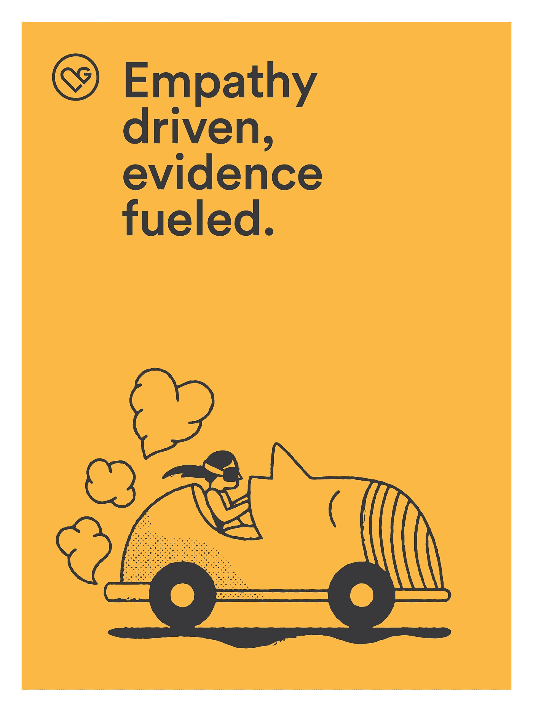

# 让实验有价值的 4 个原则

> 原文：<https://medium.com/airbnb-engineering/4-principles-for-making-experimentation-count-7a5f1a5268a?source=collection_archive---------1----------------------->

两年多来，我一直是 Airbnb 增长团队的数据科学家。当我刚开始在公司工作时，我们在一周内进行不到 100 个实验；我们现在运行大约 700。正如我们这些正在成长的人所熟知的那样，这种增长不会自然发生。相反，它是通过培养产生的。对我们来说，这不仅意味着构建正确的工具，如我们的内部实验报告框架[ [ERF](/airbnb-engineering/experiment-reporting-framework-4e3fcd29e6c0#.j5wtjdy0p) ]，还意味着在所有职能部门积极塑造强大的实验文化。在这里，我总结了四个关键原则，它们是我们工作的基础，并导致了实验对我们业务的影响发生了重大变化:

1.  产品实验应该是假设驱动的，
2.  定义适当的“暴露人群”是最重要的，
3.  理解权力至关重要，而且
4.  失败是一个机会。

实践这些原则不仅会为你的组织节省大量的工程时间和金钱，还会让你对你的用户和产品有难以置信的洞察力。

# 产品实验应该是假设的，而不是功能驱动的

我们在 Airbnb 有令人难以置信的工程人才。这意味着构建一个特性很容易，但这并不意味着它应该被构建，或者产品一定会因此变得更好。在 Airbnb 的增长团队中，我们总是以这样的问题开始:“数据说明了什么？”如果你没有问这个问题，那你就是在追求一个极其低效的产品优化策略。如果你不得不猜测，你就本末倒置了，应该在实验之前做更多的工作。

为什么假说很重要？没有它们，你就会失去控制，容易被看似积极的结果分散注意力，但很可能是统计上的侥幸。在这种情况下，很容易编造一个符合你的发现的故事，而不是努力去理解正在发生的事情。事情可能会让你吃惊——随它们去吧！如果有我们不理解的东西，我们通常会更新我们的假设，并在中途添加清晰的指标，因为我们的实验管道很容易将它们合并。

举个例子，我的团队在我们的网络和本地应用上使用新的翻译服务进行了一项实验。自然，我们认为这个新的和改进的服务将增加两个平台的转化率。我们看到，在我们的本地应用中，预订转化率在实验组中迅速上升，但我们不明白为什么类似的事情没有在网络上发生。经过思考，我们假设这是由于另一个团队的产品变化，因此我们本地应用程序上的访问者比网络上的访问者更可能使用翻译服务。我们为此增加了一项措施，结果是正确的！在我们的实验组中，首先使用翻译服务的用户比例较高，我们的新翻译服务鼓励他们更频繁地使用它。我们在我们的网络团队中没有发现变化，因为他们没有像本地团队那样获得外部提升。了解这一点为我们打开了一个全新的战略机遇领域。如果我们没有更新我们的假设，谁知道我们会在哪里结束。

# 定义适当的“暴露人群”至关重要

不要只是推出一项功能或进行一项实验，然后等待奇迹发生。在大多数情况下，没有魔法。这并不意味着你不牛逼，而是提醒你我们的工作很辛苦。我见过无数团队在实验中努力的一个领域是正确定义暴露人群。暴露人群定义了哪些人应该看到某个要素，哪些人不应该看到，它不同于暴露率，暴露率决定了有多少暴露人群将包含在您的实验中。

例如，我的团队想为与主人说不同语言的客人推出一个信息翻译功能，假设这个功能可以提高书籍的转化率。确定语言足够简单，但这还不够。如果我们为所有发信息和说不同于主人语言的客人推出这个功能，我们会过度暴露我们的实验——因为不是所有发信息的客人都是为了预订。有些人在旅行，需要问毛巾在哪里。其他人可能会忘记带手机充电器，希望能物归原主。虽然这看起来很简单，但是你会惊讶于这经常被掩盖甚至忽略，因为防止它经常需要关于你的业务的 API 的丰富知识。因此，当我与工程师聊天以了解实验中发生的事情时，我问的第一个问题很简单:“暴露发生在什么时候，是如何确定的？”。*必要时让人们为你画出来*。这次谈话以后会给双方带来好处。(如果他们承认适当地暴露用户可能工作量太大，先推回去，然后看下面的万福玛利亚选项。)

健全性度量在这里会很有帮助。如果您的实验仅限于当前用户，那么添加一些指标来表明您的实验中是否有非用户(访问者)，比如注册。如果你在实验中看到大量的注册，你可能没有正确地暴露它。另一个应对方法是为您的指标计算全球覆盖率。如果你希望所有人都能看到你的特征，那就确认他们都看到了。过度曝光会稀释指标，对功率有影响。构建了一个伟大的特性，却无法检测它的影响，这真的很糟糕！

万福玛利亚:如果你不能准确地暴露你的实验，确保你有办法识别不应该在实验中的用户，并在分析阶段放弃他们。在 Airbnb，我们通过将“排除表”上传到我们的实验管道来做到这一点，该表包括所有因不当暴露而应从分析中删除的用户。识别这些用户有时会非常麻烦。如果您正在做这项工作，请确保与您的合作伙伴分享，因为了解数据挑战并以可扩展的方式解决它们符合整个团队的最佳利益。

# 理解权力至关重要

力量决定了你在实验中发现效应的能力，如果有效应的话。如果你不明白这一点，你就不应该做实验。你可以，也应该比猜测做得更好。

## 三点建议:

1.  在使用历史数据开始实验之前，先了解一下基本利率。没有基本利率，你基本上是在黑暗中，你是否真的可以察觉到你的可怕的功能变化的影响。
2.  除非你正在开发你从里到外都了解的特性，否则就做大或者回家。如果你认为某样东西不会移动指针，就不要发射它。如果你不确定基本利率，这一点尤其重要。除非你的基本利率是巨大的，否则检测变化的唯一方法是做出大的改变，这将会以一种主要的方式移动指标。
3.  记住，实验并不是了解用户的唯一途径。仅仅因为你缺乏力量，因此不应该进行控制实验，并不意味着游戏结束了。在 Airbnb，我们与一个研究人员和调查科学家团队密切合作，他们在用户行为方面做着前沿和深思熟虑的工作。将研究人员视为合作伙伴:他们的见解可以成为你的团队了解用户以开发真正有影响力的功能所需的桥梁。

# 失败是一个机会:利用它

有时很容易用实验来证明你可以移动度量标准，如果(什么时候)你不能，就继续前进(到另一个令人敬畏的登月想法)。您应该移动度量标准，当您这样做时，您应该能够展示它。但是如果你只关注胜利，你将会失去很多洞察力，并有可能对错误视而不见。

> E **实验不会失败——假设被证明是错误的**

当这种情况发生时，让你的工作明白为什么。让您开始的一些问题包括:

*   假设是错误的，还是假设的实现/执行有缺陷？我们通常从后者开始，然后转向前者。我们的工作是复杂的，常常是任何一个人都无法完全理解的。这意味着我们并不总是第一次就把事情做对。如果你正在添加一个你假设会影响下游转换的特性，不要只是寻找转换中的变化——你可能看不到任何变化，因为你的特性可能没有像预期的那样工作。测试这一点的一个简单方法是确保您已经登录了正在测试的特性。(这就是为什么任何优秀的数据科学家都会在发布前推动适当的日志记录——我们无法测量不存在的东西。)
*   *指标是否按照我预期的方式一起移动？*漏斗遵循可预测的模式。如果上游指标不支持您的下游指标移动，您最好对此有一个好的解释。(在这个战线上推进，是一个伟大的产品经理的素质。)但是请记住确认偏差——我们大多数人都被激励去确认我们的工作是有影响力的。出于这个原因，在 Airbnb，我们试图通过非正式的签到和两周一次的实验回顾，让我们的实验社会化，让团队展示从实验中获得的经验教训。听到你的发现的人越多，你得到的反馈就越多。这个过程将以所有正确的方式考验你和你的团队。
*   *我测试的假设足够大胆吗？如果你的假设一直被证实，你可能会觉得很棒。但是要小心！不要陷入局部极大值优化。继续用力。*

这里有一个学习曲线。但是像大多数事情一样，它变得更容易了。从一个好奇的地方开始，你能学到的东西令人难以置信。

# 结论

实验是一项艰苦的工作。一个复杂的实验工具仅仅是一个工具。它自己不工作。这就给我们所有人留下了一个不可思议的机会来塑造我们所关心的企业。

*好奇？我们一直在寻找* [*优秀人才加入我们的数据科学和分析团队*](https://www.airbnb.com/careers/departments/data-science-analytics) *！*