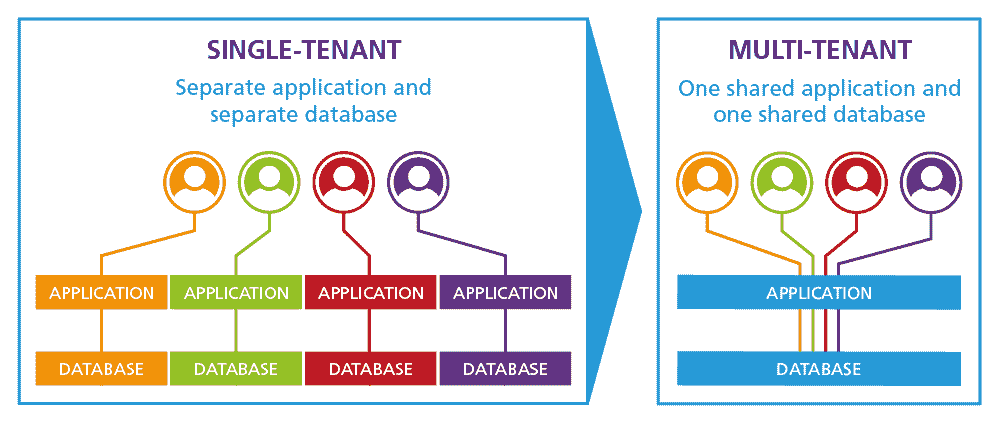
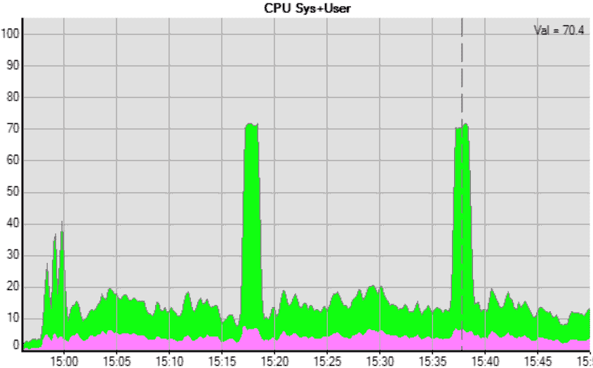
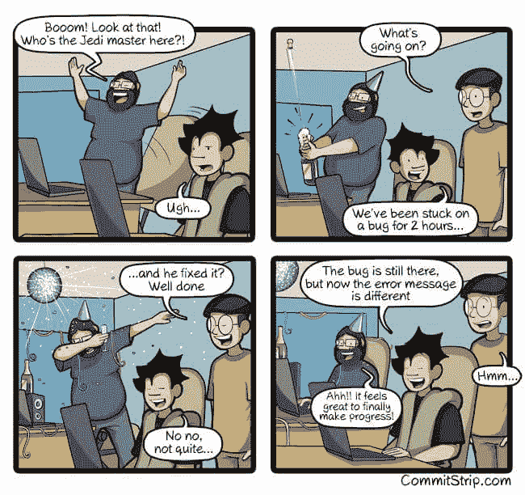

# 使用 Mendix 转向多租户架构的 4 个理由

> 原文：<https://medium.com/mendix/4-reasons-to-switch-to-a-multi-tenant-architecture-with-mendix-447ae10107b7?source=collection_archive---------0----------------------->

在这篇博文中，我想看看多租户应用的一些优势，并警告与这种架构相关的风险。

在我们开始之前，让我们先定义一下这篇文章中要用到的术语:

*   **租户** —是一个由一组用户代表的实体，这些用户共享具有特定权限的普通访问权限，通常购买 SaaS 产品的许可证，也称为客户/客户端。
*   **单租户架构** —每个租户都有自己独立的数据库和软件实例。本质上，租户之间没有资源或数据共享。
*   **多租户架构**——通常只有一个数据库和软件实例来满足所有租户的需求。租户数据是孤立的，对其他租户不可见。

Comparison between different app architectures. Credits to [https://www.peoplefluent.com/blog/learning/single-tenant-lms-vs-multi-tenant-lms-security/](https://www.peoplefluent.com/blog/learning/single-tenant-lms-vs-multi-tenant-lms-security/)

# 每个客户端的成本更低

Mendix 许可证并不便宜。Mendix 云资源也不是。如果每个客户都需要单独的许可证和云实例，那么这些成本需要包含在您的产品价格中。与此相反，对于多租户应用，每个客户端只需要一个 Mendix 许可证和一个云实例。这很容易每年节省一大笔钱。

可惜，天下没有免费的午餐。多租户应用带来了更高的风险，因为正确配置和构建您的 Mendix 模型变得至关重要，尤其是访问权限和许可。想象一下，如果由于建模错误，一个租户突然看到另一个租户的所有用户数据或发票，会发生什么！幸运的是，application code reviewer 在这里检查没有这样的错误被忽视，这要感谢[几个专门为多租户应用设计的规则](https://sdf-docs.mansystems.com/docs/acr-rules/security/accespathuser/)。

# 更好的资源利用

大多数软件表现出所谓的尖峰使用模式，即负载在时间上不是平均分布的，而是倾向于在高活动期间达到尖峰。当每个客户端都有单独的运行时和数据库实例时，每个实例都需要足够大，以适应峰值。这可能意味着您需要一个大部分时间都处于空闲状态的大型云节点，以应对偶尔出现的峰值。

Example of spiky behavior.

但是，当多个租户使用同一个节点时，负载更有可能均匀分布。此外，如果一个租户出现峰值，那么可以充分利用云节点的能力，从而更好地利用可用的计算资源。

这也是一把双刃剑，存在单个租户对所有租户的性能产生负面影响的风险。因此，使用 Mendix 特定工具检查性能至关重要，例如[应用性能诊断](https://www.mansystems.com/smart-digital-factory/tooling/apd)。否则，由于一个行为不端的租户，您可能会收到许多关于您的产品运行缓慢的投诉。

# 添加客户变得很简单

对于单租户架构，添加一个新客户意味着为每个系统建立一个新的单独的实例，比如运行时和数据库。通常情况下，系统需要进行初始化，并填充正常运行所需的配置和其他数据。

在多租户架构中，添加新租户变得像在数据库中添加新记录一样简单。

然而，“权力越大，责任越大”，因此必须小心，不同的租户在他们可以看到的数据中是完全分离的。为了确保这一点，[应用模型安全](https://www.mansystems.com/smart-digital-factory/tooling/ams)工具会扫描应用，并报告特定用户可以查看和编辑的数据。

# 易于维护

单租户配置的另一个常见问题是更新和错误修复。每次发布产品的新版本时，所有租户都需要更新。当客户缓慢且不情愿地采用新版本时，您通常会最终支持您工具的多个版本。这可能会带来很多令人头疼的问题，这是我亲身经历过的。

The joys of debugging. Credits to [http://comicstrip.com/](http://comicstrip.com/)

幸运的是，有了多租户设置，这些问题就迎刃而解了，因为所有租户都可以轻松升级，而且他们都将使用相同的最新版本的产品。

只要用[应用程序代码审查人员](https://www.mansystems.com/smart-digital-factory/tooling/acr)扫描新发布的软件，确保它们不包含任何错误，应用程序代码审查人员会检查 100 多种常见的错误和代码气味。否则，一个小错误可能会影响所有的租户，破坏客户满意度。

# 结束语

多租户架构为那些选择采用它的人提供了许多好处。然而，这些好处伴随着高风险，需要正确管理。否则，它们会严重损害你的产品和品牌。使用 Mendix 构建多租户应用程序时，使用[正确的工具](https://www.mansystems.com/smart-digital-factory/tooling)会带来很大的不同。

我希望你喜欢阅读这篇文章，并希望它能帮助你构建伟大的应用程序。

*原载于* [*安德烈·加杜克的博客*](https://www.notion.so/gajduk/740334bec7a740938f646ed7d99270eb?v=c145b965a05e4ed48096041ba018a005) *。*

*来自发布者-*

*如果你喜欢这篇文章，你可以在我们的* [*媒体页面*](https://medium.com/mendix) *或我们自己的* [*社区博客网站*](https://developers.mendix.com/community-blog/) *找到更多类似的内容。*

有兴趣加入我们的社区吗？你可以加入我们的 slack 社区 [*这里*](https://join.slack.com/t/mendixcommunity/shared_invite/zt-hwhwkcxu-~59ywyjqHlUHXmrw5heqpQ) *或者对于那些想要更多参与的人，看看加入我们的聚会* [*这里*](https://developers.mendix.com/meetups/#meetupsNearYou)