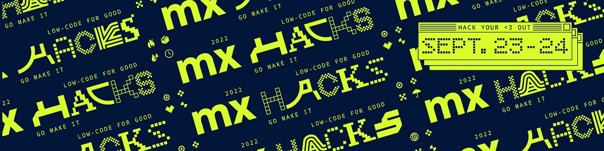

# 我要参加 MxHacks 的 4 个原因

> 原文：<https://medium.com/mendix/4-reasons-why-i-participate-mxhacks-9297ad666fb6?source=collection_archive---------4----------------------->

4 reasons why I’m going to participate in MxHacks (Banner Image)

# 最后，MxHacks 就在眼前。在家工作了 2 年多，没有亲自参加 MxWorld，是时候来一次不错的老黑客马拉松了。让我分享一下今年我和我来自[低代码学院](http://www.lowcodeacademy.com/)的团队一起参加的 **4 个主要原因**。

MxHacks 23 -24 September 2022

# **学习**

开发人员的核心活动之一是让东西工作。对我来说，建模一个应用程序，利用我现有的知识，找出我还不知道的东西，这是一个项目中最有趣的部分。发现事物可以通过多种方式完成。

作为一名经验丰富的 Mendix 培训师，我开始通过参加培训和研讨会学习新事物。好的培训会以结构化的方式分享新的见解。知识快，切中要害，瞬间适用。就像我们每天在[低代码学院](http://www.lowcodeacademy.com/)为客户做的一样。

MxHacks 由 Mendix 学院和 Mendix 专家提供培训和研讨会。您可以在 [MxHacks schedule](https://mxhacks.mendixcloud.com/) 中找到所有这些问题以及它们发生的时间。

提供的培训和研讨会面向所有经验水平的开发人员。

您是 Mendix 的新手，想通过这次黑客马拉松获得开发经验吗？

> 参加**速成班培训**和/或**为您的应用**创建一个定制注册系统。

你是一个更有经验的 Mendix 开发人员，并想了解高级主题吗？

> 然后抓住机会了解更多关于**在 Mendix** 中构建原生移动应用的信息。

我在活动期间明确推荐的一个研讨会是由 [**Bizzomate**](https://bizzomate.com/) 举办的，内容是关于他们的**开发工具**。我自己已经试用过他们的工具，我对结果非常满意。不想破坏他们的研讨会:您的安全可能没有您想象的那么安全。😉

# **连接**

获取知识的第二种方式是与 Mendix 开发人员交流思想。利用[文档](https://docs.mendix.com/)、[论坛](https://forum.mendix.com)、[学院](https://academy.mendix.com)获取知识是一个好的开始；但在我看来，没有比向其他开发者学习更好的方法了。能够与 Mendix 制造商同行交流并相互学习是令人鼓舞和有趣的。

与其他开发人员分享关于技术解决方案和项目动态的见解；传播我学到的关于如何解决挑战或未来如何解决挑战的经验。

对我来说，这些是提升自己作为 Mendix 制作者最有价值的方法。Mendix 社区是一个充满活力的开放社区，许多开发人员愿意分享他们的经验。这些联系比一次黑客马拉松持续的时间更长。每当我遇到难题时，我经常向一位 Mendix 开发人员寻求支持。反之亦然。

当然，一起吃披萨和喝好啤酒也是锦上添花。😉

# **好玩的**

作为 Mendix 开发人员，我们有最好的工作。我们非常乐意为客户服务，我们的同事也很棒。为期两天的共同解决发展难题的挑战就像一种催化剂，将所有这些汇集在一起。你可以更好地了解和团结你的队友。

我肯定要再次练习我的乒乓球技术，自从我几年前离开门迪克斯以来，我还没有打过一场好的乒乓球。所以我向鹿特丹的所有与会者呼吁:谁想玩游戏？

我也听到了关于其他游戏的传言，包括提到一个游戏大师。

# **低码为好**

最后但并非最不重要的一点，MxHacks 的目标是低代码，或者用 Mendix 语言来说:建模。每个地区都选择了一个非营利组织，参与者将在他们的团队中一起工作，构建一个 Mendix 应用程序来支持他们的事业。

对其他人来说，这似乎只是和朋友出去玩，在我们的电脑上乱搞，玩游戏。而在现实中，参加这个活动意味着我将创造一些有助于更美好世界的东西。

在撰写本文时，我不知道 Mendix 选择了哪个非营利组织，但我很期待听到我所在地区选择的组织以及随之而来的要解决的挑战。

因此，如果你喜欢比萨饼，结交新朋友，学习新技能，或者用你已经掌握的技能帮助世界，去为自己争取一个位置，并在注册今年的 MxHacks👉[https://mxhacks.mendixcloud.com/](https://mxhacks.mendixcloud.com/)

## **已经注册了？**

我们连线吧！跟我挑战打一场乒乓球，或者我们一起去吃块披萨，喝杯啤酒。**想在 MxHacks 之前连接？给我写封短信！**🤝

此外，确保您加入了 [Mendix Community Slack](http://bit.ly/mxslack) 和 [#mxhacks-general](https://mendixcommunity.slack.com/archives/C03HSKEJR6G) 频道，了解最新消息，如果您还没有完整的团队，还可以找到团队成员！

(psst，在 Slack 中搜索“MxHacks”以找到其他频道)

[rene.vanhofwegen@lowcodeacademy.com](mailto:rene.vanhofwegen@lowcodeacademy.com)

[https://www.linkedin.com/in/renevanhofwegen](https://www.linkedin.com/in/renevanhofwegen)

## 阅读更多

 [## MxHacks 2022

### MxHacks 2022 向 Mendix maker 社区发起挑战，要求他们为非营利组织构建解决方案，在全球范围内产生积极影响。

mxhacks.mendixcloud.com](https://mxhacks.mendixcloud.com/)  [## Mendix 发起全球“低代码换好代码”黑客马拉松，为以下领域提供变革性解决方案…

### 世界上最大的低代码黑客马拉松“MxHacks 2022”将于 9 月 23 日至 24 日在四个地点举行

www.mendix.com](https://www.mendix.com/press/mendix-launches-global-low-code-for-good-hackathon-to-deliver-transformative-solutions-for-nonprofits/) 

*来自发布者-*

*如果你喜欢这篇文章，你可以在我们的* [*中页*](https://medium.com/mendix) *找到更多喜欢的。对于精彩的视频和直播会话，您可以前往*[*MxLive*](https://www.mendix.com/live/)*或我们的社区*[*Youtube PAG*](https://www.youtube.com/c/MendixCommunity/community)*e .*

*希望入门的创客可以注册一个* [*免费账号*](https://signup.mendix.com/link/signup/?source=direct) *，通过我们的* [*学苑*](https://academy.mendix.com/link/home) *获得即时学习。*

有兴趣更多地参与我们的社区吗？加入我们的 [*闲散社区频道*](https://join.slack.com/t/mendixcommunity/shared_invite/zt-hwhwkcxu-~59ywyjqHlUHXmrw5heqpQ) *。*