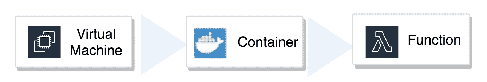

# 开始使用 AWS 之前需要了解的 4 个无服务器误区

> 原文：<https://medium.com/capital-one-tech/4-serverless-myths-to-understand-before-getting-started-with-aws-48c4ab1203ab?source=collection_archive---------0----------------------->

## 在 AWS 上设计无服务器应用程序的经验教训

如果您正在考虑开始使用无服务器应用程序，那么这篇文章是为您准备的。虽然无服务器提供了许多好处，但根据我设计无服务器应用程序的经验，有几个常见的误区会阻碍成功。

# 误解 1:无服务器意味着功能即服务(FaaS)

为了将开发时间集中在应用程序代码而不是底层基础设施上，无服务器架构是基于云的应用程序的自然发展。

虽然 FaaS 产品如 AWS Lambda 可能会主导无服务器架构，但还有许多其他无服务器选项。

在以下情况下，云服务可归类为无服务器服务:

*   没有需要您直接管理的公开服务器。
*   该服务是灵活的，因为它可以自动伸缩并且高度可用。
*   您只需为您使用的东西付费。

这使得无服务器不仅适用于基于网络的应用，还适用于实时分析和处理。以下是 AWS 无服务器产品的代表性示例，以说明这种广度:

# 误解 2:无服务器是一颗独一无二的银弹

就像任何其他技术一样，无服务器并不是所有用例的灵丹妙药，它最适合基于事件的架构。为什么？

嗯，传统的客户机/服务器架构最简单的形式如下图所示。

像这样的传统客户端/服务器架构面临的挑战包括:

*   同步调用导致高度耦合的系统。
*   需要状态管理。
*   对失败没有弹性。
*   不能有效地扩展。

简单地将服务器逻辑放在 lambda 函数中并不能解决客户端/服务器架构的这些挑战；事实上，它带来了额外的挑战，例如:

*   Lambda 计算和内存限制。
*   lambda 函数的一致打包和部署。

相反，基于事件的架构模式——这里以简单的形式展示——更适合无服务器。

将无服务器与基于事件的架构模式结合使用的好处:

*   支持去耦系统的异步调用。
*   支持不可变的、持久的、可共享的事件。
*   高度适应失败。
*   能够有效扩展。
*   高度可观察和可扩展的系统。
*   可独立释放。
*   可独立优化。

基于事件的架构模式在设计和实现微服务时很常见。虽然这种体系结构仍然存在挑战——例如需要分布式跟踪、管理当前状态和解决最终的一致性——但要考虑的主要挑战是如何避免在无服务器环境中重新创建单一应用程序。考虑设计无服务器微服务，以创建更加灵活、松散耦合的基于事件的架构。设计良好的微服务具有简洁的逻辑，没有编排逻辑，通常是专用代码，并且在短暂的环境中运行。使用这些原则设计您的架构将有助于保持整体性，以帮助更好地利用无服务器。

# 误解 3:无服务器意味着运营负担的终结

正如前面提到的，无服务器应用程序需要高度的可观察性，以便有效地排除故障。根据经验，在一个高度分布式的无服务器系统中，很难确定哪里出了问题。尤其是在级联故障的情况下。

除了运行状况检查、轮询和监控指标之外，无服务器可观察性还需要能够询问系统整体和每个部分的状态。在这种情况下，询问是提出关于无服务器系统的问题并理解答案的能力。为了支持这种有意义的询问，您需要确保无服务器系统的每个组件都输出遥测数据，以支持下游跟踪和关联以及对系统状态的全面了解。定义和测试故障场景，以及审核配置，有助于确定哪种遥测是必要的。

由于无服务器产品是托管服务，基于代理的遥测不再是一种选择。相反，无服务器功能需要与部署路径和回滚一起使用。将日志提取到可查询的系统。当无法使用工具时，云提供商应该启用可以关联的指标和日志摘录。例如， [DynamoDB 可以输出关于其请求状态和内部统计信息的有用事件或指标](https://docs.aws.amazon.com/amazondynamodb/latest/developerguide/monitoring-cloudwatch.html)。

任何无服务器开发人员都有一个强大的工具[分布式跟踪](https://opentracing.io/docs/overview/what-is-tracing/)。分布式跟踪允许事务的端到端可见性，即使事务通过多跳传播请求。这显示了服务依赖性，并使您能够建立行为和性能的基线，从中可以检测异常跟踪以确定问题。 [AWS X-Ray](https://aws.amazon.com/xray/) 是一个分布式跟踪服务，旨在帮助开发人员对无服务器应用程序进行故障排除和调试。AWS Lambda 运行 X 射线守护程序来启用 X 射线可见遥测。

以下是各种无服务器系统组件在发射实现可观测性所需的遥测数据时相互作用的简化示例。

因此，虽然无服务器确实消除了管理服务器的操作负担，但是仍然需要操作努力来有效地监控、维护和扩展无服务器系统。

# 误解 4:无服务器是无限可扩展的

说到扩展，无服务器服务的一个主要好处是高可用性。然而，高可用性并不等同于能够无限扩展。每个无服务器服务都有自己的限制要应对，无论是 [lambda 的内存限制](https://docs.aws.amazon.com/lambda/latest/dg/limits.html)还是 [Kinesis 的吞吐量限制](https://docs.aws.amazon.com/streams/latest/dev/service-sizes-and-limits.html)。其他限制可能不那么明显，例如区域性阻碍了跨区域弹性，或者由于使用占用子网 IP 地址的 ENI 在 VPC 中运行 Lambda 而导致的 IP 耗尽。(如果为 Lambda 配置的子网没有可用的 IP，Lambda 将无法扩展。)

Lambda 还有另一个挑战，即 lambda 函数在后台的容器中运行，并且需要启动步骤。这就是所谓的“[冷启动”](https://docs.aws.amazon.com/lambda/latest/dg/running-lambda-code.html)问题，当 lambda 被配置为在 VPC 中运行时，由于支持创建和连接 VPC ENI 需要额外的步骤，这个问题可能会加剧。

最佳实践包括优化您作为开发人员可以控制的内容:

*   在事件处理程序之外实例化客户端和连接。
*   根据“预热”需要安排功能执行。
*   使用环境变量。
*   使用的最大内存大小合适。
*   最小化包。

# 结论

无服务器是云技术发展的自然下一步。借助无服务器架构，我们可以专注于创新应用和解决方案，而不是管理基础架构。但是不要被常见的神话所迷惑！相反，请记住我们上面提到的基本要点:

1.  寻找无服务器解决方案的功能。
2.  将无服务器应用于基于事件的架构，而不是重新创建整体架构。
3.  了解无服务器操作的内在高级可观察性。
4.  针对限制/故障情况进行规划，并针对无服务器操作进行优化，以提高无服务器系统的弹性。

# 有关系的

*   [将云和开发运维配对以提高弹性的 4 个步骤](/capital-one-tech/4-steps-for-pairing-cloud-and-devops-to-improve-resiliency-c72fe2e52b05)
*   [从倦怠到 DevOps](/capital-one-tech/devops-from-burnout-to-taking-a-capability-centric-view-to-solving-problems-b2d2a8fb674a)

*以上观点为作者个人观点。除非本帖中另有说明，否则 Capital One 不隶属于所提及的任何公司，也不被其认可。使用或展示的所有商标和其他知识产权都是其各自所有者的所有权。本文为 2019 首都一。*