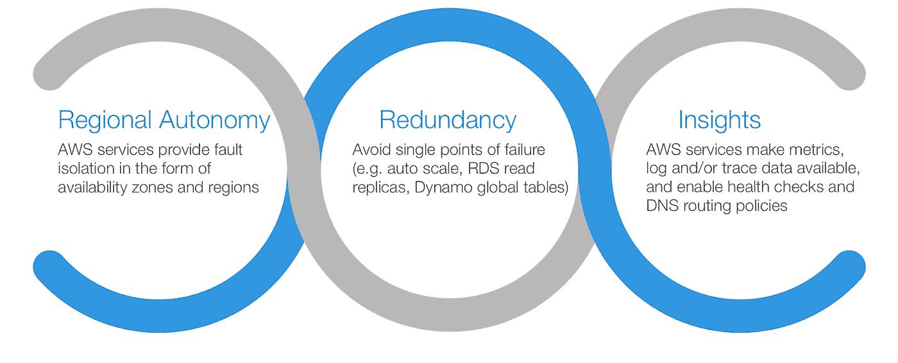
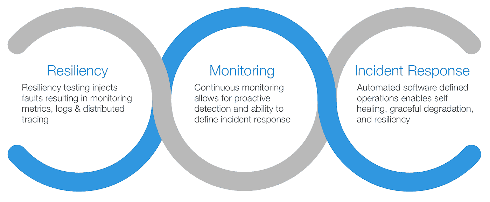
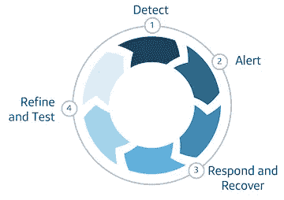
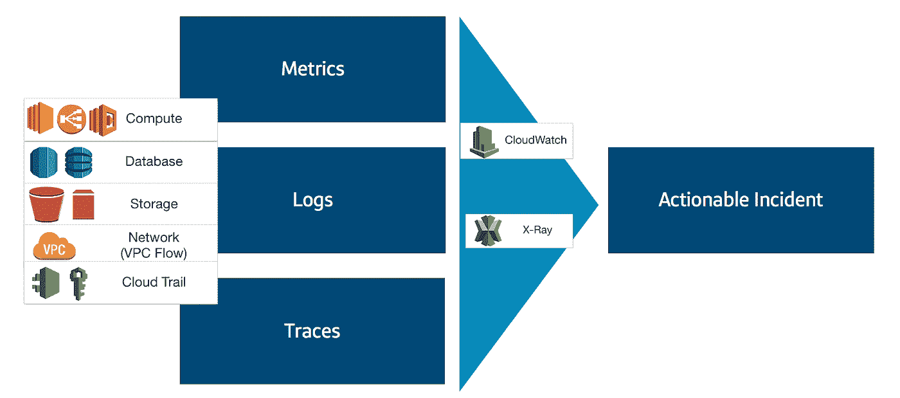
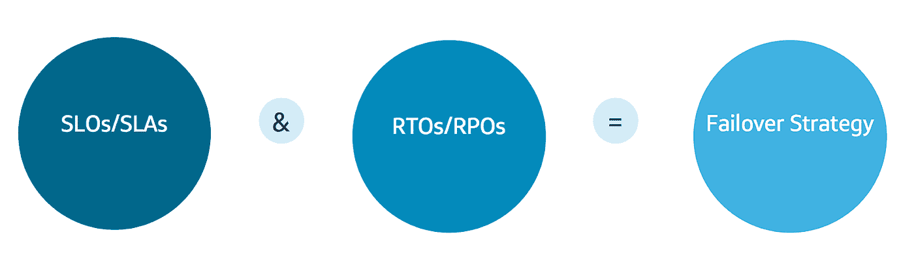
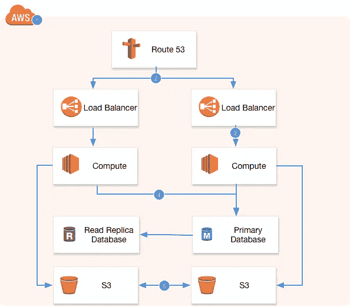
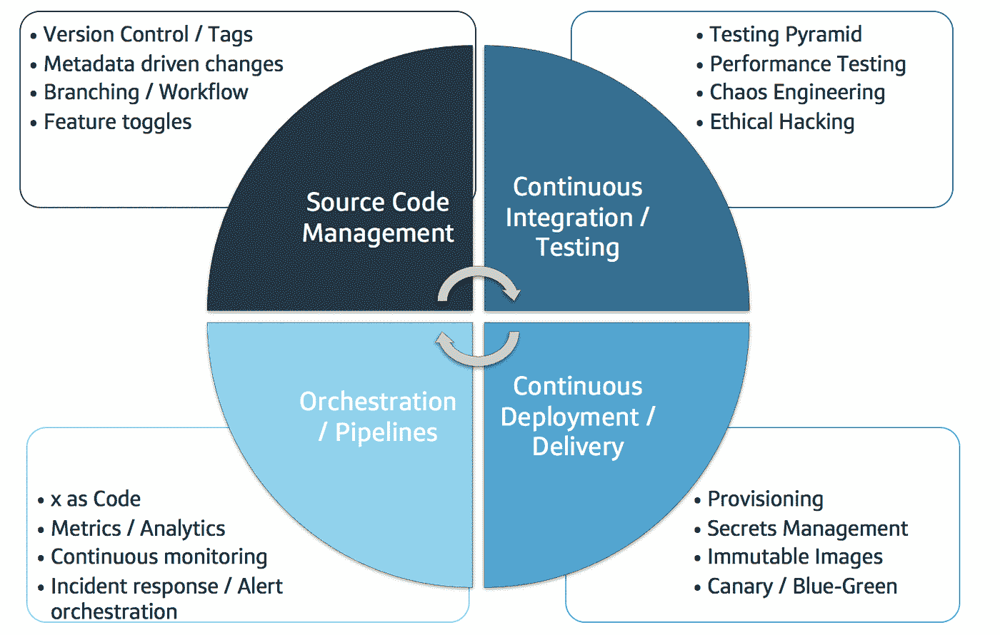
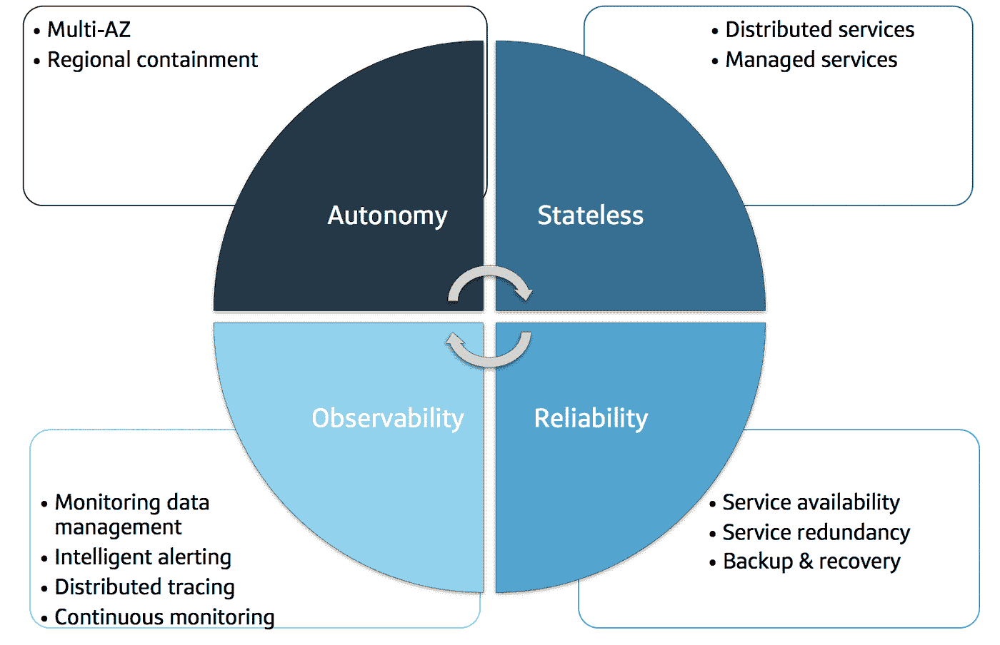

# 将云和开发运维配对以提高弹性的 4 个步骤

> 原文：<https://medium.com/capital-one-tech/4-steps-for-pairing-cloud-and-devops-to-improve-resiliency-c72fe2e52b05?source=collection_archive---------0----------------------->

再也不用回复凌晨 3 点的电话提醒不是很好吗？相信您的系统将始终对您的最终用户可用不是很好吗？如果是这样，你并不孤单！通过使用云服务和 DevOps 原则，实现这种涅槃应该是可能的。多年来，我一直是一名狂热的 DevOps 技术专家，最近为 Capital One 设计了基于云的系统，我在该领域的经验让我创建了一个简单的四步框架来帮助实现弹性。

# 第一，什么是韧性？

弹性是一个高度自动化、设计良好和测试良好的系统的结果，基于以下共同特征:

*   **适应性** —适应不断变化的条件的能力。
*   **自我修复** —自主从故障中恢复的能力。
*   **可预测的** —持续定义对失败的响应的能力。这是支持自适应和自我修复所必需的自动化的先决条件。

为了实现这些特性，弹性系统需要满足以下条件:

*   **投资** —关于开发、测试和部署弹性架构所需的资源和流程所需的劳动力和成本。基础设施成本随着所需的冗余和数据备份水平成比例增加。
*   **自动化** —这对于开发和软件定义的操作都是必不可少的。
*   **监控** —持续监控对于实现自动响应和可靠性至关重要。
*   **简单性** —一般来说，更简单的架构出现故障的可能性更小。

# 云弹性

云服务提供商，如 Amazon Web Services (AWS ),本质上支持弹性的各个方面。

*   **区域自治**允许系统在一个区域内自由运行，不依赖其他区域。一些云服务是全球性的，比如 S3，但是区域自治仍然适用。例如，S3 提供区域端点。
*   **冗余**指的是服务通常可配置的能力，以支持不同级别的冗余和数据备份到持久存储中。
*   **洞察力**是提供做出自动化决策所需数据的能力。

# DevOps 弹性

此外，DevOps 原则支持弹性的各个方面:

*   **弹性测试**指的是测试纪律，如混沌工程，以注入故障和失败来定义可预测性。这些测试就像科学实验一样，你首先做一个假设，然后运行测试来查看结果。这还包括监控和事件响应解决方案和流程的测试。
*   **持续监控整个应用堆栈(包括基础设施)的**,从而获得全面的洞察力。
*   **事件响应**依靠软件定义的操作实现自我修复。

# 介绍弹性框架的 4 个步骤

云技术和 DevOps 共同为以下简单的弹性框架奠定了基础:

## 步骤 1:检测，DevOps 风格

让我们从图表的顶部开始。为了**发现**失败的原因，首先需要了解你的依赖关系。经常被忽视的依赖是我们认为理所当然的。DevOps 强调打破筒仓；考虑到这一点，打破云基础设施和应用之间的孤岛有助于定义一个很好理解的依赖链。

**运行时依赖关系—** 依赖关系分析通常关注应用程序运行时使用的依赖关系。纵观基础架构和应用程序范围，您可以定义一整套依赖关系，例如:

*   **操作** —操作应用程序是否有任何依赖关系？
*   **系统** —是否依赖于内部或外部系统？图书馆怎么样？
*   **基础设施** —是否存在任何网络依赖性？DNS 怎么样？
*   **区域** —从区域自治的角度来看，是否存在区域内的依赖关系？跨区域依赖怎么样？

**构建时间依赖关系—** 有时这一点会被忽略。但是，为了自动扩展应用程序，或者在主动-被动或主动-备用模式下对应用程序进行故障转移，构建时依赖关系经常会出现。例如:

*   **自动缩放** —什么是自动缩放依赖关系？需要一个亚马逊机器映像(AMI)？容器图像？注册表？包存储库？
*   引导程序——你依赖引导程序脚本吗？脚本中的依赖关系是什么？
*   **管道** —为了将应用程序部署到灾难恢复站点，您是否需要一个可运行的管道？靠什么来操作？

就故障发生的概率和故障可能造成的影响而言，并非所有的依赖关系都是相同的。确定**硬依赖关系和**软依赖关系，以确定您的恢复方法。对于哪些失败，你可以接受降级体验？哪种情况下应该使用断路器机制？您应该对哪些进行故障转移？如果出现级联故障怎么办？

一旦您的依赖链被识别，检测可能的失败和限制，以防止或减轻它们。失败有多种形式:

*   **人为** —如部署错误或配置错误。[部署策略](/capital-one-tech/resiliency-patterns-at-the-edge-capital-one-a5b4d41d477e)如 canary 部署有助于改善影响，但通过监控来定义和快速检测故障也很重要。严格的非脆性自动化测试有助于通过质量控制来预防问题。
*   **云服务** —虽然云服务趋向于高度可用，但有时可能会出现中断或达到服务极限。软限制可以提高，但硬限制(如预先确定规模的子网中可用的 IP 空间)很难克服，除非进行规划。在故障转移场景中，需要考虑容量；灾难恢复区域是否有足够的实例大小和 IP 空间？冷启动延迟可以接受吗？根据服务的不同，数据复制时间可能会有所不同。
*   **安全性** —故障覆盖范围很广，从证书过期到拒绝服务攻击。应识别攻击媒介，以便采取缓解措施。交付团队应该保留开发能力来解决与安全相关的问题，例如漏洞缓解。
*   **压力—** 这包括意料之外的负载，可以提前进行测试和规划，并进行性能调整以获得最佳体验。应用程序对压力的反应是不同的，这取决于它们是否受 CPU、内存或 I/O 的限制。此应用程序特征还会影响所设置的监视器和警报的类型。
*   尽管我们尽了最大努力，不管失败是由于自然灾害还是随机事件，混乱还是会继续存在。混沌工程和测试可以帮助减轻这种风险。应该考虑基础设施级别与应用程序级别的混乱。

## 第 2 步以云和开发运维的心态保持警惕

在我们的框架图上顺时针移动，我们的下一步是 **Alert** 。尽管尽了最大努力，失败还是会发生。为了使系统具有弹性，必须采用持续的监控策略，该策略还包括**数据策略**:数据收集、数据摄取、数据分析、数据可视化，以及最终产生可操作事件的有意义的警报。从 AWS 云的角度来看，监控数据以指标、日志和跟踪的形式跨应用程序和基础架构堆栈中的服务提供。这可能会导致大量的数据。[警报](/capital-one-tech/the-mon-ifesto-part-2-alerting-and-graphing-bf51828a008f)对数据的响应需要微调，否则噪音会否定系统被监控的事实。DevOps 团队知道根据警报采取什么行动是非常重要的(理想情况下，可以自动执行这些行动)。

## 步骤 3:使用自动化和适当的故障转移策略进行响应和恢复

继续框架中的下一步，**对失败的响应**意味着决定行动的纠正过程。**恢复**然后执行纠正过程。自我修复是自动响应和恢复的结果，依赖于软件定义的操作。软件定义的运营是 DevOps 的一个元素，在 devo PS 中，包括运行手册在内的一切都被定义为代码，并在应用生命周期管理中被视为代码。云通过提供健壮的 API 来实现这种自动化。

每个系统的响应和恢复需要根据该系统的要求来定义(例如，SLO/SLA、RTO/RPO):

[故障切换策略](/capital-one-tech/architecting-for-resiliency-9ec663db5c94)通常是主动/主动、主动/被动和主动/备用，可以在一个区域内和多个 AZ 内使用，也可以跨多个区域使用。为了自动化和投资的深度，需要考虑故障转移、适度降级和可用性。此外，还需要处理会话和状态管理。一般来说，无状态应用程序比有状态应用程序更可取，这样可以减少故障影响，并实现更容易的动态伸缩。

故障转移策略将告知架构考虑事项。

例如，上图展示了一个典型的三层应用程序。考虑因素包括:

*   **多 AZ 或多区域** —根据系统要求，需要多少冗余？可以承受多大的延迟？
*   **加权策略** —基于第一个考虑，Route53 提供了几种不同的加权策略，对故障转移产生不同的结果。
*   **自动缩放策略** —应用程序支持水平缩放吗？
*   **数据库策略** —不同的数据库和数据库服务提供不同的弹性功能。例如，RDS MySQL 和 PostgreSQL 使用主读取副本策略，这意味着无论写入来自何处(例如，不同的区域)，写入总是会发生在主服务器上。然而，DynamoDB 提供了全局表。同步与异步数据复制以及最终一致性与保证一致性是确定系统可预测性的重要考虑因素。
*   **持久存储策略** —根据弹性确定你的持久存储策略很重要；例如，S3 提供跨区域复制，但根据对象的卷和大小，复制时间可能会有所不同。

## 步骤#4:提炼和测试，实现增量改进

最后但同样重要的是，我们将讨论框架中的最后一步。对你的系统有信任和信心的唯一方法是，本着真正的 DevOps 精神，不断改进你的系统和过程。这可以通过不断地**提炼**你的方法来实现，这些方法基于**测试**作为你常规应用开发生命周期的一部分。

有许多 DevOps 最佳实践可应用于灵活性:

*   **源代码管理—** 如上所述，软件定义的操作应被视为代码，并遵循应用代码最佳实践。此外，特性切换允许打开和关闭新功能，以减少与应用程序代码相关的错误。
*   **持续集成/测试** —如上所述，弹性和性能测试对于实现系统可预测性和微调监控和警报至关重要。类似地，测试金字塔中的全面测试对于确保代码质量至关重要。此外，道德黑客可以发现提高安全性的机会。
*   **连续部署/交付(CD)** —依赖关系在 CD 流程中很常见，如上所述，需要在故障规划中加以考虑。应该根据系统需求选择部署策略。
*   **编排/管道** —如上所述，数据策略支持智能警报和高效监控。监控可以集成到管道和编排流程中。

还有许多可应用于弹性的云最佳实践:

*   **自治** —如上所述，云的最佳实践是在一个区域内尽可能自治。如果采用跨区域灾难恢复策略，请注意避免跨区域依赖性。
*   **无状态** —无状态应用程序最容易扩展，并且有许多关于故障转移策略的管理状态的最佳实践。
*   **可靠性** —云服务本身提供可靠性 SLA，但也使您的应用程序能够支持基于可用性、冗余以及备份和恢复选项的可靠性。
*   **可观察性** —如上所述，云服务虽然是托管的，但提供了可用于持续监控的度量、日志和跟踪等洞察。

# 实现务实的弹性

恢复能力不会一蹴而就。基于云的系统自主恢复和适应故障的能力是可能的，但需要投资和不断完善。你们中的许多人可能已经在使用云技术和 DevOps 原则来加速发布周期。我希望你现在也能把它们应用到弹性上。

这个四步弹性框架可以根据您系统的需求，直接用于提升您系统的弹性级别。确保发现你所有的依赖，仔细考虑你认为永远有效的依赖。然后，基于高效的持续监控进行智能报警。接下来，确定对故障条件的适当响应。然后，定义并自动恢复到正常操作。期望通过全面的测试不断完善和扩展这些方法。

# 相关:

*   [云计算和运营团队如何将云计算的采用从瓶颈提升到工程成功](/capital-one-tech/how-cloud-and-ops-teams-can-take-cloud-adoption-from-bottleneck-to-engineering-success-666d149db746)
*   [弹性架构](/capital-one-tech/architecting-for-resiliency-9ec663db5c94)
*   [信心十足地部署—借助 AWS 上的 Canary 部署，最大限度地降低风险，提高弹性](/capital-one-tech/deploying-with-confidence-strategies-for-canary-deployments-on-aws-7cab3798823e)

*声明:以上观点仅代表作者个人观点。除非本帖中另有说明，否则 Capital One 不属于所提及的任何公司，也不被其认可。使用或展示的所有商标和其他知识产权都是其各自所有者的所有权。本文为 2019 首都一。*