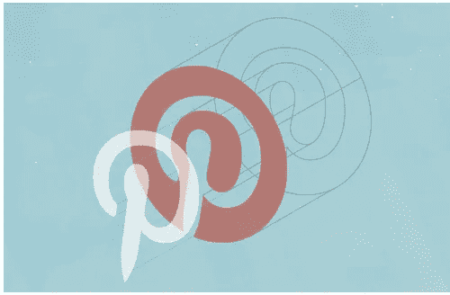

# 实现更好目标和指标的 4 个步骤

> 原文：<https://medium.com/pinterest-engineering/4-steps-to-better-goals-and-metrics-dfe7ad7b2c9c?source=collection_archive---------1----------------------->

Marty Weiner | Pinterest 工程经理，BlackOps

没有战术的战略是最慢的胜利之路。没有战略的战术，是战败前的噪音。” —孙子

我一次又一次地发现，许多组织都有同样的问题，目标设定。并不总是清楚目标是如何设定的，或者如何设定的。创业公司尤其如此。我不得不通过犯很多错误和用头撞墙来艰难地学习这个过程。所以你可以省下你自己的脑袋和一些无辜的墙，我正在分享我在制定目标和指标上的大脑垃圾。

## 目标

目标是你在规定的时间内试图完成的事情，以及你如何根据这些成就来衡量进展的组合。它们可以是期望的(你的团队希望达到的目标)和/或承诺的(对团队外其他人的承诺)。

目标是有用的，有几个原因。这里有两个我最喜欢的:

1.  它们非常有助于你从工程/产品战的战壕中抬起头来，努力思考你要去的方向，以及你在一定时间内可以合理实现的目标。
2.  目标是一种有效的方式，可以让你在前进的道路上保持一致，同时灌输一种紧迫感。

每个负责设定目标的人 ***必须*** 知道目标线是如何选择的(步骤 1)以及达成目标的重要性(步骤 2)。在第 3 步和第 4 步中，我将讨论如何设定一个好的目标。警告:跳过前两步会导致你头痛、食欲不振、头发稀疏和偶尔恶心。

## 第一步。传达如何选择目标线

***每个人*** 都要知道公司的目标线是如何设定的。这样做的目的是确保我们在足球场上跑的方向一致。以下是引发讨论的几个选项:

1.  设定难以置信的大范围目标
2.  设定你有 70%可能达到的目标
3.  设定你可能达到的目标
4.  设定你容易达到的目标

每个选项都有有趣的分支，你应该选择最适合你的文化的一个。在 Pinterest，我们有一种设定目标的文化，我们可能有 70%的机会达到目标，并且我们非常努力地去实现它们。如果我们没有达到目标，我们会讨论如何改进我们的战略和/或战术，或者我们设定目标的能力。

如果不清楚整个组织使用哪种风格，沟通就会中断，很可能是以微妙的方式(在这种情况下，你应该把“微妙”理解为一个诅咒词)。例如，如果爱丽丝假设目标(2)是公司如何运营，而鲍勃正在为目标(3)设定目标，爱丽丝可能会认为鲍勃是一个[沙袋](http://www.investopedia.com/terms/s/sandbag.asp)*咒骂语*。如果 Alice 和 Bob 没有意识到他们在做不同的基本假设，他们的交流可能会中断，而他们甚至不会意识到。

## 第二步。传达达成目标的重要性

你的公司需要一个沟通良好的理念，如何对待目标设定和达到/未达到目标。几个选项:

1.  你必须达到你的目标！
2.  努力实现你的目标。如果你做到了，那就太棒了。讨论如果你不这样做，什么会更好。
3.  目标只是指导方针。没什么大不了的。

再次强调，选择最符合你公司文化的方式是很重要的。更重要的是，确保选择得到充分沟通。沟通不畅的影响可能是 Alice 假设(1)和 Bob 假设(2)，而目标没有实现。结果可能是 Alice 因为目标没有实现而感到沮丧，Bob 感到困惑，因为他觉得自己没有做错什么。鲍勃很可能会采取守势，这是有效沟通已经停止的明显迹象。

## 那么你选择哪个呢？

不同的公司和部门设定目标的方式不同。如果你不确定选择哪个，把合适的人召集起来，收集情绪和 ***选择一个组合从*** 开始。

在你选择了一个“目标线”选项和一个“目标的重要性”选项后，传达它。一遍又一遍地传达它，直到它融入公司的 DNA。在每次目标会议上传达。边喝啤酒边交流。然后多喝啤酒，这样会有更多的交流。

一旦你喝够了啤酒，就该选择一个目标了。

## 第三步。选择一个目标

争取一个度量驱动的目标，但不要到了失去人的因素的地步。确定目标的一个很好的方法是使用 OKRs。如果你已经熟悉 OKRs，跳过下一段。如果没有，请继续阅读。

一个是一个 ***O*** 宾语，一个***K***ey***R***结果。目标是你想要达到的目标。它应该是定性的和鼓舞人心的(如增长我们的用户群到月球)。关键结果是您将用来监控您的进度的指标(例如，增长到 1000 万活跃用户或发布 1.3 版本)。关键结果应该是定性的，并指定一个测量窗口。让我们将第一个例子改进为“每月活跃用户增长到 1000 万”，这意味着我们将自己与上个月的所有活跃用户进行比较。下面是关于 [OKRs](http://www.eleganthack.com/the-art-of-the-okr/) 的[更多](http://www.firstround.com/article/the-management-framework-that-propelled-LinkedIn-to-a-20-billion-company) [。把这东西吃光。这对你有好处，而且钠含量低。](http://www.gv.com/lib/how-google-sets-goals-objectives-and-key-results-okrs)

此外，目标应该级联。在最高层次上，你可能有一个围绕增长的目标。支持该目标可以是其他团队为提高站点加载时间的性能和可靠性而维护的子目标。这一目标的基础可能是提高新服务器的部署速度。诸如此类。

记住这一点，让我们来讨论选择一个可靠的指标。我讨厌缩略词，但我还是要用一个。一个 ***指标*** 应该是 ***有意义、可衡量、可操作的*** ，以及 ***励志*** ，否则称为 MMOM。(为什么「运营」一定要以「O」开头？毁了一个潜在的伟大缩写！)

## 有意义的

您的度量标准需要以某种相当明显的方式(或者至少以每个人都能同意的方式)来度量或贡献您的业务目标。将活跃用户的数量增加到 1000 万是一个很好的方法来衡量你增加用户群的进度。另一方面，用你能引用的《星际迷航》的集数来衡量收入并不太好。

你与意义斗争的时候通常是当你有一个很好地定义你的目标的标准，但不是完美的时候。例如,“内容被标记的次数”能有意义地衡量不好的体验吗？也许吧，但你更想知道“某人有过糟糕经历的次数”(这可能无法衡量)。您必须在指标和不断努力改进之间做出艰难的权衡。

## 可测量的

你应该能够定期衡量进展。例如，如果你想提高增长率，你可以测量在过去的七天里有多少人访问了你的网站，这对于一个简单的地图缩小工作来说是很容易做到的。

但是有时候可测量性几乎是不可能的。例如，你如何衡量垃圾邮件发送者从你的网站赚了多少钱？不管我多少次认为一个度量是不可能测量的，我们已经找到了一种方法。它可能并不完美，但从某件事开始，任何事，都会有助于推动进步。对于上面的垃圾邮件指标，我们从测量上个月我们发送到垃圾邮件发送者站点的流量开始。这至少给了我们一些他们收入的近似值，我们可以据此开始运作。

## 操作的

一个高度可操作的度量标准是你的团队可以影响并快速看到效果的。你需要能够移动指标上的指针？而且，您的度量对系统中的变化响应得越快，您迭代的速度就越快。

测量“在过去的 10 秒钟内有多少人访问了你的网站”是非常容易操作的。你可以改变主屏幕的颜色，并立即看到它是否有影响。如果你愿意，你可以在接下来的一个小时内换 20 多次颜色。

另一方面，你可以衡量 14 天后有多少人会回到你的网站。迭代现在变得很慢，因为你可能要等 14 天，但有时这是一个必要的权衡，以便你衡量你真正想要衡量的东西(对公司目标更有意义)。

你也可以考虑设立几个目标，一个对你的团队来说高度可操作的目标，另外一个对公司其他人来说更有意义的不那么可操作的目标。他们应该是近亲。

## 动机的

别忘了动力！我们在和这里的人打交道。如果人们没有动力，早上起床去征服这个指标有点糟糕。有时指标本身是激励性的，例如增加增长或增加零食与人的比率。你推动一个指标的量也会对动机产生重大影响(接下来在步骤 4 中讨论)。

一个重要但自然缺乏动机的度量标准通常可以通过讨论影响或将其与更有趣的东西联系起来进行补救。例如，将灯泡亮度提高 0.00003%听起来很无聊。相反，不如说这一影响将使我们的收入增加 300 万美元？哇！

其他人的动机是对该领域的精通。将这一指标与他们如何成为世界上最好的灯泡的工程师联系起来，对一些人来说可能很有说服力。

一些人受到挑战的激励。但是，如果这是一个几乎不可能实现的目标，有些人会觉得它毫无价值或遥不可及。如果目标太容易，你就失去了其他人。

还有一些人的动机来自其他方面:聚会、金钱、认可、啤酒、油炸圈饼、熏肉。事实上，人们同时受到其中几个因素的激励。你必须深刻理解是什么驱动着你的团队，不仅仅是为了设定目标，也是为了成为一个有效的鼓舞人心的领导者。考虑学习更多关于人类动机的知识，从观看丹·平克的精彩演讲开始。

## 第四步。推绳子！

一旦我们知道我们在测量什么以及如何测量，下一步就是要弄清楚在什么样的时间表上你能把指标推进多远，以及为什么。

一个非常常见的操作时间线是季度。每月与上级联系，建立信任，并提供相关更新。

首先， ***你的指标要求你负责的时间范围是多少？***

一些指标应该覆盖整个季度，例如维护指标(例如，不要在可用性上有所损失)。如果时间窗口太长，一些度量标准，尤其是涵盖快速改进领域的度量标准，可能会失去动力。例如，在关键的基础设施有机会被建立之前，测量团队的表现是没有意义的。如果您的可用性达到 99 %,并希望在本季度末提高到 99.9 %,那么您将需要发布几个关键的优化，而这些优化可能要到中途才会准备好。在这种情况下，也许最好只衡量过去两周的情况。

作为一个经验法则，我觉得一个指标不应该覆盖短于两周的时间。通常有太多的噪音。第二， ***你能把公制移动多远？***

这就是事情变得更加艰难的地方。有时候直觉是一个足够的答案，但是用数据支持你的答案可以让你更好地猜测到季度末你会在哪里，并与其他相关人员建立信任。利用你现有的任何数据，收集新的数据，以了解你有什么优势。

## 超越完美

当第一次选择目标时，很难找到一个符合所有三个 M 和一个 o 的目标。有时有太多的指标可供选择，有时似乎没有。请记住，你最好选择一个不太完美的目标来开始，而不是什么都不做。在某些情况下，你可能会发现没有完美的度量标准，甚至某个度量标准是不合适的，但是请努力尝试一下。

## 例子

这里有两个应用于不同情况的模型的例子:网站性能和垃圾邮件数量。

## 示例 1 —现场性能

让我们围绕站点性能设定一个目标。假设你有一个从未测量过网站性能的年轻网站。你首先需要一个基线，一个使用什么样的杠杆来将度量标准推向正确方向的意识，以及一个目标。

首先，选择你设定目标的策略，并在目标设定会议上告诉每个人。例如，设定一个你有 70%机会达到的目标线，如果你没有达到，研究一下为什么，然后更好地设定目标。此外，让我们假设你正在设定一个目标，希望在即将开始的季度末实现。

在进行了一些分析以确定站点缓慢且有时不响应的原因后，您发现数据库导致了主要的可用性和延迟问题，并且执行一些关键的优化可以改善延迟和可用性:

***目标:*** 提高面向客户的网站绩效

***关键成果 1:*** 将本季度最后两周的可用性从 98.5%提高到 99%

***关键结果 2:*** 将 99.9%的延迟从 200 毫秒减少到 100 毫秒，这是在本季度的最后两周测得的

在讨论性能时，包含一个可用性指标(衡量在不超时或出错的情况下向客户端返回答案的频率)和一个性能指标(衡量合理部分用户的网站加载速度)总是一个好主意。(顺便说一句，如果你认为你理解延迟，[再想想](https://www.youtube.com/watch?v=6Rs0p3mPNr0)。)

KR1 和 KR2 结合在一起给出了一个非常棒的 MMOM 故事。首先，这些 ***有意义地*** 衡量你的客户的体验。如果您改进了度量标准，您所做的(希望是小的)信心飞跃是用户满意度将会上升(您可以将其作为另一个更高的 OKR 来衡量)。

这些都很容易 ***测出*** 。您可以设置 [StatsD](https://github.com/etsy/statsd/) 并立即获取这些数据。你可以设置提醒来知道什么时候你可能会违反你的目标。

这些指标是在一周内测量的，所以从操作上来说有点太长了。但是，您可以测量最近五分钟和一小时的可用性和延迟，并将其报告给您的工程师。这很好地代表了更广泛的目标。这样，工程师就可以在几分钟内知道优化是否产生了影响。

最后，这些指标，在我看来，非常 ***励志*** 。没有什么比让网站更快更可靠更能让我的工程设备运转起来了！此外，我们还在谈论一个相当大的飞跃，在最后两周之前，你必须非常努力地推进其中的一些项目，这样团队的大多数人才能集中精力。

您可能应该围绕维护指定一个(隐含的或明确的)目标，以及为此目的的一些资源。从上个季度的 98%上升到本季度大部分时间的 93 %,然后在测量窗口期间回升到 99 %,这是很糟糕的。

## 示例 2 —垃圾邮件数量

衡量减少垃圾邮件的成功非常困难。这是因为存在一个悖论。如果我知道某个东西是垃圾邮件，我会把它扔掉。我想知道还有多少垃圾邮件，但是我如何衡量我不知道的东西呢？

在 Pinterest，我们经历了几轮对垃圾邮件指标的改进，直到今天我们还在继续改进。如前所述，我们假设我们的目标是达到 70%的可能性。我们过去使用的一个指标如下:

***目标:*** 减少用户因垃圾邮件带来的负面体验

***关键结果:*** 本季度的 pin 报告比上一季度减少 30%

Pin 报告是对有人在 Pinterest 上将 Pin 标记为垃圾邮件的次数的计数。这个指标非常容易 ***测量***——只需计算任何标准统计软件包中的报告数量。**我们可以保留一个分分钟的图表，让我们能够快速观察和应对攻击，并在几分钟内查看我们的规则和模型是否有效。因此， ***这个指标仍然非常*** 可操作。**

这个指标非常具有 ***激励性*** 。我们偶尔会看到可能将我们推向错误方向的每日峰值，以及使每日平均值更高的低级垃圾邮件攻击。我们分析了这些数据，虽然我们觉得减少 30%很难，但我们有一个强有力的攻击计划。我们还可以尝试许多不同的方法，并快速做出反应。

***有意义*** 这就是这个度量有意思的地方。我们想衡量垃圾邮件带来的负面体验。有时 Pin 报告是误报(例如，Pinner 标记了他们不喜欢的东西，但不一定是垃圾邮件)。此外，Pin 报告并不能真正告诉我们一个人的经历有多糟糕。有时人们不报告 pin，因为他们不知道他们可以这样做。而且，理想情况下，最好能知道垃圾邮件发送者有多成功(尽管这在目标中没有明确指出)。然而，Pin 报告确实向我们显示了大规模攻击的时间，并且它们与大规模攻击期间 Pinners 发送的帮助台票证相关联。

随着我们在打击垃圾邮件方面做得越来越好，Pin 报告变得如此之少，以至于它们大部分都是噪音。作为回应，我们现在转而衡量每天有多少 mau(每月活跃用户)点击垃圾邮件。这一指标更有意义，并直接映射到我们的反垃圾邮件战略(但一开始有点难以衡量和操作)。

在[推特](http://twitter.com/MartyWeiner)和 [Pinterest](http://pinterest.com/martaaay) 上关注我的冒险。

邮箱:[marty@pinterest.com](http://marty@pinterest.com)

*感谢* [*吉米·索普科*](http://twitter.com/jimmysopko) *和克里斯·沃尔特斯分享这个目标设定，和我一起撞头冒险！*

*感谢 Philip Ogden-Fisher 和 Sriram Sankar 提供的大量反馈和见解！*

Marty 是 BlackOps 团队的经理。

*获取 Pinterest 工程新闻及更新，关注我们的工程*[*Pinterest*](https://www.pinterest.com/malorie/pinterest-engineering-news/)*[*脸书*](https://www.facebook.com/pinterestengineering) *和* [*推特*](https://twitter.com/PinterestEng) *。有兴趣加入团队吗？查看我们的* [*招聘网站*](https://about.pinterest.com/en/careers/engineering-product) *。**