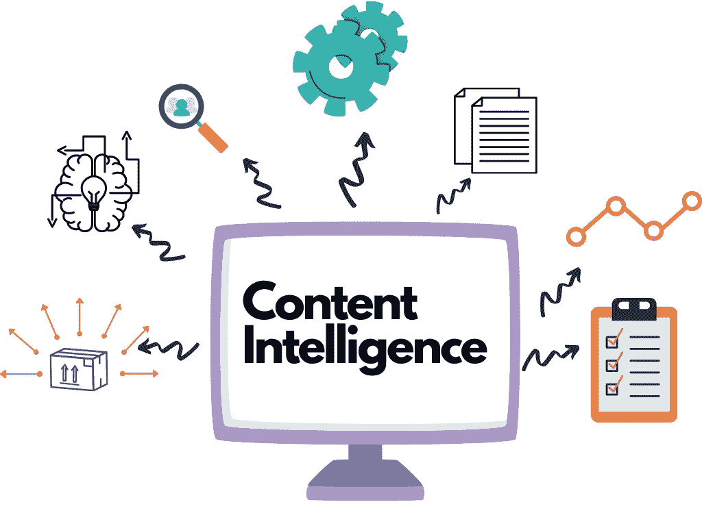

# 人工智能驱动的内容智能可以改善客户体验的 4 种方式

> 原文：<https://medium.com/globant/4-ways-ai-driven-content-intelligence-can-improve-customer-experience-2d8d46d40c87?source=collection_archive---------4----------------------->

随着近年来内容消费方式的快速变化，内容营销也已经发展到不仅仅是教科书定义的创建内容，仅仅是为了分发给观众，而没有具体的目标。

随着企业在内容管理系统中采用和实施人工智能，内容智能最近已经成为一个流行词汇——以衡量内容的有效性，并更好地了解客户。

根据 Research and Markets 的一项研究，内容智能作为一个市场将在未来 5 年内以每年约 25%的速度呈指数级增长。这种增长可以归因于营销人员越来越依赖数据驱动的洞察力来制定他们的战略。

内容战略家和专家正在利用大数据科学获得可操作的见解，以构建更好的战略，从而在当前高度竞争的环境中获得显著优势。

以下是内容智能提供的一些优势:

**1-内容创建和分发**

从创建买家角色到理解客户行为，人工智能在内容领域有着不可思议的潜力。由于内容智能是关于细节的，它给内容营销者提供了目标受众偏好的更详细的图片。这有助于确定要制作、共享、更新甚至推广的内容类型，而无需假设客户行为。

**例如**:关键词研究工具，如亚马逊的 Alexa，用于创建新内容和更新现有内容，允许营销人员根据竞争、搜索需求、搜索量、结果数量和其他指标来找到关键词。这些工具提供的数据驱动的洞察力是它们如何对 ROI 产生切实影响的完美例子。

**2-超个性化**

在竞争激烈的数字营销环境中，使用人工智能的超个性化正在成为公司有效地从竞争中脱颖而出并为读者/观众提供超相关内容的一种手段。

尽管经常被引用，网飞仍然是超级个性化内容如何改变世界的最好例子。网飞收集了他们客户的大量数据——从他们的浏览历史、他们的兴趣到他们的好恶等等。

关于用户偏好的数据被用于:

1)获取并使用实时数据和人工智能来分析客户偏好，并使用它来为其订户创建一个推荐系统——超个性化。

2)构建和创建可能被更广泛消费的原创内容。

通过利用这些数据，网飞改善了消费者体验，这对用户数量产生了直接的积极影响。

充分利用和理解消费者行为数据的还有电子商务行业，在这个行业，超个性化以推荐系统的形式出现。系统越好，用户体验越好——从而带来更高的转化率。

**3-实时反馈回路和策略输入**

营销人员最有效地利用内容智能来提供内容的上下文和相关性。这是通过对与内容/主题相关的数据进行整理和分析，并利用这些反馈来建立内容策略来实现的。

在过去，由于收集的数据的分析过程的手动性质，反馈通常是过时的—内容策略既不高效也不普遍。

随着 CI 成为一个自动化流程，指标的分析速度越来越快，其优势也越来越明显。它还让营销人员有机会根据实时反馈循环不断制定和重新制定他们的内容策略，以保持在不断变化的市场上。

**例子** : A/B 测试是实时反馈回路如何发挥作用的完美例子。正确的指标，如参与度、偏好和对活动的反应，可以帮助营销人员测试哪个选项对他们的受众有效，并确保预算用于更有效的选项。

**4-数据驱动的内容审计**

检查网站上现有内容的优势、劣势和相关性的审计是非常有益的练习，尤其是如果网站上有很多内容的话。但是，即使对于大型内容团队来说，整理所有内容也是一项艰巨的任务。

**工具**:人工智能驱动的工具，如 Marketmuse，Concured 可以帮助这一过程更容易地确定现有内容中的主题缺口和饱和点，以改善内容策略。通过更好地了解用户/受众的参与方式，数据驱动的审计可以帮助通过上下文放置内容，并基于可操作的见解规划未来战略。

**最终想法**

内容消费的速度加快了，内容管理和战略也跟着加快了步伐。人工智能正在帮助营销人员更好地控制和理解内容生命周期。内容智能可以帮助营销人员堵塞内容营销策略几乎每个方面的漏洞——从了解消费者行为到优化消费者旅程每一步的内容——让他们每次都能达到目标。