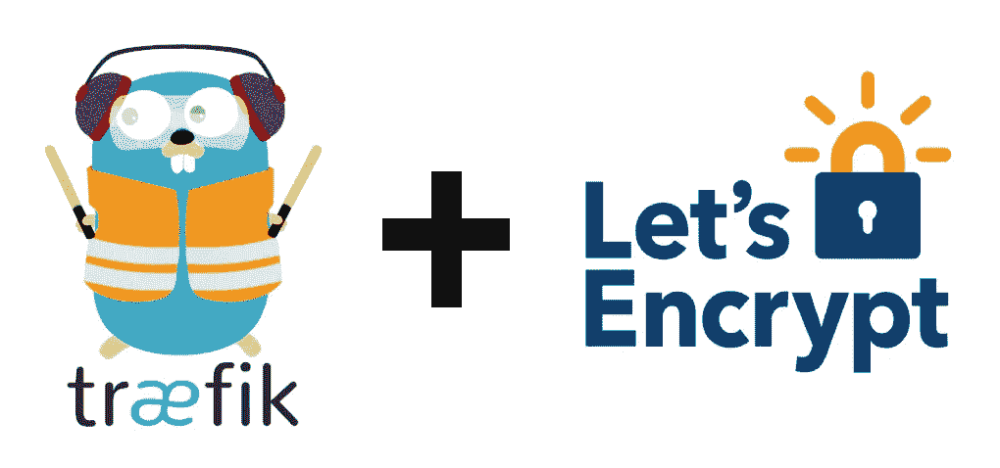
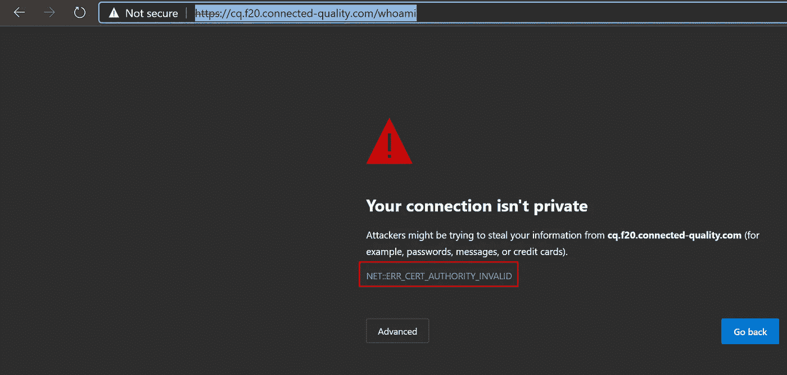
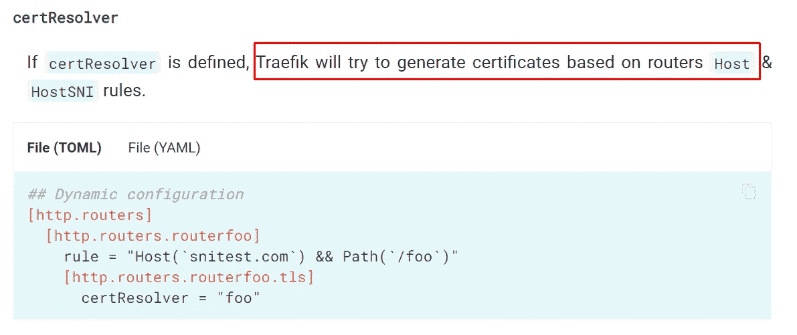
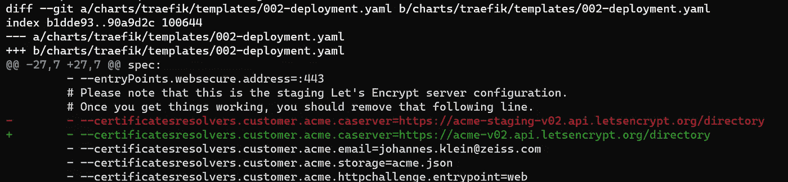

# 在 Kubernetes 中用 Traefik 修复 LetsEncrypt SSL 生成的 4 种方法

> 原文：<https://medium.com/quick-code/4-ways-to-fix-letsencrypt-ssl-generation-with-traefik-in-kubernetes-ec438127b765?source=collection_archive---------0----------------------->

在 Kubernetes 中使用 Traefik 作为负载平衡器和 HTTP 反向代理是一种展示您的微服务的好方法。Traefik 还将使用 letsencrypt 生成 SSL 证书。

好吧，如果你把所有的配置都做对了:-)的话

如果您得到一个`NET::ERR_CERT_AUTHORITY_INVALID`错误，这意味着 traefik 没有为您的域生成有效的证书:

这里有三个可能的问题，你可以仔细看看:

1.  无主机()规则
2.  LetsEncrypt 生产服务器
3.  让加密率限制
4.  民航局记录

# **问题 1:无主机()规则**

当 Traefik 启动时，它将解析所有 ingressroutes，并查找任何在`Host()`规则中指定的域。

在 [traefik 文档](https://docs.traefik.io/routing/routers/#service)中了解更多信息

这是一个例子**进入路线:**

# **问题 2: LetsEncrypt 生产服务器**

LetsEncrypt 提供 API 端点来生成证书。登台环境将生成无效证书，因此请确保使用生产环境:

*   分期:`https://acme-staging-v02.api.letsencrypt.org/directory`
*   生产:`https://acme-v02.api.letsencrypt.org/directory`

这是一个有效的 Traefik **部署**:

其他资源:

*   [https://letsencrypt.org/docs/staging-environment/](https://letsencrypt.org/docs/staging-environment/)
*   [https://community . lets encrypt . org/t/acme-v2-production-environment-通配符/55578](https://community.letsencrypt.org/t/acme-v2-production-environment-wildcards/55578)

# **问题 3:设置加密速率限制**

LetsEncrypt 有一些速率限制，以确保公平使用。如果你打错了

`too many certificates already issued for exact set of domains`

那么您的 traefik 容器可能会重新启动 5 次以上，因为每次重新启动都会导致证书更新。

目前最重要的限制是:

*   每个注册域的证书(每周 50 个)—生成多达 50 个子域
*   重复证书(每周 5 份)—最多更新证书 5 次

其他资源:

*   【https://letsencrypt.org/docs/rate-limits/】

# **问题 4: CAA 记录**

您还可能会遇到这样的问题:由于“证书颁发机构授权”的问题，LetsEncrypt 无法生成有效的证书。您的域托管商可能不支持 CAA，有关更多详细信息，请参考以下文章:

*   [https://www . the-cake-shop . de/traefik-2-0-docker-container-MIT-lets-encrypt-nutzen](https://www.the-cake-shop.de/traefik-2-0-docker-container-mit-lets-encrypt-nutzen)
*   [https://stack overflow . com/questions/55261846/docker-setup-with-traefik-reverse-proxy-neterr-cert-authority-invalid-on-one](https://stackoverflow.com/questions/55261846/docker-setup-with-traefik-reverse-proxy-neterr-cert-authority-invalid-on-one)