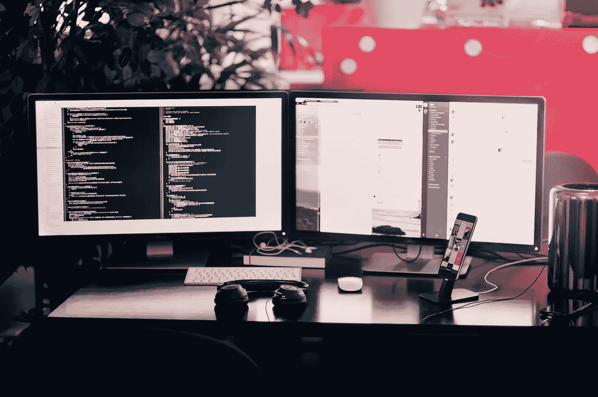

# Coursera 上学习编程的 40 门免费在线课程

> 原文：<https://medium.com/quick-code/40-free-online-courses-to-learn-programming-on-coursera-7568db1a61b5?source=collection_archive---------0----------------------->

Coursera 上的很多课程仍然是免费的。要获得这些免费课程，当你点击注册按钮，你会看到两个选项。选择*“全课程，无证书”*选项，免费获取课程。你不需要做任何审计。

在这个系列中，我们收集了所有有这个选项的免费编程课程，因此任何人都可以免费访问它们。该列表如下:

# 1.[编程语言，A 部分](https://click.linksynergy.com/deeplink?id=BuGceriufQM&mid=40328&u1=quickcode&murl=https%3A%2F%2Fwww.coursera.org%2Flearn%2Fprogramming-languages)

本课程介绍编程语言的基本概念，重点强调函数式编程。本课程使用 ML、Racket 和 Ruby 语言作为讲授概念的工具，但真正的目的是教授足够多的关于任何语言如何“组合在一起”的知识，以使您在任何语言中以及在学习新语言时更有效地编程。

这门课程既不是特别理论化，也不仅仅是关于编程细节——它将为你理解如何有效地使用语言结构以及如何设计正确优雅的程序提供一个框架。通过使用不同的语言，你将学会比用一种语言的特定语法进行更深入的思考。强调函数式编程对于学习如何编写健壮的、可重用的、可组合的、优雅的程序是必不可少的。事实上，现代语言中许多最重要的思想都源于函数式编程。准备好学习一种全新的、漂亮的看待软件的方式，以及如何享受构建软件的乐趣。

本课程假设学生之前有一些编程经验，第一个模块中有更详细的描述。

本课程分为三个 Coursera 课程:A 部分、B 部分和 c 部分。正如 A 部分的第一个模块中更详细地解释的那样，整个课程包含大量具有挑战性的材料，因此三部分的形式提供了两个中间里程碑和继续之前暂停的机会。这三个部分是按顺序完成的，目的是激励你继续完成 C 部分。这三个部分的长度并不完全相等:A 部分几乎和 B 部分和 C 部分加起来一样充实。

A 部分的第 1 周有一个更详细的课程三个部分的主题列表，但预计大多数课程参与者不会(还没有！)知道这些题目都是什么意思。

# 2.[学习编程:基础知识](https://click.linksynergy.com/deeplink?id=BuGceriufQM&mid=40328&u1=quickcode&murl=https%3A%2F%2Fwww.coursera.org%2Flearn%2Flearn-to-program)

在每一次鼠标点击和触摸屏点击的背后，都有一个电脑程序让事情发生。本课程介绍了编程的基本构件，并教你如何使用 Python 语言编写有趣而有用的程序。

# 3.[自己编码！编程入门](https://click.linksynergy.com/deeplink?id=BuGceriufQM&mid=40328&u1=quickcode&murl=https%3A%2F%2Fwww.coursera.org%2Flearn%2Fintro-programming)

你是否曾经希望知道如何编程，但是不知道从哪里开始？本课程将教你如何在 Scratch 中编程，Scratch 是一种易于使用的可视化编程语言。更重要的是，它将向你介绍计算的基本原理，并帮助你像软件工程师一样思考。

# 4.[学习编程:打造质量代码](https://click.linksynergy.com/deeplink?id=BuGceriufQM&mid=40328&u1=quickcode&murl=https%3A%2F%2Fwww.coursera.org%2Flearn%2Fprogram-code)

并非所有的程序都是平等的。在本课程中，我们将专注于编写正确有效运行的高质量代码。我们将设计、编码和验证我们的程序，并学习如何比较处理相同任务的程序。

# 5. [Python 编程:简明介绍](https://click.linksynergy.com/deeplink?id=BuGceriufQM&mid=40328&u1=quickcode&murl=https%3A%2F%2Fwww.coursera.org%2Flearn%2Fpython-programming-introduction)

本课程的目标是通过实践教学向学生介绍 Python 版编程。它将展示如何安装 Python 和使用 Spyder IDE(集成开发环境)来编写和调试程序。方法是展示一个例子，然后进行一个小练习，让学习者尝试类似的东西来巩固一个概念。在每个模块结束时，将会有一个练习，要求学生编写简单的程序，并提交它们进行评分。它是为很少或没有编程背景的学生设计的，尽管有这样背景的学生应该能够以他们喜欢的速度前进。

该课程分为四个模块，计划在四周内完成。

# 6.[MATLAB 编程简介](https://click.linksynergy.com/deeplink?id=BuGceriufQM&mid=40328&u1=quickcode&murl=https%3A%2F%2Fwww.coursera.org%2Flearn%2Fmatlab)

这门课程向那些几乎没有经验的人教授计算机编程。它使用称为 MATLAB 的编程系统和语言来这样做，因为它简单易学，功能多样，对工程师和其他专业人员非常有用。MATLAB 是一种特殊用途的语言，是编写解决涉及数字操作问题的中等规模程序的绝佳选择。这种语言的设计使得用几行代码编写一个强大的程序成为可能。问题可能相对复杂，而解决问题的 MATLAB 程序相对简单:相对的，即相对于用通用语言编写的等效程序，如 C++或 Java。因此，MATLAB 正被广泛应用于各种领域，从自然科学到工程的所有学科，再到金融等等，并且它在工业中被大量使用。因此，扎实的 MATLAB 背景是当今就业市场不可或缺的技能。

然而，本课程不是 MATLAB 教程。这是一门介绍性的编程课程，使用 MATLAB 来说明计算机科学和编程中的一般概念。顺利完成本课程的学生将熟悉计算机科学中的一般概念，了解编程的一般概念，并获得使用 MATLAB 的坚实基础。

参加该课程的学生将在课程期间免费获得 MATLAB 在线许可证。

# 7.[为 Android 手持系统编写移动应用程序:第 1 部分](https://click.linksynergy.com/deeplink?id=BuGceriufQM&mid=40328&u1=quickcode&murl=https%3A%2F%2Fwww.coursera.org%2Flearn%2Fandroid-programming)

本课程将向您介绍面向移动设备的 Android 应用程序的设计和实现。假设你有 Java 的基础知识，你将从头开始开发一个应用程序，并学习如何设置 Android Studio，处理各种活动并创建简单的用户界面以使你的应用程序流畅运行。

# 8.[为 Android 手持系统编写移动应用程序:第二部分](https://click.linksynergy.com/deeplink?id=BuGceriufQM&mid=40328&u1=quickcode&murl=https%3A%2F%2Fwww.coursera.org%2Flearn%2Fandroid-programming-2)

本课程将向您介绍面向移动设备的 Android 应用程序的设计和实现。您将建立在之前课程的概念基础上，包括处理通知、使用多媒体和图形以及将触摸和手势融入您的应用程序。

# 9.[数字媒体创意编程&移动应用](https://click.linksynergy.com/deeplink?id=BuGceriufQM&mid=40328&u1=quickcode&murl=https%3A%2F%2Fwww.coursera.org%2Flearn%2Fdigitalmedia)

这门课程是为那些想把他们的技能应用到从视频游戏到艺术装置到互动音乐的创造性工作中的人，以及那些想在艺术实践中使用编程的艺术家而开设的。

本课程将教你如何开发编程技能并将其应用到创造性工作中。这是创造性移动应用程序、数字音乐和视频游戏开发中的一项重要技能。它将教授编写利用图像、音频和图形的软件所需的技术技能，并将专注于这些技能在创造性项目中的应用。将为没有编程背景的学生提供额外的资源。

本课程结束后，您将能够:

*在运行于桌面和移动设备上的处理环境中编写创造性的视听程序
*以创造性的方式编程处理声音
*显示图像和图像序列
*生成交互式算法图形
*与 2D 物理引擎合作创建基本游戏

# 10.[网络游戏:文学、新媒体和叙事](https://click.linksynergy.com/deeplink?id=BuGceriufQM&mid=40328&u1=quickcode&murl=https%3A%2F%2Fwww.coursera.org%2Flearn%2Finteractive-media-gaming)

本课程面向对视频游戏感兴趣的新手和想要反思自己激情的资深游戏玩家，将探索当故事、绘画和电影成为大型多人在线游戏的基础时会发生什么。《指环王》三部曲——小说、电影和电子游戏——是我们关于“补救”如何在熟悉的故事穿越媒体时改变它们的核心例子。

这门课程被设计成一门大学水平的英语文学课——一门多体裁、多媒体的课程，讲述文学、电影和游戏如何参与到讲故事的基本人类活动中。我们的旅程将使我们能够了解一些叙事理论，向我们介绍媒体研究中的一些关键话题，并涵盖一些视频游戏的历史和理论。它还将把我们带到浪漫文学的一些里程碑，大多数幻想游戏背后的永无止境的故事:J.R.R .托尔金的《指环王》，埃德蒙·斯宾塞的《仙后》，以及济慈、丁尼生、勃朗宁等人的诗歌。

借鉴了几个世纪的浪漫叙事传统，21 世纪的游戏产业已经成为一个创意和经济的发电站。它吸引了我们一些最聪明的作家、艺术家、作曲家、计算机工程师、游戏理论家、视频制作人和营销专业人士的才华，2012 年，它创造了约 640 亿美元的收入。任何对当今文化感兴趣的人都需要熟悉这种新媒体是如何改变我们对故事的理解的。加入我们的智力冒险，探索在线游戏的文化遗产。

# 11.[交互式计算机图形学](https://click.linksynergy.com/deeplink?id=BuGceriufQM&mid=40328&u1=quickcode&murl=https%3A%2F%2Fwww.coursera.org%2Flearn%2Finteractive-computer-graphics)

计算机图形可以成为支持视觉问题解决的强大工具，而交互性在利用用户的创造力方面起着核心作用。本课程将介绍在计算机图形学研究领域开发的各种交互式工具及其设计原理和算法。示例包括图形用户界面的增强、2D 绘图和 3D 动画的创作工具以及交互式计算机辅助设计系统。丰富的现场演示和课程作业将为你提供针对你自己的问题设计和实现此类工具的见解和技能。

# 12.[R 中的神经黑客介绍](https://click.linksynergy.com/deeplink?id=BuGceriufQM&mid=40328&u1=quickcode&murl=https%3A%2F%2Fwww.coursera.org%2Flearn%2Fneurohacking)

Neurohacking 描述了如何使用 R 编程语言(【https://cran.r-project.org/】)及其相关包来执行神经成像数据的操作、处理和分析。我们专注于公开可用的结构磁共振成像(MRI)。我们讨论的概念，如不均匀性校正，图像配准和图像可视化。

本课程结束时，您将能够:

以 NIfTI(神经成像信息学技术倡议)格式读取/写入大脑图像
可视化并探索这些图像
执行不均匀性校正、大脑提取和图像配准(在受试者内并与模板配准)。

# 13.[使用 App Inventor 开发 Android 应用](https://click.linksynergy.com/deeplink?id=BuGceriufQM&mid=40328&u1=quickcode&murl=https%3A%2F%2Fwww.coursera.org%2Flearn%2Fapp-inventor-android)

该课程将为学生提供开发有趣的 Android 应用程序的实践经验。没有以前的编程经验是必需的,并且该课程适合具有任何计算经验水平的学生。MIT App Inventor 将在课程中使用。它是一个基于块的编程工具,允许每个人,甚至是新手,开始编程并为 Android 设备构建功能齐全的应用程序。鼓励学生使用自己的 Android 设备进行实际测试和操作。

# 14.VR 和 360 视频制作(T1)

欢迎来到 Daydream Impact Virtual Reality(VR)和 360 视频制作课程!我们的使命是为您提供使用 VR 进行倡导所需的技能,并传达您的使命。

本课程将向您介绍虚拟现实(VR)和 360 视频制作,引导您逐步创建 VR 内容。首先,我们建议花几分钟的时间来探索课程网站并审查材料。

最好的运气,因为你开始 - 我们希望你喜欢这场比赛,并成功地使用 VR 来产生影响。

# [ 西班牙语课程 ]

# 15.[编程入门(C++)](https://click.linksynergy.com/deeplink?id=BuGceriufQM&mid=40328&u1=quickcode&murl=https%3A%2F%2Fwww.coursera.org%2Flearn%2Finitiation-programmation-cpp)

本课程介绍了使用 C ++编程的基础知识:变量,循环,函数,...
它不假定任何先验知识。更高级的方面(面向对象编程)在下面的课程中给出,介绍面向对象编程(在 C ++中) 。
它依赖于许多教育元素:字幕视频,视频中断,练习,自动记下作业,课程笔记。

# 16.[面向对象编程简介(C++)](https://click.linksynergy.com/deeplink?id=BuGceriufQM&mid=40328&u1=quickcode&murl=https%3A%2F%2Fwww.coursera.org%2Flearn%2Fprogrammation-orientee-objet-cpp)

本课程介绍了面向对象编程(封装,抽象,继承,多态性),并用 C ++语言说明了它。它假定已知的编程基础知识(变量,类型,循环,函数,...)。它被设计为入门级编程(在 C ++中)课程的延续。
与其前身一样,本课程依赖于许多教育元素:字幕视频,视频内外问答,练习,自动记下作业,课程笔记。

# 17.[编程!编程导论 (T1)](https://click.linksynergy.com/deeplink?id=BuGceriufQM&mid=40328&u1=quickcode&murl=https%3A%2F%2Fwww.coursera.org%2Flearn%2Fa-programar)

有没有想过创建自己的计算机游戏, 但 no tenías idea 如何做 o por 哪里开始?本课程将教你使用 Scratch 编程,一种非常易于使用的可视化编程语言,更重要的是,你将学习计算机的基本原理,以便你开始像软件工程师一样思考。

# 18.[面向对象编程简介(Java)](https://click.linksynergy.com/deeplink?id=BuGceriufQM&mid=40328&u1=quickcode&murl=https%3A%2F%2Fwww.coursera.org%2Flearn%2Fprogrammation-orientee-objet-java)

本课程介绍了面向对象编程(封装,抽象,继承,多态性),并用 Java 语言说明了它。它假定已知的编程基础知识(变量,类型,循环,函数,...)。它被设计为入门编程(Java)课程的延续。
与其前身一样,本课程依赖于许多教育元素:字幕视频,视频中断,练习,自动记下作业,课程笔记。

# 19. [编程入门(Java)](https://click.linksynergy.com/deeplink?id=BuGceriufQM&mid=40328&u1=quickcode&murl=https%3A%2F%2Fwww.coursera.org%2Flearn%2Finitiation-programmation-java)

本课程介绍了使用 Java 语言编程的基础知识:变量,循环,函数,...
它不假定任何先验知识。更高级的方面(面向对象编程)在下面的课程中给出,介绍面向对象编程(Java) 。
它依赖于许多教育元素:字幕视频,视频中断,练习,自动记下作业,课程笔记。

# 20.[Scienza da Computação com Python Part 2 简介](https://click.linksynergy.com/deeplink?id=BuGceriufQM&mid=40328&u1=quickcode&murl=https%3A%2F%2Fwww.coursera.org%2Flearn%2Fciencia-computacao-python-conceitos-2)

Bem vindo ao curso Introducción a Ciencia da Computação destinado a los estudiantes regulares da 圣保罗大学!

Esta e a segunda parte do Curso, donde usted continuará a aprender os principales conceptos introductorias de Ciencia da Computación e también aprenderá a desarrollar pequeños programas en lenguaje Python.

这个纪律没有先决条件;non e expectado 您有任何 previo en programmazione 经验;它只需要 o know dos conceitos básicos de matemática do ensino básico。但是,你必须做一个第一部分 do Curso (也可在这里没有 Coursera).

其主要目标是发展计算机问题的公式化和解决方法,并教导如何处理和解决计算机问题。

O act de programar is a util tool to work o razocinio 上面提到的, 以及使更多具体的其他概念共同在 scienza da computação.

当您完成课程时,您将有能力在 Python 中编写小程序并使用 Web 中可用的材料自行继续使用更多高级的 Python 研究。

# [ 俄语课程 ]

# 21.[开发企业系统。部分 3。灵活的开发方法(T1)](https://click.linksynergy.com/deeplink?id=BuGceriufQM&mid=40328&u1=quickcode&murl=https%3A%2F%2Fwww.coursera.org%2Flearn%2Fgibkie-metodologii-razrabotki)

该课程的主题是创建企业系统的方法 - 组织,规划和管理其开发过程的方法。本节探讨了灵活软件系统开发的方法论基础,并系统化了实际应用 - 它们的最佳实践。研究开发方法对软件系统的性质和规模的影响。重点是软件系统开发中最重要的灵活方法的比较分析,旨在最大限度地适应快速变化的业务环境。灵活方法的系统化也在其对企业系统开发的实际适用性方面进行。
将讨论以下主要问题:什么是方法论?严格方法与灵活方法有什么区别?为什么需要方法论?这些方法在什么条件下适用?将灵活的开发方法应用于企业应用程序的特点是什么?每种灵活方法都包含哪些步骤?开发过程是如何组织的?开发团队的特点是什么?为什么与客户的持续互动很重要?哪种方法最适合不同类型的软件产品?

# 22.[开发企业系统。部分 1。生命周期模型(T4)](https://click.linksynergy.com/deeplink?id=BuGceriufQM&mid=40328&u1=quickcode&murl=https%3A%2F%2Fwww.coursera.org%2Flearn%2Frazrabotka-korporativnih-sistem-modeli-jiznennogo-cikla)

Предметом курса являются модели создания корпоративных систем, подходы к организации, планированию и управлению всем их жизненным циклом — от концепции до вывода из эксплуатации. Исследуется влияние последовательности организации жизненного цикла на характер и масштаб программной системы, качество реализации и экономику разработки программного продукта. В курсе рассматриваются методологические основы разработки корпоративных систем, а также систематизируются практические приемы — «лучшие практики» их применения. Основное внимание при этом уделяется исследованию особенностей жизненного цикла при использовании наиболее распространенных моделей его организации. Систематизация моделей проводится также и в аспекте их практической пригодности для разработки корпоративных систем.

主要问题如下:
什么是公司?
为什么需要一类特殊的软件系统——企业应用程序,它们解决了什么问题?
软件系统的生命周期包括哪些阶段?Q3:每个阶段的特点是什么?
为什么系统地研究生命周期很重要?5、什么是生命周期模型?
哪种模型最适合不同类型的软件产品?

# 23.[企业系统开发。部分 2。严格的开发方法(T8)](https://click.linksynergy.com/deeplink?id=BuGceriufQM&mid=40328&u1=quickcode&murl=https%3A%2F%2Fwww.coursera.org%2Flearn%2Fstrogie-metodologii-razrabotki)

该课程的主题是创建企业系统的方法 - 组织,规划和管理其开发过程的方法。本节探讨了开发企业系统的方法论基础,并系统化了实际应用 - 它们的最佳实践。研究开发方法对软件系统的性质和规模的影响。重点是对软件系统开发中最重要的方法进行比较分析,这些方法结合了在不同生命周期模型中构建系统的实际方法。方法的系统化也在其对企业系统开发的实际适用性方面进行。
将讨论以下主要问题: 什么是方法论?严格方法与灵活方法有什么区别?将开发方法应用于企业应用程序的特点是什么?每个软件系统开发方法都包含哪些步骤?每个阶段的特点是什么?为什么系统地研究生命周期很重要?哪种方法最适合不同类型的软件产品?

# 24. [在软件开发中使用操作系统机制](https://click.linksynergy.com/deeplink?id=BuGceriufQM&mid=40328&u1=quickcode&murl=https%3A%2F%2Fwww.coursera.org%2Flearn%2Fos-v-razrabotke-po)

在软件开发中熟练使用操作系统的基本机制的能力是现代技术专家在计算机科学领域成功发展的基本条件之一。
课程 在软件开发中使用操作系统机制将有助于:
•扩展计算机科学和操作系统的知识;
:学会在开发软件工具时明智而明智地选择正确的操作系统机制;
掌握在软件代码中使用操作系统功能的技能;
•发展个人专业能力,开发现代节目。

# 25.[企业系统的危机生命周期方法(T1)](https://click.linksynergy.com/deeplink?id=BuGceriufQM&mid=40328&u1=quickcode&murl=https%3A%2F%2Fwww.coursera.org%2Flearn%2Fkorporativnye-antikrizisnye-methodology)

Предметом курса являются кризисно устойчивые методологии разработки корпоративных систем, процессно-ориентированные подходы к организации, планированию и управлению их разработкой. Исследуется влияние кризисных явлений на процессы разработки программных систем, определяющие эксплуатационные характеристики и экономические показатели программного продукта. В курсе рассматриваются основы использования методологий для антикризисной разработки корпоративных систем, а также систематизируются практические приемы — “лучшие практики” их применения. Основное внимание при этом уделяется исследованию особенностей коррекции жизненного цикла в кризисных условиях с учетом наиболее распространенных адаптивных методологий. Систематизация методологий проводится также и в аспекте их практической пригодности для антикризисной разработки корпоративных систем, с учетом технологических и антропогенных факторов.

将讨论以下主要问题:
• 危机事件如何影响软件开发方法?
哪些企业应用程序开发流程受到危机的影响?
企业系统开发过程的危机管理最重要的因素是什么?
危机中生命周期管理的最佳实践是什么?
为什么系统地调整开发方法以适应危机现象很重要?
在危机中,哪种软件开发方法最好?
每种方法的应用特点是什么?

# 26. [LaTeX 文档和演示文稿(Introduction to LaTeX)](https://click.linksynergy.com/deeplink?id=BuGceriufQM&mid=40328&u1=quickcode&murl=https%3A%2F%2Fwww.coursera.org%2Flearn%2Flatex)

LaTeX(拉脱维亚语:LaTeX)是一个科学出版系统。在本课程中,您将学习如何将您的想法以美丽,专业的文本或幻灯片形式呈现。

LaTeX 是科学界的标准。最好的数学,物理和经济学期刊在 LaTeX 上发表,并鼓励作者使用它来准备手稿。LaTeX 不是很容易开发,但它比流行的文字处理器和演示文稿编辑器有很大的优势:
高质量的拼写 - 文本看起来像书籍。
易于处理复杂的数学公式;
优秀的跨平台兼容性;
自动化许多常规流程:编号公式,图形,表格,文档部分,交叉引用,创建页眉,设计标题样式等。p。；
•庞大的用户和开发者社区,适用于所有生活场景的扩展包。

LaTeX 简化了所有需要撰写论文,摘要,课程和学位论文,论文以及基于它们的幻灯片的人的生活。熟悉 LaTeX 的用户会记得在 Word 中叠加复杂的文档,并在 PowerPoint 中创建大型演示文稿是一个可怕的梦想。

FAQ

问:我需要在电脑上安装什么来完成这门课程?
答:有许多不同的软件工具可以使用 LaTeX,其中一些是相互替代的,另一些则是相互补充的。这些工具的审查是讲座的第一周的主题之一,在此之前不需要设置任何东西。为了掌握课程,您将需要一台能够快速访问互联网并能够在其上安装软件的计算机。以后在 LaTeX 中处理自己的文档时,不需要连接到互联网。

问:是否需要事先准备课程?
答:不,不需要事先准备课程。

# 27.[Python 编程基础(T3)](https://click.linksynergy.com/deeplink?id=BuGceriufQM&mid=40328&u1=quickcode&murl=https%3A%2F%2Fwww.coursera.org%2Flearn%2Fpython-osnovy-programmirovaniya)

Python 编程语言是最容易掌握和流行的编程语言之一。本课程的目的是学习 Python 语言的基本结构,这些结构有助于解决从数据分析到开发新软件产品的各种任务。

通过该课程,学生将学习如何处理和存储数字,文本及其集合,掌握标准的 Python 语言库,并能够自动执行数据收集和处理任务。该课程为学习 Python 语言更专业的应用领域提供了必要的基础,例如机器学习,统计数据处理,数据可视化等等。学生还将熟悉不同编程范式的基础知识:过程,功能和面向对象编程。

Для качественного освоения курса достаточно знания математики на уровне средней школы, опыта программирования не требуется.

В курсе предлагается большое количество задач по программированию, расположенных по нарастанию сложности, что позволяет закреплять на практике изучаемый материал. К каждому занятию прилагается полный конспект, это делает изучение курса удобнее. Курс проводился в оффлайн варианте для студентов бакалавриата факультета компьютерных наук НИУ ВШЭ.

# [ Courses in Chinese ]

# 28\. [系统平台与计算环境](https://click.linksynergy.com/deeplink?id=BuGceriufQM&mid=40328&u1=quickcode&murl=https%3A%2F%2Fwww.coursera.org%2Flearn%2Fjisuanji-wangluo)

* “系统平台与计算环境”仅是”大学计算机”系列课程的第一部分，我们将在不久的未来推出“算法与 C 语言编程基础”，”大学计算机”系列课程的第二部分，敬请关注！*

计算机科学是研究抽象和自动计算的学科，涉及的理论知识众多。作为计算机科学的入门，“大学计算机”系列课程将从基础知识入手，循序渐进，帮助你在了解计算机系统整体结构和基本原理的基础上，具备“选择和利用各种已有工具软件解决问题的能力”和“编写程序解决一般专业问题的能力”。

本系列课程由“系统平台与计算环境（第一部分）”和“算法与 C 语言编程基础（第二部分）”两门课程构成。每门课程独立开设，既自成一体，又相互衔接，构成体系。本课程，即第一部分的内容，将涉及计算模型与信息表示、软硬件系统组成及工作原理、网络技术及应用、OFFICE 基本操作等多个知识模块。本课程的学习目标是了解计算机软硬件系统组成、信息表示方法、网络技术等计算机学科的基础知识和基本操作技能；在未来我们将提供系列课程第二部分的学习目标，即学会编写简单的 C 语言控制台程序以及排序、查找等基本算法。

本课程是学习计算机的入门课程，无需信息技术方面的基础，但需要你会一些计算机的基本操作，比如：文字录入、通过网络获取信息（网络信息检索）等。

# 29\. [软件测试 (Software Testing)](https://click.linksynergy.com/deeplink?id=BuGceriufQM&mid=40328&u1=quickcode&murl=https%3A%2F%2Fwww.coursera.org%2Flearn%2Fruanjian-ceshi)

从认识和理解软件 Bug 开始，介绍软件测试的基本理论，阐述软件测试设计的多样性原理。基于多样性原理，介绍白盒测试方法和黑盒测试，具体包括随机测试、等价类测试、控制流测试、数据流测试等；邀请业界专家讲解功能测试、性能测试、移动应用测试技术。

# 30\. [软件工程](https://click.linksynergy.com/deeplink?id=BuGceriufQM&mid=40328&u1=quickcode&murl=https%3A%2F%2Fwww.coursera.org%2Flearn%2Fruanjian-gongcheng)

欢迎大家选修北京大学开设的软件工程 MOOC 课程。
随着信息技术的发展，软件已经深入到人类社会生产和生活的各个方面。软件工程是将工程化的方法运用到软件的开发、运行和维护之中，以达到提高软件质量，降低开发成本的目的。软件工程已经成为当今最活跃、最热门的学科之一。
本次软件工程 MOOC 课程是一门导论性课程，在 11 周、21 次课的时间里，我们将全面介绍软件工程所涉及的各方面知识，包括软件过程、软件需求、结构化分析和设计方法、面向对象分析和设计方法、敏捷开发方法、软件测试、软件项目管理、软件开发工具和环境。通过课程讲授，让大家初步了解软件开发和维护的方法学，为进一步深入学习各专题打下基础。
课程还包含了实践环节，通过一个小型软件项目，大家可以体验软件开发的各个环节，并形成项目管理的意识。

一、本次课程的安排如下：
第 1 周 软件工程概论、软件过程
第 2 周 软件需求
第 3 周 结构化方法 1
第 4 周 结构化方法 2
第 5 周 面向对象方法 1
第 6 周 面向对象方法 2
第 7 周 面向对象方法 3
第 8 周 面向对象方法 4、敏捷开发方法
第 9 周 软件测试
第 10 周 软件项目管理
第 11 周 软件开发工具和环境

二、课程实践
本课程提供了三个实践题目，每个实践题目已列出三点基本需求，可在课程介绍的讲义中查看。请结合自身兴趣爱好从中任选其一，在仔细阅读并思考基本需求的基础之上额外补充一个需求，以此作为系统需求完成本次课程实践。
课程实践分为三个阶段，分别在第 4 周、第 7 周和第 10 周进行结构化方法、面向对象方法、软件测试和项目管理的实践，完成相应的文档报告。
实践成绩由同学互评给出，每位同学需要给其他三位同学的报告评分。

三、课程评分方案
在新的课程版本里，我们将课程实践所占的分数从 30%降低到了 12%。但我们依然鼓励同学们积极地完成课程实践的练习，加深对课程的理解。
（1）平时 Quiz 占 88%
（2）课程实践占 12%

祝大家学习愉快！

# 31\. [C#程序设计](https://click.linksynergy.com/deeplink?id=BuGceriufQM&mid=40328&u1=quickcode&murl=https%3A%2F%2Fwww.coursera.org%2Flearn%2Fsheng-c-biancheng)

C#（又称 csharp)是一种优秀的面向对象语言，它继承了 C++和 Java 等语言的优点，在 Windows 图形用户界面、Web 应用、数据库等方面有着广泛的应用。本课程在介绍 C#语言及面向对象的程序设计基本原理的基础上，使用 Visual Studio 作为开发工具，介绍 C#对各种常见的信息的处理方法，包括文本处理、图形绘制、图像处理、多媒体、网络信息获取、数据库应用等。
课程中除了理论知识外，更注重上机编程实践，程序示例紧密结合日常的学习和工作，生动有趣，难度适中。
本课程要求学习者学过一门程序语言（如 C 语言等）。

# 32\. [Java 程序设计](https://click.linksynergy.com/deeplink?id=BuGceriufQM&mid=40328&u1=quickcode&murl=https%3A%2F%2Fwww.coursera.org%2Flearn%2Fjava-chengxu-sheji)

《Java 程序设计》课程的主要目标有三： 一、掌握 Java 语言的语法，能够较为深入理解 Java 语言机制，掌握 Java 语言面向对象的特点。 二、掌握 JavaSE 中基本的 API，掌握在集合、线程、输入输出、图形用户界面、网络等方面的应用。三、能够编写有一定规模的应用程序，养成良好的编程习惯，会使用重构、设计模式、单元测试等方式提高代码的质量。
本课程要求学习者有一定的程序设计基础，如学过 C 或者 C++语言。

# 33\. [面向对象技术高级课程（The Advanced Object-Oriented Technology）](https://click.linksynergy.com/deeplink?id=BuGceriufQM&mid=40328&u1=quickcode&murl=https%3A%2F%2Fwww.coursera.org%2Flearn%2Faoo)

如果将软件开发人员看作行走江湖的武侠，那么各种软件开发技术就是武侠赖以傍身的武术秘籍。有的秘籍以易学灵巧见长，练习者很快掌握，并有立竿见影的功效，但失之厚重持久；有的秘籍初学乍练顿显困难，虽冥思苦解仍不得要领，需坚持不断的内功修炼方成正果，却是成为武林大侠必备的至宝。本课程有些类似于后者。

《面向对象技术高级课程》深入、系统、完整地讲解当今主流的面向对象软件开发方法的分析、设计、实现及重构方法，深入讲解 UML 语言的高级技术细节，以及近年来面向对象方法最新的发展趋势。课程集百家之所言，并结合主讲者最新的研究成果，并通过大量、丰富、完整、不同领域、应用不同技术的案例将其中的关键知识点串联起来，便于理解和应用。

本课程并不拘限于某一特定的面向对象的编程语言的编程技巧，但却包含了基于当前主流的面向对象编程语言的多项完整案例。本课程引导选课同学从更为抽象和共性的模型角度描述现实世界和软件世界,即构建分析与设计模型，之后再将其落实到软件编程实现。这种工程化的理念对于开发大型、复杂、困难、攸关软件系统是非常必要的，也是作为高级程序员、系统分析师、软件架构师等高级软件技术职位所必需具有的素质。

作为一门面向广大受众的中文 MOOC 课程，本次课程力求向不同需求和背景的朋友呈现中华文化氛围、生动有趣的案例、跨专业的广阔的视野、以及深入实用的技术综合。

同时作为一门传授软件专门知识的 MOOC 课程，本次课程将为具有编程能力的同学带来有趣的软件开发项目作业，在实际的软件开发中感受学以致用的快乐，体会面向对象方法学的深刻内涵。

本次课程仍将邀请面向对象领域著名学者北京大学信息科学技术学院邵维忠教授和麻志毅副教授讲解某些章节，并对面向对象方法学中的某些关键问题进行讨论。

# 34\. [Java 程序设计](https://click.linksynergy.com/deeplink?id=BuGceriufQM&mid=40328&u1=quickcode&murl=https%3A%2F%2Fwww.coursera.org%2Flearn%2Fjava-chengxu-sheji)

《Java 程序设计》课程的主要目标有三： 一、掌握 Java 语言的语法，能够较为深入理解 Java 语言机制，掌握 Java 语言面向对象的特点。 二、掌握 JavaSE 中基本的 API，掌握在集合、线程、输入输出、图形用户界面、网络等方面的应用。三、能够编写有一定规模的应用程序，养成良好的编程习惯，会使用重构、设计模式、单元测试等方式提高代码的质量。
本课程要求学习者有一定的程序设计基础，如学过 C 或者 C++语言。

# 35\. [用 Python 玩转数据 Data Processing Using Python](https://click.linksynergy.com/deeplink?id=BuGceriufQM&mid=40328&u1=quickcode&murl=https%3A%2F%2Fwww.coursera.org%2Flearn%2Fhipython)

本课程 (Please click [https://www.coursera.org/learn/python-data-processing](https://www.coursera.org/learn/python-data-processing) for English version) 主要面向非计算机专业学生，从 Python 基本语法开始，到 Python 中如何从本地和网络上进行数据获取，如何解析和表示数据，再到如何利用 Python 开源生态系统 SciPy 对数据进行基础和高级的统计分析及可视化，到最后如何设计一个简单的 GUI 界面来表示和处理数据，层层推进。
整个课程以财经数据为基础，通过构建一个个喜闻乐见的案例，让大家可以以更直观的方式领略 Python 的简洁、优雅和健壮，同时探讨 Python 除了在商业领域之外在文学、社会学和新闻等人文社科类领域以及在数学和生物等理工类领域同样拥有便捷高效的数据处理能力，并可以触类旁通将其灵活应用于各专业中。

近期（2017 年 8 月 14 日周内更新完毕）本课程进行了全面改版，新版主要在以下几个方面做了改变：
1\. 由 Python 2.x 换成 Python 3.x；
2\. 增加网络爬虫基础实践网页爬取和解析，Web API 等内容；
3\. 其他包括调整了部分课程顺序，丰富了课程内容特别是项目实践部分的内容。

# 36\. [計算機程式設計](https://click.linksynergy.com/deeplink?id=BuGceriufQM&mid=40328&u1=quickcode&murl=https%3A%2F%2Fwww.coursera.org%2Flearn%2Fc-bian-cheng)

本课程将介绍计算机编程在 C.我们将涵盖有关计算机的基本操作,然后移动到如何在一种称为 C 语言编写计算机程序。

授課形式 (Course format)

我们将有一个视频阅读来介绍编程的概念。视频将在演示幻灯片和当前编码过程之间切换。之后,我们将有每周编程家庭作业,以确保学生能够实践他们从视频演示中学到的东西。The students will practice on ideone.com,一个编译和运行计算机程序的网络平台。

修課背景要求 (Recommended background)

没有特殊的计算机优先知识是必需的。然而, 学生们预计将能够使用一个网页浏览器, 有基本的英语词汇, 和初中毕业生的算术技能.

披露:我们与本文中提到的某些资源相关联。我们可以得到一个小的佣金,如果你买通过链接在这个页面上的课程。唐昱。