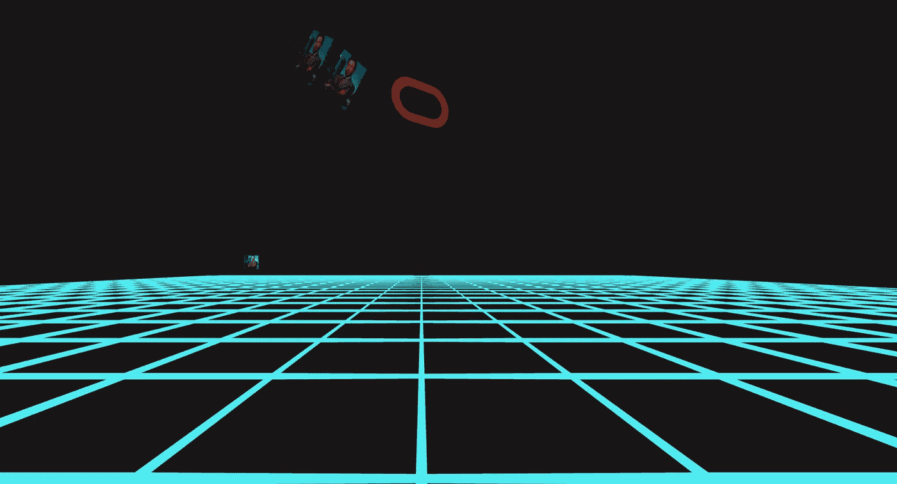
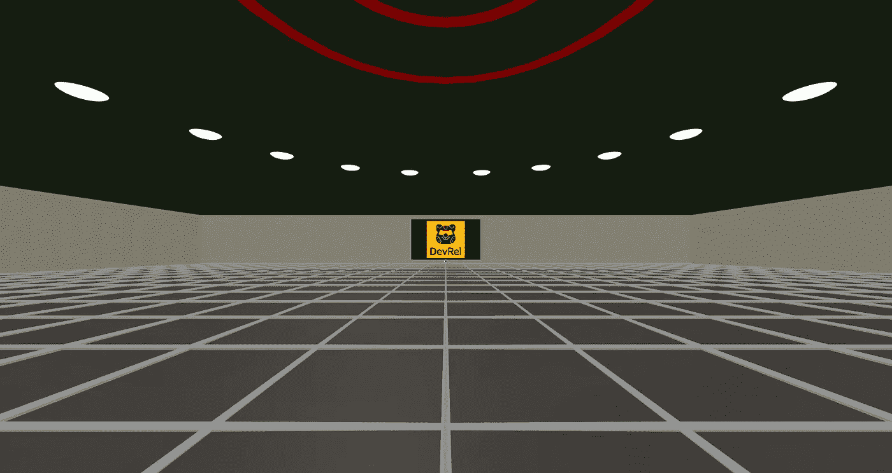
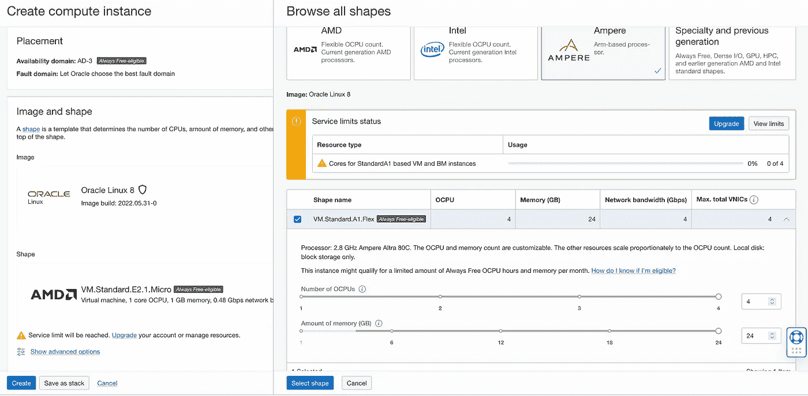
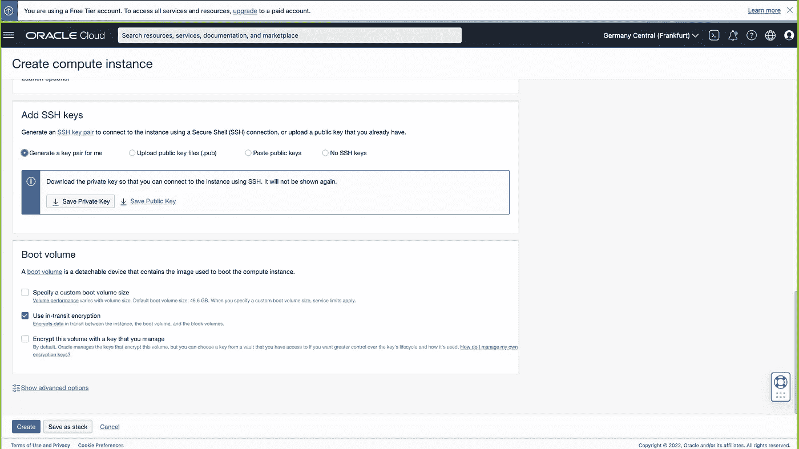

# 创日 40 周年——OCI 元宇宙室

> 原文：<https://medium.com/oracledevs/40th-anniversary-tron-day-metaverse-room-on-oci-fb24a3200fc7?source=collection_archive---------1----------------------->



**简介** 40 年前，创(Tron)，一个讲故事和 VR 的标志性庆典，在影院上映。

为了庆祝，我创建了一个存储库，教您如何运行自己的元宇宙机房，并在 Oracle 云基础架构上托管它们。

**先决条件**

在我们开始之前，先看看开源框架 [aframe.io](https://aframe.io/) 。它超级强大，它能够让你访问你能想到的几乎每个参数，这意味着你可以完成一些非常高级的东西——特别是如果你习惯使用像 [Blender](https://www.blender.org/) 这样的应用程序。



An example metaverse room

你所需要的只是一台网络服务器！不要担心，我们将向您展示如何在 OCI 上设置一个。哦，我说过它是免费的吗？

请注意，您可以在一个计算实例上运行多个房间！

**步骤 1:** 创建计算实例

为了托管我们的元宇宙房间，我们将使用 [OCI 的自由级](https://signup.cloud.oracle.com/?language=en&sourceType=:ex:tb:::::&SC=:ex:tb:::::&pcode=)账户。如果你需要帮忙设置，我的同事[写了一个教程](/oracledevs/create-an-oracle-always-free-cloud-account-bc6aa82c1397)，它将帮助你设置并运行。

您可以使用 A1 或 E2.1 shape —本教程将重点介绍 Oracle Linux 操作系统，但您也可以使用您选择的任何其他发行版(只需记住 CLI 命令会有所不同)。



确保保存或上传您的 SSH 密钥，因为您稍后需要连接到您的实例。



要通过 SSH key 连接到您的实例，在您选择的终端中使用以下命令—我使用 VS studio。

```
ssh -i /path/to/your/private/key/ username@public IP of your instance
```

顺便说一下，为了托管我们的元宇宙房间，我们将使用 OCI 的免费层帐户，包括您可以无限期使用的始终免费的云服务，以及 30 天内访问广泛的 Oracle 云服务，包括数据库、分析、计算和 Kubernetes 的容器引擎。

**步骤 2:** NGINX 网络服务器设置

Nginx 是一个很好的处理 web 服务的开源解决方案。我们将把它用作网络服务器。

在安装 NGINX 包之前检查包的更新。

```
sudo dnf update && sudo dnf upgrade
```

使用 dnf 命令安装 nginx:

```
sudo dnf install nginx
```

让我们确保 NGINX 在每次重启后都会启动。

```
sudo systemctl enable nginx
```

为了使我们的 web 服务器可以从外部访问，我们将允许在端口 80 上访问。

```
sudo firewall-cmd --zone=public --permanent --add-service=httpsudo firewall-cmd --reload
```

现在应该已经准备好从远程主机访问 Nginx 了。打开浏览器，导航到“http://YOURHOSTNAME URL ”(这是您的云机器的 IP 地址)。

如果您还没有，请接触/etc/nginx/nginx.conf 配置文件。它包含一个包罗万象的配置。

如果不是这样，添加以下内容:

```
server {listen 80 default_server;listen [::]:80 default_server;server_name _;root /usr/share/nginx/html;}
```

现在让我们将一个类似的 example.com 域的服务器块附加到 http 块上

```
server {server_name example.com;root /var/www/example.com/;access_log /var/log/nginx/example.com/access.log;error_log /var/log/nginx/example.com/error.log;}
```

**第三步:**目录设置

让我们为我们的域创建根目录:

```
sudo mkdir -p /var/www/example.com/
```

在 SELinux 的根目录上设置“httpd_sys_content_t”上下文。

```
sudo semanage fcontext -a -t httpd_sys_content_t “/var/www/example.com(/.*)?”sudo restorecon -Rv /var/www/example.com/
```

这些命令在“/var/www/example.com/”上设置“httpd_sys_content_t”上下文

请注意，您必须安装“policycoreutils-python-utils”包才能运行 restorecon 命令。

我们还需要创建日志目录:

```
sudo mkdir /var/log/nginx/example.com/
```

是时候重启 Nginx 来应用我们的配置了:

```
sudo systemctl restart nginx
```

**第四步:**验证一切正常

为了确保 example.com 服务器块按预期工作，让我们在`/var/www/example.com/folder '中添加一个虚拟文件:

```
echo “Content for example.com” > /var/www/example.com/index.html
```

使用浏览器并连接到“http://example . com”。web 服务器显示“/ var/www/example . com/index . html”文件中的示例内容。

使用浏览器并连接到“服务器的 IP 地址”。web 服务器显示了“/ usr/share/nginx/html/index . html”文件中的示例内容。

**步骤 4:** 将 TLS 添加到我们的 Nginx 服务器(可选)

如果你想给你的房间添加一个虚拟现实视图，你需要给我们的服务器添加 HTTPS 功能。

我推荐使用[*Let ' s Encrypt cert bot*](https://certbot.eff.org/)来使更新过程容易得多。

首先，我们需要启用 EPEL 存储库。

```
sudo dnf install -y [https://dl.fedoraproject.org/pub/epel/epel-release-latest-8.noarch.rpm](https://dl.fedoraproject.org/pub/epel/epel-release-latest-8.noarch.rpm)
```

之后，使用以下命令启用 PowerTools:

```
sudo dnf config-manager — set-enabled PowerTools
```

由于我们使用 Nginx 作为网络服务器，我们将下载合适的 Cerbot 版本。

```
sudo dnf install certbot python3-certbot-nginx
```

要检查 Certbot 是否安装正确，请运行以下命令:

```
certbot — version
```

从请求新证书让我们加密并填写请求的信息。

```
sudo certbot — nginx
```

为证书设置自动续订:

```
sudo echo “0 0,12 * * * root python3 -c ‘import random; import time; time.sleep(random.random() * 3600)’ && certbot renew -q” | sudo tee -a /etc/crontab > /dev/null
```

如果你卡住了，看看这个[教程](https://oracle-base.com/articles/linux/letsencrypt-free-certificates-on-oracle-linux)

**第五步。将房间模板导入您的服务器**

首先，我们需要在实例上安装 git，以便克隆存储库。

```
sudo dnf install git
```

让我们删除/var/www/example.com/文件夹中的虚拟文件:

```
cd /var/www/example.com/ && sudo rm index.html
```

从 Github 克隆我们的元宇宙房间(确保保留“.”因为我们希望在我们的文件夹中有回购的内容)。

```
sudo git clone [https://github.com/oracle-devrel/devo-tron-metaverse-room.git](https://github.com/oracle-devrel/devo-tron-metaverse-room.git) .
```

使用浏览器并连接到[https://example.com](https://example.com)查看您的元宇宙！

在甲骨文，我们拥抱开源！我们使用的 aframe.io 代码非常基础，所以可以随意改进它！你可以在这里找到灵感[https://aframe.io/aframe/examples/](https://aframe.io/aframe/examples/)

另一个伟大的灵感来源是 Blender——它是免费的，而且非常强大。如果您希望以 3D 开始您的旅程，这是一个完美的解决方案。IMHO，Blender 绝对是一个令人惊叹的套件，随着新的 3.2 版本的发布，有大量的新功能，请确保您查看它们:[https://www.blender.org/download/releases/3-2/](https://www.blender.org/download/releases/3-2/)

我鼓励你看看这个由 [Mozilla Hubs](https://hubs.mozilla.com/docs/creators-using-the-blender-gltf-exporter.html) 撰写的关于如何从 Blender 导出 glTF 文件的博客。glTF 被认为是 3D 的 jpeg 格式，它是免费的——你可以在这里找到更多关于它的细节【https://www.khronos.org/gltf/

别忘了在我们的公共休闲频道与我们分享你的作品。