# 用自治数据库构建 SPARQL 端点(使用 Tomcat 的第 1/2 部分)

> 原文：<https://medium.com/oracledevs/48fb5f33ec4a?source=collection_archive---------1----------------------->

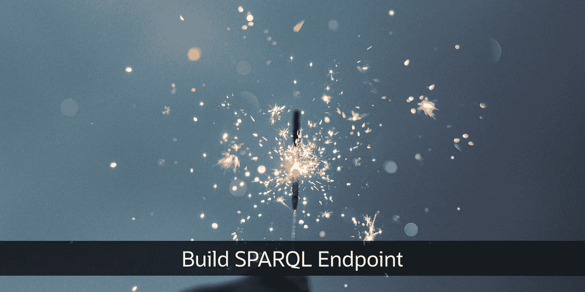

Photo by [Cristian Escobar](https://unsplash.com/@cristian1?utm_source=unsplash&utm_medium=referral&utm_content=creditCopyText) on [Unsplash](https://unsplash.com/s/photos/spark?utm_source=unsplash&utm_medium=referral&utm_content=creditCopyText)

SPARQL 是什么？资源描述框架(RDF)是在 Web 上交换数据和元数据的通用方法，SPARQL 是检索以 RDF 格式存储的数据的标准查询语言。为了发布和链接数据，许多组织都提供了 SPARQL 端点。

本文将向您展示如何在 Oracle Cloud 的 [Always Free 服务中使用 RDF 数据构建 SPARQL 端点。这是一项针对自治数据库的免费服务，没有时间限制，包括每个帐户两个数据库实例和两个计算虚拟机。](https://www.oracle.com/cloud/free/)

在我的[上一篇文章](/oracledevs/build-always-free-sparql-endpoint-part-1-2-6749daa974bd)中，我解释了如何通过在 Oracle WebLogic Server 中部署 RDF Server 来创建端点，然而，WebLogic 的生产使用需要商业许可。因此，让我展示如何使用 Apache Tomcat 来处理替代市场映像，最新版本 22.4 中提供了该映像。

这一部分描述了构建端点和执行 SPARQL 查询的快速方法，而[第 2 部分](/oracledevs/build-sparql-endpoint-with-autonomous-database-part-2-2-7c1c10f617b9)将展示如何使用这个端点。更多详情，请参见[产品文档](https://docs.oracle.com/en/database/oracle/oracle-database/21/rdfrm/using-rdf-graph-server-and-query-ui.html#GUID-DE227495-7CA9-4AC2-BB93-32069ED1E50F)。

**先决条件**

首先，做好以下准备。你需要注册一个免费的甲骨文云账户。您可以使用相同的密码。

```
- Oracle Cloud account
- 1 SSH key pair (private/public key)
- 2passwords
  - <password_1>: RDF Server admin
  - <password_2>: DB admin
```

**创建网络**

按照以下步骤浏览屏幕，创建一个网络。我们将使用向导创建基本网络配置，您可以稍后更新网络详细信息。

```
Oracle Cloud console
  > Networking
    > Virtual Cloud Networks
      > Start VCN Wizard
        > Create VCN with Internet Connectivity
          > Start VCN Wizard
```

配置项目如下。

```
- Configuration
  - VCN NAME: **VCN1**
  - The rest of the items: (Do not need to change)
```

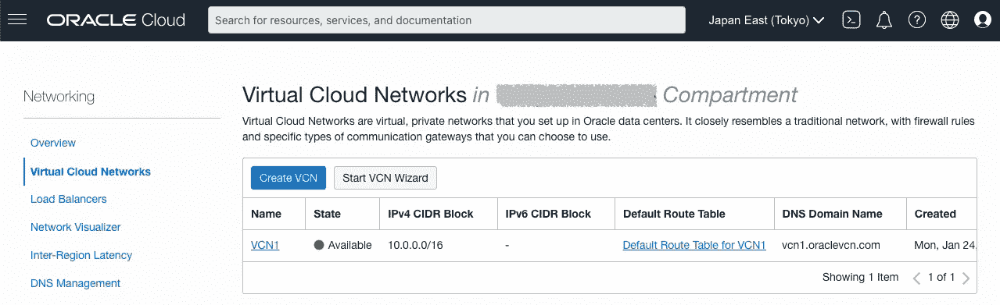

为公共子网添加新规则，使端口 4040 可以从外部访问。

```
Oracle Cloud console
  > Networking
    > Virtual Cloud Networks
      > VCN1
        > Public Subnet-VCN1
          > Default Security List for VCN1
            > Add Ingress Rules
```

配置项目如下。

```
- Add Ingress Rules
  - Source CIDR: **0.0.0.0/0**
  - Destination port range: **4040**
  - Description: **For SPARQL Endpoint**
```

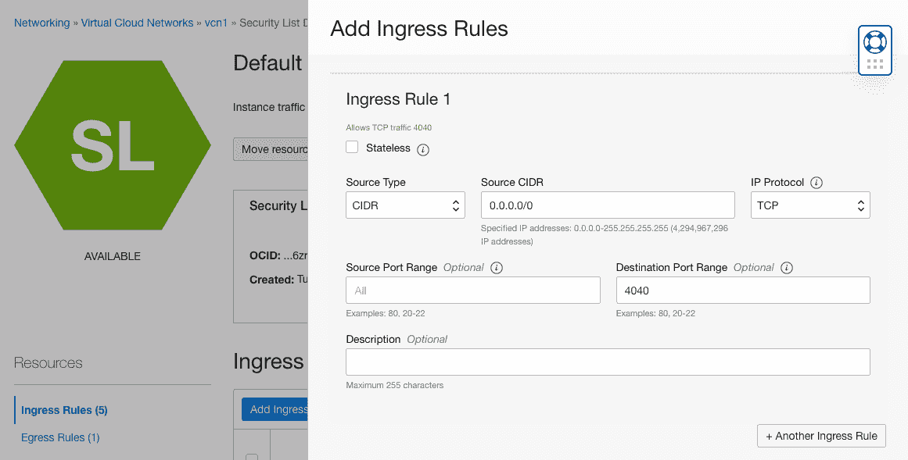

**创建一个 SPARQL 端点**

SPARQL 端点应用程序是作为一个市场映像分发的，因此按照下面的步骤启动这个映像。

```
Oracle Cloud console
  > Marketplace
    > All Applications
```

找到下图，启动堆栈。

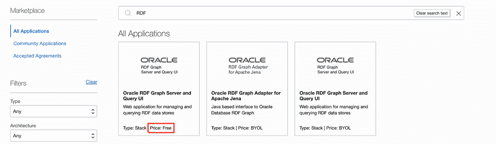

这里显示了两个名为“Oracle RDF Graph Server 和 Query UI”的图像。标有**价格:免费**的用 Tomcat，标有 **BYOL** (=自带许可证)的用 WebLogic，所以选择前者。

```
- Name: **Oracle RDF Graph Server and Query UI**
- Version: **22.4.0**
```

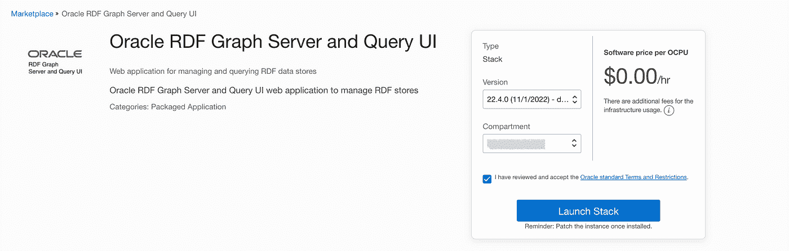

前往**发射栈**继续设置。**堆栈信息**不需要更改。在**配置变量**页面上配置以下项目。

```
- Configure Variables
  - Resource name prefix: Any name
  - OCI compartment: Your compartment
  - Server available domain: Any domain
  - Server shape: **VM.Standard.E2.1.Micro** (Always Free eligible)- Add SSH keys
  - SSH public key: Upload the public key (e.g. "ssh-rsa AAAAB3N..")- Instance Network
  - Virtual cloud network compartment: Your compartment
  - Existing virtual cloud network: The VCN created above (**VCN1**)
  - Subnet compartment: Your compartment
  - Existing subnet: The public subnet (**Public Subnet-VCN1**)- Advanced Configuration
  - Administrator User Name: **admin**
  - Administrator Password: **<password_1>**
```

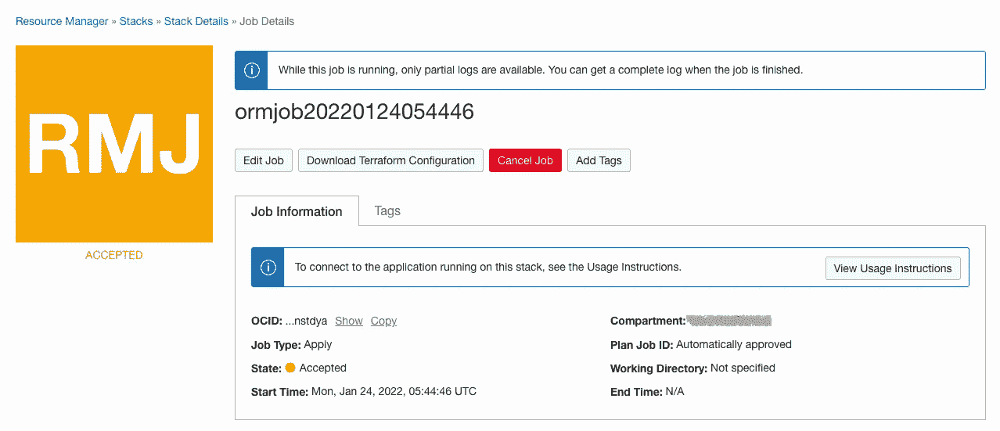

创建完成后，新创建的实例的公共 IP 地址将显示在日志部分。您也可以从“计算实例”页面检查它。

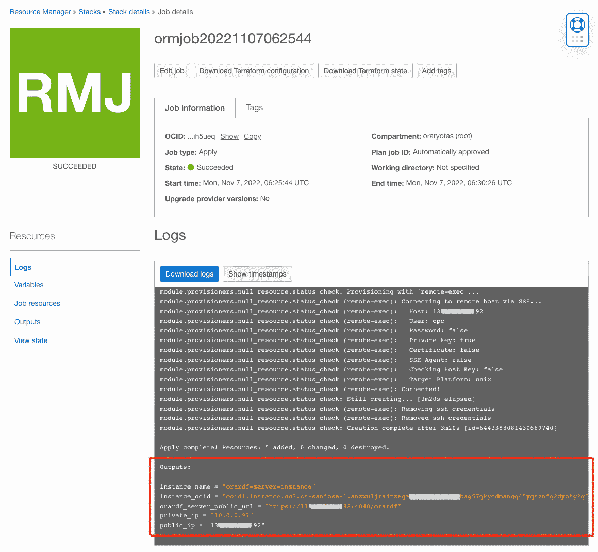

**登录 SPARQL 端点**

现在，您可以从 web 浏览器访问 SPARQL 端点。

*   https:// <ip_address>:4040/orardf</ip_address>

由于自签名证书，您将看到一条安全警告。所以你必须继续:

*   Chrome:在屏幕上输入“thisisunsafe”
*   火狐:高级>接受风险并继续

以`admin`用户身份登录。

```
- User: **admin**
- Password: **<password_1>**
```

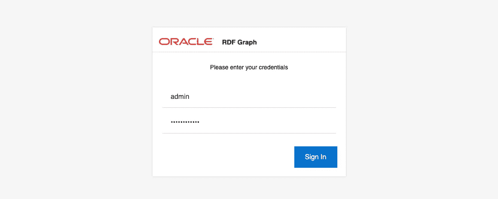

此时您将看不到数据源，因为这个端点还没有连接到自治数据库。

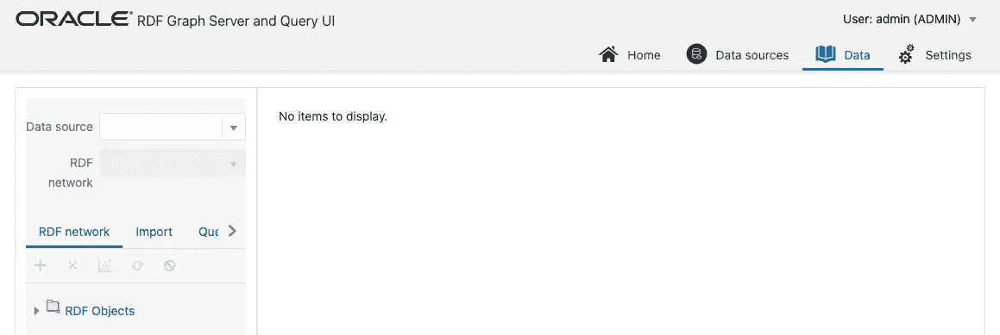

**创建数据库**

按照如下步骤浏览屏幕，创建一个数据库。这是一个完全受管理的数据库服务，称为自治数据库。

```
Oracle Cloud console
  > Oracle Database
    > Autonomous Database
      > Create Autonomous Database
```

配置项目如下。

```
- Configure the database
  - Display name: <db_name> (**ADB1**)
  - Database name: <db_name> (**ADB1**)
  - Workload type: **Data Warehouse** or **Transaction Processing**
  - Deployment type: **Shared Infrastructure**
  - Database version: **19c** or **21c**
  - Password: **<password_2>** - Choose network access: **Secure access from allowed IPs ...**
```

在这里，输入之前创建的端点服务器的 IP 地址，并保持 mTLS 选项未选中，以便端点服务器可以在没有 Oracle Wallet 设置的情况下连接到数据库。

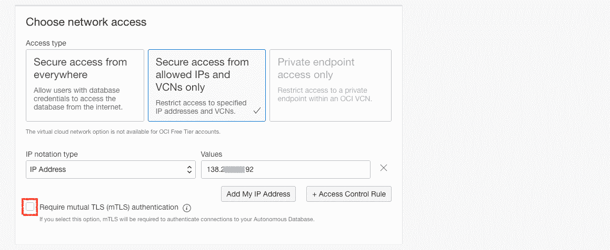

将立即创建数据库。

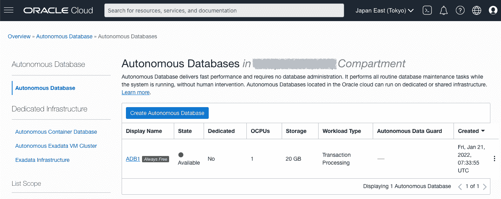

**连接到数据库**

要创建从端点服务器到数据库的连接，请从自治数据库管理屏幕中找到连接字符串。

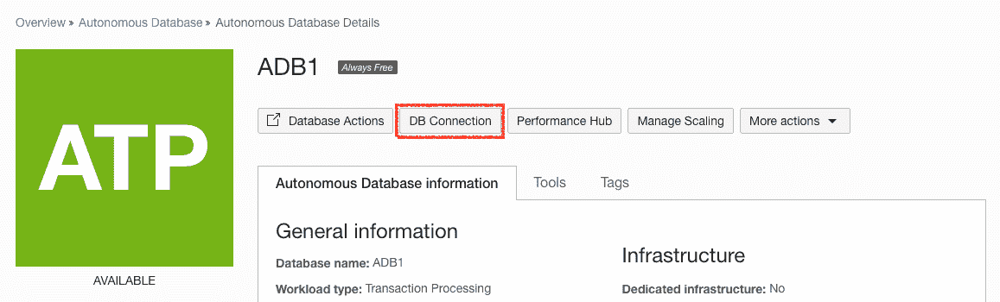

在弹出窗口的连接字符串字段中，确保将 TLS 认证切换到 **TLS** ，并复制一个列出的连接字符串(在本例中，是 adb1_medium 的连接字符串)。

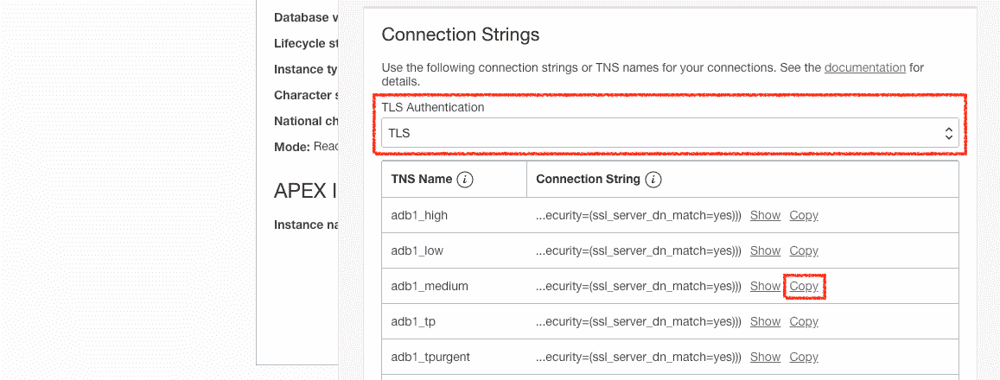

接下来，使用 SSH 客户端登录到端点服务器，并设置连接字符串。

```
$ ssh -i <private_key> opc@<ip_address>
```

首先，向 **server.xml** 添加一个全局资源。

```
$ cd /u01/app/tomcat/orardf/base/instance1/conf
$ vi server.xml
```

直接在<globalnamingresources>下添加一个<resource>元素，其中 URL 是上面复制的字符串，<password_2>是数据库管理员用户。</password_2></resource></globalnamingresources>

```
...
  <GlobalNamingResources>
      <Resource name="jdbc/ADB1" auth="Container"
                global="jdbc/ADB1"
                type="javax.sql.DataSource"
                driverClassName="oracle.jdbc.driver.OracleDriver"
                url="jdbc:oracle:thin:@(description= ... =yes)))"
                username="admin" password="<password_2>"
                maxTotal="20" maxIdle="10"
                maxWaitMillis="-1" />
...
```

接下来，将资源链接添加到 **context.xml** 中。

```
$ cd /u01/app/tomcat/orardf/base/instance1/conf
$ vi context.xml
```

在<context>的正下方添加一个<resourcelink>元素。</resourcelink></context>

```
...
<Context>
    <ResourceLink name="jdbc/ADB1"
                  global="jdbc/ADB1"
                  auth="Container"
                  type="javax.sql.DataSource" />
...
```

重新启动端点。

```
$ sudo systemctl restart tomcat_orardf
```

再次登录到端点服务器屏幕，并转到数据源选项卡以创建新的数据源。

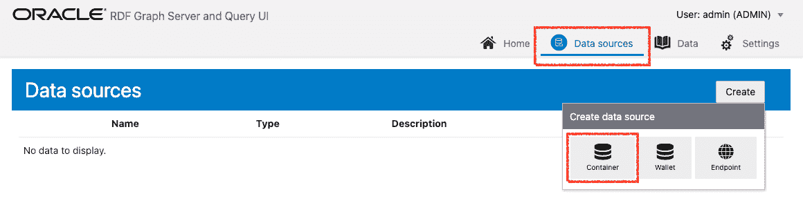

在 JNDI 名称列表中选择`jdbc/ADB1`，输入任意数据源名称(如`ADB1`)。


创建数据源后，您可以在 data 选项卡中选择它。但是，它还不包含任何 RDF 网络。

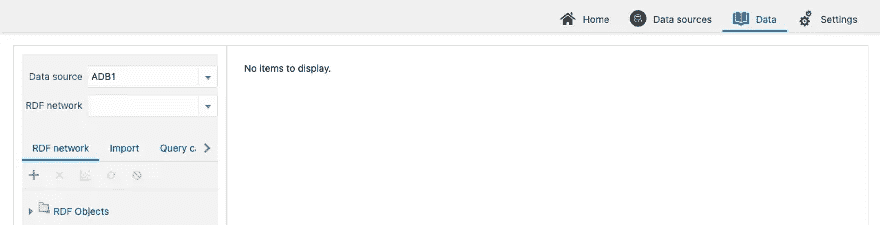

我们将在第 2 部分中创建一个 RDF 网络并上传一个样本数据集。

请从以下网址了解有关 **Oracle Graph** 的更多信息:

*   [中](/tag/oracle-graph) (=所有带有 Oracle Graph 标签的文章)
*   [堆栈溢出](https://stackoverflow.com/questions/tagged/oracle-graph) (=带有 oracle-graph 标签的问题)
*   [Slack AnDOUC](https://join.slack.com/t/andouc/shared_invite/zt-1a2hmiz6f-vLlblcQyv0t9FMraMMP5uQ) (=邀请链接，请访问#graph)
*   [Slack OracleDevRel](https://join.slack.com/t/oracledevrel/shared_invite/zt-uffjmwh3-ksmv2ii9YxSkc6IpbokL1g) (=邀请链接，请访问#oracle-db-graph)