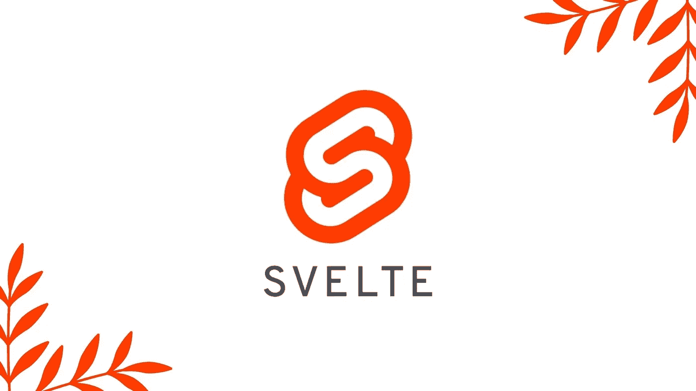
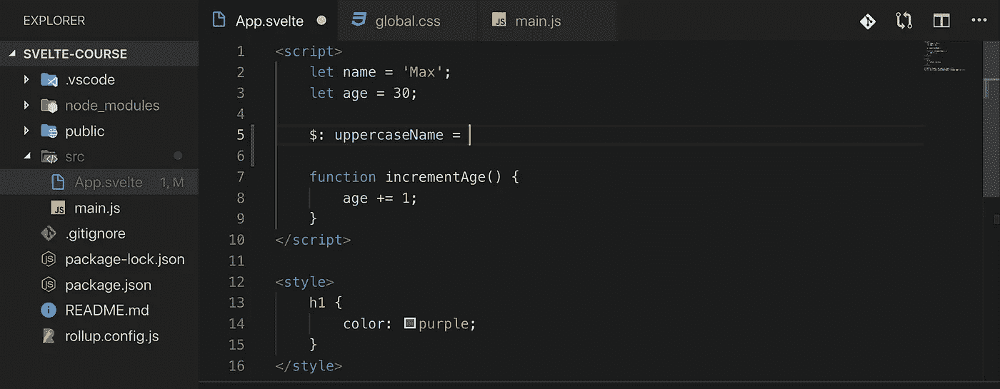
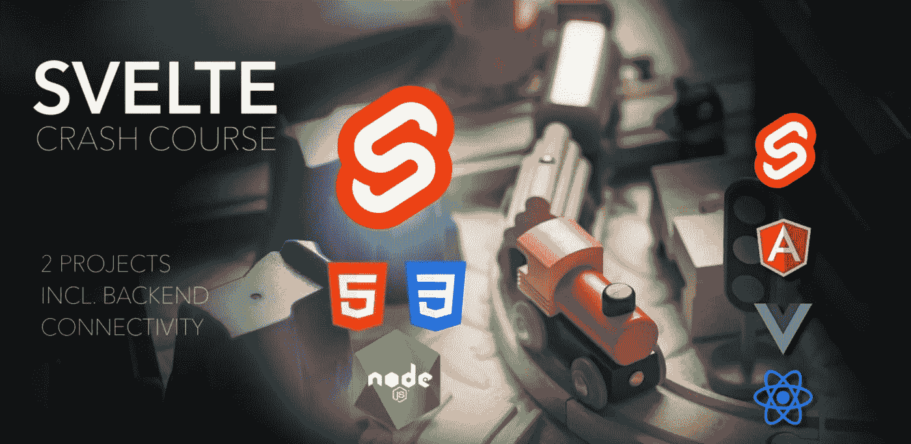
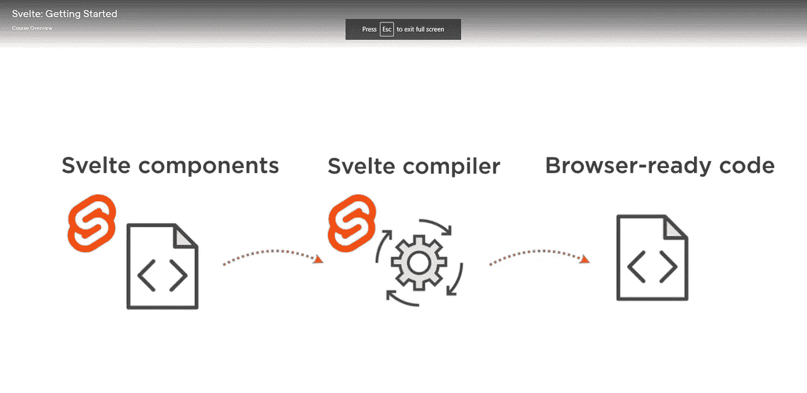
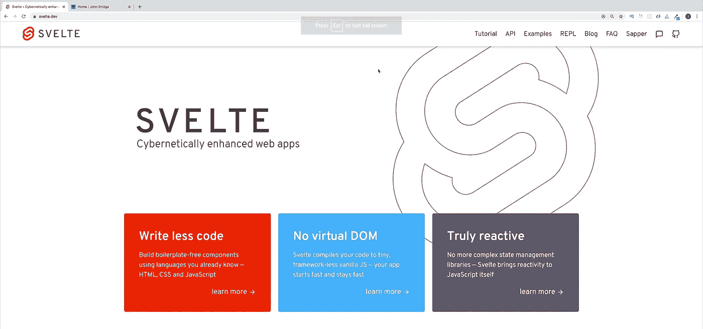

# 2022 年最适合初学者的 5 个 Svelte.js 课程

> 原文：<https://medium.com/quick-code/5-best-svelte-js-courses-for-beginners-in-2022-856ce3e3b002?source=collection_archive---------3----------------------->

## 下面是一些顶级平台为初学者提供的学习 Svelte.js 的最佳课程。

随着时间的推移， [JavaScript 框架](/quick-code/the-5-best-javascript-frameworks-of-2022-d9bf78a8b575)和库变得越来越复杂，需要越来越多的依赖。尽管如此，Svelte 利用割灌机来清除杂草，以提供一组零依赖性的核心关键功能。

Svelte.js 是一个现代的 JavaScript 编译器，它允许您编写易于理解的 JavaScript 代码，然后编译成在浏览器中运行的高效代码。但是它有什么特别之处呢？与传统的 JavaScript 框架相比，Svelte 非常快。由于其较小的尺寸和缺乏 VDOM 差异，Svelte 实现了更快的编译速度。

此外，苗条是好的，但不如[反应](/quick-code/top-10-free-courses-to-learn-react-cc6a40b9835)灵活。数据必须在真实的 DOM 结构中得到更新。然而，由于使用了真正的 DOM，Svelte 提供了比 React 更快的用户体验。因此，即使没有虚拟 dom diff，它仍然很有用。

此外，通过去除抽象，Svelte.js 生成了运行速度更快的普通 JavaScript，尤其是在移动设备上，并且还可以帮助您解决首页加载问题。学习 Svelte.js 将帮助你构建快速、现代、反应灵敏的用户界面。

## 1. [Svelte.js —完全指南(含 Sapper.js)](https://click.linksynergy.com/deeplink?id=0F1O0otUXQc&mid=47901&u1=csMedium&murl=https%3A%2F%2Fwww.udemy.com%2Fcourse%2Fsveltejs-the-complete-guide%2F)

这个由 Maximilian Schwarzüller 在 Udemy 上开设的顶级 Udemy 课程将教你如何使用 SvelteJS 构建高性能的 web 应用程序。此外，您还将了解它的工作原理、核心特性，以及如何在真实的服务器上运行您的最终应用。

在本 Svelte.js 课程中，您将学习:

*   从零开始，零知识，假设。
*   苗条身材的所有理论和实际应用。
*   构建苗条应用程序的核心概念和高级技术。

Svelte 是构建 web 应用程序的一种快速简单的方法。所以，你会从零开始学习 Svelte.js。本课程面向对编写高性能前端应用感兴趣的初学者和高级 JavaScript 学生。

在 Udemy 上学习 Svelte.js 是最好的苗条课程之一，课程评分 4.6 分满分 5.0 分，时长 12 小时 44 分钟。

## 2.[苗条:第一眼](https://linkedin-learning.pxf.io/c/1137078/646189/8005?u=https%3A%2F%2Fwww.linkedin.com%2Flearning%2Fsvelte-first-look&subId1=csMedium)

本课程由 Ray Villalobos(高级参谋讲师)主讲，将对 Svelte 进行全面介绍，讲解如何在不浪费时间的情况下开发出让你的用户满意的 app。

在本 Svelte.js 课程中，您将学习:

*   苗条是如何工作的

该课程将涵盖 Svelte 与 Angular 和 React 等流行框架的不同之处，以及如何使用样式和预处理程序，跨多个组件处理数据，以及使用生命周期方法加载数据。

是领英上唯一学习 Svelte.js 的苗条课程，课程评分 4.7 分满分 5.0 分，时长 1 小时。

## 3.[通过项目与后端连接的简单速成课程](https://click.linksynergy.com/deeplink?id=0F1O0otUXQc&mid=47901&u1=csMedium&murl=https%3A%2F%2Fwww.udemy.com%2Fcourse%2Fsvelte-crash-course-through-projects-w-backend-connections%2F)

Svelte Crash Course

本课程将教你如何应用 Svelte 的最佳实践来开发真实世界的应用程序。你将学习纤细的构造、组件交互、属性、事件、处理程序、消息等。你所需要的只是对 HTML 和 CSS 的基本理解以及一点点 JavaScript。为了帮助你，我已经整理了一份 [JavaScript 教程](https://coursesity.com/blog/free-javascript-courses/)的清单，可以免费学习 JavaScript。

在本 Svelte.js 课程中，您将学习:

*   了解为什么编译前端代码是一个好主意。
*   学习苗条的结构，组件，信息和事件，以及更多。
*   了解如何利用商场和最佳实践。
*   了解如何正确地连接到后端苗条。

完成本课程后，您将深入了解 Svelte 的理念，并能够更深入地研究您的用例。对 Svelte 的理解将使你能够独立地学习，并理解官方文档。

在 Udemy 上学习 Svelte.js 是最好的苗条课程之一，课程评分 4.8 分满分 5.0 分，时长 2 小时。

## 4.[苗条:入门](https://pluralsight.pxf.io/c/1137078/424552/7490?u=https%3A%2F%2Fwww.pluralsight.com%2Fcourses%2Fsvelte-getting-started&subId1=csMedium)

本课程将向您介绍 Svelte，一个 JavaScript UI 框架。您将学习如何使用 Svelte 开发 web 应用程序，这是一个有趣的 JavaScript UI 框架。首先，您将设置 UI 布局。

Svelte.js 课程的主题包括:

*   了解苗条的价值主张
*   设置为编写苗条的代码
*   构建您的第一个细长组件
*   为苗条的用户界面增加交互性
*   将表单绑定到数据
*   准备建造

接下来，您将学习如何让您的设计具有交互性。最后，您将学习如何绑定动态数据。完成本课程后，一旦你获得了技能和知识，你将能够独立使用苗条。

Svelte Basics

在 Pluralsight 上学习 Svelte.js 是最好的 Svelte 课程之一，课程评分 4.4 分满分 5.0 分，时长 1 小时 37 分钟。

## 5.[苗条教程和项目课程](https://click.linksynergy.com/deeplink?id=0F1O0otUXQc&mid=47901&u1=csMedium&murl=https%3A%2F%2Fwww.udemy.com%2Fcourse%2Fsvelte-tutorial-and-projects-course%2F)

Svelte Tutorial

既然你已经学会了苗条身材的基础，是时候运用它们了。这个基于项目的课程将教你如何用 Svelte 快速创建应用程序。

在这个简单的课程中，你将学到:

*   创建速度惊人的应用程序

这门课程将由两部分组成。第一节重点介绍基本的 Svelte 知识，我们的第二节介绍 Svelte 融入 Razor 的电商项目。

在 Udemy 上学习 Svelte.js 是最好的苗条课程之一，课程评分 4.6 分满分 5.0 分，时长 12 小时 44 分钟。

## 6.[初学者苗条教程](https://www.youtube.com/watch?v=zojEMeQGGHs&list=PL4cUxeGkcC9hlbrVO_2QFVqVPhlZmz7tO)——【YouTube】

这个来自[网络忍者](https://www.youtube.com/c/TheNetNinja)的苗条教程将帮助你完全免费地学习苗条。这个简单的演练涵盖了从设置应用程序到补间动画和动画的所有内容。

> 感谢您阅读这篇关于最佳瘦身课程的文章。希望这篇帖子能帮助你高效学习 Svelte。以下是一些你可能会觉得有用的帖子:

 [## 初学者学习 React 的 10 个最佳 React 课程

### 在最知名的 Javascript 库中，React 是最受欢迎的一个。它是一个开源的前端…

medium.com](/quick-code/10-best-react-courses-to-learn-reactjs-online-36dd0e3d3b68)  [## 5 门免费在线课程，供初学者学习 Vue JS

### 众所周知，谈到 JavaScript 框架，有两个名字一直排在最前面——node . js 和 React…

medium.com](/quick-code/5-free-online-courses-for-beginners-to-learn-vue-js-86103aaeb2b)  [## 在线学习 Node.js 的 8 门免费课程

### 下面是我列出的供初学者学习 Node.js 的顶级免费 Node.js 课程

medium.com](/quick-code/8-free-online-courses-to-learn-node-js-6dc7b63543c7)  [## 2022 年 React 开发者的 7 门最佳 Next.js 课程

### Next.js 是一个越来越受欢迎的框架，它允许 React 开发人员创建服务器端呈现的应用程序…

medium.com](/quick-code/7-best-next-js-courses-for-react-developers-2b5c9ad86ff6)