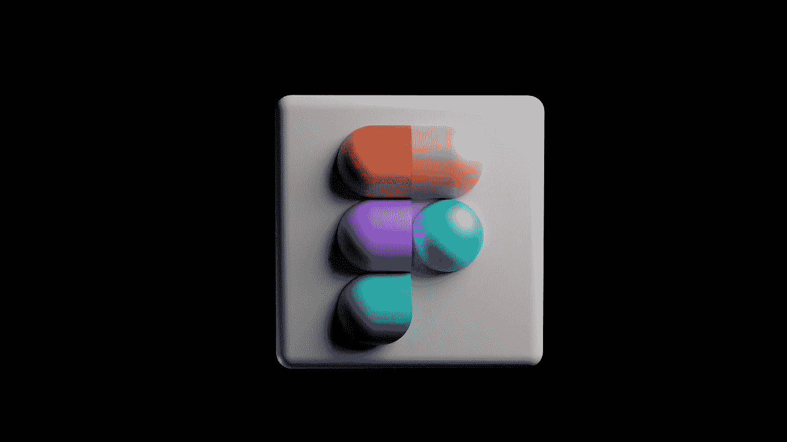

# 面向初学者的 5 门免费 Figma 课程—在线学习 Figma

> 原文：<https://medium.com/quick-code/5-free-figma-courses-for-beginners-learn-figma-online-326b997bb793?source=collection_archive---------0----------------------->

## 以下是我列出的 5 个免费 Figma 课程&来自 Udemy、Coursera、YouTube 等顶级平台的初学者教程。

Photo by [GuerrillaBuzz Crypto PR](http://guerrillabuzz.com/) on [Unsplash](https://unsplash.com?utm_source=medium&utm_medium=referral)

嘿伙计们！众所周知，如果你想在用户界面和用户体验设计方面迈出第一步，Figma 是一门必学的课程。这些技能对于为你的公司建立一个令人印象深刻的投资组合是必不可少的。除了夺取 Sketch 和 Adobe XD 的份额，Figma 还提供了广泛的功能。

Figma 非常容易使用。你所需要做的就是创建一个帐户并开始开发。此外，Figma 并不难学，因为它包含了您已经知道的大多数工具。因此，拥有 Figma 将有助于你从设计开始职业生涯。

为了您的方便，我为初学者整理了一份免费的 Figma 课程列表，以帮助您入门。所以，事不宜迟，我们开始吧。

## 1.UI/UX 设计-Figma—【Udemy】

当你用创造性的方法做你最喜欢的事情时，Figma 让你的设计变得有趣而简单。本课程教你如何使用 Figma 设计界面。在本课程中，您将找到一些有价值的资源/链接，引导您了解一个不断变化的世界。

在本 Figma 教程中，您将:

*   对线框/原型制作有基本的了解。
*   学习基本的设计基础。
*   设计并连接应用程序的登录屏幕、欢迎界面和注册界面。
*   了解从哪里获得好的资源。

本课程旨在教你如何使用形状(组件)和工具创建令人惊叹的用户界面。此外，它将涵盖一些基本的设计原则。

这是 Udemy 上最好的免费 Figma 课程，在 5 门课程中获得 4.2 分，时长 2 小时。请记住，由于这是一门免费的 Udemy 课程，所以完成后您不会获得证书。

## 2.[在 Figma](https://coursera.pxf.io/c/1137078/1213622/14726?u=https%3A%2F%2Fwww.coursera.org%2Flearn%2Fhigh-fidelity-designs-prototype&subId1=csMedium) 中创建高保真设计和原型

在本课程中，你将掌握申请用户体验(UX)设计领域入门级工作所需的技能。这门课程将教你如何使用最流行的设计工具 Figma 来创建名为**模型**的高保真设计。

在本 Figma 教程中，您将:

*   在设计工具 Figma 中构建实体模型和高保真原型。
*   定义和应用常见的视觉设计元素和原则。
*   展示设计系统如何组织、标准化和增强设计。
*   在迭代设计时，理解设计评论会议和反馈的作用。

在下一步中，您将创建一个交互式原型，其工作方式就像成品一样。在你的研究过程中，你将收集对你的设计的反馈，以便你可以做出改进。最后，您将学习如何在您的专业作品集中展示您的 UX 作品，并与开发团队分享您的创作。

这是 Coursera 上排名第一的免费 Figma 课程，5 门课程中有 4.8 门，时长 39 小时。旁听这个课程是免费的，但是付费会给你更多的好处。

## 3.[为 UI UX 设计学习 Figma(带设计项目)](https://click.linksynergy.com/deeplink?id=0F1O0otUXQc&mid=479017&u1=csMedium&murl=https%3A%2F%2Fwww.udemy.com%2Fcourse%2Flearn-figma-ui-ux-design-project%2F)—【Udemy】

本课程将帮助您学习如何使用 Figma 设计两个 iOS 屏幕。无论你是一个使用 Figma 的初学者，还是只是想通过实际做一个设计项目来学习基础知识，这个课程都会让你受益。

在本 Figma 教程中，您将学习:

*   Figma 基础与高级原理。
*   如何使用图标库进行 UI 设计？
*   专业设计工作流程
*   iOS 设计最佳实践
*   如何在 Figma 中设计一个基础的手机 App？

这是 Udemy 上排名第一的免费 Figma 课程，在 5 门课程中获得 4.3 分，时长 33 分钟。请记住，由于这是一门免费的 Udemy 课程，所以完成后您不会获得证书。

## 4. [Figma UI 设计教程:24 分钟入门](https://www.youtube.com/watch?v=FTFaQWZBqQ8)——【YouTube】

有兴趣学习 Figma，但不知道从哪里开始？使用这个循序渐进的教程，你将在 24 分钟内学会在 Figma 中开始设计应用程序和网站所需的所有基础知识。

本 Figma 初学者教程由用户体验设计师 **Amr** 指导，他带你浏览 Figma 的界面、工具和原则，帮助你开始掌握它。记住，想学基础，最好是抄袭其他设计。

本 Figma 教程的主题包括:

*   使用 Figma 的优势
*   如何登录 figma.com
*   为什么你应该从教程开始复制其他设计
*   如何从模板开始项目
*   界面概述
*   创建一个框架
*   形状和颜色创作
*   拐角半径调整
*   创建一个圆圈
*   如何使用图标
*   如何粘贴图像
*   如何使用文本
*   按钮用户界面

## 5.使用 Figma 重新设计亚马逊应用程序

用户体验通常会区分好的和坏的应用程序设计。本课程将教你如何从头开始构建亚马逊应用的线框和原型。

在本 Figma 教程中，您将学习:

*   设计
*   实体模型
*   样机研究
*   应用设计

这是 Udemy 上排名第一的免费 Figma 课程，5 门课程中有 3.9 分，时长 53 分钟。请记住，由于这是一门免费的 Udemy 课程，所以完成后您不会获得证书。

感谢您阅读这篇关于免费 Figma 课程的文章！如果你觉得这篇文章有帮助，请在评论中告诉我。此外，这里还有一些帖子，你可能会觉得有用:

 [## 学习围棋编程的 5 门免费 Golang 课程

### 各位程序员和开发者好！您对免费 Golang 课程的搜索到此结束。在这篇文章中，我将分享…

medium.com](/quick-code/5-free-golang-courses-to-learn-go-programming-5dd95c4baddb)  [## 面向 Java 程序员的 6 门免费 Spring Boot 课程

### 这些免费课程将教你所有你需要知道的关于流行的 Java 框架 Spring Boot 的知识。

medium.com](/quick-code/5-free-spring-boot-courses-for-java-programmers-369981c93c4a)  [## 7 门面向初学者的免费打字课程

### 以下是我在 Udemy、Codecademy、Pluralsight 等网站上的免费打字稿课程的首选。

medium.com](/quick-code/7-free-typescript-courses-for-beginners-da0423ab5943)