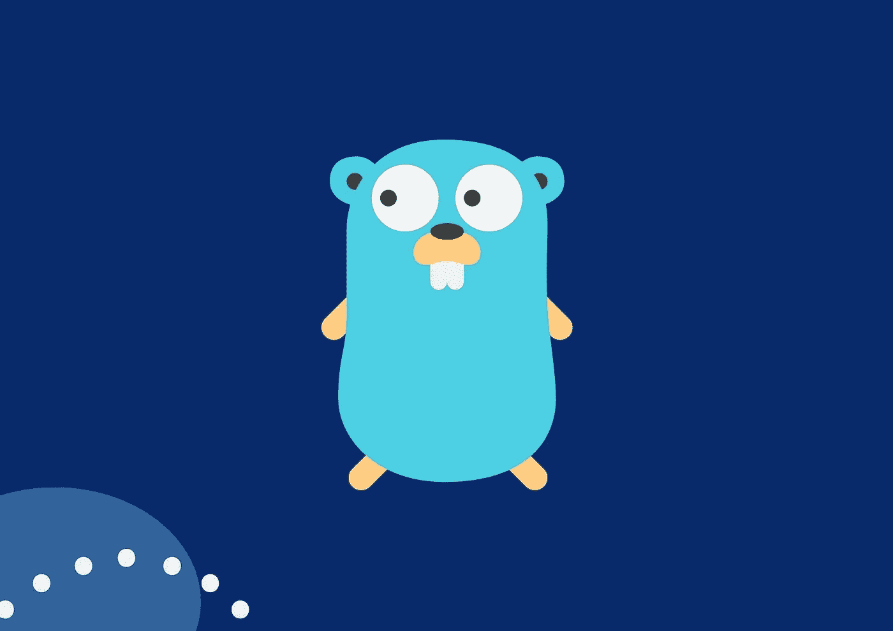
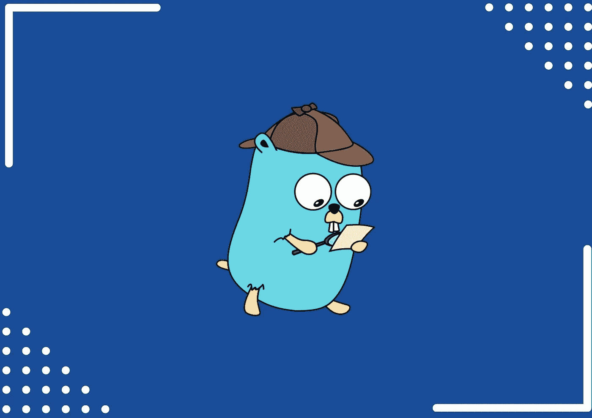

# 学习围棋编程的 5 门免费 Golang 课程

> 原文：<https://medium.com/quick-code/5-free-golang-courses-to-learn-go-programming-5dd95c4baddb?source=collection_archive---------0----------------------->

Free Go Programming Tutorials

各位程序员和开发者好！您对免费 Golang 课程的搜索到此结束。在这篇文章中，我将分享一些顶级的免费 Golang 课程，供初学者学习 Go 编程。所以，如果你是不想投资付费教程来学习围棋的人，这篇文章就是为你准备的！但在此之前，如果你想投资付费课程，为你提供更好的价值，我已经策划了这份清单，列出了最好的高尔夫课程，你可以查看一下。现在，我们来谈谈 Golang 是什么。

Golang，俗称 Go，是一种开源编程语言，由 Rob Pike、Robert Griesemer 和 Ken Thompson 于 2007 年在 Google 开发。它是一种程序性的、编译时的、静态类型的编程语言，由 Google 设计用来解决 Google 在大规模开发软件时遇到的问题。它直接编译成机器代码，不需要解释器，这使它成为一种令人满意的高效语言。

自从谷歌在 2009 年推出围棋以来，得益于谷歌、网飞、优步等公司的帮助，围棋获得了发展。，这些公司已经使用这种语言扩展了他们的产品，实现了高性能商业怪兽的性能。许多开发人员喜欢这种编程语言的特性，比如结构化类型和垃圾收集。

# 学习围棋编程的免费 Golang 课程

请记住，这些免费的 Golang 课程可能会在未来再次变成付费课程，所以请将它们放在您的列表中，以避免以后为它们付费。事不宜迟，我们走吧！

## 1.[get going:Golang 简介](https://click.linksynergy.com/deeplink?id=0F1O0otUXQc&mid=47901&u1=csMedium&murl=https%3A%2F%2Fwww.udemy.com%2Fcourse%2Fgetgoing%2F)【Udemy】

Learn Go

Udemy 上的这门 Golang 课程是初学者学习围棋编程的顶级免费课程。它将为您提供 Go 如何工作的概述。在本课程中，您将了解 GOPATH 和 Go 文件结构、数据类型、接口、结构和指针、控制语句、并发性、并行性、Goroutines 等等。

在本 Golang 课程中，您将学习:

*   戈朗
*   后端开发
*   软件语言
*   主办；主持
*   程序设计语言
*   去
*   谷佛

这是 Udemy 上的顶级免费围棋编程课程，在 5 门课程中获得 4.1 分，时长 3 小时 24 分钟。此外，请记住，由于这是一门免费的 Udemy 课程，所以完成后您不会获得证书。

## 2.[围棋入门](https://coursera.pxf.io/c/1137078/1213622/14726?u=https%3A%2F%2Fwww.coursera.org%2Flearn%2Fgolang-getting-started&subId1=csMedium)【Coursera】

加州大学欧文分校的 Golang 课程将向您介绍世界上最受欢迎的开源编程语言之一——Go，最初由 Google 开发，并由社区继续增强。

本 Golang 课程的主题包括:

*   Go 基础
*   基本数据类型
*   复合数据类型
*   协议和格式

该课程涵盖了具有 C、Python 或 Java 经验的编程专业人员的 Go 基础知识。涵盖的主题有数据类型、协议、格式、RFC 和 JSON 编码。此外，你将有机会编写围棋程序，并从他人那里获得反馈。一旦你完成这门课程，你将能够构建简单的围棋程序，为更高级的学习做准备。

这是 Coursera 上排名最高的免费围棋编程课程，在 5 门课程中获得 4.6 分，持续时间为 11 小时。因为这是一门免费的 Coursera 课程，所以完成后你还会得到一个证书。

## 3.[学围棋](https://www.pjatr.com/t/TUJGR0lLR0JHR0pMSUtCR0ZISk1N?sid=csMedium&url=https%3A%2F%2Fwww.codecademy.com%2Flearn%2Flearn-go)【代码学院】

Codecademy 的免费 Golang 课程将教你如何使用 Go (Golang)，这是一种由谷歌支持的开源编程语言。您将学习如何使用变量在 Go 中创建和存储值，如何使用 Go 的 fmt 包打印和扫描数据，在 Go 中实现条件和函数，等等。

在本 Golang 课程中，我们将涵盖:

*   设置 Go 环境并创建 Go 文件。
*   数据类型和变量
*   条件语句
*   在 Go 中使用函数

这是 Codecademy 上的顶级免费围棋编程课程，持续时间为 10 小时。此外，请记住，除非您拥有 Codecademy 的专业会员资格，否则您不会获得结业证书。

## 4.[围棋中的并发](https://coursera.pxf.io/c/1137078/1213622/14726?u=https%3A%2F%2Fwww.coursera.org%2Flearn%2Fgolang-concurrency&subId1=csMedium)【Coursera】

这门 Golang 课程将帮助你学习如何在 Go 中实现并发编程。此外，它将帮助学习者探索通道和 goroutines 在实现并发性中的作用。此外，您将通过开发几个程序作为示例，在课程活动中练习 Go 的并发编程能力。

Concurrency in Go

本 Golang 课程的主题包括:

*   为什么要使用并发？
*   并发基础
*   GO 中的线程
*   同步通信

这是 Coursera 上排名第一的免费围棋编程课程，在 5 门课程中获得 4.7 分，时长 9 小时。因为这是一门免费的 Coursera 课程，所以完成后你还会得到一个证书。

## 5.[学习围棋:循环、数组、映射和结构](https://www.pjatr.com/t/TUJGR0lLR0JHR0pMSUtCR0ZISk1N?sid=csMedium&url=https%3A%2F%2Fwww.codecademy.com%2Flearn%2Flearn-go-loops-arrays-maps-and-structs)

在本课程中，您将学习更多关于 Go 的基础知识，包括控制流(如循环)和更复杂的数据类型(如数组、映射和结构)。此外，在这门 Golang 课程中，您将学习如何组织数组中的数据，使用映射来关联数据，以及创建组织数据的结构。

在本 Golang 课程中，我们将涵盖:

*   环
*   数组
*   地图
*   结构

这是 Codecademy 上的顶级免费围棋编程课程，持续时间为 8 小时。此外，请记住，除非您拥有 Codecademy 的专业会员资格，否则您不会获得结业证书。

## 6.[学习围棋编程— Golang 初学者教程](https://www.youtube.com/watch?v=YS4e4q9oBaU)【FreeCodeCamp—YouTube】

这篇来自 FreeCodeCamp 的 Golang 教程将帮助你在这个面向初学者的循序渐进的教程中学习 Go 编程语言。他们还在传记中提供了时间戳，允许你继续学习你想学的主题，如变量、原语、常量、数组和切片等。此外，讲师以引人入胜、清晰简洁的方式解释概念。

感谢您阅读这篇关于免费 Golang 课程的文章！如果你觉得这篇文章有帮助，请在评论中告诉我。还有，你更喜欢哪个，免费的还是付费的？

这里有更多的主题供您阅读:

 [## 面向初学者的 10 门免费 Java 课程[2022 年 8 月]——在线学习 Java

### 这里有一些免费的 java 课程，可以帮助你开始成为 Java 开发人员的旅程。

medium.com](/quick-code/10-free-java-courses-for-beginners-2022-aug-learn-java-online-e8bd09f923eb)  [## 10 门免费 Django 课程，供初学者学习 Django [2022 年 8 月]

### 众所周知，Python 是当今最流行的编程语言之一，Django 使 web 开发…

medium.com](/quick-code/10-free-django-courses-for-beginners-to-learn-django-ce2d598957a)  [## 五大热门 Web3 开发技能

### 遵循这五个技巧来学习如何成为一名 Web3 开发者

medium.com](/geekculture/5-web3-developer-skills-you-should-learn-a210b9f30604)