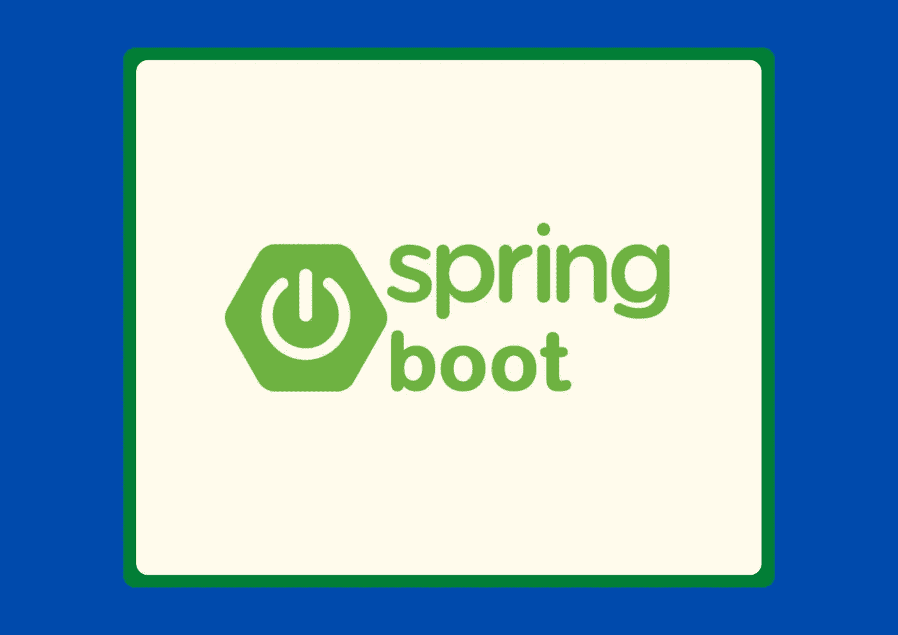
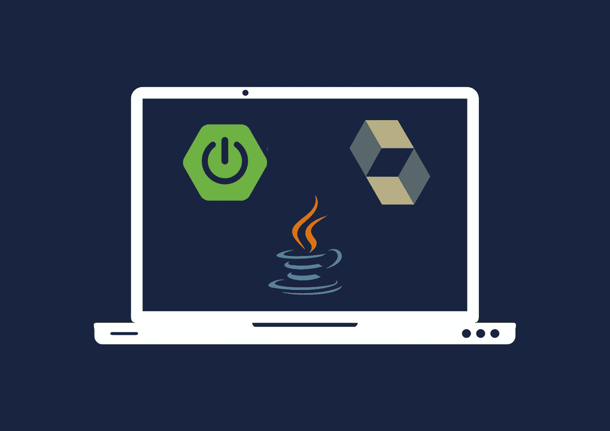
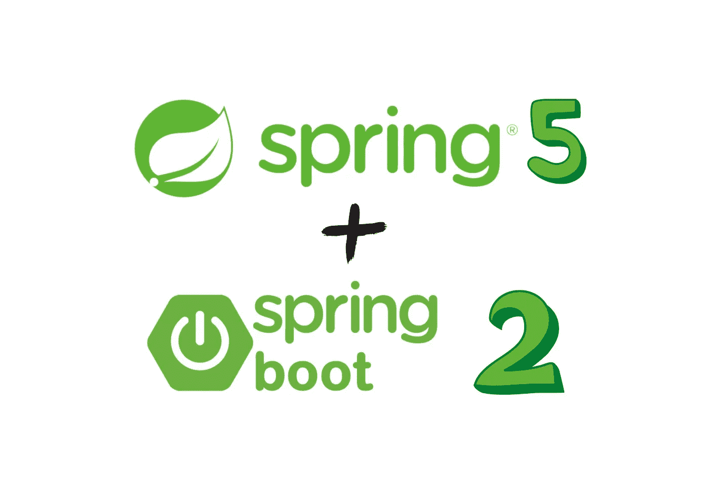

# 面向 Java 程序员的 6 门免费 Spring Boot 课程

> 原文：<https://medium.com/quick-code/5-free-spring-boot-courses-for-java-programmers-369981c93c4a?source=collection_archive---------1----------------------->

## 这些免费课程将教你所有你需要知道的关于流行的 Java 框架 Spring Boot 的知识。

Master Spring Boot

在过去的十年中，Spring 已经成为 Java 开发人员最流行的框架之一。同样，Spring Boot 是一个轻量级版本的微服务 Spring 框架。它不仅仅是一个框架，而是一个具有许多集成工具的平台，支持多个行业用例，如 Spring Batch 和 Spring Integration。这是一个直观且易于配置的下一代框架。

因此，我在这里分享几个最有用的免费春季课程。如果你对支付 Spring Boot 教程不感兴趣，这篇文章将帮助你学习。所以，事不宜迟，让我们开始吧！

# 面向 Java 程序员的免费 Spring Boot 课程

请记住，这些免费的 Spring Boot 课程可能会在未来再次变成付费课程，所以把它们放在你的清单上，以避免以后为它们付费。事不宜迟，我们走吧！

## 1.Spring Boot Restful Web 服务教程—【Udemy】

Learn Spring Boot

Spring Boot 允许开发者快速轻松地创建基于 Spring 的应用程序。使用 Spring Boot，开发人员可以快速创建基于 Spring 的应用程序，而无需反复编写样板代码。

在本 Spring Boot 课程中，您将:

*   了解如何使用 Spring Boot 构建 RESTful web 服务。
*   了解如何在 Spring boot 应用程序中实现三层架构(控制器、服务和存储库)。
*   了解如何将 Spring boot 应用程序连接到 MySQL 数据库。
*   了解如何使用 Lombok 库来减少样板代码。
*   了解 Spring Data JPA 如何在 Spring Boot 应用程序中工作。

总之，Spring Boot 是 Spring 框架的扩展，它消除了设置 Spring 应用程序所需的所有样板配置。本课程将帮助您学习如何使用 Spring Boot、Spring Data JPA (Hibernate)和 MySQL 为员工管理项目开发 REST APIs。

这是 Udemy 上的顶级免费春训课程，5 门课程中有 4.4 门，时长 1 小时 51 分钟。此外，请记住，由于这是一门免费的 Udemy 课程，所以完成后您不会获得证书。

## 2.[用 Spring Boot 和 Spring Cloud 构建可扩展的 Java 微服务](https://coursera.pxf.io/c/1137078/1213622/14726?u=https%3A%2F%2Fwww.coursera.org%2Flearn%2Fgoogle-cloud-java-spring&subId1=csMedium)——【Coursera】

微服务是形成软件设计模式的松散耦合的服务。它们是细粒度的，可以独立扩展和维护。微服务强调弹性扩展和按需资源，是公共云环境的理想选择。本课程教你如何使用 Spring Boot 和 Spring Cloud 在 Google Cloud 上开发 Java 应用。

在本次春季入门课程中，您将:

*   学习在 Google Cloud 上使用 Spring Boot 和 Spring Cloud 构建 Java 应用程序。
*   通过发布/订阅和 Spring 集成来发送和接收消息。
*   了解如何从 Cloud SQL 迁移到 Cloud Spanner，作为 Java 应用程序的托管关系数据库。
*   使用 Google Cloud 的操作套件跟踪和调试 Spring 应用程序。

在整个课程中，您将使用 Spring Cloud Config 来管理应用程序配置。您将通过发布/订阅和 Spring 集成来发送和接收消息。此外，您将了解如何为您的 Java 应用程序使用 Cloud SQL，这是 Google Cloud 的全球分布的强一致性数据库，以及如何迁移到 Cloud Spanner。此外，您将学习如何使用 Google Cloud 的 operations suite 调试和跟踪您的 Spring 应用程序。

这是 Coursera 上排名第一的免费春季课程，5 门课程中有 4.3 分，持续时间为 13 小时。由于这是一门免费的 Coursera 课程，完成后您将获得一份证书。

## 3.[Spring Boot 2 和 Spring 框架 5 简介](https://click.linksynergy.com/deeplink?id=0F1O0otUXQc&mid=47901&u1=csMedium&murl=https%3A%2F%2Fwww.udemy.com%2Fcourse%2Fintroduction-to-spring-boot-2-and-spring-framework-5%2F)——【Udemy】

Learn Spring

Udemy 的这个免费的 Spring boot 课程将帮助你了解 Spring Boot 2 和 Spring Framework 5。这个课程非常适合初来 Spring Boot 的人！它解释了如何使用 Spring Boot 2.0 快速轻松地构建 web 应用程序。使用 Spring 初始化器，您将创建您的初始 Spring Boot 项目。

在本 Spring Boot 课程中，您将:

*   了解如何创建 Spring Boot Web 应用程序。
*   创建一个新的 Spring Boot 项目。
*   用 Spring Data JPA 存储和检索数据。
*   使用百里香将数据库中的数据显示到网页上。

之后，在这个春季引导课程中，您将使用 Hibernate 创建 JPA 实体来持久化数据库。使用 Spring Boot 和 Spring Data JPA，您将看到如何配置内存中的 H2 数据库和初始化数据。最后，您将看到如何使用 Spring MVC 和 Thymeleaf 模板在 web 页面上显示数据库中的数据。

这是 Udemy 上的顶级免费春训课程，5 门课程中有 4.4 门，时长 2 小时 18 分钟。此外，请记住，由于这是一门免费的 Udemy 课程，所以完成后您不会获得证书。

## 4.春天 MVC，Spring Boot 和休息控制器——【Coursera】

希望使用著名的 Spring MVC 和 Spring Boot 框架开发基于 Java 的 Web 应用程序和 Restful 微服务的学生将从本课程中受益。作为课程的一部分，学生将使用各种 URL 模板创建服务，使用 json 或 XML 有效负载进行消费和响应，并创建自定义 HTTP 头。

这些服务将支持 Java 和 Angular JS 客户机，以展示它们在分布式系统中的可重用性。我们还将讨论使用模型视图控制器(MVC)架构来呈现网页的传统 web 应用程序。本动手课程包括几个实验来说明关键概念。

春季引导课程的主题包括:

*   Spring MVC、SpringBoot 和 RestControllers
*   请求参数
*   控制器

这是 Coursera 上排名第一的免费春季课程，5 门课程中有 4.3 分，持续时间为 12 小时。由于这是一门免费的 Coursera 课程，完成后您将获得一份证书。

## 5.[面向初学者的 Spring 框架和依赖注入](https://click.linksynergy.com/deeplink?id=0F1O0otUXQc&mid=47901&u1=csMedium&murl=https%3A%2F%2Fwww.udemy.com%2Fcourse%2Fspring-framework-video-tutorial%2F)——【Udemy】

这个课程非常适合刚接触 Spring 框架或 Spring，但过去从未配置过 Java 的初学者。现实世界中的开发人员只需要知道 Spring Framework 的依赖注入框架的一些关键特性。这些是您需要知道的一些事情，以便立即开始创建真实世界的应用程序。

在春季课程中，您将:

*   快速开始使用 spring 应用程序。
*   有效地使用 Java 和基于注释的依赖注入。
*   为不同的环境配置自定义外部属性和 beans。
*   使用 Spring Boot 以正确的方式发送 SMTP 电子邮件。
*   满怀信心地进一步学习 Spring。

在这个循序渐进的视频教程中，我们首先要学习如何快速创建一个 Spring 应用程序。本课程将教你使用 Java 和基于注释的配置的 Spring 的依赖注入(IoC)特性的基础。这项技能在任何 Spring 框架课程中都是无价的。

这是 Udemy 上的顶级免费春训课程，5 门课程中有 4.4 门，时长 1 小时 24 分钟。此外，请记住，由于这是一门免费的 Udemy 课程，所以完成后您不会获得证书。

## 6. [Spring Boot 初学者教程](https://www.youtube.com/watch?v=vtPkZShrvXQ)【免费代码营——YouTube】

Spring Boot Tutorial

用 Spring Boot 开发 Java 应用程序是一种很棒的体验。该框架简化了创建独立的、生产级的基于 Spring 的应用程序的过程。在这个完整的初学者春季入门课程中，你将学到你需要知道的关于 Spring boot 的一切。

感谢您阅读这篇关于免费 Spring Boot 课程的文章！如果你觉得这篇文章有帮助，请在评论中告诉我。另外，如果我错过了你喜欢的免费课程，请告诉我。

这里有更多的主题供您阅读:

 [## 面向初学者的 10 门免费 Java 课程[2022 年 8 月]——在线学习 Java

### 这里有一些免费的 java 课程，可以帮助你开始成为 Java 开发人员的旅程。

medium.com](/quick-code/10-free-java-courses-for-beginners-2022-aug-learn-java-online-e8bd09f923eb)  [## 学习围棋编程的 5 门免费 Golang 课程

### 各位程序员和开发者好！您对免费 Golang 课程的搜索到此结束。在这篇文章中，我将分享…

medium.com](/quick-code/5-free-golang-courses-to-learn-go-programming-5dd95c4baddb)  [## 10 门免费 Django 课程，供初学者学习 Django [2022 年 8 月]

### 众所周知，Python 是当今最流行的编程语言之一，Django 使 web 开发…

medium.com](/quick-code/10-free-django-courses-for-beginners-to-learn-django-ce2d598957a)