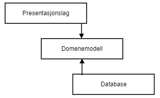
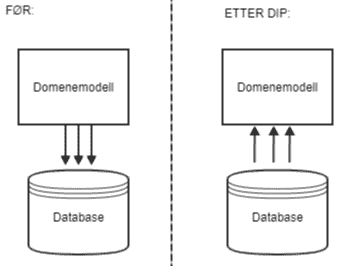
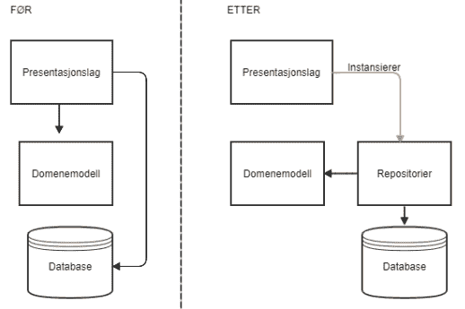
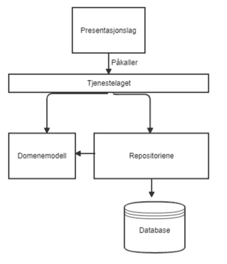

# 5 interessante konsepter fra “Architecture Patterns with Python”

> 原文：<https://medium.com/compendium/5-interessante-konsepter-fra-architecture-patterns-with-python-75f8883703ff?source=collection_archive---------1----------------------->

*Som konsulent i Computas har jeg jobbet på prosjekter hvor utviklingsspråket primært har vært Python. Gjennom disse erfaringene har jeg lært hvor viktig det er med en domenemodell og lagdeling i en applikasjon, selv i et dynamisk språk som Python som tillater utvikleren stor grad av fleksibilitet. Min bakgrunn er en master i anvendt matematikk og er selv nybegynner når det kommer til domenetdrevet design (DDD).*

Den siste uken har jeg lest boken “ [*Architecture Patterns with Python*](https://www.oreilly.com/library/view/architecture-patterns-with/9781492052197/) ” (av Bob Gregory og Harry Percival, [early release utgave](https://github.com/cosmicpython/book) fra O’Reilly Media, Inc.) for å lære mer om arkitektur og DDD i Python. Boken er delt i to deler, og jeg skal ta for meg 5 interessante konseptene jeg lærte fra del 1 av boken.

1.  Domenemodell
2.  Dependency inversion-prinsippet
3.  Presentasjonslaget
4.  Tjenestelaget
5.  Unit of Work-laget, og til slutt avslutte med noen refleksjoner over den endelige arkitekturen og boken.

Boken bruker et gjennomgående eksempel som jeg først vil starte med å beskrive og i lys av dette eksempelet diskutere disse fem konseptene. Forfatterne av boken jobber til daglig med en nettbutikk med et fysisk varelager som det allokeres varer fra til kunden. Hittil har det vært slik at dersom nettbutikken har gått tom for en vare på det fysiske varelageret, presenteres varen som ‘out of stock’ på nettsiden. Nå ønsker nettbutikken å utvide forretningsmodellen til å inkludere varer som er på vei som del av lagerbeholdningen. Dvs. at hvis de bestiller inn 50 stoler fra utlandet og disse fraktes til det fysiske varelageret som er tom for denne typen stoler, så presenteres ikke lenger stolene som ‘out of stock’ på nettsiden, men med noe lengre leveringstid. Selv om akkurat dette eksempelet vi skal følge er fra et spesifikt domene, så er konseptene gyldige i alle slags prosjekt.

# 1\. Domenemodellen

En domenemodell er en modell som løser problemstillingen på en spesifikk måte. Den er fri fra eksterne avhengigheter og terminologien som brukes i modellen kommer fra domenet, ikke f.eks. Python eller et teknisk rammeverk. Måten man lager en domenemodell på i Python er ved å lage klasser som hver representerer et objekt i modellen, og koble disse på den måten som tilnærmer seg det virkelige problemet i forretningsmodellen.

I bokens eksempel er problemstillingen fra domenet varehandel. Domenemodellen det tas utgangspunkt i er at et Batch-objekt (batch av varer butikken har, eller har bestilt til lageret) og et Bestillingsobjekt (varer kunden har bestilt) henger sammen ved at en bestilling allokeres fra en batch. Hver av disse objektene har sine attributter, og så er det en metode på Batch-objektet som allokerer objekter av typen Bestillingsobjekter og reduserer tilgjengeligheten av den typen vare i en batch. Denne domenemodellen skal det bygges rundt slik at vi ender med en webapplikasjon med datalagring. Da skal vi se hvordan verdien i å ha en isolert modell for domenet kommer frem.

# 2\. Lagdeling, Dependency inversion-prinsippet og Decoupling

Nettbutikken må ha en oversikt over alle varene de har eller venter. I avsnittet over kom vi frem til at domenemodellen kun skal ha ansvar for å modellere domenet. Så vi trenger et eget arkitekturlag for å håndtere dataene.

*Figur 1\. Den midterste boksen representerer domenemodellen, mens den over et presentasjonslag og den under et databaselag. Pilene inn fra de andre lagene til domenelaget representerer at disse lagene påkaller modellen.*

En lagdelt arkitektur kan representeres som i figuren over. Her har vi tre lag, et presentasjonslag, en domenemodell og et databaselag. Presentasjonslaget sørger for fremvisningen til brukerne mens databaselaget sørger for oppbevaring og lagring av dataene. Disse lagene er uavhengige av hverandre, men er koblet sammen ved at de ytre lagene forholder seg til det indre laget (domenemodellen). Vi skal se hvordan vi oppnår dette ved hjelp av Dependency inversion-prinsippet (DIP).

I vårt eksempel med varer kan vi bruke en database for å holde på og lagre vare dataene. Så gjør vi bruk av DIP. Dersom vi ikke bruker DIP blir vi nødt til å koble hver parameter i modellen til en kolonne i databasen. Hvis vi da foretar en endring i databasen, må vi også gjøre denne endringen i modellen. Vi sier at lagene er ‘strongly coupled’. Når vi derimot snur avhengigheten slik at databasen blir avhengig av modellen, så ‘decoupler’ vi de to lagene. Det som da skjer er at en kolonne i databasen bindes til en parameter i modellen. Det vi får da er en database som vet om modellen, og ikke omvendt. Legg også merke til at domenemodellen fra avsnitt 1 fortsatt er urørt og fri fra tekniske detaljer.

*Figur 2\. Før DIP peker pilene som representerer avhengigheter fra domenemodellen til databasen. Etter DIP peker pilene i motsatt retning.*

# 3\. Presentasjonslaget og Repository

Vi trenger nå å ta imot bestillinger fra kunden, initierere databasen og laste opp batchene. Disse oppgavene er det foreløpig presentasjonslaget som tar seg av, for eksempel et Flask-endepunkt. Den gjør om kundebestillingen, hvilket enn format den kom i, og batch-dataene om til domeneobjekter i henhold til domenemodellen, og disse brukes i allokeringen av bestillingen fra en batch. Når vi snakker om et domeneobjekt så menes det et objekt som er uttrykt med domenemodellen. Legg merke til at bestillingen opprinnelig kan ha vært i et JSON-format, men er gjort om til et domeneobjekt. Hvis vi hadde bygd applikasjonen vår rundt at vi tar imot et ‘løst’ JSON-dokument og bygd våre metoder rundt å aksessere verdier i dette ut fra dets nøkler, ville vi ha sammenblandet oppgaver opprinnelig tiltenkt ulike lag, og applikasjon ville vært sårbar for feil og dessuten rigid for endringer. Bare tenk om formatet for kundebestillinger hadde blitt endret fra JSON til noe annet, som f.eks. XML. Det er en god ting at vi jobber med domeneobjektene og ikke med et ‘løst’ JSON-dokument.

*Figur 3\. Repo-ene legges som et abstraksjonsnivå mellom presentasjonslaget og modellen og databasen.*

Det er imidlertid fortsatt en sterk kobling mellom databasen og modellen. Vi trenger med andre ord et abstraksjonsnivå som fjerner denne tette sammenkoblingen. Vi lager derfor et abstrakt repository (repo) med metoder som “legg til” og “list opp”, så arver vi denne i den typen repo vi måtte ønske å bruke. Nå kan presentasjonslaget lage en instans av repo-et, og bruke list-metoden for å få listen av alle batch-objektene, se Figur 3\. Det gjør det også mulig å lage tester for presentasjonslaget uten å måtte bruke et ekte repo og database.

# 4\. Orkestrering og Tjenestelaget

Så langt har vi et presentasjonslag, en domenemodell, et repository (abstrakt og spesifikt) og en database. I tillegg til disse er det nyttig med et lag som tar seg av ulike use-caser. For eksempel kan det komme en bestilling av en vare som ikke finnes. Modellen vet ikke noe om hvilke vare-eksemplarer som finnes, det er bare databasen som kan se om en vare finnes eller ikke.

For å håndtere flyten av ulike tilfeller som kan dukke opp, legger vi på et tjenestelag som skal ta seg av det vi kaller orkestrering, dvs. bruke funksjonalitet fra domenemodellen og repo-ene og validere ulike caser før det setter det sammen og gir enten et resultat eller en feilmelding til presentasjonslaget. Når det for eksempel kommer inn en bestilling, sjekker det mot repo-et at det fins mer av varen, og hvis ikke lager det en feilmelding, men dersom varen derimot fins, gjennomfører det bestillingen ved å hente ut varen fra repo-et. På denne måten orkestrerer tjenestelaget en ellers komplisert flyt på en ryddig måte. Legg også merke til at tjenestelaget er separat fra presentasjonslaget og trenger f.eks. ikke å forholde seg til formatet varebestillingen kom i.

*Figur 4\. Arkitektur med presentasjonslag på toppen som påkaller et tjenestelag som igjen påkaller domenemodellen og repo-ene, med databasen på bunnen.*

# 5\. Unit of Work

I tilfeller der presentasjonslaget gjør for mye, som å ta seg av kommunikasjonen til tjenesten, databasen og repo-ene, kan vi introdusere et siste lag, kalt Unit of Work (UoW). Denne fungerer som en kontekstmanager, dvs. at vi i denne har tilgang til databasen og kan opprette repo-ene vi måtte trenge. Da har vi ‘decouplet’ presentasjonslaget til å kun behøve å ha kommunikasjon med tjenestelaget og UoW-laget, se Figur 4.

# Konklusjon

Fra å ha startet med en veldig enkel domenemodell, når vi frem til en ganske sammensatt arkitektur, bestående av et presentasjonslag, koblet til et tjenestelag, videre koblet til et repo som vet om domenemodellen og databasen, se Figur 4\. Legg imidlertid merke til at domenemodellen har forblitt urørt. Denne lagdelingen og ‘decoupling-en’ mellom de ulike lagene tillater oss å gjøre endringer eller erstatte deler av arkitekturen mens de øvrige forblir urørt. Det tillater oss å lage enhetstester for lagene helt uavhengig av hverandre. Når forretningsmodellen i fremtiden skal oppskaleres og flere bestillinger må håndteres samtidig blir det behov for å håndtere dette på nye måter, og da tillater en slik arkitektur å oppskalere.

Jeg anbefaler denne boken for alle som er interessert i å introdusere mer struktur i sine Python-prosjekter, men også andre som er nysgjerrige på arkitektur og DDD. Boken inneholder kodeeksempler for produksjonskoden i tillegg til testkoden. Konseptene er også godt forklart med eksempler som er lette å forstå. Det hadde vært veldig interessant om boken også hadde inneholdt et eget kapittel med problemstillinger fra ulike felt, og hvordan forfatterne ville ha gått frem for å lage domenemodeller av disse. Hvis jeg skulle endret noe på boken, ville det vært at essensen av produksjonskoden eller logikken ble litt oftere presentert før testkoden, for det hadde gjort kapitlene mer strukturert, da det var veldig mange av sistnevnte.

*Helt til slutt vil jeg takke kollegaen min Torgeir Mossige som var den første som introduserte meg for software-arkitektur og viste meg hvordan man lager gode domenemodeller. Og senestfor innsikt og gode diskusjoner rundt temaene i denne boken og ikke minst redigeringer av denne teksten. Det har vært en fryd å jobbe med dette med han på laget.*