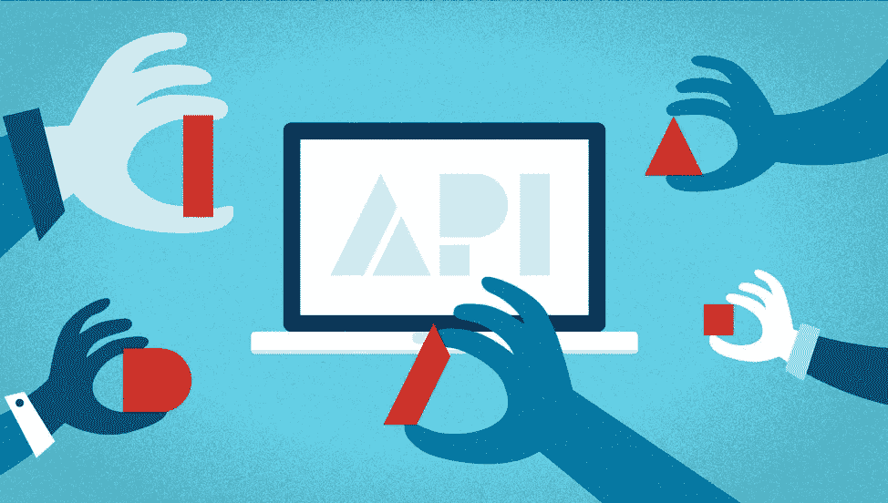

# 成功的 API 集成的 5 个关键

> 原文：<https://medium.com/capital-one-tech/5-keys-to-successful-api-integration-aa1b02657eff?source=collection_archive---------4----------------------->

## 使用 Capital One 移动 iOS 应用程序的经验教训

重建 Capital One iOS 应用程序需要整个 Capital One 的许多不同团队进行协调。新的应用程序不仅采用全新的设计在本机构建，而且它还为所有需要所有新后端 API 的客户帐户使用单一登录。通过这一努力，我们学到了很多，我们尝试了许多不同的实践和哲学。然而，面对这些变化和挑战，我们开发了一些与内部 API 集成的通用最佳实践。

在 Google 上快速搜索“API 集成最佳实践”会返回超过 2600 万个结果，但大多数结果都集中在技术性 API 消费实践上，如缓存、线程和错误处理。所有这些对于成功的 API 集成都很重要，但是在这篇文章中，我决定将重点放在成功的 API 集成所需的沟通上。下面是与 API 集成相关的五个关键经验。

# 1.沟通是关键

这听起来可能是显而易见的，但沟通是至关重要的。它应该在与 API 的集成真正开始之前就开始，并且它有多种用途。

*首先是预警**。**API 的存在并不意味着它已经为无限量的流量做好了准备。如果您正在处理一个大容量的应用程序，那么在选择 API 时需要考虑负载。通过早期的沟通，客户团队可以和 API 团队一起工作，为他们的项目和 API 确定最佳的前进方向。

在某些情况下，API 可能需要进行更改以支持流量需求。虽然这可能会影响时间表——确实如此——但这比其他选择好得多。没有人想开发一个新特性，把它发布到产品中，认为一切都会很好(因为你的测试显示没有问题)，然后让 API 关闭，因为突然有数百万人试图访问它，而它是为更少的流量设计的。

在其他情况下，您选择的 API 可能已经能够处理负载。这是否意味着交流不重要？不，因为它打开了沟通渠道，让 API 团队计划发布日期前后的额外监控。

*除了预先警告，早期沟通可以让你尽早开始提问。这为集成过程中出现的问题打开了沟通的渠道。这允许 API 团队学习并影响你如何计划使用他们的 API。它还允许前端开发团队确定他们计划使用的 API 的特性。这是一种沟通模式，应该贯穿整个开发过程，甚至在发布之后；帮助两个团队避免不必要的意外，并帮助快速解决问题和顾虑。

*沟通还有助于调试客户团队面临的任何意外行为。然而，为了使这种交流最有效，两个团队都需要诚实地面对他们代码中的任何问题或限制，并对潜在的解决方案持开放态度。

# 2.文档文档文档

这伴随着交流，但是文档对于 API 和开发团队都是至关重要的。

*拥有最新和准确的 API 文档允许客户端团队轻松地与 API 集成。对于与 API 相关的问题，他们有一个文档可以参考，这减少了 API 团队回答问题所花费的时间。

文档中的信息越多越好，但至少应该包含所有的请求字段，指定它们的数据类型和可接受的值，以便正确调用 API、响应的基本结构和问题的联系点。更好的文档还将包括关于错误场景、样本请求和样本响应的信息，包括针对错误场景的信息。同样，这里的信息越多越好。如果 API 团队认为有任何其他与 API 相关的信息，应该包括在内。

*对于客户端团队来说，拥有关于他们对 API 的期望的文档同样重要。这个文档应该是一致的，并应用于所有与它们集成的 API。(显然，会出现例外，但这些应该很少。)这个文档将允许 API 团队快速了解你对他们和他们的 API 的要求。

例如，对于 Capital One 移动 iOS 应用程序，我们要求我们集成的任何 API 都要有适当的错误处理，带有客户友好的错误消息和特定的响应格式。这允许我们以同样的方式处理所有的错误。这个需求在我们的文档中进行了交流，所以 API 团队理解我们的期望。

# 3.做好管家

每一个 API 和每一个组织对于好的管理都有自己的要求和期望。这也是为什么交流、诚实和文档是成功集成组织内部 API 的关键的原因。例如，您可能希望使用每个 API 来确定适当的缓存行为。不断调用 API 可能会对您的客户产生严重影响，例如增加他们的数据使用量并耗尽他们的电池。此外，这些额外的、通常是不必要的 API 调用对您的组织来说是非常昂贵的，因为它们增加了后端的流量。

因此，与您的 API 团队一起确定成为每个 API 的好管家意味着什么是很重要的。这可能包括预期的缓存行为、调用频率和/或确定要调用的适当 API。在开发 iOS 应用程序的一个实例中，通过与 API 团队的讨论，确定不仅应用程序调用 API 过于频繁，而且有一个 API 更适合我们的用例。由此带来的变化带来了更好的客户体验和更可靠的整体功能。

# 4.测试一切

无论客户团队和 API 团队之间存在多少沟通，总有可能会遗漏一些东西。适当的测试有助于填补这些空白。这个测试应该包括快乐路径场景、HTTP 错误场景和边缘情况。

当与 Capital One 移动应用中的新 API 集成时，这种测试实际上发生在多个级别:

* API 集成代码使用模拟响应进行了全面的单元测试，这些模拟响应要么是我们直接从 API 收到的，要么是我们与 API 团队密切合作开发的。

*每个 API 集成包含至少一个集成测试。这些测试涵盖了快乐的路径和一些更常见的错误场景。

UI 构建完成后，我们对所有场景进行端到端测试。这些测试将涵盖所有的快乐路径、错误场景和边缘情况。

这种级别的测试有两个目的。第一个也是最重要的目的是降低在应用程序中引入 bug 的风险。第二，当测试开始失败时，它可以更容易地找出问题所在。如果 UI 的端到端测试失败了，但是 API 层的单元测试和集成测试成功了，那么问题很可能出在 UI 代码上，等等。

编写这些测试可能会感觉乏味，但它们会防止代码中的错误，带来更好的用户体验，以及更稳定的应用程序。这使得他们值得努力。

# 5.我们都是一个团队

归根结底，API 团队和客户团队都朝着同一个目标努力，尽可能提供最好的体验。此外，客户团队和 API 团队需要彼此来完成这个目标。如果不与后端 API 集成，大多数应用程序都不是很有用。同样，API 只有在有人实际使用时才有用。记住我们都在一起，可以在团队之间发展有益的关系。

# 结论

这五个关键点代表了我们每天努力实现、支持和扩展的事情，并导致了 API 和客户团队之间的良好合作关系、改进的应用程序功能、改进的 API 等等。它们适用于各种各样的企业和应用程序，其中内部 API 集成是开发过程的一部分。希望这些要点也能对您的用例有所帮助。

*披露声明:这些观点是作者的观点。除非本帖中另有说明，否则 Capital One 不属于所提及的任何公司，也不被其认可。使用或展示的所有商标和其他知识产权都是其各自所有者的所有权。本文为 2018 首都一。*