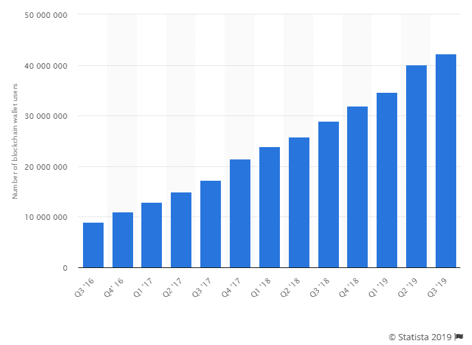

# 2020 年最具创新性的 5 大数字钱包趋势

> 原文：<https://medium.com/quick-code/5-most-innovative-digital-wallet-trends-of-2020-377fbb54eab4?source=collection_archive---------0----------------------->

数字钱包在过去的 5 年里有了显著的增长。

例如，2018 年全球数字钱包交易[达到 42，960 亿美元](https://www.paymentscardsandmobile.com/mobile-wallet-global-usage-statistic/)，预计到 2022 年将达到 13，979 亿美元。

更令人惊讶的是，数字钱包的创新才刚刚开始。在未来 3-5 年内，越来越多的数字钱包技术将会出现，这将在不久的将来使数字支付更加安全和方便。

所以，如果你是一个企业家，想要开发一个数字钱包应用程序，那么你必须了解在不久的将来将占主导地位的数字钱包趋势。

在这篇文章中，我将分享 2020 年及以后的 5 个最具创新性的数字钱包趋势。

# **2020 年值得关注的五大数字钱包趋势**

让我们仔细看看最具创新性的移动数字趋势，它们将在 2020 年及以后大受欢迎。

# **1 —加密货币钱包**

如果你不知道的话，加密货币不再是价值数百万美元的品牌或独家投资者的专利。它已经被初创公司和中小型企业广泛采用。

事实上，有数百万个加密货币钱包 app 解决方案。

[根据 Statista](https://www.statista.com/statistics/647374/worldwide-blockchain-wallet-users/) 的数据，自 2016 年以来，加密货币钱包解决方案的数量急剧增加，从 670 万增加到 2019 年的 4200 万。

这种大幅增长背后的原因也是相当明显的！

例如，加密货币和区块链技术基本上消除了交易中对第三方的需求，这不仅导致更安全的交易，还降低了成本。

因此，采用这种技术的企业或初创公司正见证着巨大的好处，并且在未来也将继续下去。

# **2 —智能音箱支付**

自亚马逊在 2014 年推出首款智能音箱以来，智能音箱经历了巨大的增长。

事实上，在亚马逊智能音箱推出后不久，苹果和谷歌都在 2016 年以 Google Home 和 2017 年以苹果智能音箱加入了智能音箱的竞赛。

如今，智能音箱或语音助手已经成为大多数家庭的主流。

[根据 Statista](https://www.statista.com/statistics/801963/worldwide-level-usage-voice-assistant-various-functions/) 的数据，82%的人使用过语音助手来检索信息，而 35%的人通过语音助手和智能音箱购买过产品。

就在线支付而言，28%的智能音箱用户直接支付过购物和汇款。

虽然目前使用智能音箱进行在线支付的用户数量相当少，但随着智能音箱技术变得更加方便和安全，预计这一数字将在不久的将来上升。

事实上，智能扬声器用于支付的未来在美国已经看起来很有前景。

[Business Insider](https://www.businessinsider.in/research?r=US&IR=T) 预测，到 2022 年，使用智能扬声器进行支付的用户将从 1840 万增加到 7790 万。

因此，在未来 3-5 年内，30%的美国用户将开始使用智能音箱进行在线支付。

# **3 —基于 NFC 的钱包解决方案**

在过去五年中，基于 NFC 或非接触式钱包解决方案在英国的使用大幅增加。

例如，2014 年是英国非接触式支付最受欢迎的一年。非接触式消费总额创下了 23.2 亿英镑的记录，比去年增长了 255%。

更令人惊讶的事实是，截至 2017 年，英国共发行了 1.19 亿张非接触式卡，人均近两张。

[据英国金融](https://www.ukfinance.org.uk/sites/default/files/uploads/pdf/UK-Finance-UK-Payment-Markets-Report-2019-SUMMARY.pdf)报道，三分之二的英国成年人使用非接触式支付方式购物或支付。

所以，现在你知道了非接触式或基于 NFC 的支付有多流行，是时候了解非接触式或基于 NFC 的钱包实际上是如何工作的了。

基本上，今天的智能手机都带有 NFC 技术，通过该技术它们可以与 NFC 卡片机进行通信。

虽然大多数智能手机不需要接触销售点设备来进行支付，但是，它们必须离终端很近。

就 NFC 钱包解决方案的需求而言，正如我们前面看到的那样，NFC 技术已经获得了巨大的普及，这意味着构建基于 NFC 的数字钱包应用程序开发绝对是一项值得的投资。

# **4 —基于人工智能的钱包解决方案，实现日常交易自动化**

人工智能(AI)就像 NFC 技术一样，已经迅速成为最新兴的技术之一。不仅如此，人工智能技术在过去的 5 年里也有了巨大的进步。

例如，现在许多电子商务公司已经雇用了基于人工智能的聊天机器人，帮助这些公司和品牌解决他们客户的问题。

就数字钱包或移动支付而言，人工智能聊天机器人已经能够在客户批准的情况下执行和自动化基本交易。

事实上，AI 现在还可以处理语音指令，并自动执行与号码验证或 ACH 支付处理等日常任务相关的支付。

# **5 —国际汇款**

国际汇款基本上是外国工人向他们本国的家人、朋友或其他个人汇款。

事实上，在许多国家，国际汇款占一国国内生产总值很大一部分。

[根据世界银行最新的《移民&发展简报](https://www.worldbank.org/en/news/press-release/2019/04/08/record-high-remittances-sent-globally-in-2018)，2018 年中低收入国家的全球汇款总额达到 5290 亿美元，而在高收入国家，这一数字同年达到 6890 亿美元。

你猜怎么着？—国际汇款高速增长背后的原因之一是智能手机的渗透和数字钱包解决方案的大量采用。

智能手机和数字技术迅速改变了整个汇款领域和整个金融业。

# **结束语……**

总体而言，数字钱包解决方案或[移动应用开发](https://www.credencys.com/mobile-application-development-services/)已经对金融业产生了巨大影响，预计在不久的将来，它可能很快成为默认的支付模式。

截至目前，这是 2020 年最具创新性的 5 大数字钱包趋势。因此，如果你是一个对建立自己的数字钱包应用解决方案感兴趣的企业家，一定要记住这 5 个趋势。