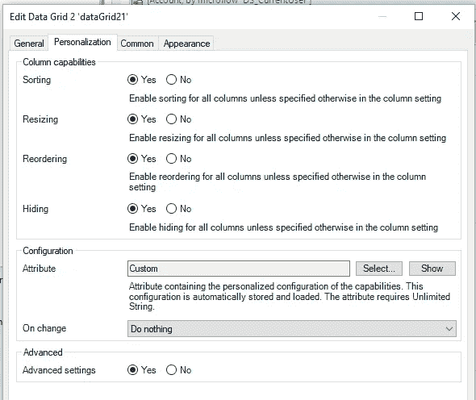

# 我希望在 Mendix World 上看到的 5 个新发展趋势

> 原文：<https://medium.com/mendix/5-new-development-trends-that-i-would-like-to-see-at-mendix-world-f18ef4791123?source=collection_archive---------4----------------------->

# 随着 Mendix World 的迅速临近，Mendix 9 中有大量新项目可供探索，包括对 Mendix 工作流的更新、全新的 Atlas 3.0 框架、任务队列等等。在为期三天的会议中，将通过现场直播和录音会议相结合的方式介绍 Mendix 9 的新功能。这个博客将涵盖一些我希望在 Mendix world 上看到的发展趋势和新亮点。

## **数据网格 2.0**

Mendix 9 最丰富的特性之一是引入了一个完全改进的数据网格小部件。这个小部件完全由 React 框架重新构建，由现有的三个数据小部件(数据网格 1.0、模板网格和列表视图)的最佳特性组成，所有这些都捆绑在一个全面的解决方案中。

与旧版本类似，新的数据网格支持分页、过滤和处理大量数据，而且还允许您创建模板化的文本属性(将多个字段连接成一个字段)，以及将自定义上下文添加到列中的能力(类似于模板网格和列表视图)。

数据网格中的每个单元格都添加了动态类功能，以便根据表达式灵活地设置每个单元格的样式，从而简化了过去依赖于使用 cell styler 小部件的流程。表达式编辑器允许您访问网格的行对象，以及页面上任何其他父数据视图的上下文。

添加的另一个令人高兴的功能是高级设置，允许对数据网格中的列进行排序、调整大小、重新排序和隐藏。此功能在旧版本中不可用，只能通过使用数据网格扩展小部件来实现。这个新功能最方便和用户友好的方面之一是个性化选项。小部件允许您存储用户的个人设置，这样当他们导航回或刷新页面时，他们的所有设置都会被重新加载。

(For my setup, I added an unlimited string attribute to the Adminstration.Account table to store these settings)

数据网格 2.0 小部件在 Mendix 9 中有大量可用的特性，这些特性扩展并改进了现有的功能。值得注意的是，Mendix 包含了来自社区构建的定制小部件的关键特性，并将它们集成到这个新版本的数据网格小部件中。

## **任务队列**

Mendix 9 引入了一个关键的新特性，即任务队列。这是对 Mendix 的流程队列模块和 Web Flight 的队列模块的直接替换，并将功能原生引入平台。

任务队列的设置是无缝的，现在它已经变成了一个快速的、两次点击的过程。要设置它，右键单击模块并添加任务队列(类似于添加新页面或微流)。

然后定义您想要使用的线程数量(我通常默认为 10)。现在，当调用任何微流活动时，您可以选择在队列中执行它。

与之前模块中的要求相比，这是一个非常简化的设置，我很高兴在 Mendix World 上看到关于这一点的任何更新！

**PWA 导航配置文件**

前面提到的对 Mendix 9 的添加及其所有的新特性都伴随着对旧特性的一些废弃。移动开发方面的一个主要变化是混合移动导航配置文件的弃用。随着原生移动功能集在过去几年中的增加，仍然有一些完全在线移动应用程序的用例。如果你的应用属于这一类，那么新的[渐进式网络应用](https://docs.mendix.com/refguide/progressive-web-app)功能可能非常适合你！

渐进式网络应用程序允许你将应用程序添加到 iOS/Android 设备的主屏幕上，而不需要通过 Appstore 进行分发，它们的行为非常类似于混合移动或 React 原生移动应用程序，但有一些限制。

在开发方面，您将能够重用之前为您的 web 应用程序开发的所有微流/纳流，并且您可以选择添加逻辑以根据用户使用的导航配置文件显示不同的页面，或者构建一个响应性 web 应用程序，通过样式处理不同的屏幕大小。

要启用 PWA 功能，请转到导航配置文件并找到“发布为渐进式 Web 应用程序”复选框。

虽然与 React 本地应用相比，离线 PWA 的空间有限，但该功能在离线配置文件中也可用。

[https://bit.ly/MXW21](https://bit.ly/MXW21)

## **调试纳流**

在 Mendix 中引入 nanoflows 后期待已久的功能之一终于来了！在排除错误时，对额外的日志消息和猜测说“再见”，对使用调试器说“你好”。调试纳流的能力可能会节省开发人员排除工作故障的时间，并提高生产力和效率。

使用时，只需右击任一活动，放下断点，即可正常使用调试器！

## **性能机器人**

Mendix 9 的另一个很棒的新增功能是 MxAssist 性能机器人。这是去年注意到的，我希望我们能看到自那时以来所做的改进，以及这个机器人即将到来的路线图。

对于那些去年没有赶上会议的人来说，这不仅是新开发人员学习最佳实践的好工具，而且对于高级开发人员快速完成他们团队正在进行的所有开发的代码评审也特别有用。

只需点击一个按钮，我就可以浏览我所有的代码，看看是否有任何建议。

分析了以下最佳实践:

这个 bot 的一个值得注意的特性是，它有您想要检查的每个最佳实践的设置，排除某些模块的能力，以及抑制某些建议的能力。

上面的屏幕截图显示了我想在一个循环中为这个特定的微流提交的确认。

总的来说，这是对 Mendix 9 的一个很好的补充，我计划在所有未来的项目中使用这个机器人。

## **结论**

即将到来的 Mendix 世界将充满许多令人兴奋的关于 Mendix 9 的新闻，以及 Mendix 路线图上的所有新功能。如果你还没看过的话，Mendix 世界大会将会是一个为期三天的活动(9/7–9/9)，并且将会完全在线！要注册参加[会议，请点击这里](https://bit.ly/MXW21)，我希望能在九月与大家见面！

## 阅读更多

 [## 渐进式网络应用| Mendix 评估指南

### 渐进式 web 应用程序(PWA)是一种特殊类型的 web 应用程序，它逐步使用来自…

www.mendix.com](https://www.mendix.com/evaluation-guide/app-capabilities/progressive-web-apps/)  [## 数据网格 2 -市场指南| Mendix 文档

### 数据网格 2 是以表格形式显示内容的标准数据网格小部件的继承者。它带有…

docs.mendix.com](https://docs.mendix.com/appstore/modules/data-grid-2)  [## MxAssist Performance Bot-Studio Pro 9 指南| Mendix 文档

### MxAssist Performance Bot 是一款智能虚拟合作开发机器人，可帮助您提高应用程序的性能…

docs.mendix.com](https://docs.mendix.com/refguide/mx-assist-performance-bot)  [## 调试微流和纳流- Studio Pro 9 操作指南| Mendix 文档

### Mendix Studio Pro 有一个内置的一致性检查器，可以验证您正在构建的应用程序是否包含任何…

docs.mendix.com](https://docs.mendix.com/howto/monitoring-troubleshooting/debug-microflows-and-nanoflows) 

*来自出版商-*

*如果你喜欢这篇文章，你可以在我们的* [*媒体页面*](https://medium.com/mendix) *或我们自己的* [*社区博客网站*](https://developers.mendix.com/community-blog/) *找到更多类似的内容。*

*希望入门的创客，可以注册一个* [*免费账号*](https://signup.mendix.com/link/signup/?source=direct) *，通过我们的* [*学苑*](https://academy.mendix.com/link/home) *即时获取学习。*

有兴趣更多地参与我们的社区吗？你可以加入我们的 [*闲散社区频道*](https://join.slack.com/t/mendixcommunity/shared_invite/zt-hwhwkcxu-~59ywyjqHlUHXmrw5heqpQ) *或者想更多参与的人，看看加入我们的* [*遇见 ups*](https://developers.mendix.com/meetups/#meetupsNearYou) *。*