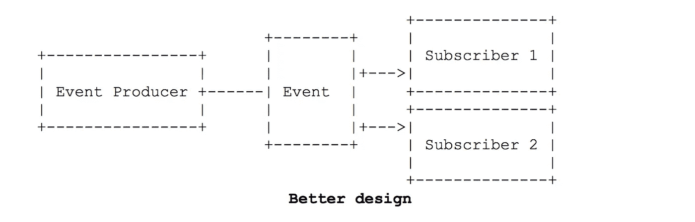
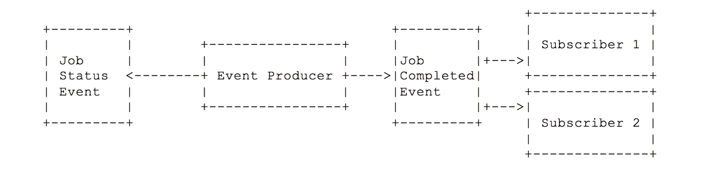

# 设计进化事件流的 5 个原则

> 原文：<https://medium.com/capital-one-tech/5-principles-for-designing-evolvable-event-streams-f32e90dcbb79?source=collection_archive---------1----------------------->


对于企业来说，要提高业务敏捷性和应对市场变化，软件不再是固定不变的。相反，它必须能够随着时间的推移处理变化——它必须能够发展。

系统进化的方法很重要。API 生产团队应该超越在系统之间移动数据，而是从 API 消费者的角度考虑 API 设计。这将导致 API 满足共同的需求，并能够承受超出其最初意图的变化。

像 API 一样，适当设计的事件流允许系统随着需求的变化而发展。虽然事件流是构建可演化软件的一种强有力的方法，但也存在不恰当的事件设计的危险，导致脆弱的系统无法随时间演化。让我们深入探讨设计事件流的五个原则，以避免脆弱性并鼓励更具发展性的解决方案。

## **原则#1:为正确的粒度级别设计事件**

在设计你的活动时，考虑一下你给订阅者带来的负担。如果您设计了非常细粒度的事件——比如一个 API 请求中每个更改的字段都有一个事件——那么订阅者将需要聚合和处理多个事件来获得他们想要的结果。

一个建议是从每个操作(如创建、更新、删除、提交、批准)、每个业务事件(如开立储蓄账户)或每个外部系统事件(如收到警报)的单个事件开始。这将允许您的订阅者轻松确定哪些事件是感兴趣的，哪些事件应该被忽略。

## **原则#2:组相关事件数据**

在事件的初始设计阶段，将事件负载的模式扁平化似乎是合适的，例如:

```
firstName
lastName
email
billingAddressLine1
billingAddressLine2
billingCity
…
```

随着时间的推移，事件可能需要包括额外的细节，从而导致非常大的结构，这可能会使订户困惑或不知所措。在上面的例子中，如果我们需要在账单地址旁边添加一个邮寄地址，该怎么办？

不要添加带有*邮件地址*前缀的新字段(例如，邮件*地址行 1* ，*邮件地址行 2* ，…)，考虑在初始设计阶段将相关数据分组在一起，以提供更多的可发展性。例如:

```
contactDetails:
      firstName
      lastName
      email
billingAddress:
      addressLine1
      addressLine2
      city
      …
mailingAddress:
      addressLine1
      addressLine2
      city
      …
```

我们现在可以添加 s *hippingAddress* 作为事件有效负载中的一个新分组，同时允许订阅者轻松处理他们感兴趣的地址。另外，订户可以通过定义地址数据结构或对象来优化他们的代码，该地址数据结构或对象可用于处理帐单和邮寄地址，以及将来需要的任何其他地址。

## **原则 3:不要让你的活动订户破产**

像 API 一样，事件是事件生产者和其订户之间的契约。随着时间的推移，订阅者的需求可能会发生变化，需要对事件负载模式进行修改。应用以下规则有助于确保不破坏事件订阅者:

1.  在不中断订户的情况下向有效负载添加新字段是可以接受的。使用原则#2(如上)对相关数据进行分组。
2.  不要重命名现有的字段名称。相反，在前面的字段旁边添加新字段，以纠正任何命名错误，从而为订阅者提供更好的清晰度。
3.  不要删除字段，因为您的订户可能依赖于它们的存在。

如果您不能应用上面的规则，那么您可能需要在一个新的主题上定义一个新的事件来满足需求。随着时间的推移，您可以尝试引导订阅者转移到新主题，并删除已弃用的主题。然而，这可能是一个巨大的挑战，所以要准备好在一段时间内同时支持这两者。

## **原则#4:管理你的事件依赖关系**

理解您在事件生产者和订阅者之间创建的依赖类型是很重要的。可演化事件流要求生产者不知道他们的订户。

事件应该以一种格式发出任何订阅者可能需要的信息，这种格式即使不熟悉生成系统也是可以理解的。当事件为特定的、已知的订户发出信息时，会导致产生脆弱软件的紧密耦合。

在下面的例子中，我们的事件设计导致了依赖和紧密耦合，因为生产者为已知的订户发出特定的事件:


相反，我们应该设计一个既能被我们今天预期已知订户理解，又能被未知的未来订户理解的事件:



这个原则不仅扩展到生产者对其下游订户的意识，还扩展到事件有效负载。糟糕的事件有效负载设计要求事件生产者理解内部数据值并将其转换为订阅者可以轻松处理的更有用的值，这些值可能是内部格式的。

例如，具有名为 customerStatus 的字段的事件负载可能会在内部存储 N、A、I 的值，虽然您的团队可能知道这些值代表新的、活动的和非活动的，但并不是每个人都知道它们的含义。此外，下游用户不应该被要求在某些文档中查找这些代码。相反，customerStatus 字段应该包含 new、active 和 inactive 之一，以清楚地描述状态。虽然这需要一点额外的开发工作，但订户能够轻松理解和处理该事件，而无需额外的繁重工作，也无需深入了解您的内部数据是如何存储的。

## **原则 5:区分私有和共享事件流**

不是所有的事件都应该被认为是公开的，其他团队也可以参加。一些事件流，尤其是那些支持微服务通信和协调的事件流，应该保持私有。

例如，后台作业进度事件可能会在您的系统中使用，以保持其他服务更新后台作业的内部进度。但是，订阅者只对作业已经完成或由于错误而退出感兴趣。



当设计事件流来支持您的 API 和微服务时，只共享下游订阅者所需的事件。这将允许您的内部微服务独立于您的订户发展。在某些情况下，最好从所有私有事件流开始，然后将一些私有事件迁移到公共事件，因为这样可以更好地理解涉众的需求。

## **将所有这些放在一起**

正如我们在[上一篇文章](/capital-one-developers/event-streaming-an-additional-architectural-style-to-supplement-api-design-703c4f801722)中讨论的，事件驱动架构和事件流使 API 和微服务能够在关键业务事件发生时通知感兴趣的组件。虽然这是构建可演化软件的一种强有力的方法，但是也存在不适当地应用这些技术的危险，从而导致脆弱的系统。通过将这五个原则应用到我们的事件流设计中，我们将更好地定位于交付可独立发展并能够承受时间变化的软件系统。

# 有关系的

*   [在 Web APIs 和消息流之间选择](/capital-one-developers/choosing-between-rest-web-apis-and-message-streaming-8e2f4813a058)
*   [事件流:补充 API 设计的额外架构风格](/capital-one-developers/event-streaming-an-additional-architectural-style-to-supplement-api-design-703c4f801722)
*   [API 产品所有权是 API 采用的关键](/capital-one-developers/api-product-ownership-is-key-for-api-adoption-6a12c64b2c83)

[](https://medium.com/capital-one-tech/api/home)

*声明:以上观点仅代表作者个人观点。除非本帖中另有说明，否则 Capital One 不属于所提及的任何公司，也不被其认可。使用或展示的所有商标和其他知识产权都是其各自所有者的所有权。本文为 2018 资本一*。