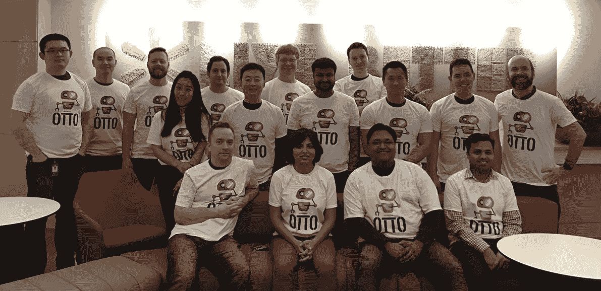
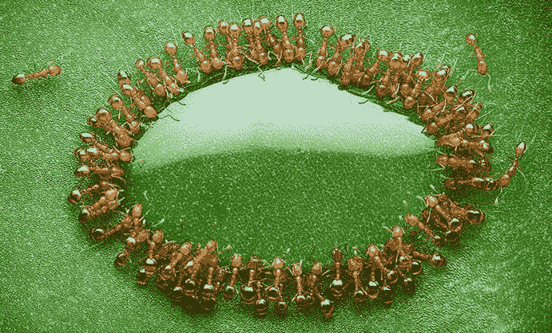
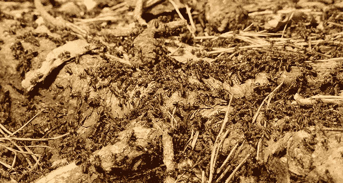
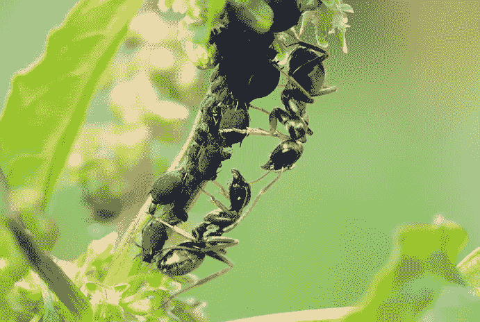
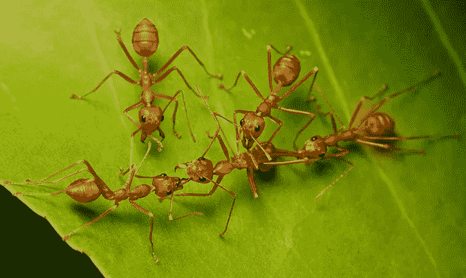
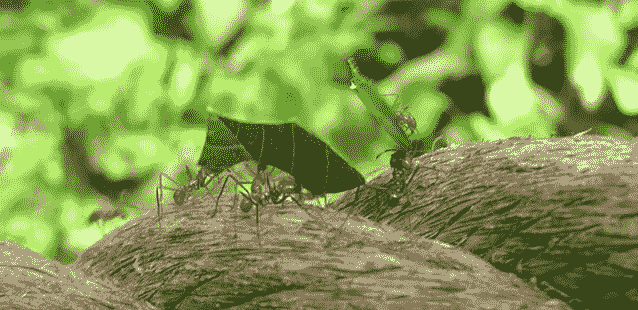

# 保证有助于建立强大团队文化的 5 项原则

> 原文：<https://medium.com/walmartglobaltech/5-principles-guaranteed-to-help-build-a-strong-team-culture-6055ab478c56?source=collection_archive---------1----------------------->

Photo By: [creativeart / Freepik](http://www.freepik.com/free-photo/hands-holding-letters-with-sky-background_928718.htm)

# 一个团队。一个目标。

2017 年 1 月初，我有机会为我的自动化工具团队举办了一次研讨会。该小组由两个子小组组成，成员分布在加利福尼亚州、内华达州、科罗拉多州和俄勒冈州。

Automation Tools Team

在 13 个月的时间里，每个团队都成功地实现了他们的公司目标。然而，作为研讨会的一部分，我想挑战团队，消除人为的“两个团队”的界限，并开始作为一个整体运作。

这篇文章将涵盖我在研讨会上分享的团队合作的 5 个原则。我的希望是激励你建立“一个团队”。一个目标。”组织的思维模式。

# 团队合作的 5 项原则

Photo By: [Husni Che Ngah](http://yourshot.nationalgeographic.com/photos/4559276/)

为了帮助说明团队合作的 5 个原则，我将用蚂蚁和它们本能的团队合作品质来类比。你不仅会看到这些原则是如何促进健康的团队文化的，你甚至会学到一些关于蚂蚁的有趣事实。

# 原则 1:分工

Photo By: [WerbeFabrik](https://pixabay.com/en/ants-insect-forest-red-wood-ant-1308161/)

蚁群是一个复杂的地下洞穴网络，蚂蚁生活在其中。

根据物种的不同，蚁群的规模可以从容纳 100 只蚂蚁的不足 2 平方英寸到容纳多达 700 万只蚂蚁的超过 500 平方英尺不等。

为了帮助组织这些蚁群中的混乱，每只蚂蚁负责特定的任务，无论是采集食物、筑巢、守卫蚁群还是繁殖。蚂蚁组织自己的这些本能的社会规则有助于确保蚁群的生存。

在团队环境中，分工是关于角色的明确性，以及你的贡献如何与团队设定的目标保持一致，以确保其成功。

*   作为团队中的一员，重要的是你要花时间自我反省，了解你的弱点，投资于你的优势，并利用你的才能实现团队的成功。
*   作为一个团队的管理者，重要的是你要了解每个成员的优势，将他们放在成功的位置上，并且*清楚地*传达他们在团队中的角色，这样对分工就有了一致的理解。

做这些事情会让你快速提高运营效率。

# 原则 2:沟通

Photo By: [Myriams-Fotos](https://pixabay.com/en/ants-formicidae-garden-ants-lasius-1461069/)

蚂蚁从遍布全身的腺体中释放大约 10 到 20 种不同的信息素。这些信息素被用作蚁群中与其他蚂蚁交流的一种方式。

这种“化学语言”用于召唤蚂蚁保卫蚁群，寻找食物来源的位置，或警告其他人潜在的危险。简而言之，了解这些信息素对蚁群的生存至关重要。

在团队环境中，由于独特的个性、不同的交流方式、技术以及作为分布式团队的一部分，定义“化学语言”可能是一项挑战。然而，一个简单的缓解策略是为您的团队定义清晰的标准和过程来遵循。

这也有社会方面的原因。像任何关系一样，你需要培养和建立人际关系。看看下面的例子，作为加强团队凝聚力的一种方式:

*   鼓励面对面的会议，或者如果使用网络会议软件，确保每个人都开着摄像机
*   思想开放:练习积极的意图、积极的倾听和换位思考
*   召集团队参加工作之外的活动(如欢乐时光、季度团队活动)

定义一种特定于您的组织的“化学语言”可能有助于减少现有的沟通挑战。你将什么样的最佳实践定义为你的团队文化的一部分？

# 原则 3:协作

Photo By: [Fractality](https://www.flickr.com/photos/fractality23/8843866341/)

众所周知，蚂蚁通过集体合作来克服具有挑战性的障碍。无论是用它们的下颚和爪子连接起来形成桥梁，还是将它们的身体放入防水筏中以在洪水中幸存，蚂蚁都有一种不可思议的能力，可以快速识别问题并组织起来解决问题。

作为一个团队，我们经常遇到似乎无法解决的问题。然而，如果团队有一个协作的心态，这将最大化他们成功的机会。

以下是一些自我反思的思维策略，来衡量你的合作程度:

1.  你愿意以开放的心态与他人一起工作，接受新的想法或方法吗？
2.  你了解并信任你的团队成员吗？
3.  你知道每个团队成员的角色和他们带来的好处吗？
4.  为了团队的成功，你愿意帮助一个奋斗中的团队成员吗？

练习成为这些领域的个人领导者。其他人会跟随。

# 原则 4:解决冲突

Photo By: [Troup Dresser](https://www.flickr.com/photos/23271361@N06/6134944209/)

蚂蚁社会非常复杂，表现出极高的合作水平。然而，就像人类社会一样，蚁群也会遇到一些离群值偏离现状的冲突。

例如，生殖分工通常是留给蚁后的。在某些种类的蚂蚁中，工蚁有能力产下雄蚁，并非法这样做以试图推翻蚁后。

无论团队有多团结，内部冲突总是会出现。然而，如果管理得当，冲突可以作为一种渠道机制来鼓励增长和创新。使用以下提示成功管理团队冲突:

1.  协调团队流程和标准，确保运营一致性
2.  鼓励基于事实的决策，消除情绪和个人依恋
3.  把“我”从等式中去掉。通过确定什么对客户、公司和/或团队是正确的来挑战成本效益
4.  提供实时反馈，提前解决问题，而不是让怨恨累积

# 原则 5:支持

Photo By: [shapour bahrami](https://www.flickr.com/photos/shapourbahrami/888791334/)

建立强大的团队文化需要耐心和纪律。上面的原则可以帮助你打下一个坚实的基础，但是要把所有这些联系在一起，最后的支持原则是必须的。

作为一名领导者，无论是人事经理还是个人贡献者，问问自己这个问题:

“我在支持团队方面的作用是什么？”记住——只需要一个人就能有所作为。

# 包扎

蚂蚁有一种本能的理解，群体需要合作才能成功。使用以下原则作为指导，帮助创建一个强大团队文化的支持系统:

1.  团队内部明确的分工和角色定义
2.  就团队所有成员理解的一套沟通最佳实践达成一致
3.  创造一个建立在信任和同情基础上的工作环境
4.  通过标准、流程和实时反馈管理良性冲突
5.  通过耐心和纪律发展一个支持系统

> “走到一起是一个开始。保持在一起就是进步。合作就是成功。”亨利·福特

## Ant 事实的来源:

*   蚂蚁:文明缩影 III
*   [一个蚁群有多大](http://www.theincredibleant.com/ant-how/how-big-is-an-ant-colony)
*   [蚁群与社会结构](https://www.terminix.com/blog/education/what-is-an-ant-colony)
*   [蚂蚁之间化学信息素的交流](http://antark.net/ant-life/ant-communication/pheromones/)
*   [蚂蚁:当女王统治时的性别分配冲突](https://www.ncbi.nlm.nih.gov/pubmed/16461288)