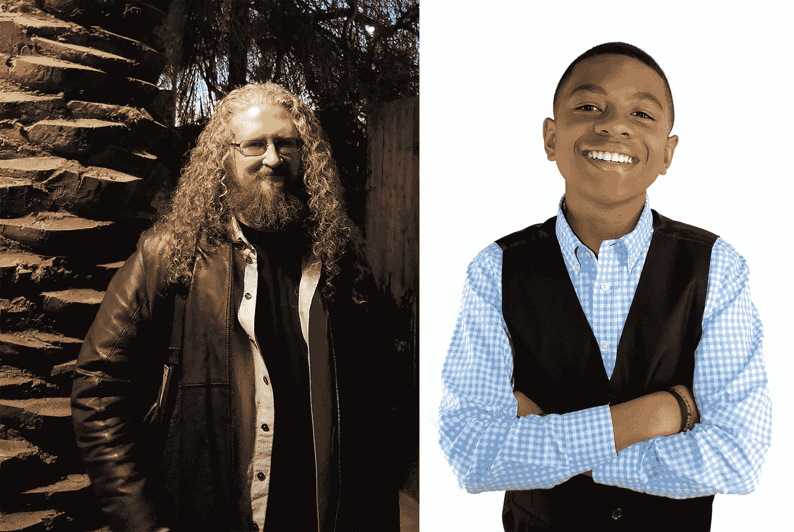

# 关于梦想的 5 个问题:不是你 13 岁的平均年龄

> 原文：<https://medium.com/javascript-scene/5-questions-with-dreamhustlecode-2ae85e97ce3b?source=collection_archive---------1----------------------->

Eric Elliott (left), Ian Brock (Right)

> 本系列提供了对该行业中其他开发人员生活的一瞥。我们有什么共同点？我们能从别人的旅程中学到什么？

## 1.Twitter 上有近 15000 名粉丝知道你的名字是 [@DreamHustleCode](https://twitter.com/dreamhustlecode) 。你叫什么名字？

伊恩·布洛克

## 2.你长大后想做什么？

我还不知道我想建立什么样的公司，但由于我正在学习 JavaScript、HTML、Python、Ruby 等编程语言，我相信这些技能将帮助我在科技领域创建一家公司。此外，我希望继续发展 T2，超越 Cookie 和 Dream Hustle 代码，这样他们不仅可以为芝加哥服务水平低下的社区创造计算机科学机会，还可以在全美国并最终在全世界实现这一目标。最后，我想拥有一支能赢得一大堆冠军的 NBA 球队。

## 3.你是如何获得在 Startup Grind 演讲的机会的？

这一切都要追溯到 2016 年 9 月。[初创公司 Grind 的约翰·弗莱先生开始在推特上关注我。我给他发了一封邮件感谢他的关注，我也谈到了我的书和计算机科学技术的重要性。从那一刻起，他说他会尽自己所能提供帮助(他做到了，他给我安排了一次采访埃弗雷特·泰勒先生的机会)。2017 年 1 月，他问我们是否想参加硅谷的初创公司 Grind Global。起初，我父母和我都不确定这个活动是关于什么的。考虑到我们将在那里呆 3-4 天，我们想看看我们是否能在那里完成一些其他的事情。](https://twitter.com/jfryeofficial)

在沙加·桑戈尔先生的帮助下，我们正在安排对本·霍洛维茨先生的采访。后来，有人宣布霍洛维茨先生将成为 Startup Grind 的主题演讲人。当我们发现时，我和我的家人决定我们必须参加这个活动。我想在采访前见见 Horowitz 先生，所以我被 Senghor 先生邀请到休息室，他正式把我介绍给 Horowitz 先生。在我们的谈话之后，我见到了[德里克·安德森](https://twitter.com/derekjandersen)先生，他是 Startup Grind 的创始人兼首席执行官。在我们的会面中，我谈到了我正在做的所有工作，他对此印象深刻。他半开玩笑地说“你应该在明年的活动上发言”。那年夏天，我为了写书采访了安徒生先生。就在采访结束后，我想我能够给他留下足够深刻的印象，让我在今年会议的主礼堂呆上五分钟。这就是事情的经过。

## 4.你最初是怎么发现 JavaScript 的？

我在寻找学习如何编码的网站，然后我发现可汗学院有一门计算机科学课程。我接着说，JavaScript 是他们的第一种语言。

## 5.你最喜欢科技行业的哪一点？

我最喜欢的是每个人都能上网。即使家里没有权限，也可以去图书馆获取权限。有了这种途径，每个人都有机会学习他们想学的任何东西，比如编码。有了这种途径，随着我们知识的扩展，可能性是无穷无尽的。

我在听一位教授在 NPR 电台的访谈节目中讲话。他看到了 Vibranium(来自卖座电影[、【黑豹】](https://www.youtube.com/watch?v=xjDjIWPwcPU))和欠发达社区人们心中未被发现的可能性之间的有趣对比。他说，如果资源被积极地用于释放这些社区人们头脑中未被发现的可能性……就像大多数国家(更具体地说是美国)会迅速将资源用于开采新发现的强大自然资源……那么我们可能会发现比“vibranium”或任何其他自然资源更有价值的可能性。因为…地球上最宝贵的自然资源存在于人们的头脑中。这就是我想要帮助揭示的…我在我们所有孩子身上“寻找真正的振动”。

伊恩·布洛克 不是一般的 13 岁小孩|新手程序员(HTML/JavaScript) |研究员，正在为孩子们写一本关于成功的书

[***埃里克·埃利奥特***](https://twitter.com/_ericelliott) *是《编程 JavaScript 应用程序》* *(O'Reilly)的作者，也是*[*devanywhere . io*](https://devanywhere.io/)*的联合创始人。他曾为****Adobe Systems*******尊巴健身*******华尔街日报*******ESPN*******BBC****等顶级录音师贡献过软件经验*****

**他和世界上最美丽的女人一起在任何他想去的地方工作。**