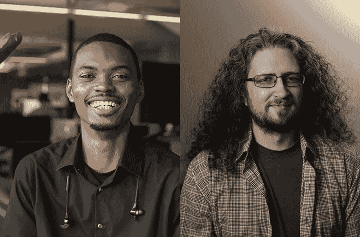

# Slack 的 Rodney Urquhart 的 5 个问题

> 原文：<https://medium.com/javascript-scene/5-questions-with-slacks-rodney-urquhart-435734d0b133?source=collection_archive---------1----------------------->

Left: Rodney Urquhart — Right: Eric Elliott

> 本系列提供了对该行业中其他开发人员生活的一瞥。我们有什么共同点？我们能从别人的旅程中学到什么？

## 1)你是如何进入科技行业的？

我一直对事物如何运作很感兴趣。甚至在很小的时候，我就把我的玩具拆开，试着给它们重新布线，看看会发生什么。直到我 21 岁的时候，我才决定试着找一份和电脑打交道的工作。

我在科技行业的第一份工作是在百思买的极客团队工作。我的工作是修理和销售电脑。在百思买工作时，我修好了康卡斯特一位主管的电脑，他鼓励我申请一份技术支持的工作。我在康卡斯特做了几年技术支持，这就是我如何发现自动化工程师的角色。2011 年买了几本编程方面的书，找了导师，自学了编程。

## 2)有没有一个“啊哈”的瞬间让你从不同的角度看到了一个技术挑战？

当我第一次开始学习构建 webapps 时，我很难自学所有的概念。这些年来，我发现对我帮助最大的是遵循诸如 MVC 这样的架构模式。通过遵循模式，我首先学会了如何构建样本项目，然后随着我对它越来越熟悉，我更深入地理解了它为什么以某种方式工作。Rails 是快速构建 web 应用程序的最佳方式之一。这也是一个很好的学习框架。

## 3)你能描述一下软件测试的重要性吗？

软件测试会验证您的假设，因此您的客户不必这么做。从长远来看，通过识别规划过程中遗漏的问题，它可以为您节省时间和金钱。

面对现实吧！没有人会带着软件不能工作的意图来构建软件。然而，几乎所有构建的东西都有不可预见的情况和不断变化的需求。测试(如果做得正确)能让你快速前进，自信满满。

## 4)您在日常编码中面临的最大挑战是什么？

代码切换！:D:不，不是文化代码切换，我指的是编程语言之间的切换。作为一名专注于工具和基础设施的工程师，我的一天通常分为两部分，一部分是编写代码，另一部分是审查用 Python、PHP 或 Javascript 编写的代码。

当我只是简单地寻找错误或提高整体质量时，在这些语言之间切换不会出现问题。我面临的挑战是错过了学习和练习批判性思维的机会。质疑 PR 是否是编写代码的最佳、最有效和可维护的方式。在一个快节奏的创业公司里，找到时间做这件事真的很难。

## 5)你未来的职业目标是什么？

在 Slack，我的职责是围绕提高生产率和改善我们的开发人员体验。到目前为止，2018 年我的重点和使命将围绕构建工具来促进和优化点对点反馈。我还将继续指导同事，并在我们的工具和基础设施团队中提供技术领导。

[**罗德尼·厄克特**](https://twitter.com/rodneyu215) 是丈夫、父亲、游戏玩家、 [Slack](https://medium.com/u/26d90a99f605?source=post_page-----435734d0b133--------------------------------) 的&工程师。

[***埃里克·艾略特***](https://twitter.com/_ericelliott) *是《JavaScript 应用程序编程》***(O ' Reilly)的作者，也是*[*devanywhere . io*](https://devanywhere.io/)*的联合创始人。他为 Adobe Systems******Zumba Fitness*******华尔街日报*******ESPN******BBC***等顶级录音师贡献了软件经验*******

**他和世界上最美丽的女人一起在任何他想去的地方工作。**