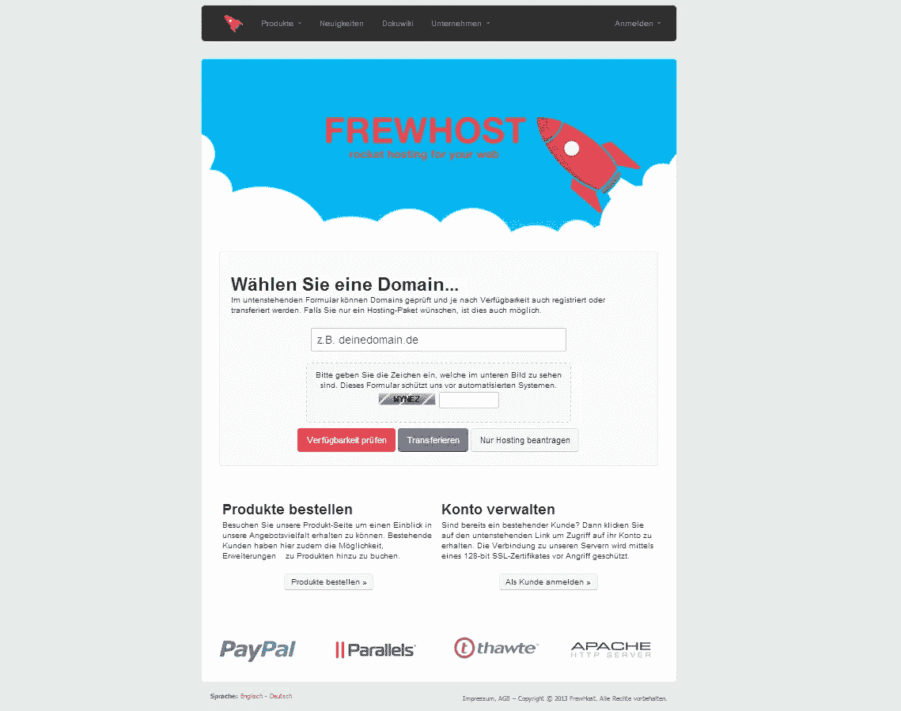

# 与 ZEIT 的 Leo Lamprecht 的 5 个问题

> 原文：<https://medium.com/javascript-scene/5-questions-with-zeits-leo-lamprecht-1e4a3b7e969c?source=collection_archive---------2----------------------->

Leo (Left) & Eric (Right)

## 1.你觉得编程怎么样？

大约 7 年前，12 岁的我转学加入了一个新的班级。

我结交了一些新朋友，他们正在为我们的同学建立一个包含信息的主页(大部分是图片和重要的日期)。

当时，他们使用的是基本的拖放主页生成器。

过了一段时间，他们厌倦了，就放弃了这个网站。然而，我发现了发现幕后真相的乐趣，并继续在这个平台上建立自己的网站。

Frewhost web hosting platform

后来，我从头到尾自学了编写这类网站所需的一切。然后，随着时间的推移，我越来越深入地挖掘这个话题，建立了几个项目(包括一个虚拟主机平台[如图])，现在我正在将 ZEIT 推向新的水平。

## 2.ZEIT 吸引你的地方是什么？作为一名开发者，你的背景是什么，ZEIT 是如何融入你的个人目标的？

在 2015 年到 2016 年的某个时候，我决定结束我的学徒生涯，成为一名个体经营者。在那个时候，我已经和全球的几个人一起工作了——我个人和我的老团队[切鸡蛋](http://cuttingegg.de/)。

我知道我能接手的项目很少，但是我知道我想要一些新的东西。我想独立，自己做决定，也有时间推进自己的想法。

谢天谢地，随着时间的推移，越来越多的人对我感兴趣，给我工作，并允许我用编程来谋生。然而，有一件事让我很困扰:我没有一个可以分享我的经验和成就的团队。

就在那时，我碰巧通过推特认识了[吉列尔莫](https://twitter.com/rauchg)和他的工作。当我浏览他的推文时，我发现了一个特别的:它只包括一个三角形的图像，单词“soon”和一个到 zeit.co[的链接。](http://zeit.co/)

我后来发现，他正在创建一家公司，并寻找人们加入他的使命。

由于我不仅仅是在寻找一个团队，也在寻找一个我有更多责任、资源和合适导师(Guillermo)的职位，我决定给他写信，让他建立一些项目，并最终全职加入了 [ZEIT](https://zeit.co/) 。

## ZEIT 推出了许多伟大的项目。Now CLI 和 Next.js 正在掀起大浪。ZEIT 的使命围绕着云计算的开发者 UX。电子项目是如何融入这幅画面的？

自从我们第一次接触云以来，与云的交互变得容易多了。

然而，主要的改进主要发生在整个画面的前端:当用户开始享受能够从任何地方访问他们的文件并利用各种新服务的便利时，开发人员却受困于过于复杂和半生不熟的工作流。

由于时代已经来临，你只需要运行一个命令( [Now CLI](https://zeit.co/now) )或者拖动托盘菜单图标上的一个目录( [Now Desktop](https://zeit.co/download) )就可以从网络上访问你的项目。实际上，任何能熟练使用电脑的人至少能做这两件事情中的一件。

这正是我们的[电子](https://electron.atom.io/)应用程序完美契合的地方:

*   [现在桌面](https://zeit.co/download)提供了一个使用拖放来部署你的项目的 GUI，并且提供了你的团队正在做的事情的概述。
*   [Hyper](https://hyper.is/) 是一款基于网络技术的可破解终端，是指导您的设备和 [Now](https://zeit.co/now) 平台的最有效方式。

正如你所看到的，他们都为使云更易访问做出了很大贡献——这是 ZEIT 的使命。

如果你——作为读者——有兴趣了解我是如何构建电子应用程序的，我建议你阅读这篇文章。

## 你所从事的产品之间最大的联系是什么？在 ZEIT，有没有一个让每个人都保持专注的普遍指导原则？

我基本上在做所有面向客户的事情。

因为我们仍然是一个相当小的团队，所以我有时也会做一些与我们平台相关的隐藏工作。但当我加入 ZEIT 时，我的前提是我的工作从外面就能看到。这使得人们可以看到幕后(就像我开始编程时一样)，理解事情为什么会这样，甚至为我们的产品做出贡献。

我们在 ZEIT 有许多不成文的法律，但总的来说，我想说我们所做的主要是由我们对这个话题的热情和热爱所驱动的。

## ZEIT 最近对 OSS 做出了一些重要的贡献。对团队和公司有什么影响？你的 OSS 努力如何给 ZEIT 的公司、客户和开发者带来价值？

在我们的第一个产品发布后([现在](https://zeit.co/now))，我们很快决定开源[现在客户端](https://github.com/zeit/now-cli)，以便让人们与我们一起开发我们的产品，并在透明的基础上建立更多的信任。

从那以后，我们 [GitHub 组织](https://github.com/zeit)上的项目数量急剧增长。今天，我们有近 60，000 位明星、47 个公共存储库和数百名修复了错误、添加了功能并帮助扩展了我们的社区的人。

我们发布的所有项目不仅使我们——作为一家公司——对外更加透明，而且通过让客户直接处理代码，使我们更接近客户的期望。

因此，他们和公司都从我们所有产品更快的迭代速度和更快的移动能力中受益(因为功能和错误修复更快)。在一起，我们更强大！

# 后续步骤

*   在 Twitter 上关注狮子座。
*   在 ZEIT.co[查看 ZEIT 的直观开发工具](https://zeit.co/)。

***埃里克·艾略特*** *是* [*【编程 JavaScript 应用】*](http://pjabook.com) *(O'Reilly)的作者，也是*[*devanywhere . io*](https://devanywhere.io/)*的联合创始人。他为 Adobe Systems******Zumba Fitness*******【华尔街日报*******【ESPN*******BBC****等顶级录音师贡献了软件经验******

**他和世界上最美丽的女人一起在任何他想去的地方工作。**