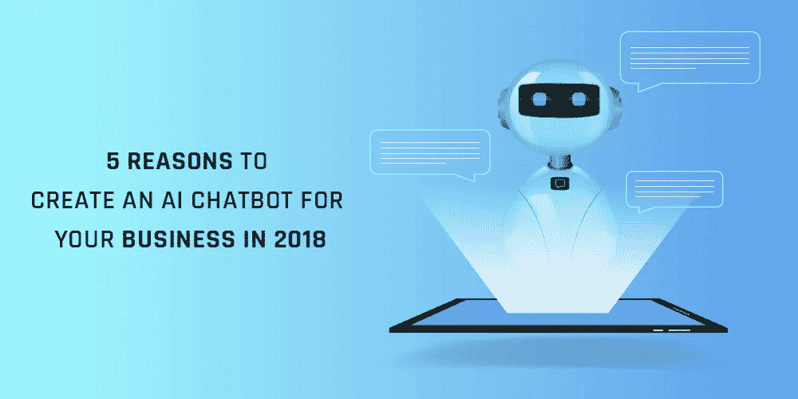

# 2018 年为您的企业创建人工智能聊天机器人的 5 个理由

> 原文：<https://medium.com/quick-code/5-reasons-to-create-an-ai-chatbot-for-your-business-in-2018-98b6f01e738a?source=collection_archive---------6----------------------->

[Zealous System](https://www.zealousys.com/)

聊天机器人和人工智能并不是新发明。它们可以追溯到 20 世纪 60 年代，当时第一个虚拟助理——伊莱扎——是为了实现人机对话而创建的。

但在过去的几年里，我们注意到企业现在比以往任何时候都更加渴望制造自己的聊天机器人。事实上，它的采用已经影响了数百个…