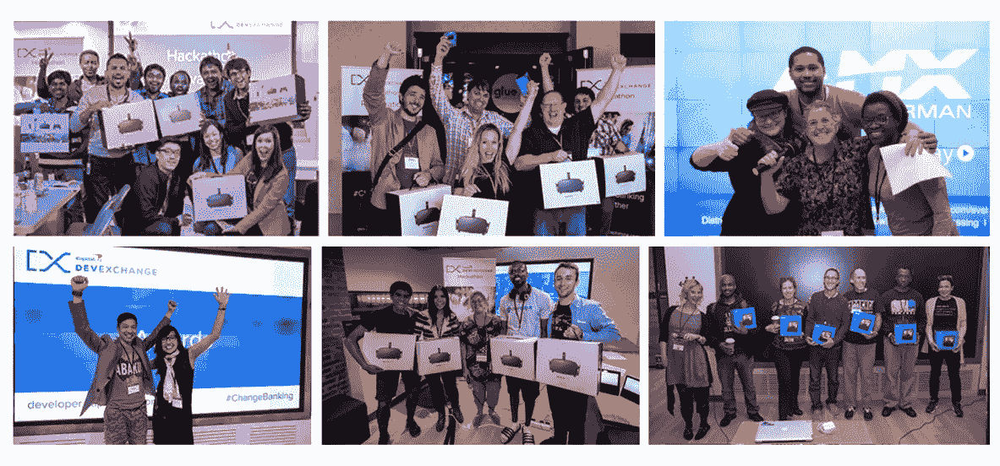

# 我们从举办黑客马拉松中学到的 5 件事

> 原文：<https://medium.com/capital-one-tech/5-things-we-learned-from-hosting-hackathons-1781b9728fde?source=collection_archive---------0----------------------->

Capital One DevExchange 建立在共同开发和开发商参与的原则基础上。这些原则支撑了我们举办[黑客马拉松](https://developer.capitalone.com/events/)的方法。迄今为止，我们已经在 7 个不同的州举办了 8 场活动，展示了 10 个我们的 API。在每一次活动中，我们都邀请开发人员、设计人员和产品负责人参加为期一天的练习，用我们的 API 构建客户体验。

一路上，我们了解了很多关于我们的 API、我们访问过的城市以及在这些城市工作的不同开发者社区。我们也在黑客马拉松中学到了很多与开发者交流的艺术。以下是我们在举办 DevExchange 黑客马拉松时学到的五大经验。

# 1.API 演示很重要

在我们的[波士顿黑客马拉松](https://developer.capitalone.com/blog-post/devexchange-capital-one-cafs-celebrate-a-hackathon-first-in-boston/)上，我们向世界介绍了我们的[数字身份产品](https://developer.capitalone.com/api-products/digital-identity/)。任何时候你引入一个新的 API，更不用说三个了，都需要一个更长的演示和 QA 阶段。但是如何平衡 API 演示部分的需求和编码部分的需求呢？在波士顿之后，我们决定将他们分成两个不同的实体——周五的演示和 QA；周六编码，演示，评审。这对我们的活动有一些明显的好处:

*   将我们从看时间和匆忙的 API 演示中解放出来。
*   在设置/QA 阶段为我们提供了更多实践时间。
*   提高在 API 演示期间深入使用案例的能力。
*   更多的时间思考和编码。
*   给团队更多时间来建立融洽的关系/工作流程。
*   通过更强有力的商业计划和准则提高产品质量。
*   减轻与会者和活动工作人员的压力。

首次亮相于我们的[丹佛黑客马拉松](https://developer.capitalone.com/blog-post/capital-one-devexchange-drives-developer-innovation-at-denver-hackathon/)，这种为期两天的活动形式已经迅速成为 DevExchange 黑客马拉松的标准。

# 2.开发环境与此有什么关系？

2017 年，我们在 DevExchange 黑客马拉松上预览了六个实验性或预发布的 API。这包括:

*   [**波士顿黑客马拉松**](https://developer.capitalone.com/blog-post/devexchange-capital-one-cafs-celebrate-a-hackathon-first-in-boston/)**——我们预览了我们的[数字身份 API](https://developer.capitalone.com/api-products/digital-identity/)套件。**
*   **[**费城黑客马拉松**](https://developer.capitalone.com/blog-post/philly-hackathon-from-stuff-we-are-giving-to-stuff-we-are-developing/) —我们预览了两个基于实验数据的 API。**
*   **[**圣莫尼卡黑客马拉松**](https://developer.capitalone.com/blog-post/sun-surf-apis-at-the-devexchange-santa-monica-hackathon/) —我们预览了一个实验性的文档存储和处理 API。**

**这些预览允许我们在 API 发布周期的早期收集宝贵的反馈；帮助创造更好的最终产品。然而，我们通过这个过程了解到，在黑客马拉松上测试 API 可能很棘手。在 7 月的波士顿黑客马拉松之后，我们做了一些改变来增加我们的实验 API 的参与度。我们了解到，如果我们给开发人员一个单独的、易于使用的模拟服务环境，他们就更容易投入使用。这一功能首次出现在我们的费城黑客马拉松上，此后一直是我们活动中的宝贵功能。**

> **“我们设计了一个轻量级的黑客马拉松环境，允许我们在 DevExchange 公共产品的同时，为开发人员提供私有的和实验性的 API。我们已经看到这导致了创新的新应用想法，团队可以花更少的时间配置，花更多的时间编码。”— [David Benko](https://twitter.com/davidwbenko) ，专业服务**

# **3.多元化团队获胜**

**我们非常重视开发人员外展，并一直努力吸引不同群体的参与者参加我们的黑客马拉松。然而，尽管我们尽了最大努力，费城黑客马拉松的出席率还是没有达到我们的标准。没错，那个周末只有*一个*女 dev 参加了我们的黑客马拉松。**

**[*她的团队赢了。*](https://developer.capitalone.com/blog-post/philly-hackathon-from-stuff-we-are-giving-to-stuff-we-are-developing/)**

**我们都听说过，背景、经验和思想的多样性有助于产品具有更深入和更广泛的用例。通过我们的黑客马拉松记录，费城女性代表的缺乏是一个异常，但她的团队的位置不是。在 DevExchange 举办的七次黑客马拉松中，*六个*获胜团队中至少有一名女性，而*五个*获胜团队中至少有一名女性。**

**费城之后的黑客马拉松呢？圣莫尼卡是我们迄今为止最多样化的黑客马拉松，为黑客马拉松的表现形式设立了标杆。**

****

# **4.会议黑客马拉松不需要太难**

**当然，时间是有限的，争夺眼球和注意力的竞争是激烈的。但是在会议上举办黑客马拉松并不一定是徒劳的。相反，在编码和社区建设中，这可能是一个有趣、随意的练习。DevExchange 在 2017 年 6 月的 [Gluecon 上举办了我们的第一次会议黑客马拉松。我们没有试图把我们通常的黑客马拉松硬塞到会议形式中，而是采取了一种更随意的方式。](https://developer.capitalone.com/blog-post/laughter-meaning-and-code-at-the-glue-hackathon/)**

*   ****保持简单**——我们经常在我们的黑客马拉松上推出新的 API 或提供独特的挑战——但新的 API 和挑战也可能意味着新的打嗝，消耗编码时间。在这次活动中，我们专注于我们最了解的产品和挑战，以最大限度地将时间和精力用于编码。**
*   ****保持休闲**——啤酒、披萨、一些音乐——谁说黑客马拉松必须过于正式？如果与会者错过了社交聚会来参加你的活动，为什么不把一些精力带给他们呢？**
*   ****安排在奇数时间，(但不要太过*奇数)*** *—如果你不想紧接着一个充满主题演讲和研讨会的时间表，那么为什么不安排在它们周围呢？考虑在晚上计划结束和/或演示结束时进行编码部分，并在早上开始之前进行判断。我们在 GlueCon 上使用了这两种调度策略，并且对结果非常满意。***

***只有五个小时的构思和编码，团队用幽默的项目反映了我们的休闲形式，专注于令人愉快的界面和人类互动，而不是精致的商业计划。这个黑客马拉松产生的项目包括一个数字发誓罐；一个用于进行随机互联网购物的应用程序；一款利用轻松语言的客户维系应用；还有一个用迷因和音乐片段说话的假期规划 Alexa 技能。***

# ***5.不要低估人情味***

***2017 年 [Money20/20 黑客马拉松](https://developer.capitalone.com/blog-post/money2020-hackathon-vegas-here-we-come/)是我们的第二次会议黑客马拉松，也是我们第一次让多个 API 公司将他们的产品和奖品贡献到开发组合中。在大型联合主办的黑客马拉松上吸引眼球和注意力可能很难。那么，我们如何在 Money 20/20 hackathon 上传达 Capital One 的 API 的价值和效用呢？通过关注人情味。***

***拥有一支知识渊博、充满激情的团队是用你的产品介绍、打动和激励与会者的第一步。对于 Money20/20，我们让我们的集成专家和 API 技术负责人亲自向人们介绍我们的 API 的效用和使用。我们还让我们的营销和 API 产品负责人帮助他们构思和制定产品战略。这种方法使我们能够帮助鼓励和支持我们 14 个团队当天所开发产品的技术和业务方面。***

> ***“在我们的黑客马拉松中，我们遇到的人越多，一起工作的人越多，我们学到的东西就越多。与这些才华横溢的专业人士面对面交谈和倾听，不仅有助于我们改进产品，每一次活动都让我们成长为一个基于协作和对工作的共同热情的社区。”— [Rachel Rique](https://www.linkedin.com/in/rachelrique/) ，市场营销，平台服务***

***我们总是让来自不同团队和角色的人员参与我们的活动，这次黑客马拉松的形式真正凸显了拥有正确技能的正确人员到位的重要性。它还说明了基于共同发展的方法可以带来的领先优势。***

***我们要特别祝贺 2017 年 Money20/20 黑客马拉松第一资本挑战赛的获胜者。Pop 团队使用我们的[奖励](https://developer.capitalone.com/products/rewards/homepage/) & [信用优惠](https://developer.capitalone.com/products/credit-offers/homepage/)API 来构建应用程序***

***个性化优惠和商家奖励。我们希望您期待您的奖品——为期 4 天的 SXSW 贵宾之旅和在首都一号屋的特别演示。***

# ***我们对黑客马拉松的承诺***

******

> ***“在全国各地举办这些黑客马拉松让我们学到了很多东西……不仅是关于我们的 API、文档和门户体验，还有关于开发人员社区本身。我们一路走来所遇到的创造力和能量令人振奋，并让我们专注于在未来构建更好的开发体验。”— [平台服务营销总监洛琳达·布兰登](https://twitter.com/lindybrandon)***

***2018 年，我们将再次承诺通过黑客马拉松参与开发社区。日历上充满了新的 API 发布和新的黑客马拉松，我们很高兴看到新城市的新开发人员用我们的新 API 产品构建了什么。希望在这个过程中能学到一些新的经验。***

******有关即将举行的 DevExchange 黑客马拉松的更多信息，请随时关注我们的*** [**活动页面**](https://developer.capitalone.com/event/hackathon-series-2018/) ***进行更新。******

****披露声明:这些观点是作者的观点。除非本帖中另有说明，否则 Capital One 不属于所提及的任何公司，也不被其认可。使用或展示的所有商标和其他知识产权都是其各自所有者的所有权。本文为 2018 首都一。****

# ***相关链接***

*   ***[关于我们的 API，托管黑客马拉松教会了我们什么](/capital-one-developers/what-hosting-hackathons-taught-us-about-our-apis-b48d8304b74d)***
*   ***[开发人员参与:勇往直前](https://developer.capitalone.com/blog-post/developer-engagement-braving-the-wilds/)***
*   ***[银行的黑客马拉松——金融科技的新时代](https://developer.capitalone.com/blog-post/a-hackathon-at-the-bank-a-new-era-in-fintech/)***