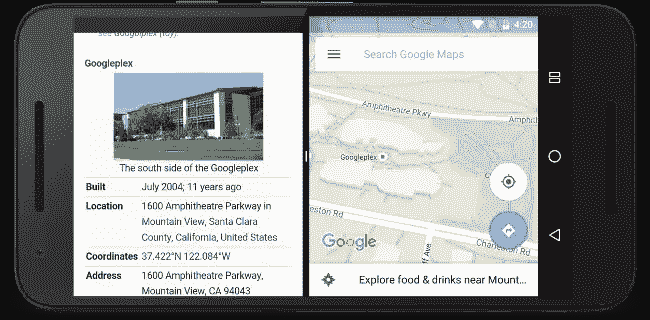
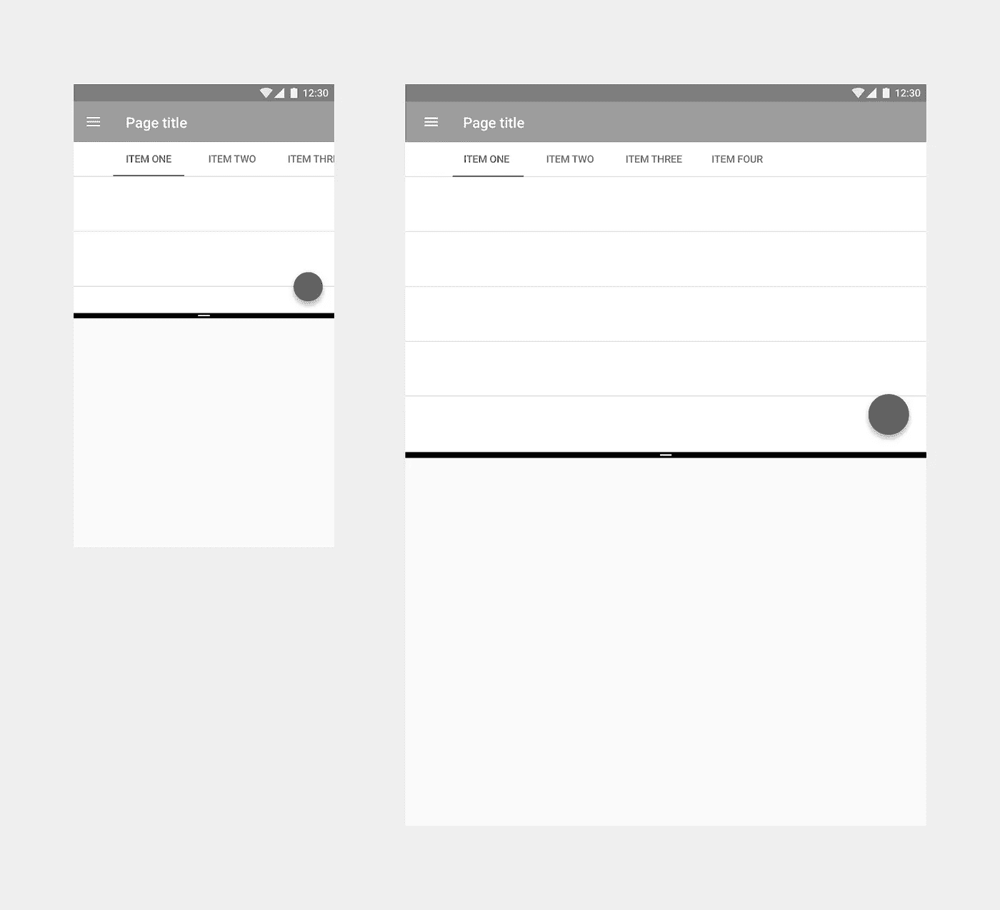

# Android N 中多窗口准备的 5 个技巧

> 原文：<https://medium.com/androiddevelopers/5-tips-for-preparing-for-multi-window-in-android-n-7bed803dda64?source=collection_archive---------1----------------------->

如果你一直在挖掘 Android N 的新功能[，你可能会偶然发现](https://www.youtube.com/watch?v=CsulIu3UaUM&utm_campaign=adp_series_prepareformultiwindow_032316&utm_source=medium&utm_medium=blog)[多窗口支持](http://developer.android.com/preview/features/multi-window.html?utm_campaign=adp_series_prepareformultiwindow_032316&utm_source=medium&utm_medium=blog)。



通过分屏多窗口，两个应用程序将并排可见。很高兴看到这是如何工作的，我知道我立即浏览了文档，寻找是什么新的 API 使这种魔法工作。

事实证明，新的 API 并不多。一些用于定制是否支持多窗口的 XML 属性和一些用于检查当前是否处于多窗口模式的 Activity 方法。那么魔力在哪里呢？ ***魔力一直都在。***

而所谓的神奇，我们指的是 Android 的[资源系统](http://developer.android.com/guide/topics/resources/overview.html?utm_campaign=adp_series_prepareformultiwindow_032316&utm_source=medium&utm_medium=blog)。资源系统最强大的部分之一是[提供替代资源](http://developer.android.com/guide/topics/resources/providing-resources.html?utm_campaign=adp_series_prepareformultiwindow_032316&utm_source=medium&utm_medium=blog#AlternativeResources)的能力——改变尺寸、布局、绘图、菜单等。基于不同的限定词。

**多窗口通过根据您的窗口大小调整配置来利用资源系统** —屏幕大小是最明显的一个，但最小宽度(即宽度或高度的最小值)和方向也会在调整大小时更新。

这让我们想到了第一个技巧。

# 提示 1:使用正确的上下文

加载适当的资源需要[适当的上下文](https://possiblemobile.com/2013/06/context?utm_campaign=adp_series_prepareformultiwindow_032316&utm_source=medium&utm_medium=blog)。如果您正在使用 [*活动*](http://developer.android.com/reference/android/app/Activity.html?utm_campaign=adp_series_prepareformultiwindow_032316&utm_source=medium&utm_medium=blog) 上下文来扩展您的布局、检索资源等，那么您可以开始了。

然而，如果你使用你的 [*应用*](http://developer.android.com/reference/android/app/Application.html?utm_campaign=adp_series_prepareformultiwindow_032316&utm_source=medium&utm_medium=blog) 上下文来处理任何与 UI 相关的事情，你会发现被加载的资源并没有意识到多窗口。除了不使用活动主题的问题之外，你可能完全加载了错误的资源！最好让你的用户界面和*活动*的上下文保持一致。

# 提示 2:正确处理配置更改

有了正确的上下文，你就一定能在给定窗口大小的情况下获得正确的资源(无论是像以前一样全屏显示还是在你的应用程序和另一个应用程序之间拆分)。重新加载这些资源的过程基于您如何处理运行时变化。

默认情况下，您的整个活动被销毁并重新创建，恢复您在[*onSaveInstanceState()*](http://developer.android.com/reference/android/app/Activity.html?utm_campaign=adp_series_prepareformultiwindow_032316&utm_source=medium&utm_medium=blog#onSaveInstanceState(android.os.Bundle))中保存的任何状态，并重新加载所有资源/布局。这有一个很好的特性，你知道一切都与新的配置一致，并且每种类型的配置都被处理。

**不言而喻，每次配置更改都应该快速无缝**。确保您没有在 [*onResume()*](http://developer.android.com/reference/android/app/Activity.html?utm_campaign=adp_series_prepareformultiwindow_032316&utm_source=medium&utm_medium=blog#onResume()) 中做大量工作，并考虑使用[加载器](/google-developers/making-loading-data-on-android-lifecycle-aware-897e12760832?utm_campaign=adp_series_prepareformultiwindow_032316&utm_source=medium&utm_medium=blog)来确保您的数据在配置更改后仍然存在。

您仍然可以[自己处理配置更改](http://developer.android.com/guide/topics/resources/runtime-changes.html?utm_campaign=adp_series_prepareformultiwindow_032316&utm_source=medium&utm_medium=blog#HandlingTheChange)，在这种情况下，您的活动(和片段)将收到对[*onConfigurationChanged()*](http://developer.android.com/reference/android/app/Activity.html?utm_campaign=adp_series_prepareformultiwindow_032316&utm_source=medium&utm_medium=blog#onConfigurationChanged(android.content.res.Configuration))的回调，而不是被销毁和重新创建，您将需要手动更新您的视图、重新加载资源等。

为了捕捉与多窗口相关的配置更改，您需要向您的清单添加一个[*Android:config changes*](http://developer.android.com/guide/topics/manifest/activity-element.html?utm_campaign=adp_series_prepareformultiwindow_032316&utm_source=medium&utm_medium=blog#config)属性，至少包含以下值:

```
<activity
  android:name=".MyActivity"
  android:configChanges="screenSize|smallestScreenSize
      |screenLayout|orientation"/>
```

确保您正在处理每一个可能发生变化的资源(当您自己处理配置变化时，这是您的责任)。

这包括重新加载以前可能被认为是常量的资源。考虑在*值*和*值-sw600dp* 中有一个尺寸的情况。在非多窗口世界中，你永远不会在运行时在这两个窗口之间切换，因为最小宽度永远不会改变(它永远是你的设备的最小宽度)。然而，有了多窗口，当你的应用程序调整大小时，你将不得不在这些资源之间切换。

# 提示 3:处理所有方向

还记得我们在介绍中谈到的当窗口调整大小时方向的变化吗？没错:**即使设备是横向的，你的应用也可能是纵向的。**

原来:“纵向”实际上意味着高度大于宽度，“横向”意味着宽度大于高度。因此，考虑到这个定义，你的应用程序可以在调整大小时从一个过渡到另一个，这当然是有意义的。

这也意味着方向之间的过渡应该尽可能平滑。引用[分屏材料设计规格](https://www.google.com/design/spec/layout/split-screen.html?utm_campaign=adp_series_prepareformultiwindow_032316&utm_source=medium&utm_medium=blog#split-screen-layout):

> 改变设备的方向不会导致用户界面发生意外的变化。例如，如果设备旋转到横向模式，在其中一个分屏(纵向模式)中显示视频的应用程序不应开始全屏播放。

> **注意**:如果当你的应用程序全屏显示时，你仍然需要这种功能，你可以使用 *inMultiWindowMode()* 方法来检查你到底处于哪种情况。

使用 [*锁定你的屏幕方向安卓:屏幕方向*](http://developer.android.com/guide/topics/manifest/activity-element.html?utm_campaign=adp_series_prepareformultiwindow_032316&utm_source=medium&utm_medium=blog#screen) 也受多窗口影响。**对于不针对 Android N 的应用，** **添加*Android:screen orientation*意味着你将根本不支持多窗口**——你将总是迫使用户退出多窗口模式。当你以 N 为目标时，事情发生了一点变化——不是完全不支持多窗口，而是在多窗口模式下，你通过*Android:screen orientation*设置的任何方向都会被忽略。

请记住，在运行时使用[*setrequesteorientation()*](http://developer.android.com/reference/android/app/Activity.html?utm_campaign=adp_series_prepareformultiwindow_032316&utm_source=medium&utm_medium=blog#setRequestedOrientation(int))锁定您的方向在多窗口模式下不会有任何效果，无论您是否以 N 为目标。

> **将 *android:immersive* 属性添加到您的活动清单** **中，还会禁用不针对 N** 的应用上的多窗口，规则与上面的*Android:screen orientation*相同。

# 专业技巧 4:为所有屏幕尺寸构建一个响应迅速的 UI

对于分屏设计来说，方向并不是唯一需要考虑的事情。多窗口是你第一次平板 UI(你有平板 UI 吧？毕竟，14 亿个设备中的 12.5%是一个很大的设备……)将被缩小到微型尺寸。

如果你一直在构建一个对可用空间做出反应的用户界面，并且拥有相对相似的手机和平板电脑布局，你会发现你已经为多窗口做好了充分的准备。正如所建议的，**将用户界面缩小到 220dp 宽/高，然后从那个尺寸扩大到全屏尺寸是你现在可以做的事情。**



Building a single responsive layout makes for smooth transitions as your app resizes

然而，如果你的手机和平板电脑用户界面有很大的不同，不要在两者之间切换，让用户不知所措——坚持使用平板电脑用户界面，努力缩小它的尺寸。有许多[响应的 UI 模式](https://www.google.com/design/spec/layout/responsive-ui.html?utm_campaign=adp_series_prepareformultiwindow_032316&utm_source=medium&utm_medium=blog#responsive-ui-patterns)你可以考虑用来为你的用户提供无缝的调整大小体验——同样，不需要 N 个 API。

# Pro-tip 5:其他 app 启动的活动必须始终支持多窗口

在多窗口世界中，你的整个[任务](http://developer.android.com/guide/components/tasks-and-back-stack.html?utm_campaign=adp_series_prepareformultiwindow_032316&utm_source=medium&utm_medium=blog)由一个窗口表示。这就是为什么如果你想[发起一个相邻的活动](http://developer.android.com/preview/features/multi-window.html?utm_campaign=adp_series_prepareformultiwindow_032316&utm_source=medium&utm_medium=blog#launch)，你需要开始一个新任务——新任务，新窗口。

这也意味着反过来也是正确的，引用同一页:

> 如果在任务堆栈中启动一个活动，该活动将替换屏幕上的活动，并继承其所有多窗口属性。

**这意味着如果你有一个可以被其他应用程序启动的活动，你的活动将继承与调用活动相同的多窗口属性**。这包括最小尺寸等属性。在[*startActivityForResult()*](http://developer.android.com/reference/android/app/Activity.html?utm_campaign=adp_series_prepareformultiwindow_032316&utm_source=medium&utm_medium=blog#startActivityForResult(android.content.Intent,%20int))的情况下，您的活动必须是同一个任务堆栈的一部分，即使在[隐式意图](http://developer.android.com/guide/components/intents-filters.html?utm_campaign=adp_series_prepareformultiwindow_032316&utm_source=medium&utm_medium=blog#ExampleSend)的情况下，您也不能保证它们也会包含一个[*FLAG _ Activity _ NEW _ TASK*](http://developer.android.com/reference/android/content/Intent.html?utm_campaign=adp_series_prepareformultiwindow_032316&utm_source=medium&utm_medium=blog#FLAG_ACTIVITY_NEW_TASK)。

因此，这些活动中的每一个(以及由该活动启动的任何活动)**都必须**支持多窗口，一直到最小的尺寸。彻底测试！

# 测试所有的东西！

准备多窗口的最好方法是**测试你的应用**。即使没有任何代码更改或经历设置 Android N SDK 的过程，在 Android N 设备或模拟器上安装您现有的应用程序也是一个了不起的第一步，是一个捕捉低挂水果和#BuildBetterApps 的简单方法。

关注 [Android 开发模式集](https://plus.google.com/collection/sLR0p?utm_campaign=adp_series_prepareformultiwindow_032316&utm_source=medium&utm_medium=blog)了解更多！

