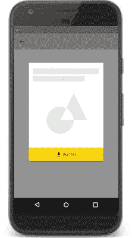

# 在即时体验中使用 showInstallPrompt 的 5 个技巧

> 原文：<https://medium.com/androiddevelopers/5-tips-for-using-showinstallprompt-in-your-instant-experience-99d4681e0ae?source=collection_archive---------5----------------------->


[Google Play Instant](https://developer.android.com/topic/google-play-instant) 允许您的用户在安装之前试用您的应用程序或游戏。无论是从 Play Store 还是从 URL 启动，即时体验都会将您的用户直接带入应用的原生体验。

您的即时体验的目标之一可能是从您的应用程序的即时体验中驱动安装。通过确保正确使用最新的 API 和最佳实践，您可以更容易地实现这一点。

当用户决定安装你的应用或游戏时， [showInstallPrompt API](https://developers.google.com/android/reference/com/google/android/gms/instantapps/InstantApps.html#showInstallPrompt(android.app.Activity,%20android.content.Intent,%20int,%20java.lang.String)) 允许你在即时体验中提示安装。调用 API 后，应用内安装提示会出现在你的应用中。一旦用户同意安装，应用程序安装过程就开始了。完成后，安装的应用程序会自动启动。


*This animation shows the installation flow when using showInstallPrompt*

在您的即时体验中实施 showInstallPrompt 时，以下详述的最佳实践将使您的用户尽可能平稳地从即时应用过渡到已安装的应用。

# 1.确保您使用的是最新的 showInstallPrompt API

更新后的 [showInstallPrompt API](https://developers.google.com/android/reference/com/google/android/gms/instantapps/InstantApps.html#showInstallPrompt(android.app.Activity,%20android.content.Intent,%20int,%20java.lang.String)) 于 2018 年 6 月推出，与传统 API 相比有一些关键优势。新的 API 显示了一个更小的安装提示，并通过添加 postInstallIntent 参数改进了到已安装应用程序的过渡，该参数指定了安装后要启动的活动。

## **在您的即时体验中识别 showInstallPrompt 版本**

以前，传统 API 会启动一个更大的应用内安装提示。由于传统的 showInstallPrompt 不支持，现在调用它会启动您的 Play Store 列表。为了恢复应用内安装提示，您需要迁移到新的 API。

如果您不确定您的即时体验是否调用了遗留 API，您可以通过运行您的即时应用程序并选择 install 按钮来快速确定。如果您被带到 Play Store 列表，您使用的是传统 API。如果你看到一个应用内覆盖，你使用的是最新的 API。

或者，您可以检查您的代码，看看您的方法调用是否包含 postInstallIntent 参数。如果它不包含 postInstallIntent，那么您使用的是遗留 API。下面是新的 showInstallPrompt API 的方法签名:

```
public static boolean showInstallPrompt (Activity activity, **Intent postInstallIntent**, int requestCode, String referrer)
```

`postInstallIntent`是应用程序安装后将启动的意图。它必须解析为已安装应用程序包中的活动，否则将不会被使用。

## **迁移到新的 showInstallPrompt**

要迁移到新的 showInstallPrompt API，请按照下列步骤操作:

1.确保您在项目中使用最新的即时应用程序客户端库。更新 build.gradle 文件中的以下依赖项:

```
implementation 'com.google.android.gms:play-services-instantapps:16.0.1'
```

2.更新您的代码，使用带有 postInstallIntent 参数的新的 [showInstallPrompt API](https://developers.google.com/android/reference/com/google/android/gms/instantapps/InstantApps.html#showInstallPrompt(android.app.Activity,%20android.content.Intent,%20int,%20java.lang.String)) 。

3.将您的即时应用上传到[内部测试赛道](https://support.google.com/googleplay/android-developer/answer/3131213?hl=en)以验证安装按钮现在启动应用内安装提示覆盖。

您还可以使用新的 showInstallPrompt API 查看这个[示例应用程序](https://github.com/googlesamples/android-instant-apps/tree/master/install-api)，看看它是如何工作的。

# 2.在您的即时游戏中预先注册

showInstallPrompt API 不仅仅是为了安装！如果你的即时游戏支持[预注册](https://support.google.com/googleplay/android-developer/answer/9084187)，你可以使用相同的 API 提示预注册注册。

当您的应用程序调用 showInstallPrompt 时，预注册的行为类似于安装期间出现的行为。会出现一个应用内覆盖图，对用户进行预注册。然后，用户将能够继续他们在即时游戏中停止的地方。预先注册的用户会在游戏发布时得到通知。

要启动预注册流，您可以调用 showInstallPrompt，就像您要提示安装一样。

```
*// Prompt for pre-registration* InstantApps.showInstallPrompt(activity, postInstallIntent, requestId, referrerId)
```

注意:预注册完成后，`postInstallIntent`参数被忽略。

# 3.将用户状态转换到已安装的应用程序

将用户的状态从即时体验转移到已安装的 app 中。用户应该能够从他们停止的地方重新开始。在即时体验中取得的任何成就或进步都应该延续到安装的应用程序或游戏中。


持久化用户状态的推荐方法是使用 [Cookie API](https://developers.google.com/android/reference/com/google/android/gms/instantapps/PackageManagerCompat#getInstantAppCookie()) 在安装后迁移数据。Cookie API 允许您在设备上存储少量信息，您的可安装应用程序可以访问这些信息。该 API 确保只有与您的即时应用程序具有相同包 ID 的应用程序才能访问 cookie。

在您的即时应用程序中，您应该始终使用 [PackageManagerCompat](https://developers.google.com/android/reference/com/google/android/gms/instantapps/PackageManagerCompat.html#setInstantAppCookie(byte[])) 来存储您的 cookie 数据。

用户安装好 app 后，你就可以访问数据了。

# 4.不要妨碍任务的完成

用户在打开即时体验时，在完成他们想要完成的任务时，不应该被打断。避免在用户部分完成任务时要求他们安装你的应用。

在用户完成其任务或想要使用您的即时应用程序中不可用的附加功能后，您可以调用 showInstallPrompt。



例如，如果你通过在线产品广告引导用户获得即时体验，你的即时应用程序应该允许你的用户完成结账流程。购买完成后，您可以提示安装。避免要求用户在完成购买之前安装或注册。

# 5.提供明确的安装提示

最后一个技巧看起来很明显，但是要确保你的即时体验有明确的安装提示。没有它们，用户可能会对如何安装你的应用程序感到困惑，或者可能不得不去 Play Store 安装。

安装按钮应该调用 showInstallPrompt 来启动安装提示。


使用[材料设计“获取应用”图标](https://material.io/icons/#ic_get_app)和标签“安装”作为安装按钮或“预注册”作为预注册按钮。

不要使用任何其他标签，如“获取应用程序”、“安装完整应用程序”或“升级”。不要使用横幅或其他类似广告的技术向用户展示安装提示。

如果您对在即时应用或游戏中实现 showInstallPrompt API 有其他问题，请在 [StackOverflow](https://stackoverflow.com/questions/tagged/android-instant-apps) 上提出您的问题。了解更多关于 Google Play Instant 的信息，并查看我们的其他 UX 最佳实践。