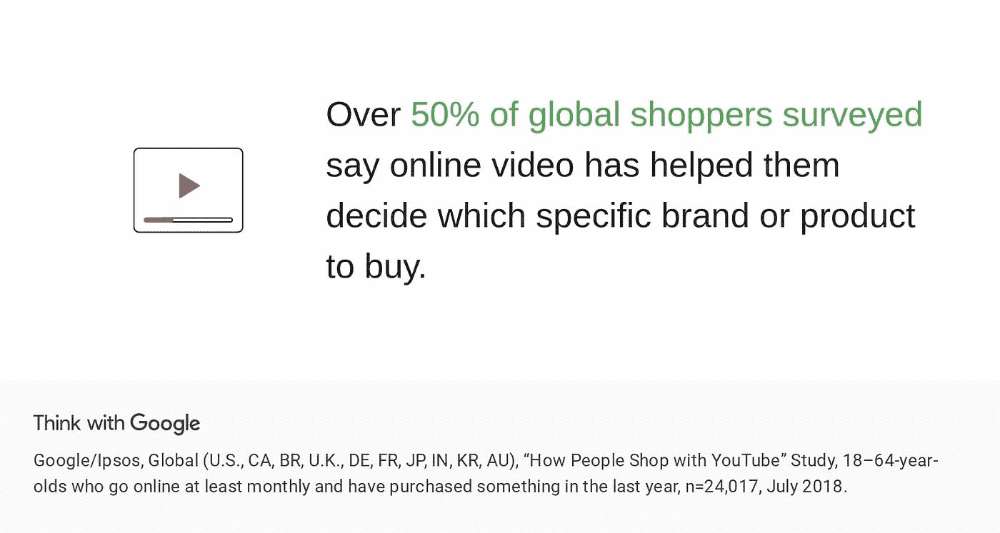

# 你必须使用的 5 个视频营销平台

> 原文：<https://medium.com/globant/5-video-marketing-platforms-that-you-must-use-b11d06c35fe3?source=collection_archive---------1----------------------->

视频营销使用视频来推广和销售产品或服务，增加您在数字和社交媒体上的互动，教育您的消费者和客户，并接触新的受众。

*(来源——用谷歌思考)*

建立一个可靠的视频营销策略的最重要的一个方面是决定选择哪一个视频营销渠道和概述你的关键人口统计。

一旦你了解了你的目标受众，并制定了视频营销策略，就该选择一个最适合你业务需求的视频营销平台了。

现在有几十个视频营销平台。然而，这里列出了五个最好的视频营销平台及其特点。你可以根据你的目标受众和你的视频营销目标来选择这些。

# **1。维德亚德**

Vidyard 重新设计了视频平台，使其比以往任何时候都更容易、更快、更安全。这是一家超越传统视频托管和管理的视频解决方案公司。

Vidyard 帮助公司通过互动、个性化的视频体验与更多观众联系，获得关于观众的强大见解，通过业务整合将这些见解付诸实践，并证明其视频节目的影响力。

这一工具能够快速、轻松地向您的潜在客户或领导传递令人难忘的信息。

## **维德亚尔的特点:**

*   **轻松的视频创建和个性化:**它允许您录制屏幕，这是一个强大的功能，可以在解释过程的同时创建“操作”视频。
*   **无广告托管**高质量视频流。
*   **大量集成**选项，包括一系列知名工具和社交媒体的共享格式。
*   Vidyard 还帮助您收集关于您的线索的数据，并显示它们如何与您的内容交互。借助强大的**分析仪表板，**您可以减少追踪不合格销售线索的时间，而将更多时间用于追求最专注的机会。

# **2。Wistia**

如果您想分发营销和销售视频以获得最大效果，Wistia 是理想的解决方案。通过 Wistia，您可以在一个商业友好型网站上托管您的视频，该网站旨在帮助您充分利用视频营销。

它还通过定制视频播放器以适应您的品牌来提供品牌认知功能，允许您嵌入视频，并提供广泛的功能，如与其他视频平台和内容管理系统集成。

凭借强大的视频搜索引擎优化功能，您可以在搜索和社交媒体上创建更智能的广告，以获得更多的浏览量并建立社区。

## **紫藤的特点:**

*   创造一个**无广告的体验**不仅利用视频内容，还利用音频内容进行播客。
*   **通过视频推荐或自动播放下一段音频来增加参与度**，以确保观众留下来。
*   **通过重新定位广告、生成订阅列表和用于线索跟踪的 CRM 集成，扩大受众范围**。
*   **通过 SEO、分析见解和 A/B 测试提高内容性能**。
*   此外，通过**观众跟踪**获得你的观众的鸟瞰图。

# **3。布莱特科夫**

Brightcove Live 是一个广播质量的基于云的直播解决方案，具有广泛的设备范围，并通过服务器端广告插入(SSAI)集成了货币化。通过提供实时视频性能分析和指标，它能够提高转化率和投资回报率。该平台帮助公司定制视频播放器，并与他们的团队合作，同时允许用户继续发布视频并关注他们最喜欢的创作者。

Brightcove 有许多工具可以用来为你的视频营销游戏充电。Brightcove 的全球分布式功能使广播公司、出版商和品牌能够创建现场活动，并为观众提供高质量的体验。

## Brightcove 的特色:

*   **基于云的**发布平台
*   **全天候客户支持。**
*   **通过服务器端广告插入实现盈利**(SSAI)
*   借助他们基于云的架构，您可以在多个设备和平台上提供针对效率和质量进行优化的大规模安全全功能**直播流**。
*   凭借**可定制的格式**、货币化选择和无与伦比的可靠性，Brightcove 让你开发和维护从免费试用到忠实粉丝的全球受众。
*   Zencoder 为您提供智能、可靠和无限的视频编码能力。

# **4。二十三**

您可以使用该平台来确定您的销售线索的参与度，了解视频如何帮助销售线索通过漏斗并将其转化为买家。

该工具提供数据驱动的建议，因此您可以制作高质量的视频，改善销售的营销漏斗，与您的目标受众联系，并产生更好的销售线索。

TwentyThree Webinars 是最全面的平台，可吸引您的受众，创造品牌体验，随着业务增长进行扩展以适应您的业务，并提供有助于您取得更好结果的见解。

## **二十三的特点:**

*   为**网络研讨会**创造**最吸引人的**体验。
*   **创建电子邮件日程**，例如网上研讨会活动的注册、提醒和跟进。
*   **为您的社交渠道打造更好的体验**根据平台适应不同的形式。
*   **借助您的线索评分和归因模型，跟踪整合视频数据的**。
*   借助**的分析和见解，改变你的营销策略。**

# **5。YouTube**

最后但同样重要的是！世界第二大搜索引擎——YouTube。

YouTube 视频营销帮助您创建引人入胜的视频，增加流量，吸引 YouTube 频道的订户，并最终增加您的收入。YouTube 视频营销分析可以让您深入了解您的频道的表现，决定您的受众和目标，并创建有针对性的内容，为您的视频营销工作增加价值。

YouTube 帮助您创建高质量和优化的内容，以便您可以找到并转化您的理想目标受众。

## **YouTube 的特色:**

*   使用这个平台的受众**范围更广**，这意味着它是一个针对关键人群的理想平台。
*   **提高您的 SEO 排名**和整体品牌形象。
*   **对内容进行个性化**并创建广告活动。
*   **获取数据和洞察力**以管理渠道受众的参与度。
*   任何规模的企业都可以使用它来利用视频内容和品牌知名度。
*   **动态视频阵容**和**视频推荐**功能。

你不仅可以做一个视频放在你的网站上说你在做视频营销，你还可以利用这些视频托管平台达到你想要的目标。

这可以让你决定哪些视频是最成功的，哪些不是，这可能会导致你的视频营销策略的转变。你将受益于与你的观众联系，完善你的策略，尽可能有效地使用你的平台。